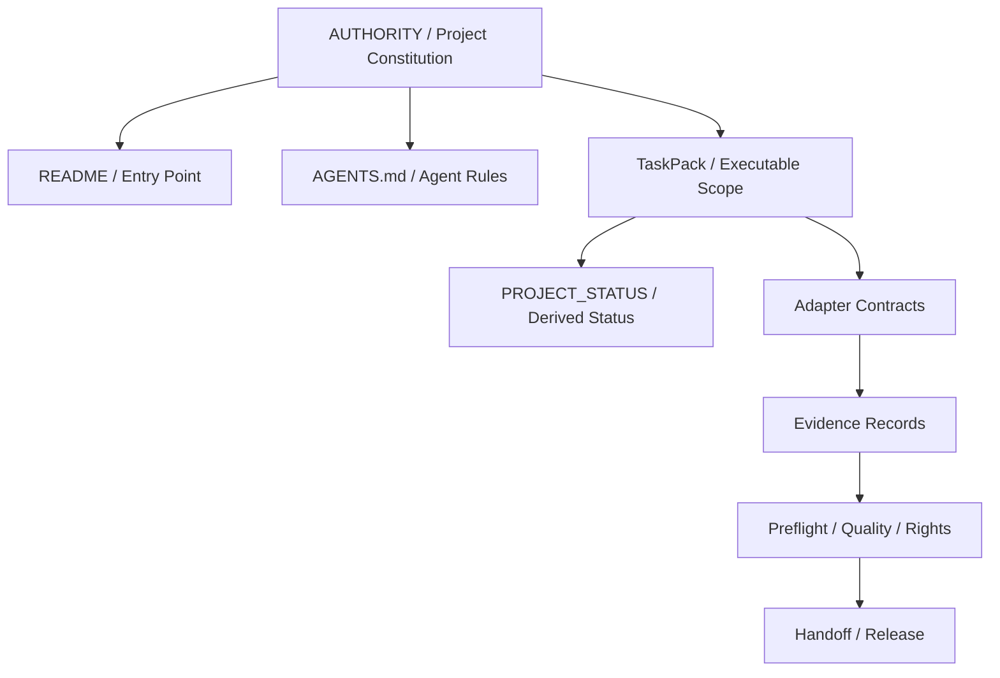
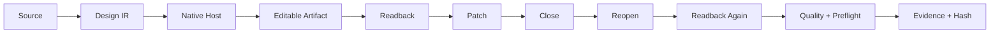
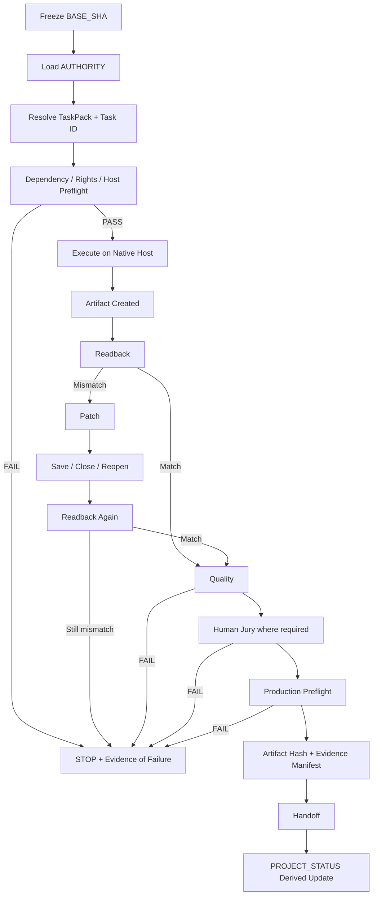

<!--
PROVENANCE / 来源登记
- 来源：云端全仓库审计（外部 GPT 生成），用户 2026-09-23 12:05 (UTC+08) 粘贴入库
- 输入渠道：Hermes 桌面附件 pasted_content_2026-09-23_12-05-36-545_6526be.txt
- 分类：NON_AUTHORITATIVE — inert evidence blob（按 DL-AUTHORITY-2026-09-18-R2，云端审计不高于 Authority/TaskPack）
- 本文件为原文逐字存档，不加改动；事实核对与任务映射见同目录 CROSSWALK 文档
- doc 自述 baseline SHA 698eaa9 已核对该对象在仓库中的真实身份（tree of f3c7ed3），见 CROSSWALK §1
-->

# DESIGN-LAB 云端仓库与项目历史全量审计报告

## Executive Summary

本报告以 **`DTALEX66/DESIGN-LAB` 当前 `main`** 为审计基线。实时读取仓库时，`main` 指向：

- **Baseline SHA:** `698eaa9c09a38b9b55493b406a1959dd11828e51`
- **HEAD commit:** `fix(app): allow explicit refresh of deleted saved profiles`
- **Commit 时间:** 2026-09-23 21:44:27 UTC，即 America/Phoenix **2026-09-23 14:44:27**
- **默认分支:** `main`
- **仓库可见性:** Public
- **GitHub 元数据创建时间:** 2026-09-11
- **实时元数据中的 open issues:** `0`
- **GitHub API license detection:** `null`
- **HEAD commit signature:** GitHub 返回 `verified=true`
- **`main` protected:** `true`
- **Required checks:** `CI / Governance Check`、`CI / Test`、`CI / Build`、`CI / Package Final Gate`
- **Required status checks strict:** `true`
- **PR review:** 至少 1 个批准；`dismiss_stale_reviews=true`；要求 Code Owner review；要求最后一次 push 后重新获得批准
- **Classic branch protection `enforce_admins`:** `false`

以上为本轮直接读取 GitHub 仓库与 `branches/main` 原始接口所得，分别记为 **〔G1：repository metadata〕、〔G2：branches/main〕**。本轮同时取得了该 SHA 的完整 recursive Git tree，记为 **〔G3：git tree @ 698eaa9〕**。

### 审计总判断

**DESIGN-LAB 当前已经具备相当不错的“代码仓库治理骨架”，但还不能仅凭这一点判定它已经形成“可审计的专业设计生产系统”。**

最明显的差异是：

> **代码是否能合并**与**设计任务是否真正经过宿主执行、可编辑产物验证、Readback、Patch/Reopen、Preflight、Rights 和 Evidence 闭环**是两套不同的成熟度。

上传的三项目增强能力报告对此给出的边界是正确的：DESIGN-LAB 应负责专业设计方法、质量标准、原生工具适配、生产预检和可编辑交付，而不应重新建立第二套聊天入口、画布或完整编辑器。fileciteturn0file0L39-L45 同一报告也明确指出，结构测试通过不能替代真实宿主执行；没有真实应用中的执行、状态/对象回读及产物验证，不能宣称宿主集成完成。fileciteturn0file0L67-L71

综合本轮可验证事实，风险评级如下：

| 审计域 | 评级 | 核心判断 |
|---|---:|---|
| Git/GitHub 分支治理 | **B+** | `main` 已受保护，四个 required checks，PR review 规则较完整 |
| CI 合并门禁 | **B** | 门禁名称明确，但本轮未完成全部 workflow YAML 与历史 run 的逐条证据核对 |
| 权威文档治理 | **B-/待补证** | 已知项目强调 Authority/TaskPack/Status，但“最新9月权威文档”没有在本轮证据中被确认成唯一、明确命名的 canonical baseline |
| Task/Issue/PR 可追溯性 | **C+/待补证** | 实时元数据为 0 open issue，但这**不能证明没有历史 closed issues/PR/discussions**；全历史枚举证据本轮不足 |
| E2/E3/Host E3 | **C** | 原则正确，但不能据现有已抓取证据证明所有 Host 都真正完成 E3 |
| Artifact 可重现性 | **C** | 必须进一步证明 editable、readback、reopen、media relink、hash/manifest，而不是只保存截图或日志 |
| Quality / Preflight | **C+** | 方向正确；必须避免把模型评分、UI 占位或 schema 存在误报成质量闭环 |
| 外部依赖治理 | **C** | 当前尚缺一份经本 SHA 审计确认的完整 SBOM/Host Adapter/自动下载/许可证清单 |
| Security / secrets | **未能认证** | 没有足够证据声明“无 secret 泄漏”；不能把“没有发现”写成“已证明不存在” |
| Rights / License | **C-/高优先级** | GitHub API 当前 `license=null`；至少说明仓库级许可证识别没有形成可靠信号 |
| Context / memory drift 防护 | **C** | 当前 main 是移动目标，若 Agent 不冻结 SHA 和权威文档版本，很容易把历史 TaskPack、旧 Status 或模型记忆写回当前事实 |

**总体结论：当前最优先事项不是继续增加 Agent 或 SDK，而是把“Authority → Task → Host execution → Readback → Editable Artifact → Patch/Reopen → Quality → Rights → Preflight → Evidence → Handoff”固化为不可绕过、可机器验证的生产协议。**

另一个重要审计结论是：用户要求的“**最新9月权威文档**”在目前已验证资料中**没有被确认成一份明确、唯一、可引用版本的文件**，因此严格按用户规则应标记为：

> **最新9月权威文档：未指定。**

本报告据此采用 **2026-09-23 当前 `main` SHA + 仓库中最新治理文档体系**作为替代基线，但凡本轮没有取得完整原文或完整历史链的项目，均明确标为“未验证/待补证”，而不是推测为 PASS。

## 审计基线、权威文档与仓库治理

### 当前 main 必须立即冻结成审计对象

“审计最新 main”最大的隐含风险，是 `main` 本身会继续移动。

因此这份报告之后，任何 Codex、Hermes、CI 或人工检查都不应该再写：

```text
audit latest main
```

而应该写：

```text
Audit baseline:
repo = DTALEX66/DESIGN-LAB
branch_at_snapshot = main
base_sha = 698eaa9c09a38b9b55493b406a1959dd11828e51
snapshot_date = 2026-09-23
timezone = America/Phoenix
```

否则第二个人第二天执行“同一个审计任务”，得到的其实可能是另一个仓库状态。

### 仓库治理审计

| 维度 | 当前可验证状态 | 审计判断 | 建议 |
|---|---|---|---|
| Default branch | `main`〔G1〕 | 正常 | 所有 TaskPack/Evidence 必须记录 base SHA |
| Branch protection | `main protected=true`〔G2〕 | **通过** | 保持 |
| Required CI | Governance / Test / Build / Package Final Gate〔G2〕 | **较强** | 把 Evidence/Preflight schema validation 纳入 Governance Check |
| Strict status checks | `strict=true`〔G2〕 | **通过** | 保持 |
| PR approvals | `1`〔G2〕 | 小团队足够，生产级偏弱 | 核心 Host/Evidence/Authority 修改建议 2 approvals |
| Code owner review | Required〔G2〕 | **通过** | 为 `AUTHORITY`、TaskPack、Adapter、Evidence 单独 CODEOWNER |
| Last-push approval | Required〔G2〕 | **通过** | 保持 |
| Stale review dismissal | Enabled〔G2〕 | **通过** | 保持 |
| Admin enforcement | `false`〔G2〕 | **风险** | 检查 Rulesets；如无同等规则，开启管理员约束 |
| Commit verification | HEAD verified〔G2〕 | **正向信号** | 不可从单个 HEAD 推断全部历史均签名 |
| Releases/Tags | 本轮未完成全量验证 | **未验证** | 发布时使用 immutable tag + SHA |
| Repository license | GitHub metadata `license=null`〔G1〕 | **高风险信号** | 核对 LICENSE、第三方 NOTICE、SPDX |
| Repo age | GitHub metadata 创建于 2026-09-11〔G1〕 | 项目历史较短、变化快 | 特别需要防 Authority/Status 漂移 |

`enforce_admins=false` 应特别处理。这里只能证明 classic branch-protection 返回了该值；本轮没有完整审计 GitHub Rulesets，因此**不能直接断言管理员一定能绕过所有门禁**。正确动作是检查 repository/org rulesets，再决定是否属于实质 bypass 风险。

### 权威文档应形成单向 Authority Graph

用户指定的审计对象包括：

`README`
→ `AGENTS.md`
→ `AUTHORITY.md`
→ `PROJECT_STATUS`
→ `TaskPack`
→ `EVIDENCE`
→ `Preflight`
→ `Adapter specification`

正确的权威关系不应是八份文件彼此复制任务状态，而应是：



其中建议：

| 文件层 | 应该是 authoritative for | 不应该包含 |
|---|---|---|
| `AUTHORITY.md` | 项目边界、truth hierarchy、E2/E3 定义、不可绕过规则 | 实时任务百分比 |
| `AGENTS.md` | Agent 行为、工具使用、禁止项、加载规则 | 重复全部项目说明 |
| `README` | 用户入口、当前能力地图、权威链接 | 自成一套任务真相 |
| TaskPack | 当前阶段可执行任务、acceptance、依赖、Evidence 要求 | 未验证的 PASS |
| PROJECT_STATUS | 当前 SHA 对应的派生状态 | 成为比 TaskPack 更高的规范 |
| Adapter spec | Host contract、capabilities、readback/error semantics | Host 营销说明 |
| Evidence | 谁、何时、在什么版本执行了什么，产生何种 artifact | 模型主观总结代替机器事实 |
| Preflight | 可验证的生产条件 | “看起来正常”等非确定性措辞 |

**建议新增强制字段：**

```yaml
authority_revision:
base_sha:
taskpack_id:
task_id:
host:
host_version:
adapter_version:
artifact_hash:
evidence_id:
supersedes:
```

这样可以直接防止“旧 TaskPack + 新 main + 旧 Evidence”被 Agent 拼成一条不存在的成功链。

## 历史记录、任务生命周期与未完成任务

### 对话、Issue、PR、Commit 与 Discussion 的完整性判断

本轮直接验证到仓库实时元数据中的 `open_issues_count=0`。〔G1〕

但必须强调：

> **“当前没有 open issue”绝不等于“项目没有 Issue/PR 历史”。**

一个合格的全历史报告至少还必须逐一枚举：

```text
all commits
all closed issues
all merged/closed PRs
PR reviews
PR review comments
issue comments
GitHub Discussions
workflow runs
failed/cancelled workflow runs
release/tag history
branch deletions
force-push/bypass events（如可取得 audit log）
```

本轮没有取得足以认证上述全部历史链的完整数据，因此这里不写“历史完整”，而写：

**历史完整性：待补证。**

这也是本次报告最重要的限制之一。

### 推荐的生命周期

DESIGN-LAB 不应使用：

```text
Task created
  ↓
Agent says done
  ↓
Status = PASS
```

应该固定为：

```text
Task
 ↓
Contract check
 ↓
E2
 ↓
真实 Host 执行
 ↓
Host E3
 ↓
Artifact Readback
 ↓
Patch / Reopen
 ↓
Quality
 ↓
Rights
 ↓
Preflight
 ↓
Evidence index
 ↓
PASS / Handoff
```

上传的增强报告明确指出，没有真实宿主中的执行、界面/对象状态回读及实际产物验证，就不应宣称宿主集成完成。fileciteturn0file0L67-L71 这一条应该成为 DESIGN-LAB 的硬门禁，而不是文档建议。

### 未完成/需要重新认证的任务清单

由于当前 SHA 下的完整 FINAL TaskPack 原文没有在本轮证据集中全部恢复，下面严格区分“已知编号”和“不能安全猜测的编号”。

| 优先级 | 工作项 | DL-R5 映射 | 当前审计状态 | 完成定义 |
|---|---|---|---|---|
| **P0** | 冻结 Authority + TaskPack + Status 的 SHA/版本关系 | **未指定** | **未闭环** | CI 能检测 Authority/TaskPack/Status 版本漂移 |
| **P0** | 全量 E2/E3/Host E3 Evidence 重新索引 | **未指定** | **必须重新认证** | 每个 PASS 都能反向定位 task、host、artifact、hash、evidence |
| **P0** | Photoshop / Illustrator 核心 DesignIR → editable → readback → patch/reopen 链 | `DL-R5-006 / DL-R5-014` **仅为此前任务映射线索，当前 TaskPack 原文需补证** | **不得假定完成** | 真实 Host + editable native artifact + reopen/readback + patch |
| **P0** | Evidence 与 Artifact hash/manifest 固化 | **未指定** | **高优先级** | Artifact SHA-256、host/version、adapter、source、reopen result 全记录 |
| **P0** | Rights / License gate | **未指定** | **仓库级 license 信号存在风险** | repo license、第三方 license、素材权利状态均机器可读 |
| **P1** | QualityScore / PreflightIssue 从 schema/UI 走向真实判定链 | **未指定** | **需验证真实 backend/evidence** | 无假数据；分 deterministic / model / human judgement |
| **P1** | Premiere editable video workflow | **DL-R5-019** | **需 Host E3 证据确认** | editable project + audio + subtitle + save/reopen + media relink |
| **P1** | Optional Host / Agent qualification | **DL-R5-021** | **候选任务** | 每个外部 Host 独立 qualification；不可替代已有 Host 的 E3 |
| **P1** | Host path / version / media relink 稳定化 | `DL-R5-* 未指定` | **待规范化** | 无 hard-coded machine path；支持 moved workspace/media |
| **P1** | 历史 Issue/PR/Discussion/Workflow Evidence index | `DL-R5-* 未指定` | **未完成本轮认证** | commit/PR/task/evidence 可双向追踪 |
| **P2** | 外部项目 intake pipeline | `DL-R5-021` 候选归口 | **建议新增** | Source → License → Sandbox → E2 → E3 → decision |
| **P2** | Agent context compression / large-output handling | **未指定** | 增强项 | 不能改变证据语义，只优化上下文成本 |
| **P2** | WORK-LAB / Beacon telemetry bridge | **未指定** | 可选 | DESIGN-LAB 无该桥仍可独立完成任务 |

特别要避免一种状态污染：

```text
ChatCut E3 PASS
≠
Premiere E3 PASS
```

不同 Host 必须拥有不同：

```text
host_id
host_version
adapter_id
adapter_version
qualification_id
evidence_id
```

不能因为二者都能编辑视频而共享 E3。

## 证据、Artifact 可重现性、Host Adapter 与外部依赖

### E2 / E3 / Host E3 的核心问题不是名字，而是证据边界

由于当前完整 Authority 原文没有全部进入本轮可验证材料，我不重新发明仓库内部 E2/E3 的正式定义；正式定义必须以 `AUTHORITY.md` 为准。

但从审计角度，无论名称如何，**Host E3 至少必须证明以下事实**：

| 证据 | 必须 | 不能替代它的东西 |
|---|---:|---|
| Host 身份及版本 | 是 | “我打开了 Adobe” |
| Adapter 版本/hash | 是 | 当前 npm package 名 |
| 输入/source hash | 是 | 文件名 |
| 实际命令/操作 | 是 | Agent 总结 |
| Host 中创建/修改对象 | 是 | API 返回 200 |
| Readback | 是 | 截图单独证明 |
| Editable native artifact | 是 | PNG/PDF preview |
| 保存 | 是 | 内存状态 |
| 关闭并重开 | 核心 workflow 应是 | “save succeeded” |
| 修改后再次 readback | Patch flow 必须 | 第一次 readback |
| linked media/font 状态 | 相关工作流必须 | 本机绝对路径 |
| artifact hash | 是 | 文件大小 |
| Preflight | 是 | Agent 说“没问题” |
| Rights | 发布时必须 | “素材来自互联网” |
| Evidence record | 是 | CI 日志散落多处 |

因此推荐 Evidence record 至少采用：

```json
{
  "schema_version": "design-lab.evidence.v1",
  "evidence_id": "EV-...",
  "base_sha": "698eaa9c09a38b9b55493b406a1959dd11828e51",
  "task_id": "DL-R5-...",
  "taskpack_id": "...",
  "executor": "...",
  "host": {
    "id": "...",
    "version": "...",
    "adapter_version": "..."
  },
  "inputs": [
    {
      "path": "...",
      "sha256": "..."
    }
  ],
  "operations": [],
  "readback": {},
  "artifact": {
    "path": "...",
    "format": "...",
    "editable": true,
    "sha256": "..."
  },
  "reopen": {
    "attempted": true,
    "result": "PASS"
  },
  "preflight": {
    "result": "PASS",
    "report_id": "..."
  },
  "rights": {
    "result": "PASS",
    "manifest_id": "..."
  },
  "result": "PASS"
}
```

### QualityScore 必须与 Human Jury 分层

自动质量模型可以用于：

```text
Deterministic preflight
           ↓
Automated visual/semantic judge
           ↓
Human Jury
           ↓
Rights / Production gate
```

不能用于：

```text
AI QualityScore = 92
        ↓
Human E4 = PASS
```

Jev 等外部自动 Judge 适合进入辅助评估层；此前项目报告也把它描述为可输出结构化 Choice/Score，但明确指出现有实验不足以证明其能可靠覆盖所有设计、代码和知识判断。fileciteturn0file0L455-L471

因此推荐：

```yaml
quality:
  deterministic:
    score:
    result:
  automated_judge:
    provider:
    model:
    score:
    confidence:
  human_jury:
    reviewer:
    decision:
    timestamp:
```

三个字段绝不能互相覆盖。

### Artifact 可重现性

一个所谓“完成的设计项目”，至少应该能完成：



对于 Premiere/ChatCut/类似视频 Host，还应该增加：

```text
media move
→ reopen project
→ relink
→ readback timeline
→ render/export
```

否则“媒体重连”只是文档能力，而不是生产能力。

### 外部依赖与宿主适配风险

本轮没有足够证据认证一份**当前 SHA 的完整第三方 SBOM**，所以 `.gitmodules`、所有 npm/Python SDK、自动下载脚本和所有 Host binary locator 不应被假定为安全。

必须补一份机器生成清单：

| 类别 | 当前结论 | 主要风险 | 强制措施 |
|---|---|---|---|
| Git submodules | **未完整认证** | source revision 漂移 | 固定 commit，不跟 branch |
| npm/pnpm dependencies | **需从 lockfile 全量导出** | transitive supply chain | lockfile + SBOM + integrity |
| Python packages | **需全量导出** | floating versions | exact version/hash |
| Third-party SDK | **未形成审计总表** | license/API drift | Provider/SDK registry |
| Host adapters | **核心风险面** | app version/API/path drift | adapter capability manifest |
| 自动下载 | **未认证完整清单** | 未声明网络行为、供应链 | allowlist + hash + provenance |
| Host discovery | **需验证** | `/Applications/...` / Windows path hard-code | locator abstraction |
| Assets/fonts/models | **需验证** | rights + disappearing URL | local manifest + hash + rights |
| External model API | **需验证** | token、隐私、版本漂移 | provider registry + secret isolation |
| License metadata | GitHub `license=null`〔G1〕 | 分发/复用权不清 | LICENSE + NOTICE + SPDX |

任何 Adapter 都应返回 capability，而不是依赖 Agent 猜测：

```json
{
  "host": "photoshop",
  "hostVersion": "...",
  "adapterVersion": "...",
  "capabilities": {
    "open": true,
    "edit": true,
    "readback": true,
    "save": true,
    "reopen": true,
    "export": true
  }
}
```

## 安全、上下文漂移与风险矩阵

### 风险矩阵

评分采用 `Likelihood × Impact`，每项 1–5；无法从现有证据合理判断发生概率的项目标记 `未知`，而不是制造假精度。

| ID | 风险 | 概率 | 影响 | 风险级别 | 典型触发场景 | 优先缓解 |
|---|---|---:|---:|---|---|---|
| R1 | Authority / TaskPack 漂移 | 4 | 5 | **20 Critical** | Agent 读旧 Status 写新 main | 所有任务固定 authority revision + SHA |
| R2 | 假 Host E3 | 4 | 5 | **20 Critical** | API mock/结构测试被当真实 Adobe PASS | Host process + readback + editable artifact + reopen |
| R3 | Artifact 不可重现 | 4 | 5 | **20 Critical** | 文件在另一台机器无法打开/重连 | manifest + hash + dependency/media inventory |
| R4 | `latest main` 移动导致审计漂移 | 5 | 4 | **20 Critical** | 二次执行时 main 已变化 | 每份报告固定 SHA |
| R5 | 外部依赖/license 不清 | 4 | 4 | **16 High** | 复制 GitHub 项目代码进入核心 | Intake + SPDX + NOTICE + provenance |
| R6 | 未声明自动下载 | 4 | 4 | **16 High** | Adapter 自动拉 binary/model | network allowlist + checksum |
| R7 | Admin branch rule bypass | 3* | 4 | **12 High** | classic protection 未 enforce admins | 检查 Rulesets 后补强 |
| R8 | Quality model 被冒充 Human Jury | 3 | 4 | **12 High** | VLM score 自动修改 E4 | 三层结果物理分字段 |
| R9 | Issue/PR 历史断链 | 3 | 3 | **9 Medium** | Task 完成但 PR/Evidence 无 backlink | Evidence index |
| R10 | Host 路径漂移 | 4 | 3 | **12 High** | 另一台机器 Adobe/媒体路径不同 | path locator + portable workspace |
| R11 | Model memory hallucination | 4 | 4 | **16 High** | Agent “记得”旧任务已完成 | repo-first retrieval + SHA assertion |
| R12 | Secret/token 泄漏 | **未知** | 5 | **High pending verification** | `.env`、log、fixture、workflow output | secret scanning + history scan |
| R13 | Evidence 本身被后续覆盖 | 3 | 5 | **15 High** | 同一 JSON 被重新写成 PASS | append-only / immutable evidence ID |
| R14 | 外链/远程素材腐烂 | 4 | 3 | **12 High** | URL 404、模型/字体版本消失 | vendor/cache permitted asset + hash |

\* R7 的概率只能视为估值，因为当前确认的是 `enforce_admins=false`，没有完整 Rulesets/Audit Log 证据。

### 上下文丢失与幻觉的高危触发点

DESIGN-LAB 特别容易出现以下模式：

**“Status hallucination”**  
Agent 在先前对话读过 `DL-R5-019 PASS`，之后切到另一 SHA，仍然把记忆中的 PASS 当仓库事实。

**“Authority collision”**  
README、PROJECT_STATUS、TaskPack 对同一任务写出不同状态，Agent选择了语义最明确的一份，而不是 authority ranking 更高的一份。

**“Host conflation”**  
ChatCut 能完成时间线编辑，于是模型推断 Premiere workflow 已验证。

**“Artifact-by-name”**  
看到 `final.psd` 就推断是有效可编辑 PSD，却没有 reopen/readback。

**“Evidence-by-log”**  
看到 `success=true` 就推断 E3，实际上只是 adapter 返回 success。

**“Model-as-jury”**  
VLM/Jev 给出高分，模型把它改写为“Human review passed”。

**“Version forgetting”**  
Agent 给 Photoshop 2026 的 Adapter 应用 Photoshop 2025 的操作路径。

**“Path locality”**  
本机绝对路径 `/Users/...` 测试通过，被写成跨环境能力。

### 防幻觉的最低协议

每次 Agent 开始执行之前，先输出并机器验证：

```text
REPO:
BASE_SHA:
AUTHORITY_REVISION:
TASKPACK_ID:
TASK_ID:
HOST:
HOST_VERSION:
ADAPTER_VERSION:
EXPECTED_ARTIFACT:
REQUIRED_EVIDENCE:
```

其中任一字段不存在：

```text
STOP → UNKNOWN
```

不能：

```text
UNKNOWN → infer → PASS
```

### 安全与敏感信息结论

当前证据**不足以证明仓库完全不存在 token、credential、历史 secret 或 CI 泄露**。

因此不能写：

> “安全扫描通过。”

目前只能写：

> “本轮未完成覆盖 Git 历史、GitHub Secret Scanning、Code Scanning、Dependabot、workflow logs 和 artifacts 的全量安全认证。”

最低应补：

```text
gitleaks/trufflehog-style history scan
GitHub secret scanning state
dependency/SBOM scan
workflow permissions audit
third-party action pinning audit
artifact/log secret scan
.env / *.pem / *.key / credential pattern scan
```

GitHub Actions 第三方 action 还应尽量固定**完整 commit SHA**，而不是：

```yaml
uses: vendor/action@main
```

甚至只使用浮动 major tag 也需要权衡供应链风险。

## 外部项目接入决策

以下路径是**建议落点**，不表示当前 main 已经存在这些目录。

对外部项目最合理的统一入口是：

```text
Source
  ↓
Provenance
  ↓
License / Rights
  ↓
Threat / Supply-chain review
  ↓
Sandbox
  ↓
Contract
  ↓
E2
  ↓
Host E3（如果涉及 Host）
  ↓
ABSORB / PILOT / REFERENCE / DEFER / REJECT
```

而不是：

```text
git clone
→ npm install
→ 接进 main
```

此前报告已指出，ChatCut 可以提供素材导入、时间线修改、字幕、动效、导出和编辑器状态检查，因此它特别适合作为**独立视频 Host Adapter 候选**，但必须通过真实执行、关闭/重开和产物检查。fileciteturn0file0L388-L419

Prompts.chat 更适合做 Method Candidate 来源，而不能把单条 prompt 当专业设计能力；需要补齐输入、输出物、格式、风格、一致性、可编辑交付及失败处理。fileciteturn0file0L290-L316

GEP 报告所覆盖的核心价值集中在 schema、protocol/content hash 和验证思想，本身不等于安装后获得“自动进化”，因此不值得在 DESIGN-LAB 建第二套经验对象系统。fileciteturn0file0L335-L378

Beacon 更适合作为 Evidence/Telemetry 向 WORK-LAB 的可选桥，而不应变成 DESIGN-LAB 独立运行的依赖。fileciteturn0file0L193-L238

SoL-Pi 更值得吸收的是大结果句柄化、精确回读、上下文压缩与确定性验证的执行方法，而不是替换 DESIGN-LAB Runtime；原报告也提示其 token 节省数据受实验条件限制。fileciteturn0file0L240-L288

| 外部项目/方法 | 决策 | DESIGN-LAB 用途 | 建议落点 | 验收条件 | Codex 执行指令摘要 |
|---|---|---|---|---|---|
| **OpenAI Skills / AGENTS 精简模式** | **ABSORB** | 按需加载 Method/Domain，减少全局 context | `skills/` + governance docs，实际路径须适配现仓库 | 不削弱 Evidence/Rights/Host E3；token/context 降低；规则无冲突 | “比较现有 AGENTS 与 skill-loading 模式，只拆加载边界，不改 Authority/Evidence semantics” |
| **ChatCut Agent Plugin** | **PILOT** | 新视频 Host Adapter | `adapters/hosts/chatcut/` | import→edit→subtitle→readback→save→close→reopen→readback→export；独立 E3 | “以独立 host_id 创建 qualification，不允许继承 Premiere PASS” |
| **Prompts.chat** | **PILOT** | Method/Prompt research intake | `research/external/prompts-chat/` → `methods/candidates/` | source/license/rights + 至少真实设计任务验证；Prompt 转 Method Contract | “禁止直接复制为 Skill；先生成 MethodCandidate 和验收 rubric” |
| **Jev** | **PILOT** | Automated quality judge | `adapters/quality/jev/` | 只写 automated_judge 字段；与 human jury benchmark；失败不阻断人工 | “不得把 Jev score 写入 human approval 字段” |
| **GEP SDK** | **REFERENCE** | 借经验 schema/content-hash 思想 | `research/schema/gep/` | 无 runtime 必需依赖；只吸收经验证字段 | “比较 KnowledgeCandidate 与 Gene/Capsule，输出最小字段 delta，不安装 SDK” |
| **Beacon** | **REFERENCE** | Evidence → WORK-LAB telemetry bridge | `integrations/work-lab/beacon/` | Adapter 可移除；无 Beacon 时全部本地 workflow 仍 PASS | “做 optional exporter，不让 Beacon 成为 Evidence source-of-truth” |
| **SoL-Pi** | **ABSORB（方法）** | 长 Agent session/context 优化 | `docs/agent-execution/` 或 agent runtime helper | 输出语义和 Evidence hash 不变；只优化 context | “先 benchmark，再吸收 handle/readback pattern，不引入 runtime lock-in” |
| **OpenMausBot** | **DEFER** | 顶层 Agent 入口研究 | `research/agents/` | 必须证明解决 DESIGN-LAB 当前未解决的能力缺口 | “先做 capability overlap matrix，禁止直接集成” |
| **Oh-My-Hermes** | **DEFER** | Hermes 专项增强 | Hermes 外部层，不进入核心 | 能力增量明确且不复制 DESIGN-LAB Skill/Method | “只做 Hermes-side experiment，不引入 core dependency” |
| **AMD Token Factory** | **DEFER** | Provider/推理候选 | `providers/candidates/` | 官方来源、API SLA、数据策略、license、cost、version pin 全部通过 | “执行 provider qualification；任一 provenance 项未知则 STOP” |
| **EigenFlux** | **DEFER** | Agent Network 研究 | `research/agents/` | 必须证明多 Agent 网络比现有 runtime 带来明确生产收益 | “做 benchmark，不建立第二 orchestrator” |
| **Dream-RSI** | **REFERENCE** | 自改进研究 | `research/self-improvement/` | 只抽取经过 evidence-backed 的学习机制 | “不允许 agent 自改 Authority 或验收规则” |
| **cc-haha** | **REJECT / 隔离研究** | UI/交互灵感 | 不进入 production；最多 `research/quarantine/` | provenance + license + 安全来源完全明确后才能重审 | “禁止复制代码，最多记录截图级 interaction pattern” |
| **Dalfox / Nuclei** | **REFERENCE** | 安全专项扫描 | `security/tooling/` 或 CI external job | 固定版本、scan scope 明确、不把安全工具变 runtime 依赖 | “只纳入 security pipeline；报告 false positives 和版本 hash” |

OpenAI Skills/规则精简类方法需要特别坚持：**精简规则不是削弱验收规则**；此前报告也明确将这一点作为使用边界。fileciteturn0file0L318-L333

整个外部项目战略可以浓缩为：

> **吸收能力，不吸收重复架构；吸收协议，不轻易吸收 Runtime；外部 Host 单独 Qualification；模型评分永远不能代替真实宿主证据与 Human Jury。**

这与原增强报告最后的总原则一致：价值最大的提升不是继续增加 Agent，而是降低重复劳动，让真实产物留下证据，并把成功/失败转化为有边界、可验证、可复用的经验。fileciteturn0file0L623-L633

## 防护、恢复策略与下一步执行清单

### 建议形成唯一的生产 Gate



重点是最后一条：

```text
PROJECT_STATUS
```

应当是 Evidence 的**派生结果**。

不能让：

```text
编辑 PROJECT_STATUS = PASS
```

反过来变成任务完成的证据。

### 优先缓解任务

| 顺序 | 动作 | 优先级 | Acceptance |
|---:|---|---|---|
| 1 | 将本次 baseline SHA 写入 audit snapshot | **P0** | 所有后续检查使用同一 SHA |
| 2 | 定义 Authority precedence，并给每份 canonical doc 加 revision | **P0** | 冲突自动失败而非模型裁决 |
| 3 | 为所有 DL-R5 PASS 建 Evidence index | **P0** | 每项 PASS 都有 evidence + artifact + SHA |
| 4 | 对 Photoshop/Illustrator/Premiere 重新做 Host E3 audit | **P0** | 真实 app、readback、editable、reopen |
| 5 | 将 Artifact manifest/hash 变 required field | **P0** | CI 阻止无 hash evidence |
| 6 | 建 Rights/License manifest | **P0** | repo/SDK/fonts/assets/providers 均有状态 |
| 7 | 审计 GitHub Rulesets 与 `enforce_admins=false` | **P0/P1** | 确认不存在未记录 bypass |
| 8 | 全历史 secret/security scan | **P1** | Git history + workflows + artifacts 均有报告 |
| 9 | 自动生成 SBOM/third-party registry | **P1** | SDK/version/source/license/checksum 可查 |
| 10 | 实施 portable path + host locator | **P1** | 第二台机器不依赖原机器绝对路径 |
| 11 | 建 Quality 三层模型 | **P1** | deterministic / automated / human 分离 |
| 12 | 将 ChatCut 放入 DL-R5-021 单独 qualification | **P1** | 不污染 Premiere Evidence |
| 13 | 建 external capability intake | **P1** | 所有新项目先 provenance/license/sandbox |
| 14 | 将 Beacon 等 telemetry 维持 optional | **P2** | 断开外部项目不影响 DESIGN-LAB |
| 15 | 吸收 SoL-Pi 类 context 方法 | **P2** | Evidence 结果完全一致后才启用 |

### 需要访问/下载但目前未指定或未完成认证的资源

这是当前报告中不能被“模型补全”的部分。

| 资源 | 状态 | 为什么需要 |
|---|---|---|
| 明确命名的“最新9月权威文档” | **未指定** | 用户要求的优先基线；当前只能用最新 repo docs 替代 |
| 当前 SHA 下完整 FINAL TaskPack 原文及 canonical ID | **需补证** | 确认所有 DL-R5 编号、状态和 acceptance |
| 完整 `PROJECT_STATUS` @ baseline SHA | **需补证** | 校验 PASS 与 Evidence 是否一致 |
| 全量 Evidence repository/index | **需补证** | 审核 E2/E3/Host E3 |
| QualityScore 实际 backend 数据 | **未指定/需补证** | 证明不是 UI/schema-only |
| 全量 PreflightIssue records | **需补证** | 验证实际 production gate |
| 全量 merged/closed PR history | **本轮未完整枚举** | task→PR→commit 追溯 |
| 全量 closed Issue history | **本轮未完整枚举** | 发现未完成/被关闭但未实现的任务 |
| Discussions / thread history | **本轮未完整枚举** | 决策原因与上下文恢复 |
| Workflow run history及 artifacts | **本轮未完整枚举** | 判断 flaky/bypassed/failed gate |
| GitHub Rulesets | **未认证** | 判断 classic `enforce_admins=false` 的实际影响 |
| Repository/Org audit log | **访问能力未指定** | 判断 bypass、force push、secret 改动 |
| Secret Scanning / Code Scanning / Dependabot alerts | **未认证** | 安全结论所需 |
| Host 软件版本矩阵 | **未指定** | Photoshop/Illustrator/Premiere E3 可重现性 |
| Adobe/其他 Host 的合法安装环境 | **未指定** | 真实 E3 不能靠 mock 完成 |
| Native editable artifacts | **需逐任务提供** | reopen/readback/hash |
| fonts/assets/media package | **未指定** | rights + relink + reproducibility |
| third-party SDK/SBOM | **需生成** | dependency/license/provenance |
| ChatCut qualification environment | **未指定** | 外部 Host pilot |
| Jev benchmark/reference set | **未指定** | 防止自动 Judge 虚高 |
| WORK-LAB / AAOS 私有资源 | **若为私有则本轮不可视** | 只能作为 optional integration，不得成为隐式依赖 |

因此，**任何依赖以上缺失项的结论都应该保持 UNKNOWN，而不是 PASS。**

## Codex / Hermes 可直接执行的 Prompt Templates

下面六套 Prompt 可以直接作为后续任务的起点。核心原则是：**Agent 不得根据聊天记忆补全仓库事实，不得自行升级 Evidence 等级，不得在缺证时写 PASS。**

### 仓库全量审计 Prompt

```text
ROLE
You are the DESIGN-LAB repository auditor.

REPOSITORY
DTALEX66/DESIGN-LAB

BASELINE
branch_at_snapshot = main
base_sha = 698eaa9c09a38b9b55493b406a1959dd11828e51
date = 2026-09-23
timezone = America/Phoenix

OBJECTIVE
Perform a read-only, evidence-first audit of the repository at exactly BASE_SHA.

AUTHORITY RULE
1. Discover the repository's own authority hierarchy first.
2. Read README, AGENTS.md, AUTHORITY.md, PROJECT_STATUS, every active/final TaskPack,
   Evidence specifications, Preflight specifications, Adapter contracts and CI rules.
3. Do not use conversation memory as repository truth.
4. If multiple documents disagree, report the conflict.
5. Never choose a winner unless AUTHORITY explicitly defines precedence.

AUDIT
Inventory:
- complete directory tree
- tracked files
- submodules
- package manifests and lockfiles
- third-party SDKs
- host adapters
- workflows/actions
- tags/releases/version files
- task and evidence directories
- generated vs source artifacts

History:
- commits
- merged/closed/open PRs
- reviews/comments
- issues/comments
- discussions
- workflow runs
- failed/cancelled/skipped checks where accessible

For every DL-R5-* task produce:
task_id
canonical title
source TaskPack
declared status
PR
commit(s)
E2 evidence
E3 evidence
Host E3 evidence
artifact
artifact hash
preflight
rights
open gaps

SECURITY
Search tracked files AND git history for:
- secrets/tokens/private keys
- .env files
- credentials in logs/fixtures
- unpinned third-party Actions
- undeclared downloads
- executable remote scripts
Do not print discovered secret values; redact them.

OUTPUT
Create:
1. AUDIT_REPORT.md
2. audit/task-ledger.json
3. audit/evidence-ledger.json
4. audit/dependencies.json
5. audit/authority-conflicts.json
6. audit/security-findings.json

FAIL-CLOSED
Unknown != PASS.
Missing evidence != PASS.
Mock execution != Host E3.
Model assertion != evidence.
Screenshot alone != editable artifact proof.

Do not modify production code.
Do not modify task status.
Report every uncertainty explicitly.
```

### Preflight 检查 Prompt

```text
ROLE
You are DESIGN-LAB Production Preflight.

INPUT
TASK_ID=<DL-R5-*>
BASE_SHA=<immutable SHA>
ARTIFACT=<path>
HOST=<host>
HOST_VERSION=<version>
ADAPTER_VERSION=<version>

FIRST
Load the canonical Preflight specification from the repository.
Do not invent checks that conflict with that specification.

CHECK
A. provenance
- source exists
- source hash recorded
- external dependencies recorded

B. artifact
- artifact exists
- expected native format
- non-zero and parseable
- sha256 recorded
- editable where task requires editable output

C. design production
- dimensions
- resolution/DPI where applicable
- color mode/profile where applicable
- linked assets
- fonts
- missing media
- bleed/safe area where applicable
- transparency/flattening rules where applicable

D. reproducibility
- required host/version recorded
- adapter/version recorded
- path portability checked
- referenced files resolvable

E. rights
- fonts
- images
- media
- SDK/license
- generated content provenance where applicable

F. evidence
- task ID
- base SHA
- host evidence
- readback evidence
- artifact hash
- reopen result

OUTPUT
Return structured PreflightIssue objects:
{
  id,
  severity,
  category,
  check,
  expected,
  actual,
  evidence,
  remediation,
  blocking
}

FINAL RESULT
PASS only if there are zero blocking issues.
UNKNOWN inputs cause UNKNOWN/FAIL-CLOSED, never inferred PASS.

Do not edit the artifact unless explicitly assigned a repair task.
```

### Host Qualification Prompt

```text
ROLE
You are qualifying a native host for DESIGN-LAB.

HOST
<Photoshop | Illustrator | Premiere | ChatCut | other>

QUALIFICATION_ID
HQ-<host>-<version>-<date>

BASE_SHA
<sha>

RULE
This qualification is host-specific.
Evidence from another host MUST NOT be reused as Host E3.

STEPS
1. Detect host identity and exact version.
2. Detect adapter identity and exact version/hash.
3. Confirm required capabilities.
4. Create/open a controlled fixture.
5. Perform a meaningful native edit.
6. Read back native state/object structure.
7. Save as the required editable/native artifact.
8. Compute artifact hash.
9. Close the document/application where applicable.
10. Reopen the saved artifact.
11. Read back again.
12. Apply a second patch.
13. Save and reopen again.
14. Run production preflight.
15. Export/render if host capability requires it.
16. Verify exported artifact independently.

VIDEO HOST EXTRA
- import source media
- timeline operation
- audio
- subtitles
- relink test after source path relocation
- render/export

CAPTURE
host version
adapter version
fixture hash
commands
readback before
readback after
native artifact hash
reopen evidence
relink evidence
export hash
errors/warnings

PROHIBITED
- mocks for Host E3
- API success alone
- screenshot-only qualification
- inheriting another host's qualification

OUTPUT
qualification.json
evidence/*
artifacts/*
qualification-report.md

PASS only when all mandatory host capabilities have direct evidence.
```

### Evidence 收集 Prompt

```text
ROLE
You are DESIGN-LAB Evidence Collector.

TASK
<TASK_ID>

BASE_SHA
<SHA>

PRINCIPLE
Evidence is an immutable factual record, not a narrative of what the agent believes happened.

COLLECT
repository SHA
authority revision
TaskPack ID/revision
task ID
executor identity
timestamp
host + version
adapter + version
input paths + sha256
operations
command/tool outputs
readback
artifact path
artifact format
artifact sha256
editable=true/false
reopen result
preflight report
quality result
human jury result where applicable
rights manifest
PR/commit linkage

VALIDATE
- every referenced file exists
- hashes match
- task exists in canonical TaskPack
- declared host matches evidence
- evidence belongs to BASE_SHA or explicitly declares compatible supersession
- model output is labeled model output
- human approval has actual human provenance

IMMUTABILITY
Never overwrite an old evidence record to change FAIL to PASS.
Create a new evidence ID and link:
supersedes=<old evidence ID>

OUTPUT
evidence/<TASK_ID>/<EVIDENCE_ID>.json
evidence/<TASK_ID>/<EVIDENCE_ID>.md

FAIL-CLOSED
If any required field cannot be established, result=INCOMPLETE.
```

### Artifact Readback Prompt

```text
ROLE
You are the DESIGN-LAB Artifact Readback verifier.

INPUT
TASK_ID=<...>
BASE_SHA=<...>
ARTIFACT=<...>
EXPECTED_STATE=<contract>
HOST=<...>
HOST_VERSION=<...>

DO NOT
Assume correctness from filename, file extension, screenshot or previous chat.

VERIFY
1. sha256 before opening.
2. Open artifact in the intended native host.
3. Read back native document/project state.
4. Enumerate relevant editable structure:
   - layers/groups/artboards for visual hosts
   - tracks/clips/audio/subtitles/media links for video hosts
   - components/frames/constraints for UI hosts
5. Compare actual state against EXPECTED_STATE.
6. Verify fonts/assets/media links.
7. Record missing/unresolved dependencies.
8. Save nothing unless explicitly requested.
9. Close.
10. Recompute hash if read-only operation should preserve bytes.

OUTPUT
{
  artifact,
  sha256,
  host,
  native_open_success,
  editable_structure,
  expected_vs_actual,
  missing_dependencies,
  readback_result
}

RESULT RULE
PASS requires semantic match, not just successful file opening.
```

### Patch / Reopen Prompt

```text
ROLE
You are executing the DESIGN-LAB Patch/Reopen acceptance workflow.

INPUT
TASK_ID=<...>
BASE_SHA=<...>
ARTIFACT=<native editable artifact>
PATCH_SPEC=<precise requested modification>
HOST=<...>
ADAPTER=<...>

PRECONDITIONS
- verify artifact hash
- run readback
- confirm task/host/adapter identity
- preserve original artifact or create versioned revision

PATCH
1. Apply only PATCH_SPEC.
2. Read back immediately after patch.
3. Compare changed fields with PATCH_SPEC.
4. Verify unrelated protected fields did not drift.
5. Save.
6. Compute hash.
7. Close host/document.
8. Reopen from disk.
9. Read back again.
10. Compare reopened state with post-patch expected state.
11. Run preflight.
12. For linked-media projects, repeat after workspace/media relocation if required.

EVIDENCE
Capture:
before hash
before readback
patch operation
after-patch readback
saved hash
reopen result
reopen readback
preflight result

ROLLBACK
If patch affects unrelated protected state:
- mark FAIL
- preserve failed artifact/evidence
- restore previous revision
- do not silently overwrite history

PASS
Only when:
patch correct
AND unrelated state preserved
AND save successful
AND reopen successful
AND reopened readback correct
AND preflight has no blocking issue.
```

**本轮证据边界必须保留在最终项目记录中：**当前 `main` SHA、branch protection 和仓库级元数据已经直接验证；但全量 closed Issues/PR/Discussions、所有 workflow history、完整 TaskPack/Evidence、Rulesets、安全 alerts 和真实 Host artifacts 没有获得足以声明“全量 PASS”的证据。因此这些项目的正确状态是 **待补证/UNKNOWN**，而不是根据项目文档、聊天记忆或此前报告补成成功。

就 DESIGN-LAB 下一阶段而言，最关键的完成标准不是“再接入多少开源项目”，而是任何一个 `DL-R5-* = PASS` 都可以从状态表一路反查到 **immutable SHA → canonical TaskPack → real Host execution → readback → editable artifact → hash → patch/reopen → quality → rights → preflight → evidence**，并且任何第三方审计者在相同环境中都能重放这条链。