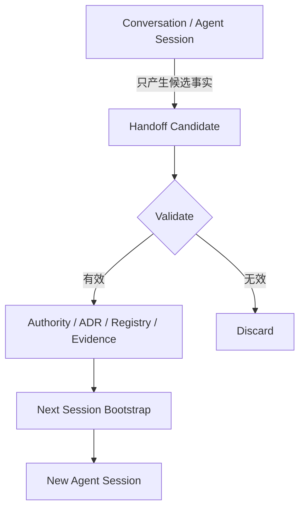
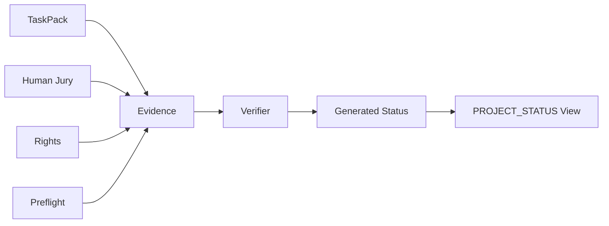
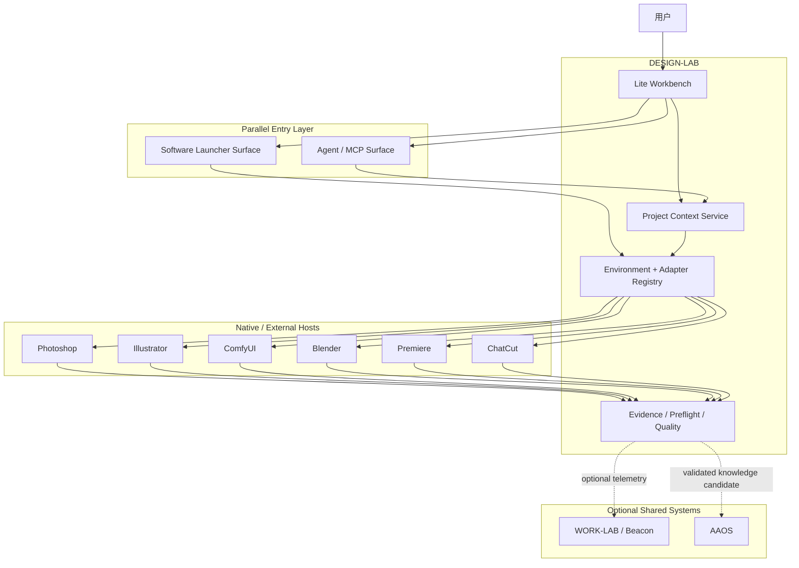
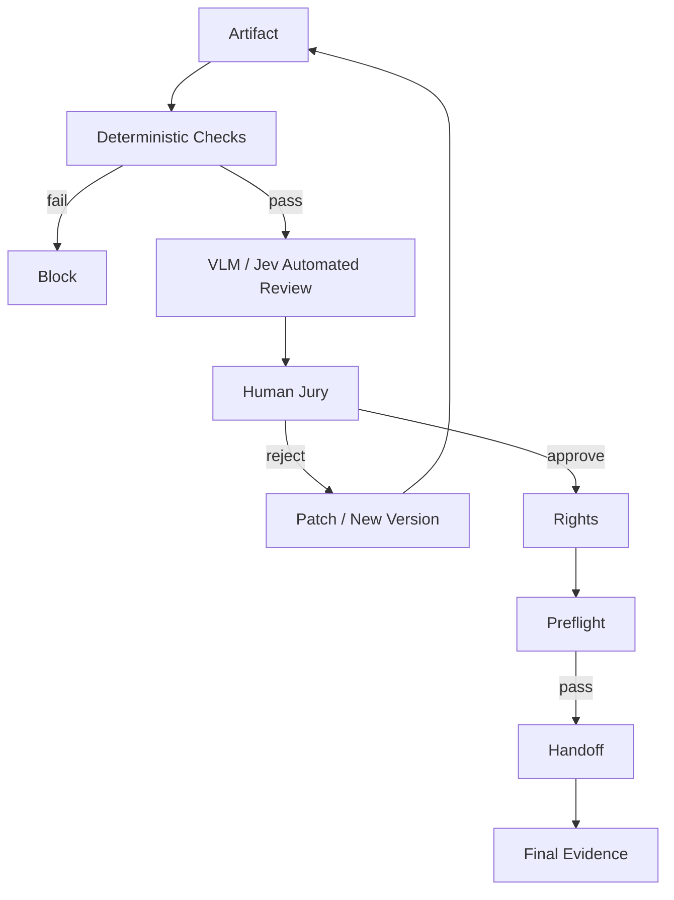

# RAW — 云端全量审计与可执行收敛方案 (2026-09-24)

> **Provenance banner.** 本文档为外部云端模型 2026-09-24 产出的**原始粘贴件**（verbatim），作为 NON_AUTHORITATIVE 历史证据存档。其事实层（分支集合 / PR 身份 / 机器索引缺项）**已与 live `cb9c3ca` 活核对，多处不符**；判定与可执行拆解见同目录 CROSSWALK 文档。本文档**不是**当前派工入口；当前权威 = `/AUTHORITY.md` (`DL-AUTHORITY-2026-09-18-R2`) + `.project/governance/authority-index.json`。

---

## 原始粘贴（verbatim）

# DESIGN-LAB 云端全量审计与可执行收敛方案

## 执行摘要

截至 **2026 年 9 月 24 日**本轮实时读取，DESIGN-LAB 云端 `main` 仍指向：

**`cb9c3ca68a4eb0a12436b719668b16aa09def600`**

因此，和上一轮已经审计过的 `cb9c3ca...` 主线相比，**主线代码本身没有再次前移**；真正发生变化的是云端协作面：当前分支集合已扩展到 **11 个可见分支**，同时存在 **1 个开放 PR：#149 `feat(ai): add declarative ai utilization registry`**。这个 PR 的 head 被 GitHub PR 元数据记录为 `codex/add-ai-utilization-registry`，但该 branch 没有出现在同次 branch-list API 返回的 11 个分支里。这是本轮首先应处理的**云端状态一致性异常**：可能是 head branch 生命周期、接口视图或删除状态差异，不能凭猜测解释，应该在合并前做一次 branch/PR provenance 校验。

综合当前仓库、此前读取过的 `README.md`、`AGENTS.md`、`AUTHORITY.md`、FINAL TaskPack、PROJECT_STATUS、现有 Workbench、Host/Evidence/Preflight 设计，以及本项目会话中已经形成的决策，我的结论是：

> **DESIGN-LAB 已经越过“概念项目”阶段，但尚未完成从“正确的工程骨架”到“可靠、可恢复、可使用的设计生产系统”的跃迁。**

现在最危险的不是缺功能，而是**真值分散**：

```text
Git main
分支
PR
Authority
TaskPack
PROJECT_STATUS
Evidence
Agent 会话
本机工具路径
外置库
Host 版本
历史交接
```

这些信息虽然分别存在，但目前还没有一个足够强的、机器可校验的 **Project Context Control Plane** 将它们锁成一条权威链。于是后期最容易出现用户已经指出的几类问题：

```text
上一轮知道 Photoshop 在哪
             ↓
下一轮 Agent 没读环境记录
             ↓
自己 find / which 没找到
             ↓
误判“未安装”
             ↓
自己下载另一份
             ↓
新路径 / 新版本 / 新依赖
             ↓
Adapter 与 Evidence 指向不同环境
             ↓
PROJECT_STATUS 仍然写 PASS
             ↓
项目事实漂移
```

这类风险的优先级**高于再增加一个 Agent、高于再做一个 UI 页面、高于再接一个开源框架**。

第二个核心结论是前端定位：

> **不要继续把 DESIGN-LAB Workbench 做成巨型 Photoshop/Figma/ChatGPT。**

正确产品形态应收敛为：

**Lite Workbench + Embedded Launcher Surface + Agent/MCP Surface + Native Host**

其中：

- DESIGN-LAB Lite Workbench 拥有项目真值、设计流程、Review、Preflight、Evidence；
- Flow Launcher / PowerToys 类型能力负责软件与资源入口；
- Jan / Witsy 类型能力负责通用 Agent/MCP 入口；
- Photoshop、Illustrator、ComfyUI、Blender、Premiere、ChatCut 等继续作为真正生产 Host；
- DESIGN-LAB 用统一 Host Contract、Environment Registry 和 Evidence Contract 管它们；
- **外部入口不得成为 DESIGN-LAB 真值源，更不能因为找不到工具就自行下载。**

这与早期增强报告的正确边界一致：DESIGN-LAB 应拥有专业设计方法、质量标准、原生工具适配、生产预检和可编辑交付，而不是再造第二套画布、聊天器或编辑器。fileciteturn0file0L39-L45

第三个核心结论是 Evidence：

> **E2 不能冒充 E3，模型评分不能冒充 Human Jury，ChatCut 不能替 Premiere 完成验收。**

现有增强报告也已经明确指出，结构测试通过并不意味着真实宿主已经集成；必须有真实宿主执行、readback 与真实产物验证。fileciteturn0file0L67-L71

因此，接下来应该同时开启四条 P0/P1 主线，而不是串行等待：

| 主线 | 优先级 | 目的 |
|---|---:|---|
| **Truth / Context / Environment Control Plane** | P0 | 防失忆、防路径漂移、防 Agent 自装工具 |
| **Lite Workbench 产品化** | P1 | 让项目真正成为可用软件，而不是工程后台 |
| **Native Host E3** | P1 | Photoshop / Illustrator / ComfyUI / Blender / Premiere |
| **Evidence → Quality → Preflight → Handoff** | P1 | 保证每次“完成”都能被证明、恢复和交付 |

ChatCut、Jev、Flow Launcher、Jan/Witsy 都值得接，但它们是**加速器**，不是新的产品中心。

## 当前云端快照与权威链

### 实时仓库状态

本轮直接读取 GitHub 云端仓库元数据得到：

| 项目 | 2026-09-24 实时结果 | 审计判断 |
|---|---|---|
| Repository | `DTALEX66/DESIGN-LAB` | 公有仓库 |
| Default branch | `main` | 正确 |
| `main` HEAD | `cb9c3ca68a4eb0a12436b719668b16aa09def600` | **当前基线** |
| 可见 branches | **11** | 分支开始积累，需要清理政策 |
| Open PR | **1** | PR #149 |
| PR #149 | `feat(ai): add declarative ai utilization registry` | 与本报告 Environment/AI registry 方向高度相关 |
| PR #149 head | `codex/add-ai-utilization-registry` | **未出现在同次 branches API 列表，需校验** |

当前可见分支如下：

| Branch | HEAD |
|---|---|
| `main` | `cb9c3ca68a4eb0a12436b719668b16aa09def600` |
| `codex/add-csp-csp-router` | `b7b71745a90019778377f23378758135d021f92e` |
| `codex/add-design-system-driver` | `ee23766abf4f3fe2560843903250770d6b9c49ea` |
| `codex/add-video-production-template` | `a1ca546244d690fdaae8e6a91d388241849a82a7` |
| `codex/build-real-system` | `f3c7ed33079af7ec59860a17782902ae17c1b8c5` |
| `codex/complete-blender-c3-evidence` | `32feac53a26141f52b0f1e10c46d554ac3cee059` |
| `codex/implement-dl-r5-p1-review` | `a47ec09b2e4c3b13d74f02876061bf4772f33089` |
| `codex/implement-final-delivery` | `a3c94e8efdbfb77f6b63be47c7a11e3f42f47352` |
| `codex/remove-duplicate-disclaimer` | `28aa70a38882d32ec80acc45d0a1a322172f8638` |
| `codex/reverify-technical-review` | `23debd27eecb75b6626921aa4760a4980296fa89` |
| `codex/update-progress-and-validation` | `6b83d5bddaa52b6ada7c07f2992431a4bae31d04` |

这组 branch 名本身暴露出一个治理问题：设计系统、视频模板、Blender Evidence、Final Delivery、Review、Validation、CSP 等能力分别滞留在不同工作分支。**branch 现在不仅是代码工作区，也在隐式承载项目历史和产品状态。**长期这样会使 Agent 把“分支里存在”误认为“main 已具备”。

建议立即建立：

```text
Branch ≠ Capability
PR ≠ Integrated
Merged ≠ Qualified
E2 ≠ E3
E3 ≠ Human Approved
```

五条硬规则。

### 权威文档链

截至我们前面已经实际读取的 `cb9c3...` 主线，核心文档层至少包括：

| 文档/记录 | 应承担的角色 | 审计结论 |
|---|---|---|
| `README.md` | 项目入口、产品定义 | 应保持简洁，不承载大量动态状态 |
| `AGENTS.md` | Agent 行为边界 | **必须成为启动必读** |
| `AUTHORITY.md` | 真值优先级/治理边界 | **最高优先级文档之一** |
| FINAL TaskPack | 当前正式任务权威 | 应成为“做什么”的唯一 Task Authority |
| PROJECT_STATUS | 当前完成度与证据摘要 | 不应独立人工宣称 PASS |
| 9 月最新 Authority/决策文档 | 当前治理基线 | 必须通过 Authority Index 显式链接 |
| Evidence records | “完成了什么”的事实 | 必须机器生成/校验 |
| Handoff | 当前上下文恢复入口 | 现在应进一步机器化 |
| ADR / decisions | 为什么这样设计 | 应防止未来 Agent 重新做已否决方案 |

这里必须诚实标记一个限制：**本轮最后一次实时 GitHub 快照确定了 HEAD、branches 和 PR，但未再次展开当前 tree 后逐一锁定 FINAL TaskPack、PROJECT_STATUS 和“最新 9 月权威文档”的精确路径与 filename。**此前对这些文档做过读取，但我不会根据记忆虚构当前路径。

这本身恰好说明 DESIGN-LAB 需要增加一个机器可读的：

```yaml
# 建议新增：docs/authority/authority-index.yaml
schema_version: 1

authority_epoch: "2026-09"
effective_at: "2026-09-24"

project:
  repo: DTALEX66/DESIGN-LAB
  default_branch: main

documents:
  project_definition: README.md
  agent_rules: AGENTS.md
  authority: AUTHORITY.md
  taskpack: "<canonical-path>"
  project_status: "<canonical-path>"
  current_handoff: "<canonical-path>"
  environment_registry: "<canonical-path>"
  adapter_registry: "<canonical-path>"

supersedes: []
```

以后 Agent 不再：

> “我觉得 FINAL TaskPack 大概在 docs/...”

而是：

> “先读 authority-index，再按索引读取。”

### 历史记录与对话能否称为“全量”

不能。

本次能够确认的记录层是：

| 记录源 | 是否实际可见 |
|---|---|
| 当前这条 DESIGN-LAB 对话 | **有** |
| 当前对话前序审计决策 | **有** |
| 用户上传的“三项目增强能力”报告 | **有** |
| Git commit / branch / PR 元数据 | **有** |
| 已读取的仓库 Authority / Task / Status 类文档 | **有，部分精确路径本轮未重展开** |
| 仓库内 Evidence / Workbench / Host 相关信息 | **部分可确认** |
| 用户所有其他 ChatGPT 历史会话 | **没有全局会话存档连接器，不能宣称已读取** |
| 本机所有 Codex/Hermes/Claude terminal session | **未提供统一日志源** |
| Photoshop/Adobe 本机完整运行日志 | **未提供** |
| 私有云盘准确目录 | **未提供** |
| 所有外置库实际物理位置 | **未提供完整清单** |
| GitHub/Adobe/Cloud Access Credentials | **未提供，也不应写进仓库** |
| WORK-LAB / AAOS 当前全部日志 | **本轮未读取** |

因此以后任何报告都不得写：

> “已审计所有历史记录”

除非确实提供统一的 Conversation/Session Archive。

正确说法应该是：

> **审计了可访问的项目 Authority、Git 历史、当前会话和登记 Evidence；其他历史源列入 UNKNOWN。**

这是防幻觉规则的一部分。

## 工程、Host、Evidence 与前端全链路审计

### 综合审计矩阵

上一轮对 `cb9c3...` 的源码审计与本轮实时 SHA 对齐，因此，只要 main SHA 未变化，之前对 Workbench 主线代码的结论仍然适用。

| 区域 | 当前判断 | 核心问题 | 下一 Gate |
|---|---|---|---|
| Authority | 🟡 | 文档存在，但缺统一机器索引 | Authority Index |
| Branch governance | 🟡 | 功能分布在长期 codex branches | Merge/Archive policy |
| Open PR | 🟡 | #149 值得做，但 branch 元数据有不一致 | provenance check |
| CI | 🟡 | 已有测试/构建基础；本轮未读取实时 checks 状态 | Required Checks 固化 |
| Schemas | 🟡→🟢 | 已有真实类型和 Preflight 等结构 | 统一版本/迁移规则 |
| Evidence | 🟡 | 方向正确，仍需更强环境/host provenance | Evidence Envelope v2 |
| Adapter Registry | 🟡 | 应提升为所有 Host 的唯一注册真值 | registry schema + CI |
| Photoshop | 🟡 | 不能只靠 contract/模拟 | E3 real host |
| Illustrator | 🟡 | 同上 | E3 real host |
| ComfyUI | 🟡 | 应锁 workflow/model/path provenance | E3 |
| Blender | 🟡 | 有专门 evidence branch 痕迹 | merge + real reopen |
| Premiere | 🟡/🔴 | DL-R5-019 尚不可视为真实完成 | E3 editable video |
| ChatCut | ⚪ | 外部候选，不属于 Premiere evidence | 独立 qualification |
| Preflight | 🟡→🟢 | `PreflightIssue` 已产品化推进 | artifact gate |
| Quality | 🟡 | 不应伪造评分 | deterministic → VLM → human |
| Workbench | 🟡 | 工程已成立，产品视觉仍偏控制后台 | Workbench 2.0 |
| Mobile | 🟡 | 可适配查看，但不宜作为重编辑入口 | responsive read/review |
| Handoff | 🟡 | 有概念，恢复链需自动生成 | Current Handoff snapshot |

### Workbench 前端判断

当前 `apps/workbench` 不应再被称为“没前端”。

上一轮同一 `cb9c3...` 基线已经确认，它已进入：

- Vite；
- strict TypeScript；
- 浏览器构建；
- 测试/E2E 基础；
- 响应式/移动处理；
- 多个 IA route；
- Project / Production / Evidence / Preflight 等真实数据读取；
- `PreflightIssue`；
- `LibraryIndex`；
- 没有后端事实时不应伪造 `QualityScore / ControlMatrix`。

但用户感觉“没有界面进展”也是正确的，因为它解决的主要是：

```text
工程正确性
API 真实性
状态真实性
类型安全
```

而不是：

```text
视觉资产工作流
设计方向
Native Host 可见性
Before/After
Inspector
专业生产时间线
```

所以 Workbench 已经完成的是：

> **UI correctness**

下一阶段必须补：

> **UI maturity**

移动端也不应复制 Desktop Create 工作台。移动端的合理范围是：

```text
查看
审批
评论
Evidence
Preflight
任务状态
轻量启动/转交
```

而不是在手机上重建 Photoshop 控制器。

### Evidence 必须升级为“事实信封”

建议以后所有 E2/E3/E4 都由统一 `EvidenceEnvelope` 表达：

```yaml
evidence_id:
task_id:
project_id:

repo:
  commit_sha:
  branch:

environment:
  registry_revision:
  os:
  machine_fingerprint:
  toolchain_lock_hash:

host:
  id:
  version:
  canonical_install_id:
  adapter_id:
  adapter_version:

inputs:
  - uri:
    sha256:

execution:
  action:
  started_at:
  completed_at:
  agent:
  model:
  policy_decision:

outputs:
  - artifact:
    sha256:
    editable: true

readback:
  status:
  snapshot_hash:

checks:
  deterministic:
  automated_quality:
  human_jury:

rights:
  status:

preflight:
  status:

provenance:
  logs:
  screenshots:
  supersedes:
```

这里最重要的字段不是模型名，而是：

**哪个主机、哪个版本、哪个安装、哪个 Adapter、哪个输入、哪个输出、有没有 readback、有没有 reopen。**

### E2、E3、E4 必须重新锁死

建议项目统一采用：

**E2：Contract / deterministic integration evidence**

能证明数据结构、Adapter 接口、fixture、schema、mock/controlled execution 正确。

**E3：Real-host evidence**

必须真实启动/连接目标 Host：

```text
Open
→ Execute
→ Save
→ Readback
→ Patch
→ Readback
→ Close
→ Reopen
→ Readback
→ Artifact Validation
```

不能只有：

```text
API returned success
```

增强报告已经明确指出，结构测试并不足以证明宿主集成。fileciteturn0file0L67-L71

**E4：Human professional acceptance**

必须由真人完成专业判断。

所以：

```text
Jev 95
VLM PASS
Claude says beautiful
GPT says production-ready
```

全部不能自动升级 E4。

Jev 更适合作为结构化自动评审辅助，其现有能力不能证明它适合作为所有设计结果的最终评价器。fileciteturn0file0L455-L471

### Host Adapter 统一接口

所有 Host——包括 Photoshop、Illustrator、Blender、ComfyUI、Premiere、ChatCut——不要各写一套世界观。

建议统一：

```ts
interface HostAdapter {
  probe(): HostProbeResult;
  connect(): HostSession;
  open(input: ProjectArtifact): HostDocument;
  readback(target: ReadbackTarget): ReadbackSnapshot;
  apply(patch: DesignPatch): PatchResult;
  save(): ArtifactResult;
  reopen(): ReadbackSnapshot;
  export(target: ExportTarget): ExportResult;
  close(): void;
}
```

每个 Adapter Registry 条目至少必须记录：

```yaml
id: photoshop
provider: adobe
adapter:
  id: photoshop-uxp
  version: ...
host:
  version_range: ...
environment:
  canonical_install_id: adobe.photoshop.primary
qualification:
  e2: PASS
  e3: CURRENT
  evidence_id: ...
last_verified_at: ...
expires_at: ...
```

核心原则是：

> **Adapter 注册表只说明“准入情况”，真正 PASS 的事实仍指向 Evidence。**

### 各 Host E3 最低标准

| Host | E3 最低真实验收 |
|---|---|
| Photoshop | 打开真实 PSD → 创建/读取图层 → 修改文字/位置/样式 → 保存 → readback → 关闭重开 → 再 readback → PSD 仍可编辑 |
| Illustrator | 打开真实 AI → 读取对象/Artboard/Text → Patch → Save → Reopen → 对象仍可编辑 |
| ComfyUI | 加载真实 workflow → 校验 nodes/models → 执行 → 产物与 workflow/input/model lineage 可追溯 → workflow 可再次打开 |
| Blender | 打开 `.blend` → 读取对象/材质/相机 → 修改 → 保存 → 关闭重开 → 再读 → 输出真实 render |
| Premiere | Media/audio/subtitle/timeline → 修改 → project 保存 → 关闭重开 → media relink → 再读 → export |
| ChatCut | Import → timeline edit → subtitle/motion → readback → save → reopen → readback → export |

**ChatCut 必须单独资格验证。**

不能：

```text
ChatCut E3 PASS
      ↓
Premiere E3 PASS
```

增强报告已经把 ChatCut 定位为有价值的视频生产候选，并建议以真实导入、时间线、字幕/动效、readback、重开和导出验证。fileciteturn0file0L388-L419

## 防失忆、防幻觉、防路径漂移控制面

这是整个项目下一步最重要的一次架构升级。

### 不再让“对话记忆”承担项目记忆

长期项目绝不能依赖：

> “上一次 ChatGPT 应该记得。”

正确关系是：



**对话是工作缓存，不是真值库。**

未来所有 Agent 的 bootstrap 顺序应锁成：

```text
authority-index
    ↓
AUTHORITY
    ↓
AGENTS
    ↓
FINAL TaskPack
    ↓
PROJECT_STATUS
    ↓
CURRENT_HANDOFF
    ↓
environment/toolchain registry
    ↓
adapter registry
    ↓
related Evidence
    ↓
Git branch/PR status
    ↓
开始工作
```

任何 Agent 没读完这条链：

> **不得修改 repo，不得下载工具，不得声称任务完成。**

### 建议新增 Project Context Control Plane

建议不是再写十篇 Markdown，而是引入一组小型机器可读记录：

```text
docs/
  authority/
    authority-index.yaml

  handoff/
    CURRENT_HANDOFF.md
    CURRENT_HANDOFF.json

config/
  environment/
    toolchain-registry.yaml
    external-paths.example.yaml

  adapters/
    registry.yaml

  ai/
    utilization-registry.yaml

evidence/
  index.jsonl

decisions/
  ADR-xxxx.md
```

其中 PR #149 的 declarative AI utilization registry 是正确方向，但它不能孤立存在，应和：

```text
toolchain registry
adapter registry
authority index
evidence
```

形成一个完整 Control Plane。

### Environment Registry 是解决“自己下载工具”的关键

不要让 Agent 使用：

```text
where photoshop
which blender
find / -name comfyui
```

找不到以后就下一个。

应该先查询：

```yaml
tools:
  photoshop:
    canonical_install_id: adobe.photoshop.primary
    path_ref: local://adobe/photoshop
    managed_by: user
    auto_install: deny
    probe_command: ...

  comfyui:
    canonical_install_id: comfyui.production
    path_ref: external://ai-tools/comfyui
    managed_by: external
    auto_install: deny

  flow-launcher:
    canonical_install_id: launcher.primary
    auto_install: deny
```

注意：

**实际绝对路径不一定适合 commit。**

Git 中可以存：

```text
path_ref
```

机器本地再映射：

```text
path_ref → D:\...
```

这样换电脑不改仓库真值。

### Agent 下载政策建议直接采用 Default Deny

规则不要写“尽量不要下载”。

必须写：

```text
AUTO_INSTALL = DENY
```

除非满足全部条件：

```text
Task 明确允许安装
+
Authority 允许
+
Environment Registry 没有现存工具
+
License 已验证
+
Source 已验证
+
目标目录明确
+
版本明确
+
Hash 明确
+
用户/Policy Gate 已批准
```

否则只能：

```text
NOT_FOUND
或
REGISTERED_PATH_UNREACHABLE
```

然后停止。

禁止通过“解决问题”的名义执行：

```bash
curl ... | bash
pip install ...
npm install -g ...
winget install ...
choco install ...
git clone ...
```

特别是**不得因为 Adapter 探测失败自动创建第二份 ComfyUI、Blender、Node、Python、FFmpeg。**

### 防路径漂移必须进 CI

CI 增加 `path-drift-check`：

检查代码、文档、taskpack、scripts 中：

- 未登记绝对 Windows 路径；
- 未登记 `/opt/...`；
- 用户 home path；
- 重复 ComfyUI root；
- 重复 Python 环境；
- 未登记 exe；
- 未登记 external repo；
- evidence 引用失效路径。

发现：

```text
C:\Users\...
D:\some-random-copy
/home/agent/...
```

如果不在允许的 local overlay 中，应直接失败。

### PROJECT_STATUS 不应该人工自由书写

最稳的模型是：



即：

> **PROJECT_STATUS 是 Evidence 的视图，而不是另一个真相。**

这会显著减少：

```text
文档写 PASS
实际 Evidence 已失效
```

## 推荐架构与开源入口选型

### 最终建议：三平面，不做超级 App



这里“embedded”不应该理解成：

> 把 Flow Launcher / Jan 的全部源码 fork 到 `apps/workbench`。

而应理解成：

> Workbench 提供一个**统一入口面板**，底层通过 Launcher Provider / Agent Provider 调用独立软件。

### 软件入口候选比较

由于本轮最终实时研究阶段在完成 repo 快照后停止，以下 License 中只有高置信项目直接锁定；标记“合并前复核”的条目不应被当成最终法务结论。

| 项目 | License 状态 | 平台/形态 | 扩展模型 | 主要风险 | 接入成本 | DESIGN-LAB 推荐角色 |
|---|---|---|---|---|---:|---|
| **Flow Launcher** | MIT，高置信 | Windows desktop | Plugin | 第三方插件执行权限 | 低 | **首选 Software Launcher Provider** |
| **PowerToys Command Palette / Run** | MIT，高置信 | Windows | Microsoft 扩展机制 | 深度定制自由度低于专用 launcher | 低 | **官方生态备选** |
| **Jan** | **吸收前重新锁定当前 LICENSE** | Desktop AI | Agent/MCP/model integrations | AI 工具权限、模型/网络配置 | 中 | **Agent Console 首选候选** |
| **Witsy** | 前序快照为 AGPL-3.0，**接入前复核** | Desktop AI/MCP | MCP/providers | copyleft 与插件执行权限 | 中 | **轻量 Agent/MCP Console** |
| **Pinokio** | **接入前复核当前 LICENSE** | AI app launcher | scripts/app recipes | **脚本可下载并执行程序，供应链/路径漂移风险最高** | 中 | **Sandbox-only AI Lab** |
| **Open WebUI** | 当前许可应在接入前重新法务锁定 | Web AI UI | tools/functions/MCP | 容易把产品重新变成 chat-first | 中 | Optional parallel console |
| **Backstage** | Apache-2.0，高置信 | Web developer portal | plugin/catalog | 对单一 DESIGN-LAB 过重 | 高 | 三项目未来 Portal 架构参考 |

### 为什么 Flow / PowerToys 比自己重写 Launcher 更合理

DESIGN-LAB 没有必要再承担：

```text
Windows app discovery
全局热键
文件搜索
进程切换
快捷方式解析
软件 launcher ecosystem
```

Workbench 自己只需要一个统一的：

```ts
interface LauncherProvider {
  listRegisteredTools(): RegisteredTool[];
  probe(toolId: string): ProbeResult;
  launch(request: LaunchRequest): LaunchResult;
  activate(toolId: string): ActivateResult;
}
```

实现可以有：

```text
FlowLauncherProvider
PowerToysProvider
NativeWindowsProvider
```

因此未来替换 Launcher，不影响 DESIGN-LAB 核心。

### Agent Console 也必须 Provider 化

同理：

```ts
interface AgentConsoleProvider {
  createSession(context: ProjectContext): SessionRef;
  sendTask(task: GovernedTask): TaskRef;
  exposeMcp(server: McpEndpoint): void;
  interrupt(taskId: string): void;
}
```

可实现：

```text
JanProvider
WitsyProvider
OpenWebUIProvider
ExternalCliProvider
```

关键不是用哪个 UI，而是：

> **Agent 必须吃 DESIGN-LAB 提供的 project context 与 policy，而不是自己重新发现项目。**

### Pinokio 必须单独隔离

Pinokio 类型工具最容易触发用户已经担心的问题：

```text
工具不存在？
↓
下载
↓
创建环境
↓
装 Python
↓
装 Node
↓
clone repo
↓
再启服务
```

所以推荐：

```text
Pinokio Sandbox
│
├── 独立 root
├── 独立 downloads
├── 独立 Python/Node
├── 禁止写 production registry
├── 禁止替换现有 ComfyUI
├── 禁止替换 Host adapters
└── 任何提升到 production 必须重新 qualification
```

也就是说：

**Pinokio 可以做实验室，不可以做 Toolchain Authority。**

### Beacon / WORK-LAB 边界

不要让 Beacon 变成 DESIGN-LAB 完成任务的前提。

正确链路：

```text
DESIGN-LAB
   │
   ├─ EvidenceRecord ← source of truth
   │
   └─ optional receipt / telemetry
                ↓
          WORK-LAB / Beacon
```

Beacon 适合补充谁执行、何时执行、用了什么软件、产物是什么等跨软件追踪，但不应该成为第四个项目真值源。这个边界也与增强报告的分析一致。fileciteturn0file0L193-L238

## Lite Workbench 产品界面与交付批次

### 界面定位

前面的“重型还是轻型”可以最终收敛成一句话：

> **Focused UX / Light Runtime / Heavy Professional Information**

也就是：

- App 自身轻；
- 不造编辑器；
- 不造通用 Chat；
- 不造软件商店；
- 专业信息密度高；
- Host/Evidence/Preflight 非常清楚。

### 非原型级 Shell

最终第一屏应接近：

```text
┌────────────────────────────────────────────────────────────────────────────┐
│ DESIGN-LAB │ 东方仕典 / Brand Refresh │ main@cb9c3ca │ ● Host │ ● Evidence │
├────────────┬──────────────────────────────────────────┬────────────────────┤
│ PROJECT    │                                          │ INSPECTOR          │
│            │                                          │                    │
│ Home       │            MAIN WORKSPACE                │ Selection          │
│ Brief      │                                          │ Host               │
│ Reference  │    Project / Board / Artifact / Compare  │ Version            │
│ Direction  │                                          │ Evidence           │
│ Create     │                                          │ Rights             │
│ Versions   │                                          │ Preflight          │
│ Review     │                                          │                    │
│ Preflight  │                                          │                    │
│ Handoff    │                                          │                    │
├────────────┴──────────────────────────────────────────┴────────────────────┤
│ LAUNCHER │ Photoshop ● │ Illustrator ● │ Blender ● │ ComfyUI ● │ Agent ● │
├────────────────────────────────────────────────────────────────────────────┤
│ Task DL-R5-019 │ Premiere E3: BLOCKED │ Evidence EV-... │ 2 Preflight Issues│
└────────────────────────────────────────────────────────────────────────────┘
```

它和传统 Dashboard 最大区别是：

> **中央区域会根据生产阶段变成真正的设计工作面，而不是永远显示卡片。**

### Launcher Panel

```text
┌─ SOFTWARE ──────────────────────────────────────┐
│ Photoshop 27.x     READY     [Open] [Activate] │
│ Illustrator        READY     [Open] [Activate] │
│ ComfyUI Production READY     [Open]            │
│ Blender            READY     [Open Project]    │
│ Premiere           REVIEW    [Probe]           │
│ ChatCut            UNQUALIFIED [Sandbox]       │
│                                                │
│ Missing tool?                                  │
│ ⚠ Report missing — automatic install disabled │
└────────────────────────────────────────────────┘
```

最后这一行必须成为产品功能，而不只是一条开发规范。

### Agent Panel

```text
┌─ AGENT / MCP ───────────────────────────────────────┐
│ Provider        Jan                                │
│ Project         东方仕典                            │
│ Authority       2026-09 ✓                          │
│ Task            DL-R5-019                          │
│ Write scope     project-workspace                  │
│ Network         allowlist                          │
│ Install policy  DENY                               │
│ Host actions    approval                           │
│                                                     │
│ Context loaded                                   ✓ │
│ Environment registry                             ✓ │
│ Adapter registry                                 ✓ │
│ Evidence policy                                  ✓ │
│                                                     │
│ [Open Session] [Send Governed Task] [Interrupt]    │
└─────────────────────────────────────────────────────┘
```

这比一个空白“跟 AI 聊天”框有价值很多。

### Inspector

选中真实 PSD：

```text
ARTIFACT
brand-wall-v12.psd

HOST
Photoshop 27.x
Adapter photoshop-uxp
E3 CURRENT

DOCUMENT
3840 × 2160
RGB / sRGB
47 Layers
12 Text
8 Smart Objects

LATEST PATCH
title-cn
x: +18
font-size: 42 → 40

QUALITY
Deterministic   PASS
VLM/Jev         REVIEW
Human Jury      PENDING

RIGHTS          PASS
PREFLIGHT       2 warnings
REOPEN          PASS

EVIDENCE
EV-DL-R5-006-...
```

### 可直接落地的 SVG 线框

以下不是概念描述，而可以直接作为 UI 实现时的 viewport/layout fixture：

```svg
<svg xmlns="http://www.w3.org/2000/svg" width="1200" height="700" viewBox="0 0 1200 700">
  <title>DESIGN-LAB Lite Workbench Wireframe</title>
  <rect x="1" y="1" width="1198" height="698" fill="white" stroke="black"/>
  <rect x="1" y="1" width="1198" height="55" fill="white" stroke="black"/>
  <text x="22" y="34" font-size="20">DESIGN-LAB   Project Context   main@SHA   Host   Evidence</text>

  <rect x="1" y="56" width="170" height="530" fill="white" stroke="black"/>
  <text x="20" y="90" font-size="16">PROJECT</text>
  <text x="20" y="130" font-size="14">Home</text>
  <text x="20" y="160" font-size="14">Brief</text>
  <text x="20" y="190" font-size="14">Reference</text>
  <text x="20" y="220" font-size="14">Direction</text>
  <text x="20" y="250" font-size="14">Create</text>
  <text x="20" y="280" font-size="14">Versions</text>
  <text x="20" y="310" font-size="14">Review</text>
  <text x="20" y="340" font-size="14">Preflight</text>
  <text x="20" y="370" font-size="14">Handoff</text>

  <rect x="171" y="56" width="755" height="530" fill="white" stroke="black"/>
  <text x="460" y="300" font-size="22">MAIN WORKSPACE</text>
  <text x="390" y="335" font-size="14">Board / Artifact / Host / Compare</text>

  <rect x="926" y="56" width="273" height="530" fill="white" stroke="black"/>
  <text x="950" y="90" font-size="16">INSPECTOR</text>
  <text x="950" y="130" font-size="14">Host / Version</text>
  <text x="950" y="160" font-size="14">Object / Patch</text>
  <text x="950" y="190" font-size="14">Quality / Jury</text>
  <text x="950" y="220" font-size="14">Rights / Preflight</text>
  <text x="950" y="250" font-size="14">Evidence</text>

  <rect x="1" y="586" width="1198" height="54" fill="white" stroke="black"/>
  <text x="20" y="618" font-size="14">LAUNCHER   Photoshop | Illustrator | ComfyUI | Blender | Premiere | Agent</text>

  <rect x="1" y="640" width="1198" height="59" fill="white" stroke="black"/>
  <text x="20" y="674" font-size="14">TASK / HOST JOBS / READBACK / EVIDENCE / POLICY EVENTS</text>
</svg>
```

### UI 批次不再排到最后

建议正式放进 P1：

| Batch | 实际交付，不接受 Prototype |
|---|---|
| **Workbench 2.0 Shell** | Shell、project context、navigation、Inspector、event lane、responsive |
| **Project Home** | Production state、task/evidence/host health、blocked reasons |
| **Reference Board** | 图片墙、source、rights、tag、direction linkage |
| **Direction Board** | moodboard、color、typography、form、rules |
| **Create / Host Control** | artifact preview、object/readback、host state、patch action |
| **Versions / Compare** | before/after、version lineage、structured diff |
| **Review / Jury** | deterministic + VLM/Jev + Human 三层评审 |
| **Preflight / Handoff** | blockers、rights、editable、reopen、delivery package |

UI acceptance 不再允许：

> “页面能打开，所以完成。”

必须有：

```text
real API
+
real empty/loading/error
+
real project
+
responsive
+
no fake KPI
+
keyboard/accessibility basics
+
browser E2E
+
screenshots
+
Evidence
```

## 路线图、验收标准与后续任务提示词

### 对现有 DL-R5 的收敛

当前可高置信锁定的现有任务信息中：

- **DL-R5-019** 是 Premiere 可编辑视频生产链；
- **DL-R5-021** 与可选 Host / Agent 收敛有关。

`DL-R5-006` 和 `DL-R5-014` 的**精确当前任务标题没有保留在本轮最终实时快照输出中**，因此这里不凭记忆编造标题；在实施时必须从 FINAL TaskPack 按 ID 读取标题和 acceptance，再补映射。

推荐映射是：

| Task | 推荐处理 | Gate |
|---|---|---|
| `DL-R5-006` | 保留原 Authority 标题；把相关专业生产能力接入统一 Evidence/Host contract | 原 acceptance + E2/E3，不改任务语义 |
| `DL-R5-014` | 同上；任何新增 UI/Adapter 不得偷偷改变原 Task Definition | 原 acceptance + Evidence |
| `DL-R5-019` | **Premiere 独立 E3**：editable project + audio + subtitle + save/reopen + relink + export | E2 → **Premiere E3** |
| `DL-R5-021` | Flow/PowerToys、Jan/Witsy、ChatCut 等候选收敛入口 | Pilot → qualification；不得替其他 Host |

### Quality / Jury 正式管线



Jev/VLM 永远位于：

```text
deterministic
     ↓
automated professional assistance
     ↓
human
```

而不是：

```text
AI score
     ↓
production approved
```

### 建议实施时间窗

这是**执行优先级窗口，不是异步承诺**。

| 时间 | 主线 |
|---|---|
| **9 月 24–27 日** | Authority Index、branch/PR clean-up、Environment Registry、auto-install deny、PR #149 对齐 |
| **9 月 28 日–10 月 4 日** | Workbench 2.0 Shell + Project Home + Launcher Contract |
| **10 月 5–11 日** | Photoshop/Illustrator E3 + Launcher Panel + Inspector |
| **10 月 12–18 日** | Reference/Direction + ComfyUI/Blender E3 + Evidence v2 |
| **10 月 19–25 日** | Create/Versions/Compare + Premiere E3 + ChatCut sandbox qualification |
| **10 月 26 日–11 月 1 日** | Review/Jury + Preflight/Handoff + release authority convergence |

任何阶段只要 P0 Context/Environment 没过，就**不得用新增软件和新增 Agent 来绕过问题**。

### 提示词：云端仓库全量审计

```text
你正在审计 DTALEX66/DESIGN-LAB。

第一原则：不得根据旧对话推断当前云端事实。

开始前必须读取：
1. Git remote/default branch/current HEAD
2. 全部分支及 HEAD SHA
3. 所有 open PR / base / head / checks
4. authority-index（若存在）
5. AUTHORITY.md
6. AGENTS.md
7. FINAL TaskPack
8. PROJECT_STATUS
9. CURRENT_HANDOFF
10. Environment/Toolchain Registry
11. Adapter Registry
12. 与本任务相关 Evidence

规则：
- 明确区分 main / branch / PR。
- “某分支存在”不得写成“main 已实现”。
- PROJECT_STATUS 与 Evidence 冲突时，以 Authority 定义的 Evidence 规则处理并报告冲突。
- 找不到文件时报告 NOT_FOUND；不得猜路径。
- 不得安装、下载、clone 或升级任何工具。
- 不得根据旧 SHA 描述当前状态。
- 输出每项结论的 source path + commit SHA + evidence id。
- 对 exact path、credentials、external storage 未知项写 UNKNOWN，不得补全。

输出：
A. Current Truth Snapshot
B. Authority Chain
C. Branch/PR Drift
D. CI
E. Task/Evidence consistency
F. Host/Adapter state
G. UI state
H. Blockers
I. 下一批最小任务
```

### 提示词：Host Adapter Qualification

```text
目标：为 <HOST> 执行正式资格验证。

禁止：
- 下载第二份 <HOST>
- 自动安装依赖
- 修改系统 PATH
- 修改 Environment Registry 中 canonical path
- 用 mock 冒充 real host

启动前：
1. 读取 Authority / AGENTS / TaskPack。
2. 从 Environment Registry 获取 canonical_install_id。
3. 从 Adapter Registry 获取 adapter/version。
4. probe 真实 Host，并记录版本。
5. 若路径不可达，STOP = REGISTERED_PATH_UNREACHABLE。

E2：
- schema
- contract
- fixture
- deterministic tests

E3：
Open real artifact
→ Readback
→ Apply controlled patch
→ Readback
→ Save
→ Close host/document
→ Reopen
→ Readback
→ Validate editable structure
→ Validate output hash/provenance

生成 EvidenceEnvelope。
没有 reopen/readback 不得标 E3 PASS。
```

### 提示词：ChatCut Qualification

```text
目标：将 ChatCut 作为独立 Video Host Candidate 验证。
不得把 ChatCut PASS 写成 Premiere PASS。

前置：
- Source/license review
- sandbox only
- Environment Registry registration
- Adapter id/version
- sample media hashes

真实验证：
1. Import media
2. Build/edit timeline
3. Add subtitle
4. Apply one motion/effect operation
5. Readback timeline/state
6. Save project
7. Close
8. Reopen
9. Readback again
10. Export
11. Validate exported artifact
12. Capture Evidence

结果只能是：
UNQUALIFIED
E2_PASS
E3_PASS_CHATCUT

禁止输出：
PREMIERE_PASS
PRODUCTION_DEFAULT

除非另有 Authority 决策。
```

ChatCut 作为候选 Host 的价值与独立真实资格验证要求也符合此前增强报告。fileciteturn0file0L388-L419

### 提示词：Workbench UI 验收

```text
任务：验收 DESIGN-LAB Workbench <SCREEN>。

这不是视觉 prototype 验收。

必须验证：
- 使用真实 API/contract
- loading
- empty
- partial data
- error
- blocked state
- real project data
- no fake metrics
- no hard-coded PASS
- desktop responsive
- mobile review mode
- keyboard navigation basics
- no console errors
- browser E2E
- screenshot evidence

针对 Launcher：
- REGISTERED
- READY
- NOT_FOUND
- PATH_UNREACHABLE
- UNQUALIFIED
必须有不同 UI。

NOT_FOUND 时绝不提供自动下载为默认动作。

针对 Host：
E2 与 E3 必须视觉区分。

针对 Quality：
AI/VLM score 不得显示成 Human Approved。

最终输出：
PASS / FAIL
失败项
截图
route
commit SHA
browser
Evidence ID
```

### 提示词：Evidence Capture

```text
为任务 <TASK_ID> 捕获 Evidence。

禁止从文字描述直接生成 PASS。

采集：
repo SHA
branch
taskpack revision
authority epoch
environment registry revision
machine fingerprint
host id/version/canonical install
adapter id/version
agent/model（若使用）
input URI/hash
actual operations
output artifact/hash
readback snapshot/hash
reopen result
deterministic checks
AI review
human jury
rights
preflight
screenshots/log refs

如任一 REQUIRED 字段无法采集：
标记 UNKNOWN/BLOCKED，
不得推断。

Evidence 写入后运行 verifier。
只有 verifier 输出结果可以驱动 PROJECT_STATUS。
```

### 提示词：Preflight

```text
对 <ARTIFACT> 运行 Production Preflight。

按 artifact type 使用确定性规则检查：
- file exists
- expected native format
- editable structure
- dimensions
- resolution
- color profile/mode
- fonts
- missing links
- media relink
- external references
- rights
- naming
- package structure
- reopen
- Evidence linkage
- required human approval

每项输出：
RULE_ID
PASS/WARN/BLOCK
observed value
expected value
source
remediation

禁止用 LLM 猜测字体、DPI、link、rights 或 reopen 状态。
无法确定 = UNKNOWN/BLOCK，不等于 PASS。
```

### 提示词：Agent Sandbox / 禁止乱下载

```text
你在 DESIGN-LAB Governed Sandbox 中执行任务。

默认政策：
INSTALL = DENY
DOWNLOAD = DENY
GLOBAL_PACKAGE = DENY
SYSTEM_PATH_CHANGE = DENY
NEW_RUNTIME = DENY
EXTERNAL_GIT_CLONE = DENY

开始前只允许：
1. 读取 Authority。
2. 读取 Environment Registry。
3. 使用 canonical registered tool。
4. 使用明确允许的 workspace。
5. 使用允许的网络目标。

如果工具找不到：
不要下载。
不要安装。
不要创建替代环境。
不要修改 Registry。
不要猜路径。

返回：
TOOL_NOT_REGISTERED
或
REGISTERED_PATH_UNREACHABLE
并附 probe evidence。

只有任务 Authority 明确提供 installation approval 时，
才能按照指定 version/source/hash/destination 执行。

任何环境改变必须形成 EnvironmentMutation Evidence。
```

### 最终收敛优先级

后续不要再让大量新开源项目把主线打散。

应严格按以下序列：

```text
P0
Authority / Context / Environment / Path / Auto-install Governance
                         ↓
P1-A                     P1-B
Lite Workbench           Native Host E3
                         │
                         ├ Photoshop
                         ├ Illustrator
                         ├ ComfyUI
                         ├ Blender
                         └ Premiere
        \                /
         \              /
          Evidence v2
              ↓
      Quality / Human Jury
              ↓
        Rights / Preflight
              ↓
            Handoff
              ↓
       Optional Extensions
          /           \
 Flow/Jan/Witsy     ChatCut/Jev
```

真正的完成标准不是“仓库又多了多少代码”，而是：

> 新的 Agent 隔几周重新进入项目，即使完全没有上一轮聊天记忆，也能从 Authority Index 在几分钟内准确恢复：**现在是什么版本、什么任务、哪些是真的完成、哪些只是 E2、软件到底装在哪里、哪个 Adapter 有资格、哪些路径不能碰、下一步该做什么。**

达到这个标准以后，DESIGN-LAB 才真正解决了长期项目最难的三个问题：

**失忆、幻觉、漂移。**

## 限制与当前必须标记为未知的事项

本报告刻意没有虚构以下信息：

- FINAL TaskPack 当前的精确 repo path；
- PROJECT_STATUS 当前的精确 repo path；
- “最新 9 月权威文档”的精确 filename/path；
- 用户私有云存储的准确根路径；
- Photoshop / Illustrator / ComfyUI / Blender / Premiere 当前本机实际安装路径；
- GitHub、Adobe、云存储等 credentials；
- 所有其他 ChatGPT 会话历史；
- 全部 Codex/Hermes/Claude CLI 历史 session；
- 当前 PR #149 的实时 CI checks 最终结果；
- Jan、Witsy、Pinokio、Open WebUI 在 **2026-09-24 当前 HEAD** 的最终 License 法务状态；
- PR #149 head branch 为什么没有出现在同次 branch-list 结果中的确切原因。

这些项应保持：

**UNKNOWN / NEEDS VERIFICATION**

而不是由下一轮 Agent “合理推断”。

对于方法与开源增强的吸收，也必须继续坚持“Prompt 不等于 Method”：一个外部提示词只有补齐输入要求、输出合同、专业标准、失败处理、Evidence 与验证，才有资格进入 DESIGN-LAB 方法层。fileciteturn0file0L290-L316

最终架构目标因此不是把 DESIGN-LAB 变得越来越庞大，而是让它成为一个**很难失忆、很难撒谎、很难误装工具、很难把测试当生产事实，同时又足够轻量、真正能驱动专业设计软件工作的设计生产控制面**。这也符合前序增强审计最重要的结论：真正的升级不是继续增加 Agent，而是减少重复劳动，让真实产物有证据，并把成功与失败沉淀成有边界、可验证、可复用的经验。fileciteturn0file0L623-L633