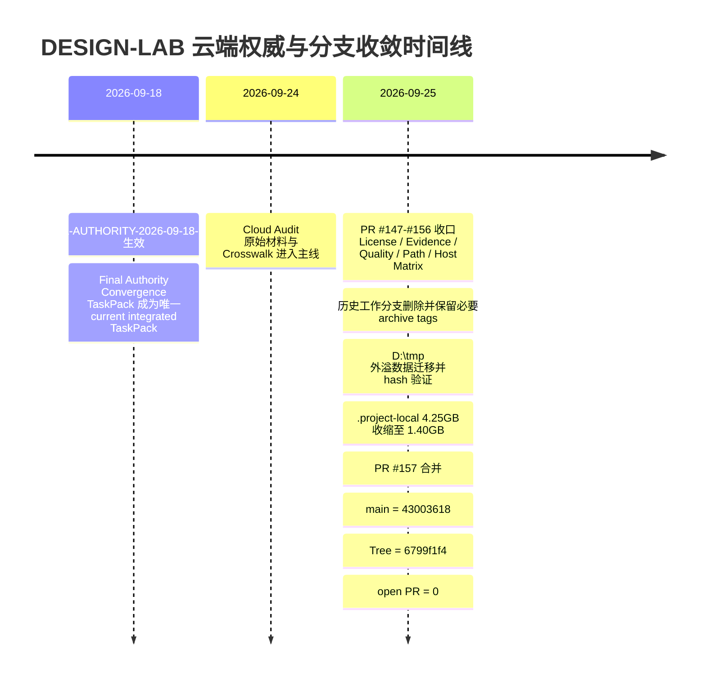
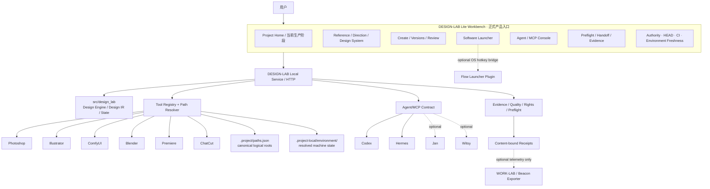
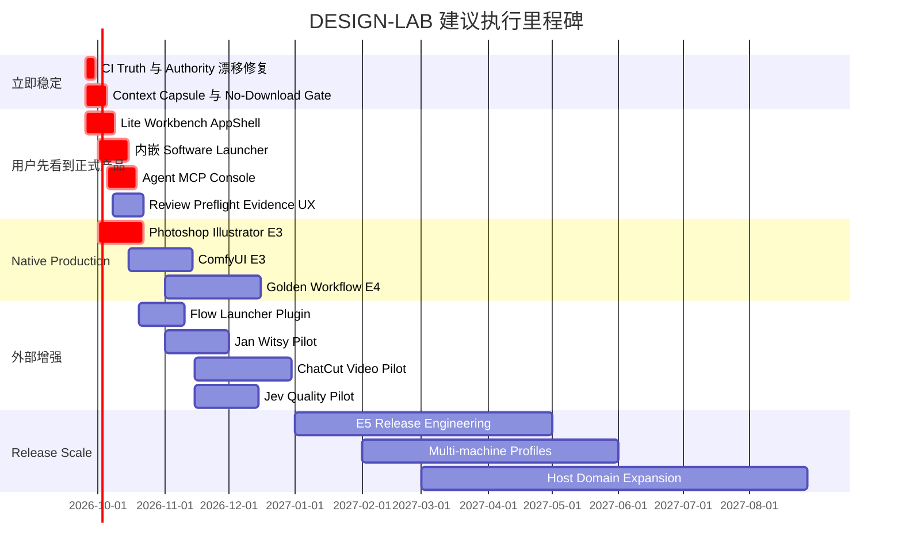

# DESIGN-LAB 云端全量深度审计与后续执行方案

## 执行摘要

截至本次实时审计，DESIGN-LAB 云端已收敛为 **`main` 单主线**，当前 HEAD 为 `43003618e87db5da61fb6350ef5be2303af66e05`，Tree SHA 为 `6799f1f4930122f1dac474291f7f523510c04c74`，开放 PR 为 0。治理、Authority、Evidence、CI 骨架已经较强，但产品仍未完成：Workbench 明示为“实验入口”，当前 Host Matrix 为 **8 项 E1、live=0、无当前 E3/E4**，最新 Canonical Verify 总体仍为红。下一阶段不应继续扩大治理文档，而应优先交付**正式 DESIGN-LAB Lite 工作台 + 内嵌受控软件启动器 + Agent/MCP 控制台**，并同步封死路径漂移、找不到工具即自行下载、上下文失忆与假验收。fileciteturn86file0L2-L2 fileciteturn70file0L2-L2

## 审计基线与访问边界

**本报告的唯一动态基线是本次重新读取的 live GitHub，而不是此前对话里的旧 SHA。** 当前 `main` HEAD 是 `43003618e87db5da61fb6350ef5be2303af66e05`，父提交 `bc71fcce35b17623eff98c0508e5b8d1690ce451`，Tree SHA `6799f1f4930122f1dac474291f7f523510c04c74`；该提交为 GitHub 验签通过的 PR #157 合并提交，时间为 **2026-09-25 02:07:05 UTC**，即 America/Phoenix **2026-09-24 19:07:05**。fileciteturn86file0L2-L2

### 当前仓库事实快照

| 审计对象 | 本次实时结论 | 证据 |
|---|---|---|
| 默认分支 | `main` | live branch API；当前仅 `main`，并标记 protected。fileciteturn60file0L2-L2 |
| 当前 Commit SHA | `43003618e87db5da61fb6350ef5be2303af66e05` | Git commit/API。fileciteturn86file0L2-L2 |
| 当前 Tree SHA | `6799f1f4930122f1dac474291f7f523510c04c74` | 同上。fileciteturn86file0L2-L2 |
| 当前父提交 | `bc71fcce35b17623eff98c0508e5b8d1690ce451` | 同上。fileciteturn86file0L2-L2 |
| 开放 PR | **0** | `pulls?state=open` 返回空数组。fileciteturn79file0L1-L12 |
| PR 历史 | 已分页审查到最早批次；page 3 为空 | PR API 第二页仍有历史 PR，第三页为空；最新编号为 #157。fileciteturn84file0L1-L2 fileciteturn85file0L1-L12 |
| Main commit 历史 | API 100/页，page 1–5 有记录，page 6 为空 | 已遍历整个 `main` 可达历史分页，不在正文逐条复述数百条 commit。fileciteturn86file0L1-L2 fileciteturn90file0L1-L2 fileciteturn91file0L1-L12 |
| 当前 Releases | **0** | GitHub Releases API 为空。fileciteturn80file0L1-L12 |
| 当前开放 Issues | **0** | GitHub Issues API 为空。fileciteturn81file0L1-L12 |
| 产品版本 | `0.1.0-alpha.0` | Python 与 Node 根包一致。fileciteturn72file0L2-L2 fileciteturn73file0L2-L2 |
| GitHub Package 发布 | **未指定/未找到已发布证明** | 根 Node 包仍 `private:true`；无 Release；当前连接未提供完整 GitHub Packages 清单读取。fileciteturn72file0L2-L2 |
| 产品发布状态 | `NOT_RELEASED` | 当前生成状态投影明确标注。fileciteturn67file0L1-L2 |

当前 refs 中保留的 **9 个历史/回滚 tag** 为：

`archive-evidence/2026-09-25/comfyui-e3`、`archive-evidence/2026-09-25/governance-closure-r4`、`archive-evidence/2026-09-25/r4-h3-prod-e3`、`archive-evidence/2026-09-25/registry-quarantine-sync`、`archive-evidence/2026-09-25/ucr-activation`，以及 `superseded-tip/codex-a1-provider-spi`、`superseded-tip/codex-a2-semantics`、`superseded-tip/oda4-0118-1005-0807`、`superseded-tip/oda4-1101-gate`。这些是历史保全/回滚 refs，不等于 Release tags。fileciteturn62file0L2-L2

2026-09-25 的 Full Sweep 已把远端和本地分支收敛为 `main` only；被删除的历史工作分支包括 `feat/comfyui-e3@aecccce`、`fix/r4-h3-prod-e3@f21a95b`、`fix/registry-quarantine-sync@7f48c7b`、`fix/design-lab-governance-closure-r4@f8ce6c0`、`feat/ucr-activation@0415e5a`、`feat/quality-record-schema-b3@d5a7c76`、`feat/adapter-locator-audit-b4@99d431b`、`docs/cloud-audit-20260924-ingest@948252d`、`docs/cloud-audit-20260924-execution-ledger@2f9acea`、`feat/path-ref-gate-ga1@713a194`、`feat/readiness-host-matrix-gate-gd@8f960f8`；收口账本记录了吸收证明或 archive tag 回滚点。fileciteturn70file0L2-L2



### 权威链与历史记录访问范围

当前 Authority 关系非常清晰：`AUTHORITY.md` 是唯一顶层权威；其后依次是 `authority-index.json`、`AGENTS.md`、当前产品/架构文档、唯一 current TaskPack、机器账本、live GitHub/CI；聊天摘要、memory、handoff、旧 TaskPack、旧报告、分支名和 commit 数量都不能覆盖 Authority。fileciteturn82file0L2-L2

`authority-index.json` 同样明确把 `CHAT_SUMMARY`、`MEMORY_SUMMARY`、`COMPRESSED_CONTEXT`、`HANDOFF_SUMMARY` 等归入 non-authoritative，并把 `reports/current/**` 规定为必须做 freshness validation 后才能使用的 projection。fileciteturn83file0L2-L2

这里存在一个**有意为之的“动态快照漂移”**：`authority-index.json` 内仍记录旧 `observedMainSha=0e9f...` 和 `remoteBranchCountObserved=28`，但同一字段明确写着 `snapshot only; refetch on every audit`。所以它不是当前仓库事实；任何 Agent 若直接把该数字当真，就是违反 Authority。fileciteturn83file0L2-L2

`PROJECT_STATUS.md` 当前也绑定的是生成时观察 SHA `bc71fcc...`，而不是现在的 `43003618...`；它自己明确说明“不是当前 HEAD”和生成时间不代表重新测试/实机验收。因此这不是数据造假，但属于**必须在正式 UI 显示 freshness 的典型场景**。fileciteturn67file0L1-L2

更值得立即修复的是 `docs/LOCAL_ENVIRONMENT.md`：正文正确规定 `.project/paths.json` 是机器路径唯一入口，但其末尾仍把 2026-09-06 的 R3 TaskPack 写成“当前 R3 任务包”；这与 2026-09-18 Authority 和 AGENTS 中“唯一 current integrated TaskPack”为 `DESIGN-LAB-FINAL-AUTHORITY-CONVERGENCE-TASKPACK-2026-09-18.md` 冲突，容易让恢复上下文后的 Agent 被旧入口带偏。fileciteturn93file0L2-L2 fileciteturn82file0L2-L2

**当前无法全量读取的范围必须明确标为未指定：**

| 范围 | 状态 | 需要的访问 |
|---|---|---|
| 全部 ChatGPT 历史会话/私有 memory | **无法访问** | ChatGPT 数据导出、对话导出文件或用户主动上传的历史包；不能由模型“凭记忆补全” |
| GitHub Branch Protection/Ruleset 详细规则 | **部分可见**：`main protected=true`，精确 required-check/ruleset 未完全读取 | GitHub Administration/Rules read 权限 |
| GitHub Packages 完整发布清单 | **未指定** | Packages read scope，若项目实际使用 Packages |
| 当前 Windows 本机进程、注册表、磁盘、软件真实路径 | **云端无法实时证明** | 在主工作机运行受控 Doctor/Resolver；不要提供明文密码/token |
| 第二台电脑实际同步状态 | **无法访问** | 第二机本地审计或上传其 environment receipt |
| 私有外置库/私有第三方仓库 | **未指定** | 对应只读 OAuth/Connector 或精确路径授权 |
| 用户 E 盘内容 | **禁止默认访问** | Authority 已要求精确授权后才可访问。fileciteturn82file0L2-L2 |

## 详细审计发现

### 全面检查矩阵

| 检查项 | 主要发现 | 风险 | 证据位置 |
|---|---|---:|---|
| **仓库完整性** | 云端已收敛为 `main` only；open PR=0；历史工作分支的必要 rollback refs 已 tag 化；最新 HEAD/Tree 明确。主要剩余不确定性是当前连接不能完整读取 branch rules 细节。 | **中** | `main@43003618...`、Tree `6799f1f4...`；`docs/audits/DESIGN-LAB-FULL-SWEEP-CLOSE-OUT-LEDGER-2026-09-25.md`。fileciteturn86file0L2-L2 fileciteturn70file0L2-L2 |
| **文档与权威链** | Authority 设计优秀；历史与当前分类明确。但 `LOCAL_ENVIRONMENT.md` 仍存在“当前 R3 TaskPack”的过期接续文案；生成报告 SHA 与 live HEAD 不同，虽符合 projection 规则，UI 不显示 freshness 时仍可能诱发误判。 | **中** | `/AUTHORITY.md`、`/.project/governance/authority-index.json`、`/AGENTS.md`、`docs/LOCAL_ENVIRONMENT.md`、`reports/current/PROJECT_STATUS.md`。fileciteturn83file0L2-L2 fileciteturn93file0L2-L2 |
| **架构与模块** | 已形成 UI、Python Runtime、Packages、Integrations、Schemas/Config/Evals、Docs/Reports、`.project/.project-local` 分层；但 `design-lab/core/` 仍保留 7 个真实代码模块却没有消费者，若后续误接可能重新形成“第二 runtime”。 | **中** | Authority 目录职责；Full Sweep 把 `design-lab/core/` 标为 `INFORMATIONAL-KEPT / zero consumers`。fileciteturn70file0L2-L2 |
| **前端状态** | Workbench 已经是真 API 绑定工程，不是空壳，但仍**明确自称实验入口**；单页 DOM 架构、`main.ts` 已达 76,463 B，产品信息架构尚未成为正式 Lite Workbench。 | **高** | `apps/workbench/main.ts` 76,463 B；`style.css` 14,033 B；`index.html` 9,813 B；`contracts.ts` 6,072 B。fileciteturn75file0L2-L2 |
| **Host 集成** | 当前 Host readiness 结论不是“历史做过即 E3”，而是 **8 entries / live=0 / all verified=false / E1**。Photoshop、Illustrator、Comfy 有历史实测资料，但当前 Authority 不允许历史 E3 自动升级现态；Blender/Premiere/ChatCut 当前真实 E3 未找到。 | **高** | `READINESS_HOST_MATRIX=PASS entries=8 live=0`；E3/E4 `DECLARED-UNPROVEN`。fileciteturn70file0L2-L2 |
| **Agent / Runtime / MCP** | 设计上正确坚持 agent-platform-neutral，Codex/Hermes 不成为产品真值；`.hermes` 不再是活跃写入根。但正式 Workbench 内还没有用户级 Agent/MCP 控制面，Jan/Witsy/OpenWebUI 也都不是当前集成。 | **中** | `AGENTS.md` Standalone-first、边界和 `.hermes` 规则。fileciteturn82file0L2-L2 |
| **Evidence / Quality / Preflight** | Evidence 治理成熟度高于产品质量闭环：已有 append-only/content-bound evidence、Quality Record gate；但当前 E4 Human Jury 未证明，Workbench contract 当前直接暴露的是 `TaskPreflightResponse/Resource`，尚未看到完整 `QualityScore + HumanJury` 用户级合同。 | **高** | #151 Evidence、#149 Quality；`apps/workbench/contracts.ts`。fileciteturn70file0L2-L2 fileciteturn96file0L2-L2 |
| **工具链与外置依赖** | 当前最大实质风险之一。已审出两个 Open Design executable 的硬编码默认路径；`.project/paths.json` 仍绑定当前机器 D 盘根；`LOCAL_ENVIRONMENT` 的路径实测日期是 09-07，而不是本次实时机器状态。尚缺统一“找不到就 fail closed、绝不自行下载”的执行级门。 | **高** | `design-lab/config/adapter-locator-inventory.json`、`.project/paths.json`、`docs/LOCAL_ENVIRONMENT.md`。fileciteturn78file0L2-L2 fileciteturn92file0L2-L2 |
| **CI/CD 与测试** | 最新 Canonical Verify `run 36084929153` 总体 `failure`；收口账本说明核心 required lanes 已过，而 H001 artifact proof 因 HTTP 415 失败且被定义为 non-required。Ruff 已配置但**未锁定/未进入 CI**。无 Release。 | **中** | GitHub Actions latest run；`.github/workflows/canonical-verify.yml`、`release-gate.yml`；`pyproject.toml`。fileciteturn64file0L2-L2 fileciteturn73file0L2-L2 |
| **安全与 License** | 主仓 MIT；CI 已具有 SPDX/SBOM、secret history 等门；Workbench 临时 token 仅驻内存是正确方向。风险主要来自后续接入 AGPL/闭源 hosted provider、MCP credentials 和自动安装器。 | **中** | repo MIT；Full Sweep G-2；Workbench session token。fileciteturn70file0L2-L2 fileciteturn76file0L2-L2 |
| **上下文保全** | Authority / task ledger / projection / evidence 基础很好，但仍缺“每次 Agent 启动时自动生成的当前上下文 capsule、路径解析 receipt、禁止下载策略、UI freshness、session handoff receipt”。这些缺口正是未来“失忆→猜路径→重复下载→第二套环境”的来源。 | **高** | Authority 已禁止 chat/memory 覆盖真值；路径与机器状态仍分散于 paths/local env/locator inventory。fileciteturn82file0L2-L2 fileciteturn78file0L2-L2 |

### 代码与模块职责映射

当前正确方向不是把所有东西塞回一个 `design-lab/`，而是继续强化已有边界。Authority 已明确 `apps/` 是 runnable frontend、`src/design_lab` 是 Python runtime、`packages/` 是可复用 capability/protocol、`integrations/` 是 Host/Tool/Model/Agent 边界、`.project-local/` 是唯一活跃状态/缓存/运行证据根。fileciteturn82file0L2-L2

| 路径 | 当前职责 | 审计判定 |
|---|---|---|
| `apps/workbench/` | 用户可见前端 | **保留并立即产品化** |
| `src/design_lab/` | Python 产品 runtime / HTTP / Design Engine | **唯一主 Runtime；继续复用** |
| `packages/` | 可复用合同/能力 | **保留，禁止变第二服务层** |
| `integrations/` | Host / Tool / Model / Agent 边界 | **所有外部项目原则上从这里接** |
| `design-lab/config/` | 账本、registry、产品配置 | **继续做 machine-readable SSOT** |
| `design-lab/schemas/` | Schema | **用于 env/context/evidence 新合同** |
| `design-lab/tests/`、`evals/`、`fixtures/` | 验证/黄金集/回归 | **Host/Quality/E3/E4 继续落这里** |
| `docs/` | 权威、架构、任务、历史 | **必须修复过期 current 链接** |
| `reports/current/` | 生成投影 | **只能由 generator 产出；不能人工当 SSOT** |
| `.project/` | 跟踪治理配置 | **保存声明，不存动态 runtime 状态** |
| `.project-local/` | 本机 state/cache/log/evidence/runtime | **唯一 active runtime root** |
| `design-lab/core/` | 7 个当前无消费者模块 | **冻结；不得新接消费者，除非 ADR 明确迁移** |

### Workbench 前端判定

前端绝不是“没有做”：`main.ts` 约 76 KB、`style.css` 约 14 KB、`index.html` 约 9.8 KB、`contracts.ts` 约 6 KB；依赖为 Vanilla TypeScript + Vite，明确暂不引入 React/Vue，且有 strict typecheck、Vite build、unit tests、Playwright。fileciteturn75file0L2-L2 fileciteturn77file0L2-L2

真正的问题是**产品形态**。当前页面仍采用一张长页面承载 Project/Reference、Verified Readback、Execution History、Native Assets、Brief→Direction→DesignSystem、Advanced Object Plan、Adobe Local Patch；底部甚至明确写着 **“实验入口 · 非完整产品验收”**。这说明目前是功能性 engineering surface，而不是用户要求的正式入口。fileciteturn76file0L2-L2

`contracts.ts` 已开始暴露 Health、Environment、Preflight 等诊断合同，而且 Preflight 中已经有 `permissions.install`、`licence_accept`、`external_traverse` 和 `install_executed` 等字段，这是以后做受控 Launcher 的很好基础；但目前还没有把这些能力组织成正式“软件中心/Host Center/Agent Center”。fileciteturn96file0L2-L2

因此前端的正确任务不是“换 React”，而是：

**先把正式产品 IA 做出来，再决定是否需要框架迁移。**

当前应继续 strict TS + Vite，把 76 KB 单文件拆成 AppShell、features、services、contracts；只有复杂 state coordination、组件复用、drag/drop 等真正证明 Vanilla TS 成为瓶颈时，再通过 ADR 考虑 React/Tauri。

### Host 真实状态

| Host | 当前可承认等级 | 当前证据 | 审计结论 |
|---|---|---|---|
| Photoshop | **E1 current** | 历史 09-08 有受控 PSD roundtrip，但当时也明确 Workbench/复杂参考/UXP 实机仍未完成。fileciteturn93file0L2-L2 | **E3 未完成** |
| Illustrator | **E1 current** | 历史有批处理/恢复原生工程，但生产桥仍未完成。fileciteturn93file0L2-L2 | **E3 未完成** |
| ComfyUI | **E1 current** | 历史存在服务/H3 证据、archive E3 tag，但当前 Matrix 明确 `live=0`，历史不能自动提升现态。fileciteturn70file0L2-L2 | **重新做 current E3** |
| Open Design | **E1/结构验证** | 有 Gate，但两个 `D:\Programs\Open Design\Open Design.exe` 硬编码 default 尚未改造。fileciteturn78file0L2-L2 | **先修 locator，再资格验证** |
| Blender | **未指定/current E3 未找到** | 当前 Authority/close-out 没有可提升为 E3 的 live receipt | **DEFER 至核心二维链闭环** |
| Premiere | **未指定/current E3 未找到** | 当前没有可确认的 live current E3 | **后续独立 Video Host** |
| ChatCut | **未集成** | 当前为外部候选；不属于 current Host evidence | **PILOT，不能替 Premiere E3** |

最重要的纪律是：**archive tag 名里有 `e3`，不代表当前产品 E3。** 当前收口账本已经明确写明所有 8 个 Host Matrix entries 为 `verified=false`、E1，E3/E4 为 `DECLARED-UNPROVEN`。fileciteturn70file0L2-L2

### CI、依赖与安全判定

Python 产品包当前要求 Python ≥3.11，核心依赖包括 `jsonschema`、Pillow、NumPy、scikit-image、defusedxml；构建工具固定 `hatchling==1.27.0`。前端使用 `pnpm@11.22.0`，Node ≥22.18，Workbench 使用 TypeScript、Vite、Playwright。fileciteturn72file0L2-L2 fileciteturn73file0L2-L2

打包规则已修掉一个很典型的环境漂移问题：此前把整个 Workbench 目录打入 wheel 会把本机 `node_modules` 一并拖进去，导致开发机生成约 30 MB/251 files 的不同 wheel；现在只 force-include `index.html`、`style.css`、built `main.js` 等必要资源。这个修复方向是正确的。fileciteturn73file0L2-L2

但 Ruff 目前只有配置，没有成为 locked dependency，也没有 CI gate；`pyproject.toml` 自己将其标为 `CONFIGURED_NOT_ENFORCED`。这应进入后续质量债务，但优先级低于用户可见 UI、路径治理和 Host E3。fileciteturn73file0L2-L2

更紧迫的是当前最新 Canonical Verify **整条 workflow 显示 failure**。仓内 close-out 说明 core required gates 是绿的，红的是 H001 artifact-proof 的 HTTP 415，而且被定义为 non-required；但对人和 Agent 来说，“main 最新 workflow 红”仍然会造成真假状态混乱。应优先修其下载协议；若它确实只是非阻塞审计，应从 Canonical green/red 信号中隔离，而不是长期维持“主线正常但总 workflow 红”。fileciteturn64file0L2-L2 fileciteturn70file0L2-L2

## 外部项目吸收矩阵

外部生态调研后的结论与今天对话方向发生一个关键变化：

> **软件 Launcher 的正式 UI 必须属于 DESIGN-LAB Lite Workbench。Flow Launcher 不再替代 Workbench，而是可选 Windows 全局快捷入口。Agent/MCP Console 同理：DESIGN-LAB 拥有“本项目任务/权限/receipt 的控制面”，Jan/Witsy/Open WebUI 只能作为可选外部客户端或 Sidecar。**

Flow Launcher 本身是 Windows 应用/文件 Launcher，MIT，拥有成熟插件体系和全局快捷键，因此非常适合后续做薄的 DESIGN-LAB system bridge；但它自带 Plugin Store，而且生态中已有可直接通过 Winget 安装/更新/卸载软件的插件，这恰好说明 DESIGN-LAB 插件必须明确**只调用已有工具，禁止继承自动安装能力**。citeturn10search2turn10search4turn10search7

Jan 是 Apache-2.0 的本地 AI 桌面应用，提供 OpenAI-compatible local API 和 MCP；但是 2026 年仍有 Windows MCP 初始化/连接状态问题，因此适合 Pilot，不适合作为 DESIGN-LAB 核心运行前置。citeturn11search0turn11search2turn11search5

Witsy 是 AGPL-3.0 的桌面 AI assistant / universal MCP client，因此可以研究或保持外部进程集成，但不应直接复制进 MIT 主仓。citeturn10search0

| 外部候选 | 策略 | DESIGN-LAB 建议落点 | 验收条件 | 优先级 |
|---|---|---|---|---:|
| **Flow Launcher** citeturn10search2 | **PILOT / REFERENCE** | `integrations/launchers/flow/`；只做 Lite Workbench 的 OS 热键/搜索桥 | Flow 插件只读取 DESIGN-LAB Launcher API；`FOUND/VERIFIED/MISSING/BLOCKED`；不得安装、更新或删除软件；断开 Flow 后 Workbench 仍完整可用 | **高，但在内置 Launcher 后** |
| **ChatCut Agent Plugin** citeturn13search0turn13search6 | **PILOT** | `integrations/hosts/chatcut/` | import→timeline→caption/MG→readback→reopen→export；固定插件 revision、账号/rights；独立 E3，不替代 Premiere | **中高** |
| **Prompts.chat** citeturn13search1turn13search11 | **ABSORB（内容方法）+ REFERENCE（MCP）** | `research/intake/` → 受审 Method/Domain Pack | 固定 source/revision；MIT/CC0 映射；Prompt 必须转换为 Method Contract + Input/Output + Rubric + Failure Cases + Evidence 后才能激活 | **中** |
| **Jev** citeturn14search0turn14search2 | **PILOT Provider，不吸收模型** | `integrations/models/jev/` 或 Quality Judge Adapter | 固定 model version；黄金集回归；只做 bounded automated judgment；不得冒充 Human E4；Hosted data/terms/rights 通过 | **中** |
| **Jan** citeturn11search0turn11search2 | **PILOT** | `integrations/agents/jan/` | DESIGN-LAB MCP/API 在 Windows 连续连接、重启、tool-list、permission/readback 可复现；Jan 故障不阻断本项目 | **中** |
| **Witsy** citeturn10search0 | **REFERENCE / 外部 PILOT** | `integrations/agents/witsy/`，只走协议 | AGPL 边界确认；不 vendor 源码；MCP tools 权限范围、密钥存储与事件 receipt 通过 | **中低** |
| **Open WebUI** citeturn14search9 | **REFERENCE** | 外部 Agent Console 兼容测试 | 仅作为第三方客户端；MCP/OAuth secret persistence 明确；不变成 DESIGN-LAB 主 UI/SSOT | **低** |
| **Pinokio** citeturn13search10 | **REJECT 核心 / PILOT 沙盒** | 独立 sandbox，不进入 canonical toolchain | Pinokio 官方明确脚本可执行任意命令、下载和运行文件；只能在隔离路径试验，禁止修改 canonical host/tool registry | **低** |
| **OpenMausBot** citeturn10search1turn10search3 | **DEFER / REFERENCE** | 研究 Agent roster、permission UX、MCP | 自定义 CLI/MCP 思想可参考；目前 Host control 官方列的是 macOS/Ubuntu Xorg，并非 DESIGN-LAB Windows 主 Host 控制面 | **低** |
| **Backstage** citeturn12search1 | **REFERENCE** | 未来三项目 Portal 架构研究 | 只有当 DESIGN-LAB/WORK-LAB/AAOS 真正需要组织级 Catalog/Plugin Portal 时再采用；不得为单机 Lite Workbench 引入 | **低** |
| **Pireel Agent / Studio** citeturn12search2turn12search4 | **PILOT Agent Plugin / REFERENCE Editor** | `integrations/hosts/pireel/` 可作为第二视频候选 | Agent plugin Apache-2.0 可单独研究；Editor 为 AGPL-3.0-only，不直接 vendor 到 MIT core；需独立视频 E3 | **中低** |

ChatCut 的官方插件已经直接面向 Codex、Claude Code、Cursor 等 Agent，并能操作导入、时间线、MG、转写、字幕、导出及验证编辑可见性，因此在“Host Adapter”问题上非常贴近 DESIGN-LAB；它应被当作**视频 Host**，而不是把 ChatCut 的聊天/编辑器 UI 搬进 Workbench。citeturn13search0

Pinokio 恰恰应该成为 DESIGN-LAB 的反例。其官方 README 明确说明脚本像终端一样可以执行命令、下载文件并执行文件，虽然其默认隔离在 `~/pinokio`，这仍与“Agent 找不到已安装工具就自己另装一套”的风险模式高度一致。citeturn13search10

Prompts.chat 则适合“吸收内容，不吸收运行时”：源代码/站点内容为 MIT，prompt 数据为 CC0，并提供 CLI/MCP；DESIGN-LAB 应把高质量内容转化为受审 Method，而不是把 prompt library 当第二知识真值。citeturn13search1turn13search11

## 上下文保全与目标架构

### 最终产品架构建议

建议把今天对话确定的方向正式固化为：

**Focused UX + Light Runtime + Integrated Controlled Launcher + Agent/MCP Console + External Native Hosts**

也就是：**用户第一眼必须看到正式 DESIGN-LAB Lite 工作台**；软件入口属于该工作台；Agent/MCP 也是工作台中的平行控制面；Photoshop、Illustrator、ComfyUI、Blender、Premiere、ChatCut 等继续是外部原生 Host，而不是被 DESIGN-LAB 重写。



### 防失忆、防幻觉、防路径漂移工程规范

现有 `.project/paths.json` 已经登记 `model-library`、`design-assets`、`os-toolchain`、`design-toolchain` 四个 canonical 外置根；不要再创建第二个互相竞争的 paths SSOT。fileciteturn92file0L2-L2

真正缺的是“**声明 → 本机解析 → 验证 → receipt**”这一层。

| 机制 | 必须实现的规则 | 解决的问题 |
|---|---|---|
| **Session Context Capsule** | 每次 Agent/Workbench 启动生成不可作为 Authority 的 `context-capsule.json`：Authority ID/hash、live HEAD、Tree SHA、current TaskPack/hash、ledger hash、open PR、CI run、project ID、environment snapshot hash | 防聊天压缩、换 Agent、断会话后的失忆 |
| **Environment Registry** | `.project/paths.json` 继续保存 canonical roots；版本化 Tool Registry 只声明 `logical_id + locator policy`；`.project-local/environment/resolved-tools.json` 保存实际 exe/path/version/hash/verified_at | 防把机器路径写死进业务代码 |
| **No Download On Miss** | resolver 找不到工具时只能返回 `UNRESOLVED_TOOL/MISSING_PATH`，列出检查过的位置；不得自动 `git clone`、`curl`、`wget`、`Invoke-WebRequest`、`winget install`、`choco install`、`pip/npm/pnpm install` | 直接解决“没找过就下载第二套工具链” |
| **Install Authorization Receipt** | 真需要安装时必须有独立 `INSTALL_AUTHORIZATION`：tool、source、revision、license、target root、owner approval、rollback；默认 `install=false` | 防 Agent 将“解决依赖”理解为任意安装 |
| **Resolver Receipt** | 每次 launch 记录 logical tool、候选位置、最终 path、version、sha256、locator type、timestamp；发现两个 writable install 时 fail closed | 防同名软件/模型多副本漂移 |
| **Source Manifest** | 所有外部项目登记 source URL、revision、SPDX/license、checksum、absorption strategy、destination、update policy、rollback | 防不知道代码从哪来、后期无法升级 |
| **Session/Handoff Receipt** | 每项任务结束记录 input SHA、modified files、tests、evidence IDs、blockers、next atomic task；内容 hash，不成为顶层 Authority | 防“上一个 Agent 说做完了” |
| **Evidence Binding** | Evidence 强制绑定 repo SHA + Tree SHA + adapter/host version + resolved executable hash + environment snapshot hash + source/artifact hash + readback + rollback + E-level | 防把另一机器、另一版本、另一 Host 的测试冒充当前 |
| **Freshness Strip** | Lite Workbench 顶部常驻显示 `main HEAD / projection subject / CI / env verified_at / Host status`；任何 mismatch 直接黄/红 | 防 UI 把旧报告当当前事实 |
| **Context Drift CI** | 验证所有 current authority references 存在、无 unknown absolute paths、无未批准 installer primitives、无重复 writable tool roots、所有 external source 有 license/revision | 防规则写了但没人执行 |
| **Beacon Boundary** | Beacon/WORK-LAB 只能接收 receipt ID/hash、状态、耗时等受控 telemetry；断开后 DESIGN-LAB 必须仍完整运行，不传商业资产/brief 默认内容 | 防新建第四真值源 |
| **Runtime GC Policy** | `.project-local` 的 cache/tmp 按 TTL 清理；Evidence/receipt 可 pin；删除前检查 tracked=0、live-session=0 | 把本次人工 4.25 GB→1.40 GB 的清理经验变成长期规则。fileciteturn70file0L2-L2 |

当前 hardcoded locator inventory 已经把问题定位得非常具体：`configure_open_design_windows.py:49` 与 `doctor_open_design_windows.py:47` 都默认返回 `D:\Programs\Open Design\Open Design.exe`；建议的解析顺序就是 `OPEN_DESIGN_EXE env → Windows App Paths registry → PATH/shutil.which → fail closed`。这是下一轮最应该实际修掉、而不是继续只写审计报告的路径债务。fileciteturn78file0L2-L2

与此同时，`TaskPreflightResponse` 已经有 `permissions.install / licence_accept / external_traverse` 等基础字段，因此“不自动下载”不是需要另造一个治理系统，而是把现有权限合同真正接到 Launcher、Agent Console 和 resolver 上。fileciteturn96file0L2-L2

**正式 Lite Workbench 的最小产品验收应调整为：**

用户打开页面后，不接触 CLI 和原始 JSON，就能看到当前 Project、Authority/HEAD/CI freshness、项目阶段、References/Direction/System、已登记 Hosts、软件状态、Agent/MCP 状态、任务/版本、Review、Preflight、Handoff、Evidence；可从 Workbench 启动**已经解析并验证存在**的 Photoshop/Illustrator/ComfyUI 等，但 Missing 状态绝不出现默认“安装”按钮。

Advanced RIR/JSON/debug surface 可以保留，但默认折叠到 Developer/Advanced 区域。当前“所有功能依次向下堆在一页”的模式不应成为正式产品 IA。现有 Workbench 已有真实 Brief、Direction、DesignSystem、任务、native assets、readback 等合同，因此这一轮应是**产品化重组，而不是重新写 Demo**。fileciteturn76file0L2-L2 fileciteturn95file0L2-L2

## 路线图与里程碑

Authority 当前明确要求真实主链最终收敛到 DesignSystem → DesignIR → native Host → editable artifact → readback → patch/reopen → Quality/Jury → Rights/Preflight → Handoff/Evidence；当前 28 个 R5 task 的投影仍全部是 PARTIAL，因此不能用新增外部项目掩盖主链未闭环。fileciteturn67file0L1-L2

但根据今天新的产品优先级，我建议把实施顺序调整为：

**“正式入口先出现” 与 “Host E3” 两条 P1 并行，而不是先继续堆治理。**

### 可执行路线图

| 周期 | 任务 | 预期产出 | 负责人角色 | 验收标准 |
|---|---|---|---|---|
| **1–4 周** | 修复 live truth 红灯 | H001 415 根因修复或合理拆分；最新 Canonical Verify 信号真实可读 | CI/Platform | clean HEAD 上 Canonical required lanes 绿；artifact proof 状态不再使正常主线产生误导性红灯 |
| **1–4 周** | 修复 Authority 接续漂移 | `LOCAL_ENVIRONMENT` 等 current-looking 文档只指向 09-18 current TaskPack | Governance | verifier 扫描“current/当前任务包”等词，不允许 superseded TaskPack 冒充 current |
| **1–4 周** | **Lite Workbench 正式 AppShell** | Project Home、References、Direction/System、Create/Versions、Review、Preflight/Handoff、Evidence | Product + Frontend | 用户不看 JSON 即可完成核心导航；真实 API；无 mock KPI；Browser E2E；产品文案不再以“实验入口”冒充正式版本 |
| **1–4 周** | **Workbench 内嵌 Software Launcher** | Hosts/Tools 列表、health/version/path、Launch、Reveal、Doctor、Missing/Blocked 状态 | Runtime + Frontend | 只启动已验证软件；找不到绝不下载；每次启动生成 resolver receipt |
| **1–4 周** | **Workbench 内嵌 Agent/MCP Console** | Codex/Hermes/MCP server 状态、tools、permissions、tasks、events、receipts | Agent Integration + Frontend | 无通用 shell 任意执行接口；所有变更 tool 有权限范围和 receipt；Agent 掉线不破坏核心 |
| **1–4 周** | Context Capsule / Env Snapshot | session context、environment resolver、freshness strip | Platform/Governance | 新 Agent 只凭 capsule + live Authority 即可无猜测接续；旧 capsule mismatch fail closed |
| **1–4 周** | Photoshop + Illustrator current E3 | 两个真实 Golden Workflow | Host Integration | 真实 brief→editable PSD/AI→readback→两次局改→关闭重开→失败/回滚；证据绑定 current HEAD/host/adapter |
| **1–4 周** | Quality/Preflight UI 最小闭环 | Deterministic QA + Human Jury pending/approve/reject + rights/preflight | Quality + Frontend | Automated Quality 与 Human E4 永不混写；Preflight blockers 能阻止 handoff |
| **1–3 月** | ComfyUI current E3 | 固定模型/工作流和 generation receipts | Generator Integration | 10 次 golden + failure/cancel/reconnect；hash/model/seed/graph/readback 完整 |
| **1–3 月** | Flow Launcher thin plugin | Windows 全局快捷入口 | Desktop Integration | Flow 只调用 DESIGN-LAB API，不读取私有 DB，不安装软件，卸掉 Flow 不影响 Workbench |
| **1–3 月** | Jan/Witsy sidecar pilots | 两个可替换 MCP client integration profiles | Agent Integration | 协议一致、无 SSOT 依赖；AGPL/secret boundary 过审；可一键禁用 |
| **1–3 月** | ChatCut Video Host Pilot | 一个独立视频 E3 Golden Workflow | Video Integration | 与 Premiere Evidence 分离；导入/时间线/字幕/Readback/Reopen/Export 通过 |
| **1–3 月** | Jev / Automated Judge Pilot | pinned automated judge + golden eval | Quality/Eval | 仅 advisory/automated quality；不能将 score 自动写成 Human E4 |
| **1–3 月** | Golden Workflow 固化 | Brand/UI/marketing 至少 2 条 E3→E4 workflow | Product QA | 每条 exact SHA，可重跑，可比较，可回滚 |
| **3–12 月** | E5 Release 工程 | signed/repeatable release、upgrade/recovery | Release Engineering | GitHub Release、exact SHA、安装/升级/恢复在 clean machine 连续通过 |
| **3–12 月** | 多机器环境 Profile | 主机/第二电脑独立 resolver snapshots | Platform | 不同步绝对路径；同步 logical registry + receipts；两机器不生成第二项目真值 |
| **3–12 月** | Blender/Premiere/Figma 等扩展 | 新 Host Adapter | Domain/Host Teams | 一个 Host 一个独立 E3；不得以别的 Host evidence 替代 |
| **3–12 月** | Domain/Method 扩展 | 品牌、UI、电商、包装、视频、3D Domain Packs | Design Intelligence | 每个 Pack 有 Rubric/Golden/rights/failure cases |
| **3–12 月** | Cross-project Portal / Telemetry | Backstage/Beacon 思想的受控跨项目视图 | Platform Architecture | 只做 catalog/telemetry，不覆盖 DESIGN-LAB Authority，不成为启动前置 |



这条路线最重要的管理规则是：

**禁止连续多个 Wave 只做 governance/backend 而没有 user-visible design progress。**

这与当前 Authority 本身的设计原则一致：DESIGN-LAB 是专业设计生产能力层，不是治理系统；backend-only 不能声称 PRODUCT_COMPLETE。当前 UI 已有真实底层，应立即把它变成正式产品，而不是再造另一套 runtime。fileciteturn82file0L2-L2

## 十条立即执行的 Agent Prompt

以下提示词均以本次观测 `main@43003618e87db5da61fb6350ef5be2303af66e05` 为**参考基线而非永久事实**。每个 Agent 开始执行时必须先重新读取 live `origin/main`；若 SHA 已变化，以 live Authority 为准，不得强行回退到本报告 SHA。当前 Authority 已明确禁止 memory/chat/旧 handoff 覆盖 live truth。fileciteturn82file0L2-L2

**Prompt A — 云端 Truth / Authority 全量再对账**

```text
你正在维护 DTALEX66/DESIGN-LAB。

目标：执行一次只读优先的 LIVE CLOUD TRUTH AUDIT，并把任何漂移转化为最小修复，而不是新建另一套治理系统。

开始前必须：
1. git fetch origin --prune --tags；
2. 记录 live origin/main commit SHA、tree SHA、parent、open PR、remote branches、tags、最新 Canonical Verify；
3. 阅读 /AUTHORITY.md；
4. 阅读 /.project/governance/authority-index.json；
5. 阅读 /AGENTS.md；
6. 阅读当前 integrated TaskPack；
7. 阅读 design-lab/config/task-ledger-r3.json；
8. 只在 freshness 检查后读取 reports/current。

本次参考基线为 main 43003618e87db5da61fb6350ef5be2303af66e05，
tree 6799f1f4930122f1dac474291f7f523510c04c74。
若 live 已改变，以 live 为准并在报告顶部记录新 SHA。

必须检查：
- current-looking 文档是否指向 superseded TaskPack；
- authority-index snapshot 是否被误当 live truth；
- reports/current 的 subject SHA / input hash / generation time；
- handoff 是否错误自称 Authority；
- open PR / branch / tag 是否与 current docs 冲突；
- RELEASE / Package / Issue 状态。

已知重点：
docs/LOCAL_ENVIRONMENT.md 末尾仍写“当前 R3 任务包”，需要核对并按 Authority 修复。

输出：
- docs/audits/ 下 exact-SHA 审计记录；
- 最小修复 commit；
- before/after diff；
- verify_design_lab + current report check 结果；
- Evidence receipt。

禁止：
- 创建第二 mutable task ledger；
- 删除历史证据；
- merge、release、remote branch delete；
- 根据聊天摘要修改 Authority。
```

**Prompt B — 路径漂移与“No Download On Miss”门**

```text
任务：彻底封死 DESIGN-LAB “找不到已有工具 → 没完整搜索 → Agent 自己下载/clone/install 第二套工具链”的风险。

先读：
AUTHORITY.md
AGENTS.md
.project/paths.json
docs/LOCAL_ENVIRONMENT.md
design-lab/config/adapter-locator-inventory.json
现有 path/locator/preflight verifier。

要求：

A. 修复当前两个已知 violation：
- design-lab/scripts/configure_open_design_windows.py 的 Open Design hardcoded default
- design-lab/scripts/doctor_open_design_windows.py 的同一 hardcoded default

统一 locator：
1. explicit task/config value
2. environment variable
3. Windows App Paths / 已批准 registry metadata
4. PATH / shutil.which
5. declared canonical roots
6. fail closed

不得在未找到时下载。

B. 建立通用 Tool Resolution Contract：
logical_id
candidate locations
resolved path
version
sha256
locator method
verified_at
status FOUND / VERIFIED / MISSING / AMBIGUOUS / BLOCKED

C. MISSING 时只能返回 actionable error。
扫描并阻止非批准执行路径中的：
curl/wget/Invoke-WebRequest
winget/choco/scoop install
git clone
pip install
npm/pnpm/yarn install
npx -y
模型自动下载。

D. 真安装必须需要单独 INSTALL_AUTHORIZATION receipt：
source/revision/license/destination/owner approval/rollback。

E. 每次 launch 生成 resolver receipt。
发现多个 writable installation 时 AMBIGUOUS + fail closed。

不要新建第二 paths SSOT。
.project/paths.json 继续保存 canonical roots。
动态解析结果进入 .project-local/。

验收：
- hermetic tests；
- Windows locator tests；
- missing tool 绝不产生网络调用/文件写入；
- 已登记软件不会被误报成需要安装；
- verify_design_lab 接入。
```

**Prompt C — 正式 DESIGN-LAB Lite Workbench 产品化**

```text
任务：把 apps/workbench 从“实验入口”产品化为正式 DESIGN-LAB Lite Workbench。
这不是做 mockup，也不是新增第二前端。

约束：
- 保持现有 strict TypeScript + Vite，当前阶段不要为视觉效果迁 React/Vue；
- 所有核心数据必须来自真实 DESIGN-LAB API；
- 禁止 fake KPI、fake quality score、fake Host status；
- Advanced JSON/RIR 保留，但移入 Advanced/Developer 区；
- 不重建 Photoshop/Figma 画布；
- 不做 generic chat-first UI。

目标 IA：
1. Project Home
2. References
3. Direction / Design System
4. Create / Hosts
5. Versions
6. Review
7. Preflight / Handoff
8. Evidence

全局 AppShell 必须包含：
- 左侧项目/功能导航；
- 顶部 Project Context；
- Authority / live HEAD / report subject SHA / CI / environment freshness；
- 中央内容区；
- 右侧 Inspector；
- 可折叠底部 Task/Event 区。

把当前 76KB main.ts 拆成可维护 feature/service/contracts 模块，
但保持单一产品入口和当前 backend。

必须先制作真实可使用页面，不提交纯原型截图。

验收：
- browser E2E exact SHA；
- mobile 至少不破坏，但 desktop-first；
- reload 后状态恢复；
- 快速切 Project 无 stale async data；
- 用户不需要打开原始 JSON 就能理解当前项目；
- 浏览器截图作为 E2 UI evidence，但截图本身不能冒充 Host E3；
- 完成后再根据实际复杂度提交是否需要 React/Tauri 的 ADR，默认不迁。
```

**Prompt D — 把软件启动器正式合并进 Lite Workbench**

```text
任务：在 DESIGN-LAB Lite Workbench 内实现正式 Software Launcher / Host Center。
它属于 DESIGN-LAB 产品 UI，不依赖 Flow Launcher 才可用。

数据源：
- .project/paths.json canonical roots
- versioned Tool Registry
- .project-local/environment resolved state
- Host Adapter probe/health
- resolver receipts

每个条目显示：
名称
逻辑 ID
类别 Host / Generator / Agent / Utility
FOUND / VERIFIED / RUNNING / MISSING / AMBIGUOUS / BLOCKED
版本
adapter version
resolved path
last verified
E level
可执行动作

允许动作：
Launch
Reveal canonical location
Probe
Doctor
Open related project/artifact

禁止默认动作：
Install
Upgrade
Uninstall
Clone
Download
Reset user data

MISSING 时：
显示检查过的 locator 和修复步骤；
不得自动安装。

首批入口：
Photoshop
Illustrator
ComfyUI
Blender（未资格则显示未资格）
Premiere（未资格则显示未资格）
Codex
Hermes
后续 ChatCut。

所有 launch 走 backend allowlist API。
前端不得接受任意 executable path 或任意 shell command。

验收：
- launch existing software；
- missing tool zero network/write side effect；
- ambiguous duplicate install fail closed；
- 每次 launch 有 resolver/evidence receipt；
- browser E2E；
- API security tests。
```

**Prompt E — Agent / MCP 控制台**

```text
任务：在 Lite Workbench 内增加一个与 Software Launcher 平行的 Agent / MCP Console。
它不是通用聊天客户端。

DESIGN-LAB 只拥有：
Agent connection status
MCP server status
available tools
permission scopes
current task
events
receipts
cancel/stop request
readback
failure/recovery

不拥有：
通用模型市场
长聊天历史真值
第二 Agent runtime
模型网关
任意 terminal shell。

首批：
Codex
Hermes
DESIGN-LAB MCP/API

External profiles 预留：
Jan
Witsy
Open WebUI

所有 external profile 必须是 optional。
它们关闭、卸载或掉线后，DESIGN-LAB standalone workflow 不得失败。

每个 tool 明确：
read-only / mutation
project scope
allowed roots
network
install
license acceptance
publish/release
human approval requirement

安装、license acceptance、external traverse、delete、publish、release 必须 fail closed。

UI 必须显示真实 connection/readback，不允许仅因进程存在显示 READY。

验收：
- disconnect/reconnect；
- process crash recovery；
- stale tool list 检测；
- permission deny；
- cancellation acknowledgement；
- content-bound task receipt；
- browser E2E。
```

**Prompt F — Context Capsule、Environment Snapshot 与接续 Receipt**

```text
任务：建立 DESIGN-LAB 防失忆/防上下文漂移协议，但不要制造第二 Authority。

新增的是 GENERATED CONTEXT，不是 SSOT。

每次 Workbench/Agent session 启动生成 context capsule，至少包含：
authority_id
authority file sha256
authority-index sha256
live main commit SHA
tree SHA
current TaskPack ID + sha256
task-ledger sha256
reports/current subject SHA
open PR snapshot
latest CI run id/status
current project ID
environment snapshot hash
resolved Host/Tool summary
generated_at

规则：
- capsule 明确 NON_AUTHORITATIVE；
- 每次启动都必须重新读取 live main；
- capsule SHA 与 live 不一致时展示 STALE，不得静默继续；
- 不能从 chat/memory 猜缺失字段。

每个任务结束生成 Session Receipt：
input context hash
task id
files changed
commands/actions
tests
evidence IDs
host receipts
blockers
rollback
next atomic task

Handoff 只能引用 receipt，不得自称 Authority。

加入 CI：
- schema validation
- stale pointer checks
- current TaskPack link validation
- current-looking historical docs detector。

验收：
模拟：
1. 新 Agent 无聊天历史接续；
2. context 被压缩；
3. main 在 session 期间前进；
4. 第二机器路径不同；
5. reports/current 滞后一 commit。
所有场景都必须停止猜测并给出可定位状态。
```

**Prompt G — 修复 Canonical Verify H001 HTTP 415**

```text
任务：修复当前 main 最新 Canonical Verify 总体 failure 的 H001 artifact-proof HTTP 415，不掩盖错误。

先重新读取 live latest run。
参考审计时 run id：36084929153。

目标：
找到 secret-history-report / workbench exact-SHA artifact 下载为何返回 HTTP 415。

要求：
1. 读取 workflow 和 job logs；
2. 验证 GitHub artifact API 当前所需 headers/API/version；
3. 禁止通过删除检查、固定 success、吞 exit code 来求绿；
4. 修复下载/验证逻辑并加测试；
5. 如果证明确实是 observability-only/non-required lane：
   将它与 Canonical required-green signal 清晰隔离，
   但 release 需要 artifact proof 的地方仍 fail closed；
6. UI/报告明确区分：
   required_gate
   advisory_gate
   proof_incomplete。

验收：
- clean exact SHA；
- required CI green；
- artifact proof 正确下载并校验 SHA，或被明确隔离为 non-blocking；
- 不能出现“workflow red 但文档声称 main green”的模糊状态。
```

**Prompt H — Photoshop / Illustrator 当前 E3 Golden Workflow**

```text
任务：不要再做结构模拟。把 Photoshop 与 Illustrator 分别推进到当前 main 的 E3 REAL_WORKFLOW。

每个 Host 独立验收，不能互相借证据。

每条 workflow：
真实 Design Brief
→ Reference
→ Direction
→ DesignSystem
→ DesignIR / RIR
→ Host Adapter
→ 原生可编辑 PSD/AI
→ readback
→ 第一次对象级 patch
→ readback
→ 第二次对象级 patch
→ save
→ close
→ reopen
→ readback
→ export preview
→ failure injection
→ rollback/recovery

必须验证：
文本真正可编辑
Illustrator path 真可编辑
Photoshop layer/object 语义正确
禁止整张 raster 冒充分层
无关对象局改后不重建
用户现有文档不受影响。

Evidence 必须绑定：
repo commit + tree
OS
host exact version
host executable resolver receipt
adapter version/hash
fixture/brief/reference hash
DesignIR hash
artifact hash
readback
patch delta
reopen result
failure/recovery
E3 verdict。

Human Jury 不在此任务伪造。
完成 E3 仍不能自动标 E4。
```

**Prompt I — Quality、Human Jury、Rights、Preflight、Handoff**

```text
任务：补齐 DESIGN-LAB 用户可见的 Quality → Human Jury → Rights → Preflight → Handoff 闭环。

先复用现有 Quality Record / Evidence / Preflight 合同。
禁止创建平行 quality truth。

层级必须严格分开：

A Deterministic Checks
尺寸
DPI
颜色模式/profile
字体
linked assets
alpha
bleed
missing resource
editability
reopen/readback

B Automated Quality
规则
VLM/可选 Jev 等 provider
输出 advisory score/issues/confidence
不能写 Human approval

C Human Jury
reviewer
rubric
decision approve/reject/revise
timestamp
artifact/evidence hash
comment

D Rights
font/image/model/trademark/license

E Handoff
editable source
linked assets
fonts/BOM
preview/export
provenance
rollback information

UI 中必须明确 BLOCKER / WARNING / INFO。
只要 Human Gate 或 Rights blocker 未过，不得显示 READY FOR HANDOFF。

验收：
- automated score 高但 Human reject 的案例；
- rights blocker；
- missing font；
- stale artifact；
- reopen failure；
- all-pass case；
- 每种情况 UI 与 backend 一致。
```

**Prompt J — 外部项目受控吸收与 Pilot**

```text
任务：建立并执行第一批 External Capability Intake，不直接安装、不直接复制第三方代码。

候选：
Flow Launcher
ChatCut Agent Plugin
Prompts.chat
Jev
Jan
Witsy
Pinokio
OpenMausBot
Backstage
Open WebUI
Pireel Agent

对每项记录：
exact source URL
upstream owner
revision/tag/commit
retrieved_at
license/SPDX
checksum
功能边界
是否需要 account/network/API key
数据是否离机
DESIGN-LAB overlap
strategy:
ABSORB / PILOT / REFERENCE / DEFER / REJECT
destination
tests
rollback
update policy

优先执行：
1. Flow Launcher：
   只设计薄插件，把全局 hotkey/search 接到 DESIGN-LAB 内置 Launcher API；
   不继承软件安装能力。

2. ChatCut：
   独立 Video Host pilot；
   不替 Premiere E3。

3. Prompts.chat：
   只抽取高价值设计 Method 候选；
   prompt 必须转 Contract/Rubric/Failure Cases。

4. Jan/Witsy：
   只作为 optional MCP clients；
   对 Windows reconnect、permission、secret 边界做实测。

5. Jev：
   只做 Automated Quality pilot；
   pinned model；
   不替 Human E4。

6. Pinokio：
   production core = REJECT；
   如需研究只能独立 sandbox，禁止写 canonical toolchain。

7. Backstage/OpenMausBot/OpenWebUI：
   仅研究架构/交互，不进入当前 P1。

任何外部项目都不得因为“看起来能用”自动下载安装到本机。
需要安装或 OAuth 时，停止并输出 owner authorization request，
包括来源、版本、目标路径、license、网络/数据风险和 rollback。

最终输出 External Intake Matrix + 每个 Pilot 的 E0→E1→E2→E3 门，
不得用 README/截图/Agent 自述把项目直接标为集成完成。
```