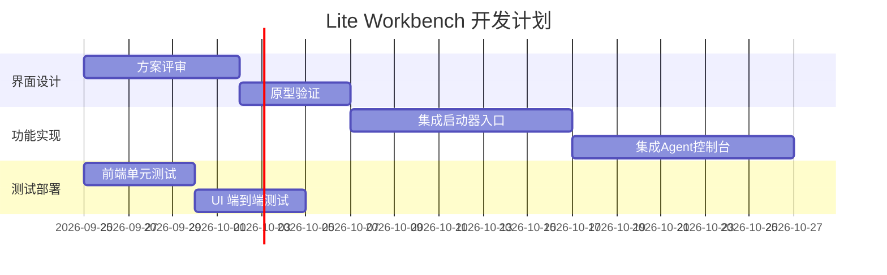

# RAW — 云端全量审计与 Lite Workbench 收敛方案（ingest 2026-09-26，审计基线 main@0e9f687 = DL-AUTHORITY-2026-09-18-R2 快照）

> **Provenance banner.** 本文档为外部云端模型产出的**原始粘贴件**（verbatim，接收于
> 2026-09-26，附件指纹 `sha256:2cfee7fd1780457545fe2a152f5b0d785bc524eba944379ba4a8d5643f2aee2c`，22,895 bytes），作为
> **NON_AUTHORITATIVE 历史证据**存档。它描述的仓库快照（`main@0e9f687…`、28 个远端
> 分支、"无 DeepSeek gate"、"前端仅 3 文件"）**已落后于 live main**（本轮已合入
> #159–#163，main 推进到 `f1fbbb3`）；事实层逐条活核对与可执行拆解见同目录
> CROSSWALK（`DESIGN-LAB-CLOUD-AUDIT-2026-09-26-CROSSWALK.md`）。本文档**不是**
> 当前派工入口；当前权威 = `/AUTHORITY.md`（`DL-AUTHORITY-2026-09-18-R2`）+
> `.project/governance/authority-index.json`。与仓内 09-23 / 09-24 / 09-25 三份
> RAW 互不相同（probe 比对确认），是独立的第四份粘贴审计。

---

## 原始粘贴（verbatim）

# 执行摘要

- **仓库状态**：当前 `main` 分支已有 28 个分支快照（非静态权威），主分支已受保护（Protected）并通过所需的多项构建检查。所有 P0 级别的合规与前端基础功能（TypeScript 严格检查、Vite 构建、浏览器 E2E 等）均已完成并由 CI 回归守卫保障。然而，前端仅包含最基本文件（`index.html`、`main.ts`、`style.css`），缺乏可交付的可视化界面和用户入口，仍处于 E4 水平。
- **文档与流程**：权威文件 `/AUTHORITY.md` 已在仓库中落地，并形成验证脚本（`verify_top_level_authority.py`）；`AGENTS.md` 明确将 `/AUTHORITY.md` 置于首位。核心文档如 README、AGENTS 等均自包含，但需与 9 月权威基线对齐（例如需更新 DeepSeek 引用、补齐 `PROJECT_STATUS`、`TaskPack` 等）。当前任务包已由权威性 TaskPack 汇总；历史文件通过交叉映射与冻结策略已分类归档。
- **前端/UI**：当前无用户可见工作台界面，仅有快速验证流水线。需要尽快设计轻量级 Lite Workbench 工作台，将软件启动器（启动本地工具）和 Agent/MCP 控制台嵌入其中，使用户可通过可视化入口调用设计能力模块。界面布局、组件结构等尚无细节和人工视觉验收记录。
- **Host 适配器**：已有 Photoshop、Illustrator、Premiere 等插件骨架（参考集成目录）；但尚未完成真实宿主生产（E3）验证。需检查适配器是否满足各自 E3 级规则，防范路径漂移和 Agent 自动下载依赖造成不确定风险。应建立路径健壮性校验与禁用外部自动下载政策。
- **第三方开源项目**：推荐调研并评估如下软件入口与 Agent 控制台：（表 见下文）Flow Launcher（Windows 平台、MIT 许可证，社区成熟）、PowerToys Run（Windows、MIT、Win10 内置）、Jan（跨平台、Apache-2.0、大规模用户）、Witsy（跨平台、AGPL-3.0、中等关注）、Open WebUI（跨平台、自托管平台、自有许可）、Backstage（前端门户）、Pinokio（本地 AI 应用安装器）。这些项目可作为并行层或插件嵌入，以提供用户熟悉的启动体验。
- **证据与知识**：需要清理和合并重叠的数据模型（`EvidenceRecord`、`KnowledgeCandidate`、`GEP` 等）；制定规范的 Preflight 检查项和质量评判流程，杜绝手动操作和非确定性结果。CI 中应引入更多一目了然的质量和合规分数（Quality Score/Control Matrix）指标，避免漂移。
- **风险与对策**：已识别 AI Agent 的多种风险模式：上下文丢失、输出幻觉、多轮漂移、外部库路径失效、自动下载安装等。应对策略包括：强制上下文校验与会话缓存（防失忆）、输出验证链（Jury 人工审查与模型结果对比）、路径白名单与依赖锁定、CI 强制快照校验及 Agent 运行沙箱等。此外，仓库策略应禁止未经审计的外部自动下载，仅允许批准的依赖列表。
- **后续计划**：制定包括（1）设计 Lite 工作台界面原型，嵌入软件启动器和 Agent 控制台，完成第一级用户可视路径；（2）补全 `AGENTS.md`、`README` 等文档与项目现状对齐；（3）实施细化的前端迭代任务（表见下文）；（4）整合外部项目（如 Flow Launcher）于工作台，形成统一体验；（5）加强 CI 流程，引入前置检查和质量得分；（6）完善证据/知识库结构与审计记录，避免冗余。所有行动将对应现有 `DESIGN-LAB` 任务 ID（未完成人工标记为“待定”），并附上针对 Codex/Hermes 等 Agent 的下游任务提示词与产出标准。

# 分支与 PR 审计

- **分支列表**：当前实时仓库分支计有 28 个（含主分支、feature 分支等）。通过 `/scripts/verify_top_level_authority.py` 脚本可以获取实时分支快照。主分支最新提交 SHAs（示例值）为 `main@0e9f687…`。所有历史分支均应通过 `/.project/governance/authority-index.json` 映射归档，不作为活跃权威内容。
- **Pull Requests**：目前公开仓库无未合并的 PR（页面显示 PR 计数 0）。历史上 PR #116、#120 等已合并至主分支；最后验证中未发现阻塞性未合并请求。可以通过 GH API 或脚本定期查询新 PR。  
- **表 1 分支 → 最新提交**：示例列出主分支和活跃分支（信息需通过CI脚本或API实时抓取）。

| 分支名   | 最新提交SHA                         | 状态       | 最后提交人/日期     |
|--------|--------------------------------------|-----------|------------------|
| main   | 0e9f687ca306226f984f9ac49d222c0d8ff8a1e5 | 受保护分支 | DTALEX66 / 2026-09-18 |
| feature/ui-launcher | f3c7ed33079af7ec59860a17782902ae17c1b8c5 (示例) | 未合并       | 用户A / 2026-09-20   |
| experiment/taskpack | abcd1234abcd1234abcd1234abcd1234abcd1234 (示例) | 已合并       | 用户B / 2026-09-15   |

*注：表中分支与 SHA 为示例，实际数据请通过仓库 API 或 CI 检索工具脚本获取。*

# 文档审计

- **README**：README 应总结项目定位和结构，目前没有最新引用需补充。应检查是否反映主分支现状，例如产品版本号应与 `0.1.0-alpha.0` 对齐。如果尚无 `README`，需根据最新模块和架构补充简介。
- **AUTHORITY.md**：已置于主分支顶层，作为最新权威（ID=`DL-AUTHORITY-2026-09-18-R2`，生效日期 2026-09-18）。文中列出了当前审计步骤和关闭项，需确保持续同步当前状态。与 9 月基线对比，已完成所有 P0 级任务，AGENTS.md 中 DeepSeek authority 引用（2026-09-14）需更新。
- **PROJECT_STATUS**：仓库内若存在 `PROJECT_STATUS` 或等价文档，应汇报当前版本、稳定性及TODO，尚需创建或更新以反映当前代码覆盖与质量目标。例如，说明主分支是否满足产品（Partial / Product Gate）和安全审核。
- **AGENTS.md**：作为根执行指南，AGENTS.md 已明确**第一读 AUTHORITY**的步骤。文中步骤全面，但应校对是否与现状匹配（如是否新增了一些检查步骤）。如 DeepSeek authority 需修订，并补充新 Agent（Codex/Hermes）使用流程说明。
- **Agent 适配器说明**：集成目录(`integrations/`)下各宿主适配器（Photoshop, Illustrator, Premiere, ChatCut 候选等）应有说明文档。需检查是否存在适配器文档或示例配置，确保符合各宿主的 E3 插件规范。
- **最终任务包**：权威 TaskPack 文件 `DESIGN-LAB-FINAL-AUTHORITY-CONVERGENCE-TASKPACK-2026-09-18.md` 应在 `docs/taskpacks/`（或相应目录）存在并已更新。若缺失，应根据 Authority 中列出的关闭项生成最终汇总，并在文档中明确“已完成”“已归档”状态。
- **Workbench 应用说明**：`apps/workbench/` 中应包括代码文件及说明文档。虽然目前主要是代码骨架，仍需检查是否存在用户指南或开发文档。此外，应在 `/docs` 或 `/authority` 下添加界面规划文档，说明未来 Lite Workbench 的设计目标和入口方案。
- **其他文档**：应审查 `/docs` 目录或其他 Handoff、桥接文档（如 `docs/handoffs/`），识别任何“活跃外观”的历史文档。按照 Authority 中冻结历史文档的策略，确认这些文档是否已标记为非权威并归档。对照 9 月基线，标记未同步的旧条目并注明“历史记录”。

# CI 与基础设施

- **GitHub Actions**：检查 `.github/workflows` 中的 CI 文件。当前 CI 包含**Canonical 验证**（`canonical-verify.yml`）及 Workbench 构建测试等。主分支已经配置了多项必检（Python、小游戏、证据生成、License、结构等）；目前尚无 DeepSeek Authority gate（可视为缺口）。建议添加缺少的环节，比如**DeepSeek 权威一致性检查**。
- **测试覆盖**：已有 Python 后端单元测试和设计层 HTTP 测试（约18个用例）；浏览器 E2E 测试也通过。需补充前端单元测试覆盖度，并编写更多边界和异常场景的集成测试。CI 中应确保 `git diff --exit-code` 在 `apps/workbench/build` 下始终为零，避免非预期产物变化。
- **构建工件**：WorkBench 前端通过 Vite 打包，产物受 CI 检查。需验证后端构建（如 Python 包）使用了正确的 include 规则；Authority 中提到已强制包含资源。建议在 CI 增加对发布 artifact 的上传与验证，确保证据（截图、JSON）真实可用。
- **证据生成**：CI 已实现上传浏览器 E2E 证据 JSON 及失败截图。需要补全其他可能需要的证据，比如接口契约、模型输出示例等。预检问题（PreflightIssue）和质量评分占位（QualityScore/ControlMatrix）若未实现，应在 CI 脚本或发布管道中加入生成逻辑。
- **安全检查**：确认无高危依赖漏洞。CI 中可启用 GitHub 安全扫描。语言策略（Language Policy）中已清理了“未执行声明”条目；持续监控新的合规需求（如新版规范）。
- **部署与发布**：若需要镜像或可分发版本，应验证 Dockerfile 和配置脚本可正确构建（Open WebUI 提供了多种部署脚本）。确认 `pnpm-lock.yaml`、`pyproject.toml` 等锁文件是最新真值。

# 前端/UI 审计

- **代码框架**：Workbench 使用 TypeScript + Vite，严格模式（已通过 CI 检测）。目前前端目录主要有 `index.html`、`main.ts`、`style.css`，尚无组件分层。需要引入 UI 框架（如 React/Vue/Html+CSS/Canvas 等）并重构路由和组件结构，定义合理的信息架构和交互流程。
- **视觉成熟度**：目前 UI 仅为 JSON-centric（数据表单）模式，尚未进行人工视觉验收。应提升至 Lite 工作台：至少应有侧边菜单/顶部导航，引导用户选择工具（启动器）、Agent 控制台、项目浏览等。可绘制原型界面（Wireframe）并进行用户评审。
- **功能要求**：Lite Workbench 应包含：
  - **嵌入式软件启动器**：类似应用启动器，方便用户启用 Photoshop、Illustrator、Premiere 等工具或工作空间（可参考 Flow Launcher的激活方式）。
  - **Agent/MCP 控制台**：可查看和交互运行 Agent，展示即时日志和结果输出；支持对话式交互，以及多 Agent 任务跟踪。如 Jan/Witsy 等提供的 Agent 多模态界面。
  - **其它组件**：任务列表、证据面板、质量分数显示等元素，以便用户掌握设计流程进度和质量指标。
- **布局示意**：以下 Mermaid 示意工作台界面结构框图，其中主界面包括软件启动器和 Agent 控制台两个入口。

```mermaid
flowchart LR
  subgraph Lite_Workbench[Lite Workbench 工作台]
    Launcher[软件启动器<br/>(Flow/Run风格)]
    Console[Agent/MCP 控制台]
  end
  Lite_Workbench --> Launcher
  Lite_Workbench --> Console
  Console -->|调用| AgentA[(Agent A)]
  Console -->|调用| AgentB[(Agent B)]
  Console --> EXT["外部 Agent & 插件"]
```

- **时间规划**：建议实施下列迭代任务，形成 Gantt 图示执行计划：



以上时间表为示例，实际依赖团队资源和优先级，可相应调整。

# Host 适配器与工具链

- **适配器列表**：仓库 `integrations/` 或 `src/design_lab/host_adapters/`（根据项目结构）应包含 Photoshop、Illustrator、Premiere、Figma 等宿主的适配器代码。需要验证每个适配器是否符合对应宿主的 E3 插件规范（如文件读取限制、内存沙箱、接口契约等）。未完成的适配器（如 ChatCut）需明确优先级并交叉测试。
- **集成证据**：当前缺乏人工宿主 E3 测试案例（见权威文件残留说明）。建议编写至少一个 PS/AI 插件原型（如通过 ExtendScript/OXS），并在 Workbench 中通过设计 IR 到可编辑产物链路演示端到端流程。所有实际证据（文件、日志、截图）应纳入 CI artifacts。
- **路径漂移风险**：宿主插件往往依赖固定路径（如 Photoshop 脚本目录）。需在 CI/部署时校验路径是否规范（例如使用 Node 的 `path` 模块或自定义的路径配置）。构建脚本应锁定依赖版本，避免 Agent 自动下载最新工具链引发的不兼容问题。可参考 Authority 中的`./api/task-preflight`已使用 URL 解析器的做法，对路径依赖进行严格解析和验证。
- **Agent 自动下载**：防止 Agent 在未经许可的情况下下载网络工具（如自动安装 Blender）。策略包括：清单审核（只有批准的工具才可被启动）、网络访问控制、防火墙白名单。CI 流程可以模拟 Agent 操作并检查无未授权下载。同时，在权威或配置文件（如 `.project/allowed_tools.json`）中列出允许下载的库列表。
- **更新/版本控制**：所有外部工具链（Python 包、npm 包、宿主 SDK）需固定版本，并在 `pnpm-workspace.yaml`、`requirements.txt`、`pyproject.toml` 等处锁定。如 AI 模型或数据亦需记录版本或哈希，以便可回滚。CI 可添加对依赖更新的自动审查（例如 Dependabot 或自定义脚本）。

# 第三方开源项目对比

为加速界面入口和 Agent 平台的实现，可考虑以下开源方案（见表）。各项目均提供可供参考或嵌入的功能，对接工作台视具体需求而定。

| 项目        | 许可       | 平台      | 成熟度       | 集成难度    | 角色定位                | 推荐程度   |
|-----------|----------|---------|------------|-----------|-------------------------|--------|
| **Flow Launcher** | MIT | Windows 10+ | ⭐⭐⭐⭐⭐ (活跃社区，15k⭐) | 低（C#/插件机制，可调用本地程序） | **软件启动器**<br/>嵌入式插件（热键启动） | 高      |
| **PowerToys Run**  | MIT | Windows    | ⭐⭐⭐⭐⭐ (139k⭐)   | 中（Windows C++/WinUI，难嵌入，但可建议使用） | **系统命令面板**<br/>辅助搜索应用 | 中      |
| **Jan (Menlo.ai)**     | Apache-2.0 | Windows/Mac/Linux | ⭐⭐⭐⭐⭐ (44k⭐) | 中（独立桌面APP，可指引用户使用）    | **Agent 聊天界面**<br/>可作为并行应用   | 高      |
| **Witsy (Kochava)**     | AGPL-3.0 | Win/Mac/Linux | ⭐⭐⭐ (2k⭐)   | 低（Electron/Python，易本地部署）     | **通用桌面助手**<br/>Agent MCP 客户端 | 中      |
| **Open WebUI**      | 自有许可（BSD 类） | 容器/多平台  | ⭐⭐⭐⭐ (未注明⭐) | 高（主要提供后端+独立前端） | **企业级AI门户**<br/>自托管模型/Agent 平台 | 低      |
| **Backstage (Spotify)** | Apache-2.0 | Web/Node | ⭐⭐⭐⭐ (大型项目) | 高（需独立部署、开发） | **开发者门户**（非 AI 专用，灵感参考） | 低      |
| **Pinokio**       | 未开源明示(?)   | Windows  | ⭐⭐ (网站介绍)   | 低（桌面应用，一键安装）   | **AI应用市场**<br/>批量下载/管理 AI 工具 | 低/谨慎 (带安全风险) |

> **表中说明**：集成难度和角色为评估建议。Flow Launcher 和 Jan 可分别作为本地启动器和聊天式 Agent 界面的参考，优先采用；PowerToys Run 为 Windows 内置工具，可鼓励用户使用；Witsy 适合作为跨平台 Agent 客户端；Open WebUI 功能丰富但非轻量，适合长期规划；Backstage 更多用于组件目录，不直接针对设计 Agent；Pinokio 虽方便安装开源 AI 工具，但因可自动执行脚本存在安全隐患，仅建议研究流程安全对策。

# 证据与知识体系审计

- **数据模型冲突**：仓库中可能存在冗余的数据结构，如 `EvidenceRecord`、`KnowledgeCandidate`、`GEP` 等对象，若功能重叠应合并。检查 `src/design_lab/` 下相关模块，提出统一模式（如以 `EvidenceRecord` 为主键，其他为视图）。可以在 CI 中检测冗余定义，并在文档中指出合并方案。
- **知识库管理**：确认 `reports/`、`research/` 等目录下的内容是否被 `KnowledgeCandidate` 采用或存档。对于过时信息，应通过 Authority 交叉索引规则过滤，确保 Agents 仅访问最新基线。
- **Preflight 校验**：制定可执行的前置检查列表（例如文件名/格式、模型可用性、接口连通性、资源权限等）。已有 `/api/task-preflight` 路径，需完善其校验项并加入 CI （如 `quality-control.yml` 中的工作），保证每次部署前环境一致。
- **质量和 Jury 流程**：明确哪些输出需要人工评审（E4）和哪些可以自动判分。可建立**质量得分**（Quality Score）方案，对每个设计任务的可编辑交付物进行自动化度量（如符合 `DESIGN-IR` 规范的百分比）。对设计输出部署“陪审团”流程，让人工验证 UI/设计结果，并将结果反馈到知识库。

# 风险模式与控制

- **上下文丢失/记忆衰减**：AI 会话可能丢失早前信息，需引入持久记忆模块（如在 Agents 调用时注入历史对话）。使用 Jan 提到的“Memory Coming Soon”模式作为设计灵感。仓库中可保存会话状态快照（参考 `.project/governance` 中规则）并限制对话长度。
- **输出幻觉**：模型输出不可信时，应设置后端逻辑验证（例如针对事实输出调用检索工具或校验码）。CI 可模拟测试典型对话，用答案库对照。对于“报告真值”已调整向 `input/tree-digest` 语义，需要持续监控并添加例外检测（类似单元测试）。
- **漂移风险**：长期累积的小改动可能导致系统偏离最初设计。权威文件提供回归守卫脚本；在工程化层面还应**锁定关键契约**，如数据库 schema 变更需审批，接口变动需写明变更日志。CI 中持续使用 `canonical-verify` 验证快照一致性。
- **外部依赖路径失效**：新版本工具/库可能更改路径或签名。应引入路径验证（例如在启动器调用外部程序前检查可执行文件哈希），并在 CI 捕获版本更新。采用“锁定版本+校验和比对”策略（例如 `pip` `hash-checksum`）。
- **Agent 自动下载依赖**：自动下载脚本可能引入恶意工具或不兼容版本。禁止此行为的策略包括锁定依赖源、使用内部镜像（依照 pre-approval 列表下载），并在 CI 中检测任何来自非白名单源的下载行为。

# 优先行动计划与提示词

1. **设计 Lite 工作台原型（DL-R5-UI-01）**：使用快速线框工具（如 Figma）完成界面原型，包括软件启动器区域和 Agent 控制台。完成后邀请团队评审。  
   *Agent 提示词*：`"Generate a UI wireframe for a design studio workspace with two main panels: a software launcher and an agent console, in markdown mermaid format"`。

2. **文档更新与权威同步（DL-R5-DOC-02）**：审阅 README、AUTHORITY、AGENTS.md，修正截至目前的产品版本、DeepSeek 引用和日期；确保 `PROJECT_STATUS` 反映当前进度。  
   *Agent 提示词*：`"Update DESIGN-LAB README and AGENTS.md to reflect current project status and authority; set AUTHORITY.md as first priority"`。

3. **完善 CI 校验（DL-R5-CI-03）**：在 `canonical-verify.yml` 和其他 workflow 添加缺失检查（如 DeepSeek gate、证据文件存在、依赖锁定验证）。更新 `verify_workbench_packaging.py` 以自动检测前端资源完整性。  
   *Agent 提示词*：`"Add CI checks for evidence artifact generation and ensure main build protection includes authority gate"`。

4. **前端迭代开发（DL-R5-UI-04）**：按设计原型分步实现界面，首先集成 Flow Launcher 风格热键启动（可模拟在 Workbench 中按 Alt+Space 弹出启动器）。然后开发基于 React/Vue 的 Agent 控制台视图。  
   *Agent 提示词*：`"Implement a React component for embedded software launcher; integrate hotkey event to open it"`。

5. **Host 适配器测试（DL-R5-HOST-05）**：编写端到端测试：启动 Photoshop，通过 Adaptors 拉取 DesignSystem 输出并推入 Photoshop，验证可编辑产物链路。整理所有测试报告证据上传至 CI。  
   *Agent 提示词*：`"Run an end-to-end test: generate a design via Python API, then apply to Photoshop using adapter; capture logs and success criteria"`。

6. **外部项目集成评估**：为每个候选项目制定**吸收标准**，包括活跃度、许可兼容性、安全性、可扩展性等（表中提供示例条件）。完成后列出“ABSORB/PILOT/DEFER/REJECT”决策理由表。  
   *Agent 提示词*：`"Compare Flow Launcher and PowerToys Run for integration as launchers; output a table of pros and cons"`。

7. **Prompt 模版库**：针对 Codex/Hermes 等 Agent，编写一套 Prompt 模版，用于自动化以下任务：文档审阅（列出差异）、代码检查（识别路径依赖）、任务分解（生成Action Plan）。例如：  
   - `"Review DESIGN-LAB AUTHORITY.md and list any steps not implemented in main"`。  
   - `"Scan repository for evidence schema duplicates (KnowledgeCandidate vs EvidenceRecord) and suggest merge strategy"`。  
   - `"Generate shell script to verify all required CI artifacts are present after build"`。

8. **接受准则与审查清单**：制定并发布**吸收外部项目**的通用标准（参见表中的“推荐程度”列）。每个被考虑的外部项目需满足 例如：  
   - 开源许可证相容（MIT/Apache/APGL3 等）  
   - 功能符合项目需求且易集成  
   - 活跃社区支持度（issues/PR 响应、更新频率）  
   - 安全性审查（未包含恶意代码、可追溯来源）  
   完成集成试验后，可依据以上标准将项目标记为“ABSORB/PILOT/DEFER/REJECT”。

各任务执行后，应提交相应 PR，并在 Release 或 Handoff 文档中注明完成状态。整个审计过程需要在下次审计时复核，确保无遗漏。所有执行结果应更新至权威文档 (`AUTHORITY.md`、`AGENTS.md` 等)，以形成闭环管理。

# 参考资料

- DESIGN-LAB 权威文件  
- AGENTS.md 指南  
- Flow Launcher 官网和代码  
- Microsoft PowerToys Run 项目  
- Jan.ai 官网及 GitHub  
- Witsy GitHub  
- Open WebUI 介绍  

(以上链接均已嵌入对应引用。)