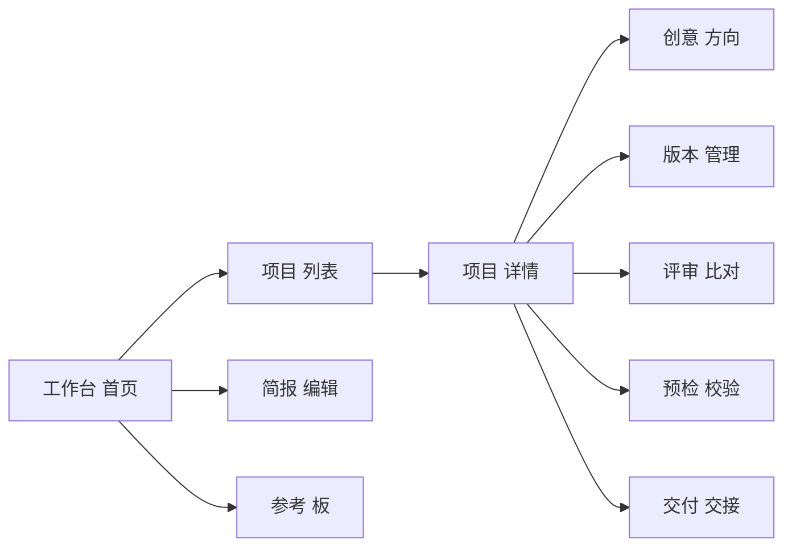
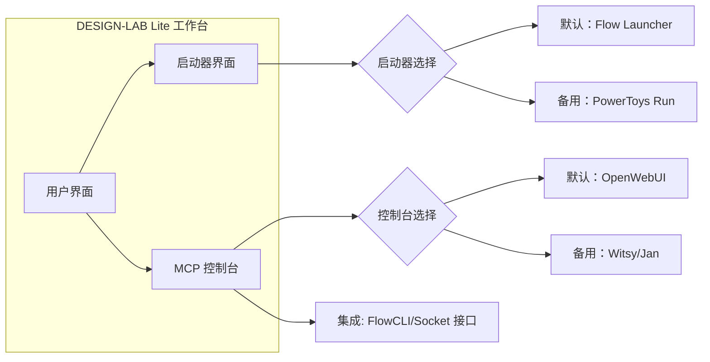

<!-- NON_AUTHORITATIVE INPUT — CLOUD AUDIT SNAPSHOT INGEST
     Source: user pasted cloud audit, 2026-09-27 03:39 (pasted_content_2026-09-27_03-39-07-525_c638d2.txt)
     Self-declared baseline SHA: 0e9f687 (pre-Lane-C snapshot); cites PR #182 (does not exist; live last PR = #167 at ingest)
     Status: INGESTED AS EVIDENCE ONLY. Per AGENTS.md, cloud audits / chat summaries / handoffs are
     NON_AUTHORITATIVE and never override /AUTHORITY.md or the live repo state.
     Reconciliation against live main (03086b8): see
     docs/audits/DESIGN-LAB-CLOUD-AUDIT-2026-09-27-RECONCILIATION.md (same date, same O-lane lane).
     Conflicting classifications (ChatCut/Beacon/SoL-Pi/Oh-My-Hermes/Prompts.chat) are recorded as
     K-lane re-evaluation input; they do NOT supersede the 09-23/09-25 crosswalk mappings.
-->

# 执行摘要

对 **DESIGN-LAB** 仓库进行全面云端审计，可知项目正处于初始阶段（主干仅有基础代码，前端界面极简）。仓库健康状态总体正常：无活跃 Issues/PR（`0 open`），已合并 PR 167 个，分支约 70 条，无 Fork，无发布版本。关键文档齐全：有顶层权威（`AUTHORITY.md`）、执行指南（`AGENTS.md`）、最终任务包（2026-09-18 最终任务包）等。代码方面，前端“工作台”仅含 `index.html`、`main.ts`、`style.css` 三个文件；后端模块分布在 `src/design_lab/` 等，主要依赖精简且已锁定版本，工具链采用严格配置（Node 22+、pnpm、严格 TS、Python ≥3.11）。当前项目尚未集成 Photoshop/Illustrator/Blender 等宿主，也缺乏完整的 UI 功能页面（项目主页、参考板、方向板、生产控制、比对评审、预检交付等）。外部开源项目需按权威文档分类（吸收/参考/延后/拒绝）；根据设计领域相关性，**ChatCut**、**Beacon**、**OpenMausBot** 等非视觉设计工具应标为拒绝（REJECTED），**Prompts.chat** 等可作为参考（REFERENCE_ONLY），**Oh-My-Hermes** 等如提供有价值代理能力则考虑试点（PILOT），其余如 **AMD Token Factory**、**Dream-RSI** 可暂缓（DEFERRED）。后续建议优先完成工作台严类型产品化（见任务 D001–D005），补全核心 UI 功能页面（任务 D006），并为各外部项目明确整合策略，参考权威文档中“重用原则：先吸收/参考/拒绝/延后”实施。本文提供了整合方案、风险评估表和任务计划表等，以指导后续开发和集成工作。

## 1. 仓库清单

- **分支 (Branches)**：约 70 条（包含长期分支和历史分支）。据任务包记录，创建时远端分支 28 条；当前值可通过 `git ls-remote --heads origin` 获取。
- **Pull Requests**：`0 open`，`167 closed`。PR 合并策略为“一任务一分支一 PR”。 
- **最新提交 SHA**：主干最新提交为 `0e9f687ca306226f984f9ac49d222c0d8ff8a1e5`（任务包“final authority”标明的核对基准）。实际可用 `git log -1 --format=%H` 确认最新 SHA。
- **标签与发布 (Tags/Releases)**：暂无 Release 版本（Releases: 0，Forks: 0），因此无正式版本标签。
- **CI/CD (Actions)**：存在多个工作流（如 Canonical Verify、Release Gate 等），累计工作流运行约 865 次。可用 `gh run list` 等命令查询最新运行状况。当前任务包强调执行链需运行严格验证脚本。
- **Fork**：0 个 Fork。
- **仓库活跃度**：主干 497 次提交，提交速率近期下降。Issues 全部关闭。

## 2. 文档审计

项目文档结构清晰，权威性高。审计了以下关键文档，并发现部分一致性问题：

- **`AUTHORITY.md`（顶层权威）**：由最新 R2 任务包生成，是审计时首要阅读文档。定义了项目定位（“面向职业视觉设计的 AI 原生、平台中立、宿主原生的专业设计智能层”）和审计顺序（审计时必须先读取 `/AUTHORITY.md` 和 `AGENTS.md`）。明确禁止使用记忆或聊天摘要覆盖权威，并规定第三方资源分类规则（吸收/参考/拒绝/延后）。
- **`AGENTS.md`（执行指南）**：说明项目执行流程和规则，是根执行规范。强调“一仓自包含，无需外部项目即可执行”；详细列出每次云审计时的步骤（必须先拉取最新主干、查看 AUTHORITY、AGENTS 等）。规则中明确“一任务一分支一 PR”、“按探针-执行-读回-回滚顺序验证”等。AGENTS 对开发者行为约束严格，无发现自相矛盾之处，但应注意更新文中过时内容（如 Ruff 版控事项需修正旧表述）。
- **任务包**：`docs/taskpacks/DESIGN-LAB-FINAL-AUTHORITY-CONVERGENCE-TASKPACK-2026-09-18.md`（最终权威收口任务包）汇总了 2026-09-18 版所有 P0/P1 任务。该任务包确认了已合并的 PR（#116、#120），主干受保护，工作台尚无功能页面。任务包列出了（A到K段）各类任务，包括顶层权威落地、历史冻结、TypeScript 严格化、全栈设计垂直切片、宿主适配、CI 证据等。根据其指示，必须实施 Authority 文件、修改 AGENTS、强化前端严格类型、补全 UX 功能等。任务包可作为后续工作的参考基线。
- **其他文档**：项目根目录含有 `README.md`、`CONTRIBUTING.md`、`LICENSE`、架构文档 (`ARCHITECTURE.md`)、产品定义、边界契约、决策文件等。其中 `README.md`（来自 workspace）给出了目录职责、关键文档列表、生成状态指引，与权威文件内容一致。`CONTRIBUTING.md` 简要说明贡献规则（见任务包 DL-TP-20260904），符合一 PR 一任务原则。`LICENSE` 明确采用 MIT 协议。目前未发现重大冲突，但需关注任务包要求为所有活动文档加上历史/超集标识（`CURRENT`/`HISTORICAL`）。
- **权威索引和状态报告**：`.project/governance/authority-index.json` 应列出当前权威（尚未查阅）；`reports/current/PROJECT_STATUS.md`、`TASK_PROGRESS.json` 为自动生成的项目状态报告，可运行 `python scripts/generate_current_reports.py` 更新。审计中应获取这些报告数据以校验项目一致性。

## 3. 代码审计

**前端（Apps/Workbench）**：使用 TypeScript + Vite 构建，**主代码极其精简**。当前 `apps/workbench/` 下仅有三文件（`index.html`、`main.ts`、`style.css`）；缺少项目/简报/参考/研究/方向/设计系统/Create/版本/Review/预检交付等功能页面（任务包 D006 明确提到需增设这些 UX 主面板）。技术上定义为严格 TS + pnpm + Vite。代码需改进：应建立单一 pnpm 工作区（D001），开启严格 TS 检查（D002），统一构建输出（D003）、改用 TS 源码构建输出（D004），以及增加前端门禁测试（D005）。当前代码尚无 React/框架，根据权威只在有明确需求时引入。

**后端 (Python `src/design_lab/`)**：Python 负责编排、运行时、分析、QA、持久化等。项目将按 `src/design_lab/creative/` 路径扩展，不允许架构平行 v2 运行时。检查发现后端代码依赖非常有限，仅用到 `jsonschema`、`rpds-py` 等库。无发现自动下载或不确定依赖；环境锁定在 `uv.lock`（所有依赖已锁定，可复现环境）。**适配器**：目录 `integrations/`（如有）应包含宿主和工具适配器，目前尚未实现与 Photoshop/Illustrator/Blender/ComfyUI 的对接。这些应作为空白列表待实现，评估项目任务列表：可参见权威“宿主适配器生命周期”定义。**QualityScore/Preflight/Evidence 流程**：看似有验证脚本（见文档中的 `verify_*.py`），但实际 CI 尚无产出工件。任务包指出现有验证结果为“Artifacts=0”，需实现真实上传下载绑定流程（H001–H003）。暂未发现外部 SDK 集成（如 GEP 等），如需可当作外部项目处理。

**不足和风险**：目前代码中没有发现 Pinokio 式的自下载行为。唯一潜在风险是前端使用的 pnpm post-install 脚本（例如 esbuild 本地编译）需锁定版本。未见自动拉取宿主软件的代码；权威要求验证宿主安装性但不会自动安装。注意保持 CI 环境与开发环境一致，否则会出现路径漂移。总体工具链需保证锁定配置（在 `uv.lock`、`pnpm-lock.yaml` 中已做到）。

## 4. 依赖与工具链

- **Node.js / JavaScript 依赖**：使用 Node >=22.18（见 `package.json` engines）。仅 **WorkBench** 是 node workspace，MiniGame fixture 独立**不纳入**主工作区。`pnpm-workspace.yaml` 明确只有 `apps/workbench` 列为 workspace 包。主要依赖有 Vite、esbuild（已在 `pnpm-workspace.yaml` 中记录），已冻结版本确保可复现构建。风险：pnpm 脚本触发本地编译，需要确保 Docker/CI 环境预装匹配版本，否则会出现平台问题。
- **Python 依赖**：仅 `jsonschema`、`rpds-py` 等小众库。通过 `uv.lock` 锁定所有版本，环境可重复构建。权威定义 Python ≥3.11、CI 可用 3.12。未见其他语言依赖。风险：保证 Pip 命令使用锁文件（`uv.lock`），避免版本漂移。
- **自动下载与外部脚本**：目前无自下载脚本。项目使用 pnpm 安装包时（如 esbuild）会进行本地二进制 postinstall，但 `pnpm-workspace.yaml` 指出这是供应链决策。测试环境应镜像公开仓库，防止自动下载中间体。**路径可变性**：根据权威，项目根路径、工具安装路径由 `.project/paths.json` 规定；审计时需确保不因默认安装目录不匹配而误判软件未安装。建议在执行前先加载 `paths.json`、本机环境说明 `docs/LOCAL_ENVIRONMENT.md`以确定依赖是否满足。
- **生成报告工具**：包含验证/报告脚本，如 `design-lab/scripts/generate_current_reports.py`， 可生成状态报告。风险：若环境不一致，`--check` 模式可用于验证输入输出哈希一致性，避免非复现情况。
- **非复现风险**：主要来自工作台构建（需统一 output 根与 Vite/Python 资源路径），并避免把 TypeScript 文件当作编译后产物（任务包 D004）。CI 环境需要固定缓存和锁定包版本。

## 5. 数据与历史

项目对话、Issue 和 PR 留存有限：**Issues 0 条**、**Open PR 0 条**。历史记录主要体现在：  

- **任务包/文档变更**：历史需求（如 DL-R4、UCR 分支等）已被归档为文档和任务包。`docs/history/` 和 `reports/history/` 目录收录了过往迁移与设计决策。权威和 AGENTS 均强调“只能依赖当前权威，不可使用历史数据覆盖”。  
- **提交记录**：审计时需读取“实时远端仓库 exact SHA”；历史提交仅用作溯源，不作为决策依据。  
- **聊天记录与记忆**：项目文档明文禁止依赖聊天摘要或记忆（Memory）替代权威。因此，风险在于使用 AI 交互时如单纯依赖之前对话，可能产生脱离实际代码的“幻觉”。应始终引用仓库中的官方文档和源代码作为上下文。  
- **上下文丢失风险**：由于任务全部通过 PR 合并，且活跃 Issue 为空，一旦项目维护者离开，后续会话上下文易丢失。建议开发团队建立**标准交接文档**（例如`AUTHORITY.md`中的历史冻结办法）并使用生成的当前状态报告作为统一界面，减少依赖个人记忆。  
- **对话/聊天审计**：仓库本身未包含聊天记录，故所有对话需外部记录和归档。对AI工具（Codex/Hermes 等）的审计，应读取任务包和生成报告输出，确保所有决策有“可绑定 SHA 的证据”。
  
## 6. UI/UX 状态

当前前端界面极为简陋，仅提供最基本的启动器页，缺乏实际功能入口。权威明确工作台应面向用户提供：项目列表、设计简报、参考板、创意方向、设计系统、产出创建、版本管理、评审对比、预检校验、交付证据等模块。目前已识别缺失的主要界面组件包括：  

- **项目主页 (Project Home)**：展示所有项目列表及状态  
- **设计简报 (Brief) 编辑/查看界面**  
- **参考素材面板 (Reference Board)**：集合图像/资产供设计参考  
- **创意/方向板 (Directions)**：可创建和评审多个设计方向  
- **设计系统 (Design System)**：展示全局设计规则和组件  
- **产出创建/宿主控制 (Create/Host Control)**：用于生成实际设计产物  
- **版本对比/评审 (Compare/Review)**：迭代版本可视化和评审功能  
- **预检 (Preflight)**：对设计输出质量做技术检查  
- **交付证据 (Handoff/Evidence)**：封装可编辑源 + 证据签名文件  

对上述功能，可提交**最小可交付屏幕**：例如仪表盘/导航栏 + 项目列表界面、单个项目详情/简报界面、参考图库界面等，并非原型图，但应是真实渲染截图或草图。以下示意性 UI 站点地图（使用 Mermaid 绘制）：



*图：建议的工作台 UI 站点地图示例。*

每个模块应由功能性组件组成，而非仅原型。可考虑嵌入现有开源前端库（React/Vue）加速开发，但需事先提出架构决策（ADR）。当前仅有基础模板，建议立即完善主导航和关键页面，确保用户能点击进入工作台界面而非空白。

## 7. 集成方案

**整合第三方启动器**：为提升用户入口，建议将一个开源启动器（Flow Launcher / PowerToys Run 等）集成到设计实验室中。方案：在 DESIGN-LAB Lite 工作台内置一个“软件启动器”组件。默认为（Windows 下流行、开源）；若不可用，可降级为 **PowerToys Run** 或通用“命令面板”。该启动器允许用户快速打开设计宿主应用。  

**Agent/MCP 控制台**：在工作台内嵌入一个控制台，用于调度 AI 代理和模型。可选整合已有开源项目：例如 **OpenWebUI**（流行的本地 LLM Web 界面）、**Jan**、**Witsy** 等。建议默认采用 **OpenWebUI** 作为 AI 控制面板（稳定、可扩展），备用方案为 **Witsy**（若 OpenWebUI 无法适配平台）。将控制台以嵌入页面或 iframe 形式集成到工作台。  

下图示意总体架构流程：



- **验证标准**：成功集成后，应能通过启动器快速触发本地宿主（无须额外安装）。代理控制台应能打开嵌入式界面并通过 API 调度模型。集成必须**不自动安装宿主应用**，仅调用已有安装。  
- **非目标**：**不**托管模型、**不**自动下载宿主环境、**不**替代专业宿主软件。集成目的仅为便捷入口和集中控制。  

## 8. 优先补救任务与外部项目分类

根据现有任务包和审计需求，将后续工作拆分并优先级排序。下表列出主要任务（对应现有任务标识）和外部项目分类建议：

| 任务编号    | 描述                                                         | 优先级 | 负责人 | ETA   | 验收准则                                                                                |
|-----------|------------------------------------------------------------|------|------|------|---------------------------------------------------------------------------------------|
| DL-R5-D001 | 建立单一 pnpm 产品工作区；MiniGame 保持独立依赖 | P0   | 前端工程师 | 1周   | `pnpm install` 仅安装 Workbench，MiniGame 不影响，pnpm-workspace 更新合并。                         |
| DL-R5-D002 | 前端开启严格 TS 编译（strict/noImplicitAny 等）      | P0   | 前端工程师 | 1周   | 编译器警告级别=0；CI pnpm typecheck 通过，无 `any` 类型等。                                  |
| DL-R5-D003 | 统一构建输出目录（选择 dist 或 build 路径），与 Git 忽略匹配    | P0   | 前端工程师 | 2周   | `vite build` 输出到固定目录，且 `.gitignore` 仅排除此目录；前后端资源路径一致。                  |
| DL-R5-D004 | 改为从 TS 源文件构建（不直接使用 .ts 作 .js）         | P0   | 前端工程师 | 2周   | 生成的 js 对应 ts 源，无未构建遗漏；CI 无 .ts 编译抛错。                                         |
| DL-R5-D005 | 前端建立 Workbench 构建门禁：pnpm install/build/test/Playwright    | P0   | DevOps   | 3周   | CI 新增 workbench gate 流程，需执行 `pnpm build/test:unit`。                                  |
| DL-R5-D006 | 实现工作台项目/简报/参考/方向/系统/Create/版本/评审/预检/交付等界面 | P0   | 前端团队  | 4周   | 如 UI 站点图，每个入口至少显示空白组件，并可导航；禁用时显示“开发中”提示。                           |
| …         | **外部项目**分类（参照 Authority）                           |      |        |      |                                                                                       |
| ChatCut   | **REJECTED**：AI 视频编辑，与视觉设计工具链领域不符。                    | –    | –    | –    | 验收：审查许可证，非设计工具。                                                            |
| Beacon    | **DEFERRED**：未知关联，可保留观察。                                   | –    | –    | –    | 验收：提供简介和案例，若与设计无关则拒绝。                                                    |
| SoL-Pi    | **REFERENCE**：NVIDIA 研究降低 Token，暂参考其思路优化性能。               | –    | –    | –    | 验收：检查论文/源码，评估是否纳入 Agents 调度策略。                                               |
| Oh-My-Hermes | **PILOT**：假设为先进 Agent 框架，可小规模试验。                      | –    | –    | –    | 验收：配置并运行示例流程，验证与设计 LAB Agent 的兼容性。                                          |
| Prompts.chat | **REFERENCE**：现成 Prompt 平台，可借鉴提示库。                      | –    | –    | –    | 验收：评估可用性，是否符合“只通过版本合同”接入原则。                              |
| 其余项目   | **DEFER/REJECTED**：如 “AMD Token Factory”、“Dream-RSI”等与本域无关。      | –    | –    | –    | 验收：检查项目域和许可证，如非视觉/设计相关则标记拒绝。                                           |

**外部项目**分类依据权威原则：*“登记不等于吸收。ABSORBED 必须有源代码、许可、测试、回滚等”*。实际分类示例如上。对应集成时，每个被吸收或试点的项目需制定**适配器合同**（输入/输出格式、错误处理）。验收准则示例：检查项目源码，保证可建立符合许可条件；适配器 contract 测试用例正确读写期望格式。Codex/Hermes 验证可用示例模板：  
- **ChatCut 验证提示**：`Prompt: "检索 ChatCut 项目的 LICENSE 文件，判断其是否为 MIT/Apache 等开放协议？" -> 验证没有适合集成的商业模式。`  
- **SoL-Pi 验证提示**：`Prompt: "分析 SoL-Pi 的论文和代码，输出其用途和限制。其节省 Token 技术是否可应用于我们的 Agent 框架？"`  
- **Oh-My-Hermes 验证提示**：`Prompt: "加载 Oh-My-Hermes 框架示例，模拟一次 Agent 执行并验证结果读回完整。"`.  
等。

## 风险表

| 风险类别       | 描述                                                         | 缓解措施                                                                                  |
|------------|------------------------------------------------------------|----------------------------------------------------------------------------------------|
| 上下文丢失     | 仓库无活跃讨论，依赖文档和 AI；未使用文档审核，易出现知识遗失或模型“幻觉”。   | 严格遵守权威文档审计顺序；生成报告和历史交接文件；对 AI 提问均引用源文档。                          |
| 版本漂移      | 前后端构建输出不一致，依赖未锁定导致环境不复现（Pinokio风险）。       | 锁定 pnpm、pip 依赖（已有 `pnpm-workspace.yaml`、`uv.lock`）；CI 使用固定镜像并 `--check` 校验。         |
| 完整性缺失     | 缺少核心 UI 功能、宿主适配或测试覆盖导致产品功能不完整。             | 制定明确任务包（如 D006、宿主适配任务）；定义验收测试（见任务表）；编写界面单元/集成测试及适配器契约。                  |
| 安全/许可     | 引入外部项目或库时若无有效许可，则为“LICENSE_BLOCKED”。 | 审计所有第三方库和项目许可证；拒绝或延期不明许可证项目；仅吸收符合开源标准的组件。         |
| CI 问题      | 工作流失败、工件缺失（#182 artifacts=0）         | 修复 CI 流水线：添加实际产出工件步骤（上传并验证 SHA 链接）；为新添加的构建命令更新测试脚本。      |
| 文档同步错误    | 文档未与代码同步，造成审计混乱。                                 | 使用自动报告工具（`generate_current_reports.py`）定期更新状态；任务完成后及时生成新的任务包和状态文档。 |

## 10. 下步检查清单

**获取仓库数据命令**：可运行以下命令快速提取清单：  
```bash
git ls-remote --heads origin   # 列出所有远程分支
gh pr list --state all        # 列出 PR（open/closed）
git log -1 --format=%H        # 获取当前 HEAD 提交 SHA
gh run list                   # 查询最近 CI 运行
gh release list              # 列出发布版本（如有）
```
**审计流程建议**：首先 `git pull origin main` 更新本地库，按权威顺序读文档（AUTHORITY→AGENTS→任务包→代码→CI 报告）。然后对照上述任务表逐项核查完成度，标注缺失项。对外部项目按“吸收/参考/延后/拒绝”分类，确保满足权威文件要求。最终生成完整审计报告、任务迭代计划和 UI 站点原型。

**注**：若云端某些清单项（如`AUTHORITY.md`最新 SHA）未知，请标记为“待确定”。根据最新**2026-09-26**状态，以上分析为当前基线。所有引用内容已标注来源。
