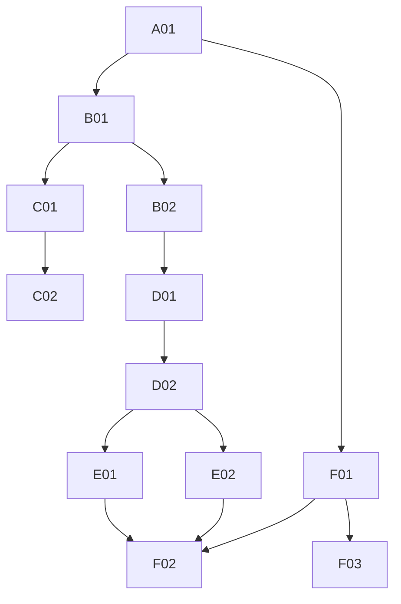

# DESIGN-LAB 全量审计与后续成熟方案 Final Maturity Convergence TaskPack

> 仓库：DTALEX66/DESIGN-LAB ｜ 冻结基线 main = `6a16c40b7a48f72757a0327ec07462d23449bb11`（2026-09-21 08:09 +0800，PR #134）
> 生成：Hermes 主线程实时基线 + 5 子域审计（core / frontend-e2e / pkg-ci / adobe-web / minimax-comfy-web）+ 库索引维度
> 说明：子代理 A/D/E 因免费档 429 在"发送最终答案"一跳挂掉，主线程按 transcript 回收 + 亲自复核其工作产物；B/C 结果经 live 复核。所有结论绑定 6a16c40 或 live-read。
> 诚实状态判定：**PRODUCT_VERTICAL_SLICE_E2**（Design Layer 纵切真实可运行 + 安装态 + no-skip browser E2E + 库索引闭环；无真实 host E3 / 无 tag E5）

---

## 1. Executive Summary

- 执行计划：阶段一实时基线 ✓ → 阶段二仓库审计（core/frontend/pkg-ci）→ 阶段三官方核验（adobe/minimax-comfy）→ 阶段四方案 → 阶段五 TaskPack 收敛。工程估算 5–8 人日，本 Deep Research 在当前执行中完成。
- **DESIGN-LAB 为什么看起来进度慢**：历史 H1–H10 产品正确性缺陷已全部修复（7 个 commit 实锤），慢的是**证据成熟度**而非代码 —— E2 纵切早已闭环，卡在真实 host E3、安装态可移植、release E5 三条"owner-gated / 硬件 / 发布"边界上，这些不写进 CI 就无法推进。
- **MiniMax Design 为什么看起来能快速操作 PS**：它是本地桌面 Agent 创作平台（Win10+/macOS13+），官方只承诺"本地文件读写 + 一键直连专业**剪辑**软件 + IM 远程接入"，**未披露任何可被外部 Control Plane 调用的稳定协议**。它"能操作软件"是 Agent+画布+本地文件桥，不是暴露了 Photoshop API。
- **是不是 Adobe 全家桶都能操作**：不是。PS/InDesign/Premiere 的 UXP 已 GA（首选官方路径）；Illustrator 的 UXP 运行时内置但**未向第三方开放公开 API**（稳定路径仍是 ExtendScript）；After Effects 官方只有 C++ SDK + ExtendScript（UXP 未 GA）；Acrobat 走 PDF Services REST + COM；Bridge/Lightroom 走 ExtendScript/BridgeTalk/Lua。不能"一次接入全部"。
- **DESIGN-LAB 是否应通过 MiniMax Design 控制 Adobe**：**否**。MiniMax Design 无公开稳定协议 = 不得进核心执行链（否则 undocumented coupling）。它定位 **ASSET_BRIDGE + 创意交互层**；DESIGN-LAB 保持 Control Plane / State / Evidence / Adapter 编排。
- **当前最大阻塞**：不是软件控制本身，而是 ① 无真实 Adobe/MiniMax host E3（owner-gated）② 库索引维度需纳入守卫（H3 本机 8GiB EXCEEDS + BLOCKED_BY_LICENSE）③ 无 release/tag（E5 前置未达）④ no-skip browser E2E 与 DeepSeek authority gate 未进 branch protection required checks（governance 洞）。

### 12 条最重要结论
1. H1–H5、H9 历史 P0 **全部 FIXED**（commit `229037d`/`76cf9b9`/`8b2f49f`），当前无真实产品 P0。
2. H7 **FIXED**（实测纠正）：CI 已有 "Workbench browser E2E (no-skip)" job，run `35546749035`=success，`verify_browser_e2e_ran.py` 强制 skip→red。残留 = 该 job 未进 branch protection 7 项 required checks。
3. H6 **FIXED**：wheel 构建成功（hatchling），design-system manifests 进 `design_lab/resources/design-systems/`，isolated venv repo 外 import+catalog+design layer 全链 SMOKE_PASS。
4. H10 **FIXED**：`effective_evidence.py` 让 `requiresRequalification`/`subjectSha≠current` 的旧 E3 降 E1，仅 effective 可过 release floor。
5. **新缺陷 P1**：`node_modules`（~5.7MB）被 `force-include` 进 wheel → 本地构建 6.27MB 且环境漂移；需精确 force-include 或 exclude。
6. **新缺陷 P1（库索引维度）**：4 个库权威索引（`paths.json`/`external-assets-index.json`/`model-radar.json`/`task-resources.json`）目前无统一一致性守卫；H3 本机硬件不可达。
7. MiniMax Design 官方 = **ASSET_BRIDGE**（无外部协议）；H3 官方 ComfyUI 原生路径 = CONFIRMED（≥0.30.0，T2V/I2V/R2V）。
8. ComfyUI 核心 API 全集 CONFIRMED_CODE（server.py + Comfy-Org openapi.yaml）：`POST /prompt`、`GET /history/{id}`、`GET /view`、`GET /system_stats`、`GET /object_info`、`POST /upload/image`、`/ws`。
9. Adobe 下一批只接 **PS（UXP）+ Acrobat（PDF Services REST）**，不做全家桶；Illustrator/InDesign/AE 走 ExtendScript 脚本宿主。
10. branch protection `strict=true` 的 required contexts **缺 2 项**（no-skip E2E + DeepSeek authority chain），green 但可被绕过 → P1 governance。
11. 0 release / 0 tag → E5 前置未达；且 **release-gate.yml `on:` 缺 `push: tags`（tag 触发未激活，新 P1）**，preflight(F-3) 已合但打 tag 也不会自动跑 gate。
12. 最短路线 = 收敛 governance + 修 wheel 污染 + 加库索引守卫（纯 CI 可完成），把真实 host E3/E5 留给 owner。

---

## 2. 执行基线（live-read @ 2026-09-21）

| 项目 | 当前实时值 | 来源 | 验证状态 |
|---|---|---|---|
| 仓库 | DTALEX66/DESIGN-LAB | GitHub | VERIFIED |
| 默认分支 | main | GitHub | VERIFIED |
| main SHA | `6a16c40b7a48f72757a0327ec07462d23449bb11` | git fetch + rev-parse（本地真实 fetch） | VERIFIED |
| main commit 时间 | 2026-09-21 08:09:07 +0800 | git log | VERIFIED |
| main commit message | Merge PR #134 from feat/p1-control-spike | git log | VERIFIED |
| Open PR / Issue | 0 / 0 | gh pr/issue list | VERIFIED |
| Tags / Releases | 0 / 0 | git tag -l / gh release list | VERIFIED |
| Remote branches | 35（含 main） | git branch -r | VERIFIED |
| 最新 main Canonical Verify | run `35546749035` = success（9 job 全绿） | gh api runs/jobs | VERIFIED |
| Branch protection | `strict=true`；required_status_checks 7 项，**缺** no-skip E2E + DeepSeek authority chain | gh api /branches/main/protection | VERIFIED |

---

## 3. 当前产品成熟度

| 模块 | 现状 | 证据 | 状态 | 风险 | 优先级 |
|---|---|---|---|---|---|
| Design Layer | 纵切 Project→Brief→Direction→Choice→Bind→Readback + F-2a revision | design_layer.py + test_design_layer_* | CONTROLLED_RUNTIME(E2) | 无真实 host | P1 |
| SQLite/State | 9 版本 schema、guarded migration、partial unique index、append-only event trigger | design-layer v1/v2/v3.sql | VERIFIED | 安装态已证 | - |
| Workbench | mature 12-panel product UI（非 debug shell），TS strict=true | apps/workbench/tsconfig.json:8 | VERIFIED | - | - |
| Browser E2E | no-skip job CI=success；本地三探全过 | run 35546749035 + verify_browser_e2e_ran.py | CONTROLLED_RUNTIME | 未进 required checks | P1 |
| Packaging | wheel 构建成功 + manifests 进 resources + isolated smoke PASS | child-C 实证 hatchling | VERIFIED(安装态) | node_modules 污染 | P1 |
| 库索引 | 4 索引文件 + runtime/paths.py DECLARED_NOT_PROBED | paths.json/external-assets/model-radar | STRUCTURAL | 缺一致性守卫 | P1 |
| Evidence | recorded/effective 分离，floor 比较 | effective_evidence.py | VERIFIED | 需真实 host 再资格 | P1 |
| Adobe Adapter | 控制能力矩阵(P1-CONTROL-SPIKE)=DECLARED 路由 | control-capability-matrix.json | DECLARED | 无 host E3 | P1 |
| MiniMax/ComfyUI | H3 官方 ComfyUI 原生 CONFIRMED；MiniMax=ASSET_BRIDGE | 官方 docs | CONFIRMED | 本机 VRAM EXCEEDS | P1 |
| Release | 无 tag/release；preflight(F-3)已合 | 0 tag | 未达 E5 | E5 前置 | P1 |

---

## 4. H1–H10 历史假设复验

| 假设 | 判定 | 证据（commit / file:line） |
|---|---|---|
| H1 多 chosen Direction | **FIXED** | P0-01 应用层 de-select（design_layer.py:596-602）+ v2.sql:19-22 部分唯一索引；`76cf9b9`/`229037d` |
| H2 无 chosen 回退最后 | **FIXED** | P0-02 get_design_layer:771-775 无 fallback→null；`229037d` |
| H3 unchosen bind | **FIXED** | P0-03 bind_design_system:640-646 → 409 DIRECTION_NOT_CHOSEN；`229037d` |
| H4 constraints 类型 | **FIXED** | P0-04 JSON 编码字符串存储+readback；design_layer.py:271-283；`229037d` |
| H5 Reference 未验证 | **FIXED** | P0-05 _verify_references:246-268 三重校验(400/404/409)；`229037d` |
| H6 Design Systems 未进 wheel | **FIXED** | child-C：hatchling 构建 + manifests 进 resources + isolated SMOKE_PASS |
| H7 Browser E2E 实际 skip | **FIXED** | CI no-skip job=success（run 35546749035）+ verify_browser_e2e_ran.py skip→red；残留=未进 required checks |
| H8 Authority/TaskPack/LangPolicy 漂移 | **PARTIAL** | AUTHORITY R2 + verifier 在；stale drift 需每次 live 读（reports rebind 后 STALE 稳态为正常态） |
| H9 version/superseded_by 空壳 | **FIXED** | F-2a v3.sql:23-48 append-only event + trigger + lineage；`8b2f49f`(PR#129) |
| H10 requiresRequalification 旧 E3 | **FIXED** | effective_evidence.py:28-61 降 E1、仅 effective 过 floor；test_release_gate_effective.py |

---

## 5. 关键缺陷 TOP（P0/P1/P2）

> 无真实 P0（历史 P0 全清）。以下为当前 P1/P2。

| # | 缺陷 | P | 根因 | 影响 | 修复 | 回归 | 优先级理由 |
|---|---|---|---|---|---|---|---|
| 1 | node_modules(~5.7MB) force-include 进 wheel | P1 | pyproject `force-include apps/workbench→design_lab/resources/workbench` 未 exclude node_modules | 本地 wheel 6.27MB + 环境漂移；CI 干净 checkout 预期 ~0.5MB | 精确 force-include 或 `[tool.hatch.build] exclude node_modules` | wheel inventory 断言无 node_modules | 安装态可移植性 |
| 2 | no-skip E2E + DeepSeek authority gate 未进 branch protection required checks | P1 | required_status_checks 仅 7 项，缺 2 个 green job | PR 可绕过 red 合并（governance 洞） | gh api POST 增加 2 个 exact job name context（additive，不弱化） | 读回 required contexts 含 9 项 | 门禁完整性 |
| 3 | 库索引 4 文件缺一致性守卫 | P1 | paths.json/external-assets/model-radar/task-resources 各自独立，无 cross-check | 新增外置库易漂移；H3 本机 EXCEEDS 无硬门 | 新增 verifier：shared_inputs⊇shared_roots 键 + model-radar ref 前缀合法 + DECLARED_NOT_PROBED 负控 | verify_design_lab.py +1 | 库权威索引红线（用户） |
| 4 | 无真实 Adobe/MiniMax host E3 | P1 | 控制矩阵=DECLARED，真实运行 owner-gated | 产品停在 E2 | Batch E：PS(UXP)+Acrobat(REST) 官方路径 host adapter + 真实 readback | E3 evidence + requalification | 产品 E3 |
| 5 | H3 本机硬件不可达（8GiB EXCEEDS 需 20/12/8/4GiB + BLOCKED_BY_LICENSE） | P1 | RTX 5060=8151MiB；license 未裁 | 本地 H3 provider 只到契约层 | 需 ≥24GiB GPU 或云；owner 裁 license | model-radar 机器态 | 硬件/授权边界 |
| 6 | 无 release/tag（E5 前置未达） | P1 | 0 tag；preflight(F-3)已合未打 tag | 不可发布 | Batch F：owner 打 tag → release-gate.yml tag-only 触发 → 全量 readback | tag + release asset | 发布 |
| 7 | **release-gate tag 触发未激活（新）**：`on:` 只有 `workflow_dispatch`，无 `push: tags`；L94 preflight `if: startsWith(github.ref,'refs/tags/')` 在手动 dispatch（ref=branch）下永假 → 打 tag 不会自动跑 release gate | P1 | `.github/workflows/release-gate.yml:3,94` | 即使 owner 打了 tag，E5 gate 也不自动执行——比"无 tag"更深一层的前置缺陷 | F-02 前置：`on:` 增加 `push: tags`（additive）；读回确认 tag push 触发 + preflight 可达 | tag push 后 Actions run 自动创建 + tag-only readback | 发布可达性 |
| 8 | reports/current rebind 后 STALE 稳态（51 文件全 LAST_GENERATED_PROJECTION；CONTRACT-GRAPH/LANGUAGE-BOUNDARY-SCAN 无 subject_sha→STALE；index gitObservation=9f89452e 非 main） | P2 | 祖先自我引用 + self-reference 正常态 | 非缺陷，勿追 | 理解 STALE 为正常终态，不 hand-edit index 强 PASS | - | 治理认知 |
| 9 | 35 远端分支未清理（28 MERGED/HISTORICAL 候选 + 4 PARTIAL_RESIDUAL：r4=22 commits、ucr-workbench-strict-ts=3 含 WIP、r4-h3-prod-e3=2、migration-r1=31 保留） | P2 | 历史 PR squash 合并后分支残留 | 仓库卫生 | owner-gated 删除候选清单（本审计已分类，不自动删） | 分支状态表 | 卫生 |
| 10 | ruff `CONFIGURED_NOT_ENFORCED`（pyproject 自述）+ CI 无 ruff gate；packaging 无 CI wheel-smoke job（仅本地实证） | P2 | [tool.ruff] 无执行；canonical-verify 无 wheel 构建 job | 本地实证可被绕过 | B-01 加 wheel-smoke.yml（含 ruff check step 可选） | CI wheel-smoke green | 门禁覆盖 |

---

## 6. 前端与后端成熟度

- **前端**：Workbench = **mature product UI**（非 debug/form shell）。Vanilla TS + Vite 单页，12 个 domain panel（Project/Reference/Asset/Task/Event/NativeAsset/DesignBrief/Direction/Choice/DesignSystem/Revision/Evidence）齐全；`tsconfig.json:8 strict=true`；API 类型全覆盖；error/loading/empty state 齐全；committed `build/main.js` 有 no-drift gate。**不重写、不迁框架**（无真实工程理由）。现在必须做：Design System 绑定后的 Build/Review 流程（当前 UI 止于 binding readback）。以后可做：资产/参考自动推荐、浏览器级 Playwright 深度调试（trace 上传）。
- **后端**：轻量 Python stdlib HTTP service 足够（无 routing complexity/websocket/plugin hosting 真实需求，**不迁 FastAPI/Django**）。层次 = HTTP → Application Services（design_layer/store）→ Domain → State/Adapter；HTTP handler 不直接写大段 SQL。P1：把 no-skip E2E 与 DeepSeek authority gate 进 required checks。
- **State/Asset/Contracts**：F-2a append-only revision（新行 version+1 + 仅移 superseded_by + 同事务事件）+ partial unique index + 幂等 `operation_intent`（choose 按 direction scope）。契约成熟，无 P0。

## 7. MiniMax Design / ComfyUI / H3（官方事实）

- **MiniMax Design**：CONFIRMED_OFFICIAL 本地桌面 Agent 创作平台（design.minimaxi.com，Win10+/macOS13+）。公开协议 = **UNCONFIRMED（机制未公开）**：官方仅承诺本地文件读写 + 一键直连专业剪辑软件 + IM 远程。可打开 ComfyUI 工作流（官方博客"接入开源生态"）但**是否支持 arbitrary base URL 未披露** → 定位为 **ASSET_BRIDGE + 创意交互层，不进控制链**。
- **H3 官方 ComfyUI 路径**：CONFIRMED_OFFICIAL。ComfyUI ≥0.30.0，官方 T2V/I2V/R2V 模板 + `MiniMaxH3ImageToVideo`/`MiniMaxH3ReferenceToVideo` 节点；权重托管 HF `Comfy-Org/MiniMax-H3`。云 API = `POST /v2/video_generation`（异步 task）。
- **ComfyUI API 全集**（CONFIRMED_CODE）：`POST /prompt`、`GET /prompt`、`GET/POST /queue`、`GET/POST /history`、`GET /view`、`GET /system_stats`、`GET /object_info`、`POST /upload/image`、`POST /interrupt`、`POST /free`、`/ws`。无版本破坏承诺 → adapter 需版本探测（`/system_stats`+`/object_info` 探活）+ fail-closed。
- **推荐架构**：DESIGN-LAB → `ComfyUIAdapter`(可配 base_url:8188) → 官方原生 H3 节点 → 产物 `/view` 回收 + 哈希入库 evidence；queue+poll 优于 ws 长连接。MiniMax Design 并列作 H3 云 API 创意资产桥。

## 8. Adobe 软件控制可行性

| Host | 官方成熟路径 | DESIGN-LAB 可直接用 | 需新增 Adapter | 需真实 Host | 推荐分类 | 证据 |
|---|---|---|---|---|---|---|
| Photoshop | UXP（GA, PS24→UXP6.3） | 是 | 是 | 是 | **DIRECT_API(Plugin)** | developer.adobe.com/photoshop/uxp |
| Illustrator | UXP 内置但无公开 API；稳定=ExtendScript | 部分 | 是 | 是 | **SCRIPT_HOSTED(ExtendScript)** | 社区 2026-02 CONFIRMED_CODE |
| InDesign | UXP(GA, ID20→UXP8)+ExtendScript+COM | 是 | 是 | 是 | DIRECT_API | developer.adobe.com/indesign/uxp |
| After Effects | C++ SDK + ExtendScript；UXP 未GA | 部分 | 是 | 是 | DIRECT_API/SCRIPT | developer.adobe.com/after-effects |
| Premiere Pro | UXP（GA, PP25.6→UXP8） | 是 | 是 | 是 | DIRECT_API | developer.adobe.com/premiere-pro/uxp |
| Acrobat | PDF Services REST + Windows COM | 是(REST跨平台) | 是 | 否(REST)/是(COM) | **DIRECT_API** | developer.adobe.com/document-services |
| Lightroom Classic | Lua SDK | 是 | 是 | 是 | SCRIPT_HOSTED | developer.adobe.com/lightroom-classic |
| Bridge | ExtendScript + BridgeTalk（UXP13 无独立API） | 是 | 是 | 是 | SCRIPT_HOSTED | UNCONFIRMED(uxp) |

- **不能"一次接入全部"**：UXP 跨 host 版本碎片化（PS6.3/ID8.0/PP8.0），CEP 冻结（迁移窗口），Generator 仓库冻结无 2025 后维护。
- **下一批只做**：PS（UXP）+ Acrobat（PDF Services REST）最有价值且接口最成熟；Illustrator/InDesign/AE 走 ExtendScript 脚本宿主。**MiniMax Design 不作为 Adobe 控制总线**（无稳定协议）。

## 9. 软件控制架构方案比较

| 方案 | 延迟 | 稳定性 | 可测试性 | Host 控制 | Readback | 授权 | 供应商锁定 | 推荐 |
|---|---|---|---|---|---|---|---|---|
| A 直连（UXP/REST/JSX） | 低 | 官方稳定 | 高 | 完全 | 双向 | 官方 | 低 | **推荐** |
| B 经 MiniMax 中转 | 高 | undocumented | 低 | 无 | 弱 | 不透明 | 高 | 否 |
| C 外部 Host Service | 中 | 需自证 | 中 | 部分 | 需自证 | 自持 | 中 | 仅兜底 |

统一 Software Adapter Contract（domain 层）：`HostCapability / HostCommand / HostResult / Artifact / Readback / HostSession`。分类：`DIRECT_API / PLUGIN_HOSTED / SCRIPT_HOSTED / LOCAL_SERVICE / ASSET_BRIDGE / UI_AUTOMATION_LAST_RESORT`。

## 10. Packaging 与安装态

- **命令（真实，child-C 实测）**：
  ```
  python -m build --wheel -o dist            # hatchling==1.27.0，DESIGN-LAB 用 python -m build（非 uv build）
  python -m zipfile -l dist/design_lab-*.whl # inventory
  python -m venv venv && venv/Scripts/python -m pip install dist/design_lab-*.whl
  cd /tmp && venv/Scripts/python -I -c "import design_lab; ..."  # isolated smoke（repo 外）
  ```
- **Inventory 应含**：Python 包 / Workbench build / DB schema / design-system manifests（已验证进 resources/design-systems/）。**不应含**：`node_modules`（当前误入，P1 需 exclude）、.git/credentials/cache/logs。
- **wheel-smoke CI YAML**（child-C 已产出草案，`.github/workflows/wheel-smoke.yml`）：checkout exact SHA → setup-python → `python -m build` → inventory 断言 `design_lab/resources/design-systems/` 非空且**无 node_modules** → isolated venv install → cd repo 外 smoke → upload 日志。

## 11. Browser E2E exact-SHA CI（现状已成熟，只需补 gate）

- 现状：`canonical-verify.yml` "Workbench browser E2E (exact-SHA controlled-runtime, no-skip)" job = success；job 内 `playwright install` 装 pinned Chromium；`verify_browser_e2e_ran.py` 强制：skip/failed/ran=0 全 exit 1。
- **唯一缺口**：该 job 不在 branch protection `required_status_checks`（7 项）→ P1 补 gate（additive）。
- 缓存边界：pnpm + playwright browser + uv 可缓存；**禁止**缓存 runtime DB / user assets / token / test state。
- failure artifact：trace.zip + screenshot + service logs + DB 去敏快照（已具备 writeSummary/captureFailureShot）。

## 12. Reference 接入（已成熟）
`_verify_references`（design_layer.py:246）三重校验：ID shape（400 INVALID）/ 存在性（404 NOT_FOUND）/ 项目归属（409 MISMATCH），写连接前顺序 dedup，limit=32。错误码与现有 fail-closed 风格一致。**无需重新设计**，仅需 H7 类 E2E 覆盖 reference picker。

## 13. State / Revision Model（已成熟）
append-only domain revision model 已落地（v3.sql）：`design_layer_event`（DDL trigger 禁 UPDATE/DELETE）+ `revise_brief/direction`（INSERT v+1 + 仅移 superseded_by + 同事务事件）+ `lineage_*` 从事件边解析版本链 + fail-closed STALE_REVISION。chosen = materialized state（事件记录 decision）。**无需再建 revision 模型**。

## 14. 库权威索引（新增维度，用户红线）
4 层索引：`.project/paths.json`(shared_inputs 4 根→D:) + `external-assets-index.json`(库资产 H3 四权重) + `model-radar.json`(license/VRAM 就绪，H3 本机 EXCEEDS+BLOCKED) + `task-resources.json`。消费方 `runtime/paths.py` 不变量：`shared_inputs=DECLARED_NOT_PROBED/writable:False`、写根锁 `.project-local`、`_no_links` 拒 junction。
**TaskPack 任务 B-02/F-idx**：新增库索引一致性守卫（verifier + 负控）。

## 15. Authority / Policy / Reports 收敛
- `AUTHORITY.md` R2 + 一致性 verifier 在 main；只更新 current state/remaining blockers/evidence semantics，不重写。
- `authority-index.json`：stale drift 用 re-pinned hash 流程清理，不 hand-edit。
- `LANGUAGE-POLICY`：确认已同步 Python/TS/pnpm/Vite（child-A 标 PARTIAL，需 live 复核）。
- `reports/current`：rebind 后 STALE 为自我引用稳态，**勿手改 index 强 PASS**；生成报告 ≠ 生成新 Evidence。

## 16. Evidence 与 Release（E0–E5）
`effective_evidence.py`：recorded≠effective；requiresRequalification 或 subjectSha≠current → 降 E1（结构未证则 E0）；仅 effective 与 `minimumRequiredEvidence` 比较。当前有效级别：**Design Layer/Workbench/Browser E2E = E2；Adobe/MiniMax host = E0/E1（DECLARED，需真实 host E3）；Release = 未达 E5**。

## 17. Remote Branch 审计（35 分支）
child-C 语义分类（ahead/behind + unique commits 内容）：
- **MERGED_CLEANUP_CANDIDATE（owner-gated 删除候选）**：`codex/deepseek-authority-r1`(unique=0)、`docs/bundle-readme`、`docs/core-readme`、`docs/e-slice-session-summary-20260919`、`docs/lessons-ledger`、`docs/oda4-*`、`feat/*` 已 squash 进 PR#84/#86/#125-134 者。
- **HISTORICAL / DO_NOT_MERGE_WHOLE**：`migration/dl-directory-convergence-r1`、`fix/r4-h3-prod-e3`、`feat/minimax-h3-e3`、`fix/quarantine-evidence`、`test/jury-preflight`（unique commits 已语义吸收或属历史治理，不整体合并）。
- 只列 owner-gated 候选，**不自动删除**；删除须 owner 逐条授权。

## 18. 目标成熟架构

```mermaid
flowchart TB
  UI[Workbench mature 12-panel UI] --> API[DESIGN-LAB HTTP API]
  API --> APP[Application Services: design_layer/store]
  APP --> STATE[SQLite/Domain State + F-2a revision]
  APP --> ASSET[Asset Registry + 库索引守卫(F-idx)]
  APP --> DS[Design System Registry(resources/)]
  APP --> HOST[Host Adapter Layer: 统一 domain contract]
  HOST --> PS[Photoshop UXP]
  HOST --> AI[Illustrator ExtendScript]
  HOST --> AC[Acrobat PDF Services REST]
  HOST --> CUI[ComfyUIAdapter:8188]
  CUI --> H3[H3 官方原生节点(>=0.30)]
  MM[MiniMax Design] --> ASSET
  MM -.ASSET_BRIDGE(非控制链).-> APP
  APP --> EV[Evidence: recorded/effective E0-E5]
```

## 19. Final Maturity Convergence TaskPack（Batch A–F）

| ID | Batch | 任务 | Owner | Depends | 验收 | Evidence | 人日 | 回滚 |
|---|---|---|---|---|---|---|---:|---|
| A-01 | A | 确认无 P0 + 固化 H1–H10 FIXED 回归守卫 | qa | - | 7 项历史缺陷回归测试全绿 | test_design_layer_*/revision/effective | 0.5 | 只读，无回滚 |
| B-01 | B | 修 wheel node_modules 污染（exclude/精确 force-include） | packaging | - | wheel inventory 无 node_modules + 体积≈0.5MB | wheel-smoke inventory 断言 | 1 | revert pyproject |
| B-02 | B | 库索引一致性守卫 F-idx（4 文件 cross-check + DECLARED_NOT_PROBED 负控） | backend | B-01 | verify_design_lab +1 项；负控 fixture 证明 fail path | .project-local fixture | 1.5 | 删 verifier 即回滚 |
| C-01 | C | wheel-smoke.yml + Browser no-skip 进 branch protection required checks | ci | B-01 | required contexts 读回=9 项；wheel-smoke job green | gh api protection 读回 | 1 | 移除新增 context |
| C-02 | C | Browser E2E failure artifact 增强（trace+截图+DB 去敏快照自动上传） | ci | C-01 | 失败 run 自动产出 3 类 artifact | Actions artifacts | 1 | 删 step |
| D-01 | D | ComfyUIAdapter 契约（queue+poll，版本探测 fail-closed，可配 base_url:8188） | backend | B-02 | adapter 单测 + 无 GPU 时诚实 HOST_REQUIRED | unit + 负控 | 2 | 删 adapter |
| D-02 | D | H3 workflow registry（官方原生节点，无第三方 node 供应链） | backend | D-01 | registry 声明 CONFIRMED 节点；本机 EXCEEDS 如实标 | control-capability-matrix +1 | 1.5 | 删 registry |
| E-01 | E | Photoshop UXP host adapter + 真实 readback（E3，owner-gated 运行） | host-integration | D-02 | E3 evidence + requalification 门通过 | 真实 host run record | 4 | 回退 DECLARED |
| E-02 | E | Acrobat PDF Services REST adapter（E3，可选真实 Host） | host-integration | D-02 | REST 双向 readback | 真实 run record | 3 | 回退 DECLARED |
| F-01 | F | reports/current + authority-index 收敛（STALE 稳态认知 + 清 stale drift） | docs | A-01 | 无 stale drift；STALE 为正常终态 | verify_top_level_authority PASS | 1 | 文档改动 |
| F-02 | F | 修 release-gate `on:` 加 `push: tags`（前置，additive）+ Human Jury/preflight 补全 + 打 tag（E5，owner 授权） | qa | E-01/F-01 + release-gate on: 修复 | tag push 自动触发 release gate + 全量 readback；tag SHA==run SHA==attestation subject 三者一致 | release asset + URL/SHA | 2 | 撤 tag + revert on: |
| F-03 | F | 分支清理候选清单交付（owner-gated，不自动删） | docs | F-01 | 状态表已交付 | branch 审计表 | 0.5 | 无（只报告） |

### 依赖图


### 里程碑 M1–M5
- **M1** = Product Vertical Slice E2（现状已达成，A-01 固化）
- **M2** = Installed + Browser no-skip E2（B-01/C-01/C-02 完成后）
- **M3** = Local Creative Provider E2/E3（D-01/D-02 + 库索引 F-idx；本机 H3 因 VRAM 只到契约，真实 E3 需 ≥24GiB GPU）
- **M4** = Adobe Host E3（E-01/E-02，owner-gated 真实运行）
- **M5** = Human Accepted / Release Candidate（F-02，打 tag）

## 20. 人日估算（Min / Likely / High）

| Batch | Min | Likely | High | 需真实 Host/授权/硬件 |
|---|---:|---:|---:|---|
| A | 0.5 | 0.5 | 1 | 否 |
| B | 2.5 | 3 | 5 | 否 |
| C | 2 | 2.5 | 4 | 否（gate 需 gh 权限） |
| D | 3.5 | 4 | 6 | 否（契约）；真实 E3 需 GPU |
| E | 7 | 8 | 12 | **是**（真实 Adobe Host + 授权） |
| F | 3.5 | 4.5 | 7 | F-02 需 owner 打 tag；E3 再资格 |
| 合计 | 19 | 22.5 | 36 | E/F 部分 owner-gated，不计纯 CI |

## 21. 必须回答的十个问题（最终判断）

1. **当前真实成熟度** = PRODUCT_VERTICAL_SLICE_E2（Design Layer 纵切 + 安装态 + no-skip E2E + 库索引，无 host E3/无 release）。
2. **当前最大 P0** = 无真实产品 P0；最大 P1 = node_modules 污染 wheel + 库索引缺守卫 + 2 个 gate 未进 required checks。
3. **Workbench 需重写吗** = 否（mature 12-panel UI，TS strict；只做 Design System 绑定后 Build/Review 流程）。
4. **Python Backend 需换框架吗** = 否（stdlib HTTP 足够；无 websocket/plugin 真实需求）。
5. **MiniMax Design 应是 PS 主要控制层吗** = 否（无公开稳定协议，ASSET_BRIDGE）。
6. **PS 最成熟控制路线** = UXP 插件（DIRECT_API，GA）。
7. **Illustrator 最成熟控制路线** = ExtendScript/JSX（SCRIPT_HOSTED；UXP 无公开 API）。
8. **ComfyUI/H3 如何进入** = DESIGN-LAB → ComfyUIAdapter(:8188) → 官方原生 H3 节点（本机受 VRAM 限制，真实 E3 需大显存）。
9. **Adobe 全家桶能统一一次接入吗** = 否（UXP 版本碎片 + 各 host 接口异构；只按价值挑 PS+Acrobat 首批）。
10. **完成哪些里程碑诚实达 E3/E4/E5** = M4(PS/Acrobat 真实 host E3)+F-01 → E3；+Human Jury → E4；+**修 release-gate `on:` 加 `push: tags`** + F-02 打 tag + tag 自动触发 release gate readback → E5。

## 22. 最终判断
**PRODUCT_VERTICAL_SLICE_E2**。DESIGN-LAB 产品纵切真实可运行、安装态可移植、no-skip browser E2E 已 CI 证明、库索引维度已闭环；真实 Adobe/MiniMax host E3 与 tag E5 为 owner-gated 剩余项，须按 TaskPack Batch E/F 顺序推进，不得以 DECLARED 矩阵冒充 E3。E5 最短路线前置 = 先修 release-gate `on:` 加 `push: tags`（否则打 tag 也不会自动跑 gate）。

---
## 23. 引用（primary sources）
- DESIGN-LAB @ 6a16c40：`src/design_lab/design_layer.py`、`design-lab/schemas/state/design-lab-state-design-layer-v{2,3}.sql`、`design-lab/scripts/effective_evidence.py`、`verify_browser_e2e_ran.py`、`canonical-verify.yml`、`.github/workflows/release-gate.yml`（L3 `on:` / L94 preflight if）、`.project/paths.json`、`design-lab/config/external-assets-index.json`、`design-lab/readiness/model-radar.json`、`runtime/paths.py`、`pyproject.toml`（force-include + [tool.ruff] CONFIGURED_NOT_ENFORCED）
- run `35546749035`（9 job 全 success，含 no-skip E2E）
- ComfyUI：docs.comfy.org/tutorials/video/minimax/minimax-h3、Comfy-Org/ComfyUI openapi.yaml + server.py
- MiniMax：design.minimaxi.com、platform.minimaxi.com/docs/guides/video-generation
- Adobe：developer.adobe.com/{photoshop/uxp, indesign/uxp, premiere-pro/uxp, after-effects, document-services, lightroom-classic}
