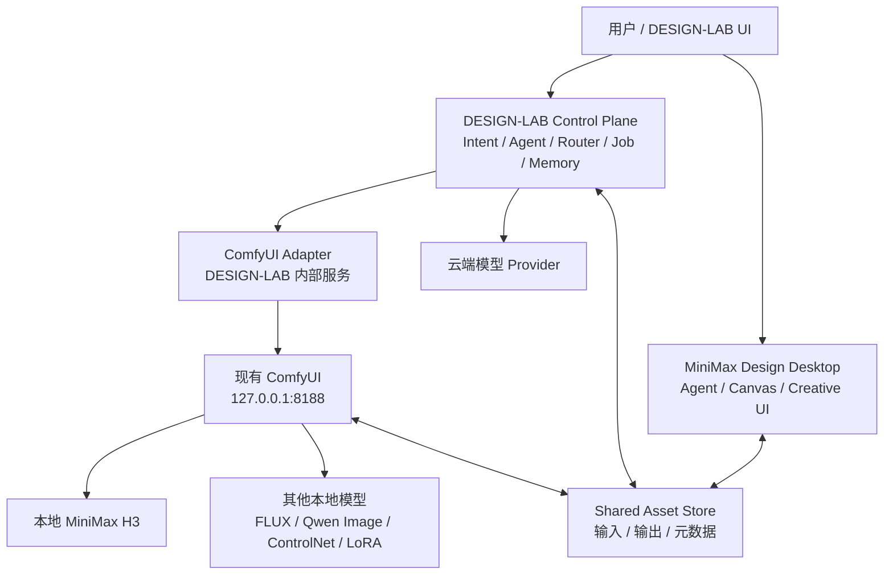
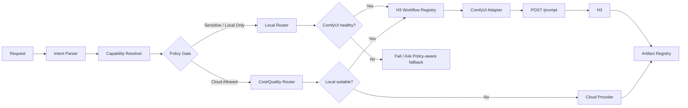
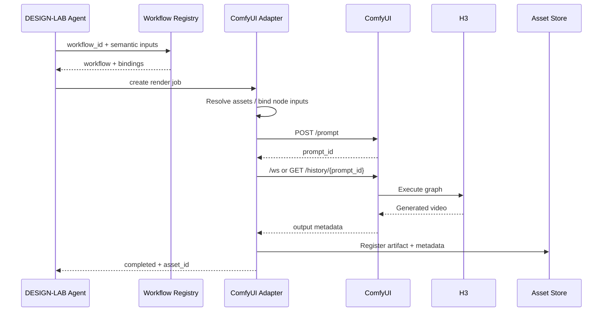

# MiniMax Design + 本地 ComfyUI + MiniMax H3 接入 DESIGN-LAB 的部署与集成报告

## 执行摘要

截至 **2026 年 9 月 21 日**，基于 MiniMax 官方公开的 MiniMax Design ComfyUI 插件仓库、MiniMax H3 的 ComfyUI 资料，以及 ComfyUI 官方服务器/API 实现，可以得到一个比较明确的工程结论：

**你现在最稳妥的方案不是把现有 ComfyUI/H3 “安装进 MiniMax Design”，而是保留它们作为独立的本地推理服务，由 DESIGN-LAB 成为统一编排层；MiniMax Design 则作为创意 Agent、Canvas、人工交互与资产入口。** MiniMax 官方已经公开了 Design 的 ComfyUI 插件代码并明确朝“可视化工作流 + 本地推理”方向集成，但本次审阅的公开资料中，**没有找到稳定、公开、可依赖的“在 MiniMax Design 中填写任意 ComfyUI Base URL，例如 `http://127.0.0.1:8188`”配置契约**。因此，不应让 DESIGN-LAB 的核心架构依赖这个尚未确认的私有接口。citeturn1view0turn1view2

与此同时，ComfyUI 本身已经具备非常适合 DESIGN-LAB 的 HTTP/WebSocket 服务接口：核心流程可以围绕 `POST /prompt`、`GET /history/{prompt_id}`、`GET /view`、`GET /system_stats`、`GET /object_info`、`POST /upload/image` 和 `/ws` 建立。ComfyUI 官方服务器实现直接定义了这些路由，因此 DESIGN-LAB 不需要模拟鼠标操作 ComfyUI UI。citeturn1view3turn6search0

MiniMax 官方也已经提供 H3 的 ComfyUI 使用路径，因此你已经拥有的“本地 ComfyUI + 本地 H3”应被视为**现成的 Local Inference Provider**，而不是重新部署一套。citeturn1view2

建议最终架构：



工程上建议分三阶段：

| 阶段 | 目标 | 建议 |
|---|---|---|
| 第一阶段 | DESIGN-LAB → ComfyUI → H3 完整自动化 | **立即实施，优先级最高** |
| 第二阶段 | MiniMax Design 与 DESIGN-LAB 共用资产和任务 | **推荐实施** |
| 第三阶段 | 若当前 MiniMax Design 构建确实提供本地 ComfyUI Server 配置，再启用直连 | **机会性增强，不作为核心依赖** |

最重要的原则有四条：

1. **不要重装或复制 H3。**
2. **不要为了 MiniMax Design 改坏现有可工作的 ComfyUI Python/CUDA 环境。**
3. **不要默认把官方 `minimax-desgin-plugin` 仓库直接复制到 `custom_nodes`；除非与你当前 MiniMax Design 版本配套的官方说明明确要求这样做。**
4. **DESIGN-LAB 应直接使用 ComfyUI API，MiniMax Design 是否能原生直连只是可选能力。** citeturn1view0turn6search0

## 已验证边界、依赖和部署前提

### MiniMax Design、ComfyUI 与 H3 的角色边界

MiniMax Design 官方公开的 ComfyUI 插件仓库位于 MiniMax-AI 官方组织下，其公开定位涉及 Design 与 ComfyUI/本地推理之间的集成。需要注意，公开仓库更适合视为**官方插件代码/同步代码源**，而不是证明“任何现成 ComfyUI 都可以通过一个 Base URL 设置立即挂载”的稳定 API 规范。citeturn1view0

MiniMax H3 则已经有官方 ComfyUI 路径，因而：

```text
现有 H3 checkpoint / components
              ↓
       现有 ComfyUI workflow
              ↓
      ComfyUI HTTP API
              ↓
        DESIGN-LAB
```

是目前证据最充分、风险最低的集成方向。citeturn1view2

### 推荐版本策略

这里不建议凭空给你指定诸如“必须 ComfyUI 0.x.x、Python 3.x.x、CUDA 12.x”的数字。

原因是你的 H3 **已经能够在现有 ComfyUI 环境中存在/运行**，升级 Python、PyTorch、CUDA 或 custom nodes 反而是最容易把环境破坏的操作；而本次可验证的官方资料也没有形成一个适用于所有 H3 本地部署的单一 MiniMax Design ↔ ComfyUI 最低版本矩阵。H3 具体工作流还可能依赖相应 custom nodes 与模型文件版本。citeturn1view2turn1view0

所以 DESIGN-LAB 应实行：

> **“验证当前工作环境 → 固化版本 → 集成”，而不是“先升级到最新版 → 再尝试集成”。**

建议建立如下基线：

| 组件 | 要记录的版本信息 | 是否建议立即升级 |
|---|---|---:|
| MiniMax Design Desktop | 客户端版本/Build ID | 否 |
| MiniMax Design ComfyUI Plugin | 与客户端匹配的插件/源码版本 | 否 |
| ComfyUI | Git commit 或应用版本 | 否 |
| ComfyUI Frontend | frontend version | 否 |
| Python | `python --version` | 否 |
| PyTorch | `torch.__version__` | 否 |
| CUDA Runtime | `torch.version.cuda` | 否 |
| GPU Driver | `nvidia-smi` | 仅必要时 |
| H3 | checkpoint/revision/文件 SHA-256 | 否 |
| H3 custom nodes | Git commit | 否 |
| Workflow | API JSON SHA-256 | 随版本管理 |

Windows 上先建立快照：

```powershell
New-Item -ItemType Directory -Force D:\DESIGN-LAB\state\baseline | Out-Null

python --version |
    Tee-Object D:\DESIGN-LAB\state\baseline\python.txt

nvidia-smi |
    Tee-Object D:\DESIGN-LAB\state\baseline\nvidia-smi.txt

python -c "import torch; print('torch=',torch.__version__); print('cuda=',torch.version.cuda); print('gpu=',torch.cuda.get_device_name(0) if torch.cuda.is_available() else 'NONE')" |
    Tee-Object D:\DESIGN-LAB\state\baseline\torch.txt
```

如果 ComfyUI 是 Git 安装：

```powershell
Set-Location D:\ComfyUI

git rev-parse HEAD |
    Tee-Object D:\DESIGN-LAB\state\baseline\comfyui-commit.txt

git status --short |
    Tee-Object D:\DESIGN-LAB\state\baseline\comfyui-status.txt
```

为 H3 模型计算哈希时，不建议每次启动都算大型 checkpoint；部署时算一次并保存：

```powershell
Get-FileHash "D:\ComfyUI\models\<H3_MODEL_PATH>\<model-file>" -Algorithm SHA256
```

### 网络、端口和 API

ComfyUI 官方服务器实现提供以 HTTP/WebSocket 为中心的执行机制，`/prompt`、`/history`、`/view` 等是构建自动化客户端的基础。citeturn1view3turn6search0

推荐 DESIGN-LAB 使用：

| 用途 | 推荐地址 | DESIGN-LAB 是否需要 |
|---|---|---:|
| ComfyUI HTTP | `http://127.0.0.1:8188` | 必需 |
| ComfyUI WebSocket | `ws://127.0.0.1:8188/ws` | 推荐 |
| 健康/设备状态 | `GET /system_stats` | 必需 |
| 节点能力检查 | `GET /object_info` | 推荐 |
| 提交 workflow | `POST /prompt` | 必需 |
| 查询任务 | `GET /history/{prompt_id}` | 必需 |
| 获取输出 | `GET /view?...` | 推荐 |
| 上传输入图 | `POST /upload/image` | 视资产策略 |
| 查询队列 | `GET /queue` | 推荐 |
| WebSocket 进度 | `/ws?clientId=<id>` | 推荐 |

这些路由来自 ComfyUI server 的官方实现；不同版本可能增加额外路由，因此 DESIGN-LAB 应只依赖自己实际验证过的最小集合。citeturn6search0

### 身份验证与安全边界

对于本机 ComfyUI，推荐：

```text
127.0.0.1:8188
```

而不是：

```text
0.0.0.0:8188
```

ComfyUI 核心执行路由不应该被当成一个面向互联网的、带完整企业级身份认证边界的服务；因此最安全的模型是**操作系统 loopback 本地访问 + DESIGN-LAB 自己负责权限控制**。从 ComfyUI 官方服务端路由可以看到这些执行接口直接暴露在服务器上，因此将其公开到不可信网络意味着外部调用者可能获得模型执行能力。citeturn6search0

尤其注意：

> **CORS 不是身份认证。**

`Access-Control-Allow-Origin` 只是浏览器跨域策略，不会阻止 curl、Python、恶意进程或远程程序直接调用 API。

如果 DESIGN-LAB 后端和 ComfyUI 都在同一 Windows 主机：

```text
DESIGN-LAB Backend
      ↓ HTTP
127.0.0.1:8188
```

**完全不需要打开 CORS。**

只有当 DESIGN-LAB 的浏览器前端直接请求 ComfyUI 时才涉及 CORS，而这种架构本身也不如：

```text
Browser
   ↓
DESIGN-LAB Backend
   ↓
ComfyUI
```

安全。

## 推荐架构与 MiniMax Design 集成方式

### 集成选项比较

这是整个方案中最重要的一张表。

| 方案 | 路径 | 稳定性 | MiniMax Design 依赖 | 自动化能力 | 推荐度 |
|---|---|---:|---:|---:|---:|
| **DESIGN-LAB → ComfyUI API** | DL → `8188` → H3 | 很高 | 无 | 很高 | **最高** |
| **共享资产桥接** | MiniMax Design ↔ Shared Assets ↔ DL ↔ ComfyUI | 高 | 低 | 高 | **推荐** |
| MiniMax Design 原生本地 ComfyUI | Design → plugin → ComfyUI | 取决于客户端版本 | 高 | 潜在很高 | 条件式 |
| 浏览器直接调用 ComfyUI | DL Web UI → `8188` | 中 | 无 | 高 | 不推荐 |
| UI 自动点击 ComfyUI | Agent → mouse/keyboard → UI | 低 | 无 | 低 | 避免 |
| 修改 MiniMax Design/插件内部连接逻辑 | Design fork → ComfyUI | 低到中 | 很高 | 高 | 实验用途 |
| LAN 暴露 ComfyUI | 多机 → `host:8188` | 中 | 无 | 高 | 仅确有需要 |

MiniMax 已经公开官方 Design ComfyUI 插件，并且 H3 官方资料也明确涉及 ComfyUI，所以未来 MiniMax Design 对本地推理的直接集成能力值得利用；但截至本报告时间，**不要把 DESIGN-LAB 依赖在未公开稳定文档化的 arbitrary Base URL 行为上**。citeturn1view0turn1view2

### 推荐的 DESIGN-LAB 控制面



DESIGN-LAB 不需要知道 H3 的所有节点细节。

它只应该知道：

```json
{
  "workflow_id": "minimax-h3-i2v-v1",
  "capability": "image_to_video",
  "provider": "comfyui-local",
  "inputs": [
    "prompt",
    "image",
    "seed",
    "duration"
  ]
}
```

真正的：

```text
prompt → node 42.inputs.text
image  → node 17.inputs.image
seed   → node 63.inputs.seed
```

应该由 Workflow Registry 管理。

这样 H3 工作流节点 ID 改动，不会传播到 Agent 层。

### MiniMax Design 没有 ComfyUI URL 设置时怎么办

推荐优先顺序：

**A. 使用 DESIGN-LAB 资产桥接，最稳。**

```text
MiniMax Design
      ↓ 导入/导出
Shared Asset Store
      ↓
DESIGN-LAB
      ↓
ComfyUI API
      ↓
H3
      ↓
Shared Asset Store
      ↓
MiniMax Design
```

也就是说 MiniMax Design 做：

```text
创意
参考图
设计稿
Canvas
人工确认
```

DESIGN-LAB 做：

```text
调用哪个模型
运行哪个 workflow
何时本地/云端
状态追踪
资产索引
失败恢复
审计
```

**B. 如果你的 MiniMax Design 当前版本出现“Local ComfyUI / Server / Endpoint / Base URL”设置。**

优先填：

```text
http://127.0.0.1:8188
```

先验证：

```powershell
Invoke-RestMethod http://127.0.0.1:8188/system_stats
```

再由 MiniMax Design 测试。

**C. 如果客户端插件固定寻找另一个本地地址。**

只有通过当前版本官方文档或实际网络观察确认其预期 endpoint 后，才考虑 localhost reverse proxy。例如：

```text
MiniMax Design → expected localhost port
                       ↓
                  reverse proxy
                       ↓
                 127.0.0.1:8188
```

不要根据猜测修改 MiniMax Design 二进制或 monkey-patch 插件。

**D. 不建议直接把 GitHub 官方插件源码扔进 `ComfyUI/custom_nodes`。**

只有在与你当前版本匹配的官方 README 明确把它定义为标准 ComfyUI custom node 安装包时才这样做。官方仓库存在并不等于它的整个内容遵循普通 `custom_nodes/<package>` 安装契约。citeturn1view0

## Windows 部署、目录和工作流注册

### 推荐文件系统布局

不要移动现有模型。

可以让现有模型保持：

```text
D:\ComfyUI\
├─ models\
│  └─ ...H3 existing files...
├─ custom_nodes\
├─ input\
└─ output\
```

而 DESIGN-LAB 建立自己的控制面：

```text
D:\DESIGN-LAB\
├─ app\
├─ config\
│  ├─ providers\
│  │  └─ comfyui-local.yaml
│  └─ routing\
│     └─ render-routing.yaml
│
├─ workflows\
│  └─ comfyui\
│     └─ minimax-h3\
│        ├─ t2v\
│        │  ├─ workflow.api.json
│        │  └─ manifest.yaml
│        ├─ i2v\
│        │  ├─ workflow.api.json
│        │  └─ manifest.yaml
│        └─ reference\
│           ├─ workflow.api.json
│           └─ manifest.yaml
│
├─ shared\
│  ├─ input\
│  ├─ references\
│  ├─ comfyui-input\
│  ├─ comfyui-output\
│  ├─ approved\
│  └─ export\
│
├─ metadata\
├─ logs\
├─ state\
└─ cache\
```

如果不希望修改现有 ComfyUI 输入输出路径，可先用 Junction：

```powershell
New-Item -ItemType Directory -Force D:\DESIGN-LAB\shared | Out-Null
```

例如现有输出仍是：

```text
D:\ComfyUI\output
```

DESIGN-LAB 可以直接配置：

```env
DESIGNLAB_COMFYUI_OUTPUT_DIR=D:\ComfyUI\output
```

这是第一阶段最安全的方案。

### ComfyUI 启动

先查看：

```powershell
Get-NetTCPConnection -LocalPort 8188 -State Listen -ErrorAction SilentlyContinue
```

或：

```powershell
netstat -ano | findstr :8188
```

如果是普通 Git/Python 安装，概念上的启动方式为：

```powershell
Set-Location D:\ComfyUI

.\venv\Scripts\python.exe .\main.py `
  --listen 127.0.0.1 `
  --port 8188
```

如果你的环境没有 venv：

```powershell
python .\main.py `
  --listen 127.0.0.1 `
  --port 8188
```

对于 Windows Portable，其 Python 位于 embedded environment，常见形式为：

```powershell
.\python_embeded\python.exe -s .\ComfyUI\main.py `
  --listen 127.0.0.1 `
  --port 8188
```

实际启动脚本应以你现有可正常运行的安装为准；不要为了 DESIGN-LAB 更换 Python 发行方式。

如果确认希望统一 input/output，再加：

```powershell
python .\main.py `
  --listen 127.0.0.1 `
  --port 8188 `
  --input-directory "D:\DESIGN-LAB\shared\comfyui-input" `
  --output-directory "D:\DESIGN-LAB\shared\comfyui-output"
```

ComfyUI 的 API 是随本地 server 提供的，不需要另外安装一个 “ComfyUI API Server”。citeturn1view3turn6search0

### DESIGN-LAB 环境变量

建议：

```env
DESIGNLAB_COMFYUI_BASE_URL=http://127.0.0.1:8188
DESIGNLAB_COMFYUI_WS_URL=ws://127.0.0.1:8188/ws

DESIGNLAB_COMFYUI_CONNECT_TIMEOUT_S=3
DESIGNLAB_COMFYUI_READ_TIMEOUT_S=30
DESIGNLAB_COMFYUI_JOB_TIMEOUT_S=3600
DESIGNLAB_COMFYUI_POLL_INTERVAL_S=2

DESIGNLAB_COMFYUI_INPUT_DIR=D:\ComfyUI\input
DESIGNLAB_COMFYUI_OUTPUT_DIR=D:\ComfyUI\output

DESIGNLAB_LOCAL_ONLY=true
```

PowerShell 临时测试：

```powershell
$env:DESIGNLAB_COMFYUI_BASE_URL = "http://127.0.0.1:8188"
$env:DESIGNLAB_COMFYUI_WS_URL   = "ws://127.0.0.1:8188/ws"
```

持久化：

```powershell
[Environment]::SetEnvironmentVariable(
    "DESIGNLAB_COMFYUI_BASE_URL",
    "http://127.0.0.1:8188",
    "User"
)
```

这里的 timeout 是 **DESIGN-LAB 推荐默认值**，不是 MiniMax 或 ComfyUI 官方强制值。

尤其 H3 视频生成的总 Job timeout 应与：

```text
分辨率
帧数
时长
GPU
VRAM
offload
当前队列
```

关联，所以 `3600 s` 是安全的初始上限，而不是性能保证。

### API 连通性验证

PowerShell：

```powershell
$Comfy = "http://127.0.0.1:8188"

Invoke-RestMethod "$Comfy/system_stats"
```

curl：

```powershell
curl.exe -s http://127.0.0.1:8188/system_stats
```

查询节点：

```powershell
curl.exe -s http://127.0.0.1:8188/object_info
```

这些检查可以同时验证“ComfyUI server 可访问”和“DESIGN-LAB 所需节点是否已经注册”。官方 ComfyUI server 提供相应运行与节点信息路由。citeturn6search0

### Workflow 的导出、导入和版本管理

这里一定要区分两个概念：

```text
UI Workflow JSON
≠
API Prompt JSON
```

UI JSON 主要用于重新打开节点图。

API JSON 才是最适合发送到：

```text
POST /prompt
```

的格式。

典型 API workflow 看起来是：

```json
{
  "6": {
    "class_type": "CLIPTextEncode",
    "inputs": {
      "text": "example",
      "clip": ["4", 1]
    }
  },
  "12": {
    "class_type": "LoadImage",
    "inputs": {
      "image": "reference.png"
    }
  }
}
```

ComfyUI 的 server 接收 `prompt` 对象并执行节点图，这是官方服务端自动化机制的核心。citeturn1view3turn6search0

在你的 ComfyUI 中：

1. 打开当前已经成功生成 H3 视频的 workflow。
2. 不要先编辑节点结构。
3. 使用当前 frontend 提供的 **API Format / Save API / Export API** 功能导出。
4. 如果 UI 名称与你看到的不一致，以当前 ComfyUI frontend 的开发者/Workflow 导出功能为准，因为前端版本间菜单名称会发生变化。
5. 保存为：

```text
D:\DESIGN-LAB\workflows\comfyui\minimax-h3\i2v\workflow.api.json
```

不要让 Agent 直接编辑整个 JSON；建立 manifest：

```yaml
id: minimax-h3-i2v-v1
provider: comfyui-local
capability: image_to_video
enabled: true

workflow:
  file: workflow.api.json

bindings:
  prompt:
    node_id: "42"
    input: text

  image:
    node_id: "17"
    input: image

  seed:
    node_id: "63"
    input: seed

defaults:
  seed: 123456789

requirements:
  nodes:
    - H3SomeLoader
    - H3SomeSampler

policy:
  supports_local_only: true
  cloud_fallback: allowed

timeouts:
  job_seconds: 3600
```

**上面的 node ID 和 class name 都只是示例。**

正确 ID 必须来自你实际导出的 H3 API workflow。

注册前应该自动验证：

```text
manifest node 42
        ↓
workflow["42"] 是否存在？
        ↓
inputs.text 是否存在？
        ↓
class_type 是否符合预期？
```

建议为每个 workflow 保存：

```text
workflow_sha256
ComfyUI commit
custom node commits
H3 model hash/revision
created_at
last_verified_at
```

这样以后 custom node 更新造成 workflow 失效，可以准确定位版本漂移。

## ComfyUI Adapter、资产同步与路由设计

### DESIGN-LAB 的 Adapter API

不要让 DESIGN-LAB 的业务 Agent 直接到处调用：

```text
http://127.0.0.1:8188/prompt
```

在 DESIGN-LAB 内统一做一层：

```text
ComfyUIAdapter
```

内部接口建议：

| DESIGN-LAB 接口 | 作用 |
|---|---|
| `GET /v1/providers/comfyui/health` | 健康、GPU、节点能力 |
| `POST /v1/render/jobs` | 提交渲染 |
| `GET /v1/render/jobs/{job_id}` | 查询状态 |
| `POST /v1/render/jobs/{job_id}/cancel` | 请求取消 |
| `GET /v1/render/jobs/{job_id}/artifacts` | 输出资产 |
| `GET /v1/workflows` | Workflow Registry |
| `POST /v1/workflows/{id}/validate` | 验证节点与参数 |

例如 DESIGN-LAB 调用：

```json
{
  "workflow_id": "minimax-h3-i2v-v1",
  "inputs": {
    "prompt": "高端护肤品广告，镜头缓慢环绕产品，柔和棚拍灯光",
    "image": "asset://ref/product-001.png",
    "seed": 123456
  },
  "policy": {
    "local_only": true
  }
}
```

Adapter 再转换为 ComfyUI prompt：



### Python Adapter 示例

下面示例刻意只依赖 ComfyUI 的核心 API，不绑定 H3 的具体 custom node：

```python
from __future__ import annotations

import asyncio
import copy
import time
import uuid
from typing import Any

import httpx


class ComfyUIError(RuntimeError):
    pass


class ComfyUIClient:
    def __init__(
        self,
        base_url: str = "http://127.0.0.1:8188",
        connect_timeout: float = 3.0,
        read_timeout: float = 30.0,
    ) -> None:
        self.base_url = base_url.rstrip("/")
        self.client_id = str(uuid.uuid4())

        timeout = httpx.Timeout(
            connect=connect_timeout,
            read=read_timeout,
            write=read_timeout,
            pool=connect_timeout,
        )

        self.http = httpx.AsyncClient(
            base_url=self.base_url,
            timeout=timeout,
        )

    async def close(self) -> None:
        await self.http.aclose()

    async def health(self) -> dict[str, Any]:
        response = await self.http.get("/system_stats")
        response.raise_for_status()
        return response.json()

    async def object_info(self) -> dict[str, Any]:
        response = await self.http.get("/object_info")
        response.raise_for_status()
        return response.json()

    async def submit(self, workflow: dict[str, Any]) -> str:
        """
        POST /prompt 是非幂等操作。
        不在这里自动 retry，避免网络超时时重复排队。
        """
        response = await self.http.post(
            "/prompt",
            json={
                "prompt": workflow,
                "client_id": self.client_id,
            },
        )

        if response.status_code >= 400:
            raise ComfyUIError(
                f"ComfyUI rejected workflow: "
                f"{response.status_code} {response.text[:2000]}"
            )

        payload = response.json()
        prompt_id = payload.get("prompt_id")

        if not prompt_id:
            raise ComfyUIError(
                f"No prompt_id returned: {payload}"
            )

        return str(prompt_id)

    async def history(self, prompt_id: str) -> dict[str, Any]:
        response = await self.http.get(f"/history/{prompt_id}")
        response.raise_for_status()
        return response.json()

    async def wait(
        self,
        prompt_id: str,
        job_timeout: float = 3600,
        poll_interval: float = 2.0,
    ) -> dict[str, Any]:
        deadline = time.monotonic() + job_timeout

        while time.monotonic() < deadline:
            try:
                result = await self.history(prompt_id)
            except (
                httpx.ConnectError,
                httpx.ReadTimeout,
            ):
                # GET 是安全的，可以重试。
                await asyncio.sleep(min(poll_interval * 2, 5))
                continue

            entry = result.get(prompt_id)

            if entry:
                return entry

            await asyncio.sleep(poll_interval)

        raise TimeoutError(
            f"ComfyUI job timed out: {prompt_id}"
        )


def apply_bindings(
    workflow: dict[str, Any],
    bindings: dict[str, dict[str, str]],
    values: dict[str, Any],
) -> dict[str, Any]:
    result = copy.deepcopy(workflow)

    for semantic_name, value in values.items():
        if semantic_name not in bindings:
            continue

        binding = bindings[semantic_name]
        node_id = str(binding["node_id"])
        input_name = binding["input"]

        try:
            result[node_id]["inputs"][input_name] = value
        except KeyError as exc:
            raise ComfyUIError(
                f"Invalid workflow binding: "
                f"{semantic_name} -> "
                f"{node_id}.{input_name}"
            ) from exc

    return result
```

ComfyUI 官方 server 的 `/prompt` 与 `/history/{prompt_id}` 正是这种无 UI 自动执行模型的基础。citeturn6search0

### Retry 和错误处理策略

特别注意：

> **不能对 `POST /prompt` 无脑自动 retry。**

因为：

```text
第一次 POST
↓
ComfyUI 实际收到了
↓
网络返回刚好超时
↓
DESIGN-LAB 误认为失败
↓
再次 POST
↓
同一 H3 视频生成两次
```

推荐：

| 操作 | Retry |
|---|---|
| `GET /system_stats` | 3 次，短指数退避 |
| `GET /object_info` | 3 次 |
| `GET /history` | 可以持续 retry |
| 下载 `/view` | 可以 retry |
| `POST /prompt` | **默认 0 次自动 retry** |
| 上传 asset | 只有确定请求未到达时再重试 |
| Cloud generation POST | 同样要求 provider idempotency |

建议状态机：

```text
CREATED
 ↓
VALIDATED
 ↓
SUBMITTING
 ↓
SUBMITTED(prompt_id)
 ↓
RUNNING
 ↓
COMPLETED
```

失败状态：

```text
VALIDATION_FAILED
SUBMIT_UNKNOWN
EXECUTION_FAILED
TIMED_OUT
CANCELLED
OOM
```

其中 `SUBMIT_UNKNOWN` 非常重要——表示：

> 请求发生网络异常，但无法证明 ComfyUI 没收到。

这比直接重新 POST 安全得多。

### 共享资产层

推荐文件名：

```text
{project}_{job-id}_{role}_{timestamp}_{hash8}.{ext}
```

例如：

```text
cosmetics_01JXYZ_ref_20260921T203012Z_a31f92bc.png

cosmetics_01JXYZ_h3-video_20260921T204455Z_449bb912.mp4
```

不要使用：

```text
final.png
final2.png
真的final.mp4
```

每个输出配 sidecar metadata：

```json
{
  "asset_id": "ast_01JXYZ",
  "project_id": "cosmetics",
  "job_id": "job_01JXYZ",
  "kind": "video",
  "provider": "comfyui-local",
  "workflow_id": "minimax-h3-i2v-v1",
  "model": "minimax-h3-local",
  "seed": 123456,
  "sha256": "....",
  "workflow_sha256": "....",
  "parents": [
    "ast_reference_001"
  ],
  "created_at": "2026-09-21T20:44:55Z",
  "privacy": "local-only"
}
```

对特别敏感任务，metadata 中不一定保存完整 prompt，可以保存：

```text
prompt_sha256
```

并让完整 prompt 进入受权限控制的 Job DB。

### 本地 H3 与云端的 Router

不要使用简单逻辑：

```python
if local_available:
    use_local()
```

应该先走 Hard Gates：

```text
数据是否要求 local-only？
       ↓
是 → 禁止云端

ComfyUI 是否 healthy？
       ↓
否 → local unavailable

H3 workflow 是否支持当前任务？
       ↓
否 → 其他 provider

模型/节点是否齐全？
       ↓
否 → workflow incompatible

磁盘/GPU/队列是否允许？
       ↓
否 → local degraded
```

再走软评分：

```python
score_local = (
    privacy_score * 0.35
    + cost_score * 0.20
    + latency_score * 0.15
    + quality_score * 0.20
    + availability_score * 0.10
)
```

推荐策略：

```yaml
routing:
  image_to_video:
    preferred:
      - minimax-h3-local
      - cloud-video

  rules:
    - when:
        local_only: true
      require:
        provider: minimax-h3-local

    - when:
        local_queue_minutes_gt: 20
        cloud_allowed: true
      prefer:
        provider: cloud-video

    - when:
        local_oom_count_gte: 2
      action:
        open_circuit
```

关键原则：

> **Cloud fallback 必须经过 privacy policy，而不是本地失败后偷偷上传。**

这对于商业设计稿、未发布产品、客户照片尤其重要。

## 性能、安全与隐私

### GPU 和显存

不要为 H3 假设一个单一“最低显存数字”。

视频模型峰值显存往往同时取决于：

```text
checkpoint / quantization
分辨率
帧数
batch
attention implementation
VAE
offload
custom node 实现
PyTorch/CUDA 版本
```

MiniMax 官方已经提供 H3 的 ComfyUI 路径，但真正的可运行规格仍应以你的 H3 工作流和当前硬件实测为准。citeturn1view2

DESIGN-LAB 应把一个实际 benchmark 记录下来，例如：

| Profile | Resolution | Frames/Duration | Batch | Peak VRAM | Time | Result |
|---|---:|---:|---:|---:|---|
| H3-low | 实测 | 实测 | 1 | 实测 | 实测 | PASS |
| H3-normal | 实测 | 实测 | 1 | 实测 | 实测 | PASS/OOM |
| H3-high | 实测 | 实测 | 1 | 实测 | 实测 | PASS/OOM |

本地视频推理推荐：

```text
batch = 1
```

先作为安全默认。

不要让两个 H3 Job 同时进入 GPU，除非 benchmark 已证明你的显存足够。

可以在 DESIGN-LAB 中：

```yaml
resources:
  minimax-h3-local:
    max_concurrency: 1
```

发生 OOM 时按这个顺序降级：

```text
并发数
↓
batch
↓
分辨率
↓
帧数/时长
↓
更节省显存的 workflow
↓
offload / low-VRAM 模式
↓
经验证的量化版本
↓
允许时 cloud fallback
```

**不要未经验证直接把 checkpoint 换成某个第三方量化模型。** H3 的量化应纳入 workflow/model revision 管理，否则输出质量和兼容性会变成不可追踪变量。

### 本地模式的真实隐私边界

这里必须区分：

```text
DESIGN-LAB → localhost ComfyUI → local H3
```

和：

```text
DESIGN-LAB → MiniMax Design → cloud features
```

前者可以设计为完全本地的数据平面。

后者是否完全本地，取决于 MiniMax Design 当前版本、具体 Agent/模型/遥测功能；**不能因为它能够调用本地插件，就自动推导整个桌面客户端是离线的。**

因此真正敏感任务应允许：

```text
MiniMax Design BYPASS
```

直接：

```text
DESIGN-LAB
  ↓
127.0.0.1:8188
  ↓
H3
```

这也是为什么 MiniMax Design 不应该成为 DESIGN-LAB 的必经控制层。

### Windows Firewall

纯本机模式：

```text
--listen 127.0.0.1
```

通常无需为 TCP 8188 新增入站允许规则。

检查：

```powershell
Get-NetTCPConnection -LocalPort 8188 |
    Format-Table LocalAddress,LocalPort,State,OwningProcess
```

理想情况：

```text
LocalAddress : 127.0.0.1
LocalPort    : 8188
State        : Listen
```

如果看到：

```text
0.0.0.0:8188
```

意味着所有本机网络接口均可监听，应确认这是否真是你的意图。

只有明确需要 LAN 调用时才考虑：

```powershell
New-NetFirewallRule `
  -DisplayName "DESIGN-LAB ComfyUI LAN" `
  -Direction Inbound `
  -Action Allow `
  -Protocol TCP `
  -LocalPort 8188 `
  -RemoteAddress 192.168.1.0/24
```

但更好的 LAN 生产方案是：

```text
Remote DESIGN-LAB
       ↓
HTTPS reverse proxy
       ↓ authentication
       ↓ IP allow-list
       ↓
127.0.0.1:8188
```

而不是：

```text
Internet
   ↓
0.0.0.0:8188
```

因为 ComfyUI 执行 API 可以触发真实模型计算。citeturn6search0

### CORS

如果 DESIGN-LAB 后端访问：

```text
Python backend → ComfyUI
```

不需要 CORS。

若浏览器必须直接访问：

```text
Browser → ComfyUI
```

才考虑 ComfyUI 的 CORS 启动设置，而且应该限定具体 origin，不应为了“先跑起来”永久开放任意来源。ComfyUI 的 server/CLI 提供相关服务器配置能力，但这仍不构成身份认证。citeturn6search0

架构上仍推荐：

```text
Browser
 ↓
DESIGN-LAB authenticated API
 ↓
ComfyUI localhost
```

### custom nodes 是代码执行边界

ComfyUI custom node 不是“一个模型文件”，而是本机运行的 Python 代码。

因此 DESIGN-LAB 的供应链策略至少应该记录：

```text
repository
commit SHA
installation date
requirements
hash
approved=true/false
```

不要让 Agent 自己执行：

```text
git clone random-node
pip install random-package
```

然后立即进行商业任务。

MiniMax Design 插件同样应该使用官方 MiniMax-AI 来源，而不是名称相似的第三方仓库。官方插件仓库可以作为来源身份校验的基础。citeturn1view0

## 验证、故障恢复与实施优先级

### 端到端测试计划

第一层只测 ComfyUI：

```powershell
$Base = "http://127.0.0.1:8188"

Write-Host "=== system_stats ==="
Invoke-RestMethod "$Base/system_stats"

Write-Host "=== object_info ==="
$nodes = Invoke-RestMethod "$Base/object_info"
Write-Host "Node count:" ($nodes.PSObject.Properties.Count)

Write-Host "=== queue ==="
Invoke-RestMethod "$Base/queue"
```

预期：

```text
/system_stats     HTTP 200
/object_info      HTTP 200，有大量节点
/queue            HTTP 200
```

第二层测试 API Workflow：

```powershell
$workflowPath = "D:\DESIGN-LAB\workflows\comfyui\minimax-h3\i2v\workflow.api.json"

$workflow = Get-Content $workflowPath -Raw | ConvertFrom-Json

$body = @{
    prompt    = $workflow
    client_id = [guid]::NewGuid().ToString()
} | ConvertTo-Json -Depth 100

$result = Invoke-RestMethod `
    -Uri "http://127.0.0.1:8188/prompt" `
    -Method Post `
    -ContentType "application/json" `
    -Body $body

$result | ConvertTo-Json -Depth 10
```

预期至少获得类似：

```json
{
  "prompt_id": "..."
}
```

`POST /prompt` 是 ComfyUI 官方服务端排队执行 workflow 的核心接口。citeturn6search0

再查询：

```powershell
$promptId = $result.prompt_id

Invoke-RestMethod `
  "http://127.0.0.1:8188/history/$promptId" |
  ConvertTo-Json -Depth 100
```

第三层测试 H3。

T2V 测试 prompt 可以固定：

```text
A premium silver cosmetic bottle on a clean studio table,
soft commercial lighting, slow cinematic camera movement,
stable product geometry, realistic reflections.
```

不要一上来用复杂长 prompt。

验证：

```text
任务能够提交
→ H3 节点执行
→ 没有 missing model
→ 没有 missing custom node
→ 没有 CUDA OOM
→ output 中产生视频
→ DESIGN-LAB 能登记该文件
```

I2V 再使用一个固定测试图，并固定 seed。

这样每次升级以后都可以比较：

```text
同一 input
同一 workflow
同一 seed
同一模型 revision
```

第四层测试 DESIGN-LAB：

```text
POST DESIGN-LAB /v1/render/jobs
             ↓
workflow registry
             ↓
binding
             ↓
ComfyUI /prompt
             ↓
history/ws
             ↓
asset registration
```

第五层才测 MiniMax Design 的资产往返：

```text
MiniMax Design
→ 导出参考素材
→ Shared Asset Store
→ DESIGN-LAB/H3
→ MP4
→ MiniMax Design 导入/查看
```

### 完整验收条件

| 测试 | PASS 条件 |
|---|---|
| ComfyUI health | `/system_stats` 200 |
| Node inventory | H3 所需节点存在 |
| Workflow validation | 所有 binding node/input 存在 |
| H3 T2V | 输出有效视频 |
| H3 I2V | 输入图成功被 workflow 使用 |
| History | 能根据 `prompt_id` 获取结果 |
| Asset registry | 输出 SHA-256、metadata 可查 |
| Local-only | 整个 H3 path 无云端 fallback |
| Failure handling | OOM/错误不会重复提交 |
| Restart | ComfyUI 重启后 adapter 自动恢复 |
| MiniMax Design bridge | 能通过 shared assets 往返 |
| Privacy routing | local-only 时云 provider 不会被调用 |

### 故障定位表

| 现象 | 最可能原因 | 首要检查 |
|---|---|---|
| `8188` connection refused | ComfyUI 未运行/端口不同 | `Get-NetTCPConnection` |
| `/system_stats` 404 | 地址错误或服务不是目标 ComfyUI | PID、Base URL |
| `/prompt` 400 | workflow 格式/节点输入错误 | 返回的 node errors |
| `class_type` unknown | custom node 缺失/版本不匹配 | `/object_info` |
| model not found | 模型路径变化 | 模型 loader / extra paths |
| API workflow UI 可开但 API 失败 | 导出了 UI JSON 而不是 API JSON | JSON 结构 |
| 任务一直没有 history | 仍在队列/执行或 workflow 卡住 | `/queue`、ComfyUI console |
| CUDA OOM | H3 profile 超过 VRAM | 分辨率/帧数/batch |
| UI 正常、DESIGN-LAB 失败 | adapter binding 错误 | manifest |
| browser CORS error | 浏览器跨域 | 改为 backend proxy |
| MiniMax Design 看不到 ComfyUI | 当前版本未提供直连/插件契约不同 | 使用 Asset Bridge |
| 视频生成了但 DESIGN-LAB 找不到 | output path 不一致 | output-directory |
| 同一任务出现两份视频 | `/prompt` 被重复 retry | 幂等/状态机 |
| 更新后突然 workflow 失效 | node/model/version drift | baseline hashes |

### 回滚方案

进行任何插件或 ComfyUI 更新之前：

```powershell
Copy-Item `
  D:\DESIGN-LAB\workflows `
  D:\DESIGN-LAB\backup\workflows-20260921 `
  -Recurse
```

记录：

```powershell
Set-Location D:\ComfyUI
git rev-parse HEAD
```

对 custom node 逐个保存 commit。

不要把模型全部复制一份浪费数百 GB；模型只需要：

```text
filename
size
SHA256
revision
location
```

回滚顺序应该是：

```text
停止 DESIGN-LAB worker
↓
停止 ComfyUI
↓
恢复 workflow/manifest
↓
恢复 custom-node commit
↓
必要时恢复 ComfyUI commit
↓
启动 ComfyUI
↓
/system_stats
↓
/object_info
↓
固定 smoke workflow
↓
启动 DESIGN-LAB worker
```

不要把：

```text
pip install -U ...
```

作为第一反应。

这往往会扩大环境差异。

### 优先实施清单

下面的工时是**单机 Windows、你已经有可工作的 ComfyUI/H3/DESIGN-LAB 的工程估算**，不是供应商承诺；若当前 H3 workflow 本身不能稳定生成，需要另计模型调试时间。

| 优先级 | 工作 | 估算 | 产物 |
|---:|---|---:|---|
| **P0** | 冻结现有 ComfyUI/H3 版本 | 30–60 分钟 | baseline |
| **P0** | 验证 `8188` API | 15–30 分钟 | health report |
| **P0** | 导出 H3 API workflow | 30–90 分钟 | `workflow.api.json` |
| **P0** | 建 manifest/bindings | 1–2 小时 | `manifest.yaml` |
| **P0** | 实现 ComfyUI Adapter 最小版 | 2–4 小时 | submit/status/result |
| **P0** | 建 Job 状态机 | 2–4 小时 | durable jobs |
| **P1** | 统一 Asset Registry | 2–4 小时 | asset + metadata |
| **P1** | T2V/I2V 自动测试 | 1–3 小时 | smoke tests |
| **P1** | WebSocket progress | 1–3 小时 | 实时进度 |
| **P1** | local/cloud Router | 2–4 小时 | routing policy |
| **P1** | OOM/circuit breaker | 1–2 小时 | fallback protection |
| **P1** | MiniMax Design Shared Asset Bridge | 1–3 小时 | 资产闭环 |
| **P2** | 检查当前 MiniMax Design 是否支持 direct ComfyUI endpoint | 30–90 分钟 | capability report |
| **P2** | 若支持，启用原生 direct connection | 1–2 小时 | optional integration |
| **P2** | Reverse proxy/Auth（仅 LAN） | 2–4 小时 | secured gateway |
| **P2** | H3 性能 profiling | 2–4 小时 | VRAM/latency profiles |
| **P3** | 自动 benchmark / workflow migration | 4–8 小时 | regression system |

最小可用闭环实际上只需要：

```text
P0-1
冻结环境

P0-2
确认 localhost:8188

P0-3
把已经工作的 H3 Workflow 导成 API JSON

P0-4
注册 workflow manifest

P0-5
DESIGN-LAB Adapter POST /prompt

P0-6
/history 跟踪完成

P0-7
把 MP4 注册成 DESIGN-LAB Asset
```

完成这里之后，你已经拥有：

```text
用户
 ↓
DESIGN-LAB
 ↓
Agent / Router
 ↓
H3 Workflow Registry
 ↓
ComfyUI Adapter
 ↓
本机 127.0.0.1:8188
 ↓
MiniMax H3
 ↓
MP4
 ↓
DESIGN-LAB Asset Registry
```

这才是整个系统最重要的基础。

### 最终部署建议与已知限制

推荐最终生产形态：

```text
Windows Workstation
│
├── MiniMax Design Desktop
│      ├── Agent
│      ├── Canvas
│      └── Creative Interaction
│
├── DESIGN-LAB
│      ├── Agent Orchestrator
│      ├── Capability Registry
│      ├── Model Router
│      ├── Workflow Registry
│      ├── ComfyUI Adapter
│      ├── Job Manager
│      ├── Asset Registry
│      └── Privacy Policy
│
├── Existing ComfyUI :8188
│      ├── H3
│      ├── other local models
│      └── custom nodes
│
└── Shared Assets
       ├── references
       ├── input
       ├── generated
       ├── approved
       └── export
```

其中依赖关系应当是：

```text
                 MiniMax Design
                       │
                 optional bridge
                       │
                       ▼
User ───────→ DESIGN-LAB ───────→ Cloud Providers
                  │
                  │ stable API
                  ▼
               ComfyUI
                  │
                  ▼
             Local H3
```

而**不要**做成：

```text
DESIGN-LAB
    ↓
MiniMax Design
    ↓
undocumented private interface
    ↓
ComfyUI
    ↓
H3
```

因为后一种架构把 DESIGN-LAB 的核心执行链依赖在 MiniMax Design 内部接口上；一旦客户端升级、插件协议改变或者本地集成策略变化，整个系统就会被牵连。MiniMax 官方插件的存在证明两者正在进行官方整合，但不足以把尚未公开稳定化的 Desktop-to-arbitrary-ComfyUI endpoint 当作 DESIGN-LAB 的基础协议。citeturn1view0

截至 **2026 年 9 月 21 日**，本次官方资料审阅中仍有三个不能凭空补齐的部分：

第一，**MiniMax Design Desktop 当前具体 build 与官方 ComfyUI plugin 的逐版本兼容矩阵**没有形成可据此给你指定唯一版本号的公开稳定契约，因此应该保留现有可工作的版本并记录 build，而不是盲目升级。citeturn1view0

第二，**没有足够官方依据确认所有 MiniMax Design Windows 构建都提供一个让用户任意填写 `http://127.0.0.1:8188` 的 Base URL 设置。** 因而本报告把它定义为“可检测的增强功能”，不是必须条件。MiniMax Design ↔ DESIGN-LAB 的共享资产桥不会受这个限制影响。citeturn1view0

第三，**H3 的实际峰值显存、可接受分辨率和生成速度必须在你自己的 GPU + 当前 H3 checkpoint + workflow 上 benchmark。** MiniMax 官方 H3 ComfyUI 路径可以证明本地 ComfyUI 集成方向成立，但不应该拿一个脱离你的具体 workflow 的统一 VRAM 数值作为容量规划依据。citeturn1view2

因此，对你现有 DESIGN-LAB 来说，最值得立即固化的接口并不是 MiniMax Design 私有接口，而是：

```text
DESIGN-LAB Provider Contract
          │
          ▼
ComfyUIAdapter
          │
          ├── GET  /system_stats
          ├── GET  /object_info
          ├── POST /prompt
          ├── GET  /history/{prompt_id}
          ├── GET  /view
          └── WS   /ws
          │
          ▼
Workflow Registry
          │
          ▼
MiniMax H3
```

这些接口由 ComfyUI 官方服务端实现直接支撑，而 H3 的 ComfyUI 使用路径也有 MiniMax 官方支持，是目前整个 **MiniMax Design + DESIGN-LAB + 本地 H3** 系统里最适合作为长期稳定边界的一层。citeturn6search0turn1view2