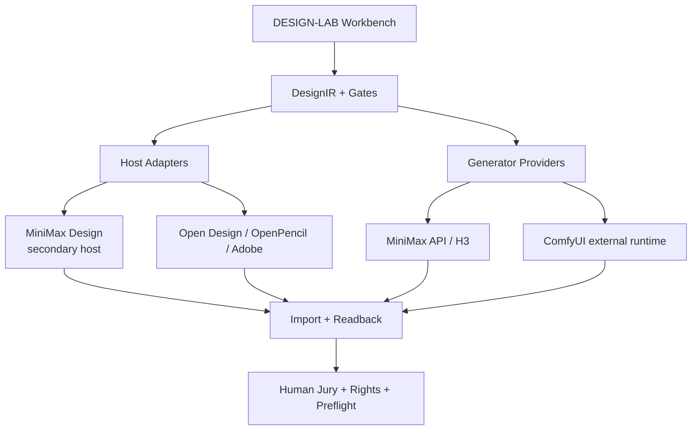

# DESIGN-LAB × MiniMax Design 深度集成审计与优化任务包

> 审计日期：2026-09-02  
> DESIGN-LAB 云端基线：`33488c882d267d683250ae684caf28d0916d9099`  
> MiniMax 官方插件快照基线：`bef9de2101e9d873619c83553b8f03ebb0c10663`（2026-08-20）  
> 范围：MiniMax Design 桌面产品、MiniMax API、MiniMax H3、官方 ComfyUI 插件快照、DESIGN-LAB 前后端与交付门禁  
> 原则：成熟方案优先；不重造设计画布、通用 Agent Runtime、模型网关或 ComfyUI 分叉。

## 1. 最终裁决

**MiniMax Design 可以加入 DESIGN-LAB，但不能整包并入仓库，也不应立即替换 Open Design。**

应按四条独立通道接入：

| 对象 | 真实身份 | DESIGN-LAB 裁决 | 当前成熟度上限 |
|---|---|---|---|
| MiniMax Design 桌面产品 | 专有的本地桌面创作控制台，编排文本、图像、视频、音频 Agent | `CONDITIONAL_SECONDARY_HOST`：作为“小白快速创作 / 广告与视频生产”第二宿主 | 未实机前 E1 |
| MiniMax API | 托管模型 API，支持图像、视频、语音等 | `EXTERNAL_GENERATOR_PROVIDER`：通过后端 Adapter 接入 | 合同完成前 E1 |
| MiniMax H3 开放权重 | Community License 下的开放权重视频模型 | `CONDITIONAL_EXTERNAL_RUNTIME`：本地或官方 API 二选一，不与产品身份混用 | 重新核权前 E1 |
| `minimax-desgin-plugin` | GPL-3.0 的 ComfyUI 前后端快照，包含 MiniMax Hub 桥接代码 | `REFERENCE_EXTRACT`：只吸收协议和测试方法，不整仓 vendoring | 静态审计 E2 |

推荐产品组合：

- Open Design：继续作为可编程、可审计、支持 MCP/CLI 的主宿主。
- MiniMax Design：作为对小白友好的“快速商业内容/视频创作入口”。
- OpenPencil / Adobe / Blender / Inkscape：承担可编辑源文件和专业精修。
- ComfyUI：作为外置生成工作流引擎，优先采用官方稳定版与标准 API。
- DESIGN-LAB：只保留 DesignIR、Human Jury、Rights、Preflight、Delivery Receipt 和宿主/模型适配合同。

## 2. 为什么可以加入

MiniMax Design 官方页面已经提供 DESIGN-LAB 目前最缺的成品体验：

- Windows 10+ x64 与 macOS 桌面端；
- 从 Brief、任务拆解、多 Agent 并行到合并、编辑、导出的连续流程；
- 文本、图像、视频、音频统一画布；
- 技能与插件复用；
- 本地资产中心和专业工具导出入口；
- 关键节点的人机确认；
- 面向短剧、电商、品牌 TVC、广告素材的现成工作流。

这非常适合作为 DESIGN-LAB 的“小白快速创作面”和“商业内容生成面”，能明显减少 DESIGN-LAB 自研完整桌面壳、Agent 编排、节点画布和素材中心的工作量。

## 3. 为什么不能成为唯一主宿主

截至本次审计，官方公开材料没有给出 MiniMax Design 产品级的稳定 SDK、CLI、MCP、DesignIR、可编辑源文件 schema 或外部审批 API。官网宣称可以导出到专业工具，但未公开可自动验证的 PSD/Figma/AI/AE 图层合同。

这会形成六个硬风险：

1. **自动化风险**：无法证明 DESIGN-LAB 能程序化创建任务、暂停、审批、读回和恢复。
2. **真值风险**：产品内部 Agent checkpoint 不能替代 DESIGN-LAB 的 Human Jury、Rights 与 Release Gate。
3. **可编辑性风险**：生成图像、视频或 RGBA 图层不等于 PSD、AI、SVG、Figma 或 Blender 的原生可编辑源文件。
4. **数据边界风险**：虽然官网称资产本地保存，但模型调用、账户、缓存和遥测的具体位置需要 Windows 实机取证。
5. **锁定风险**：技能市场、内部部署工具与 Agent 编排不是公开仓库的一部分。
6. **升级风险**：成品产品和 GPL 快照没有公开兼容性承诺，不能把 `latest` 当生产基线。

Open Design 当前公开了本地桌面端、CLI、MCP、插件/Skills、沙箱预览和多格式导出；OpenPencil公开了 `.fig/.pen`、MCP 和 100+ 设计工具。因此在“可编程、可读回、可替换”维度，两者仍更适合做 DESIGN-LAB 的正式主链。

## 4. 从用户和设计师角度的产品分工

| 角色 | 首选入口 | MiniMax Design 的价值 | 必须保留的边界 |
|---|---|---|---|
| 完全小白 | MiniMax Design Quick Create | 一句话 Brief、自动拆解、并行生成、统一画布、快速成片 | 明示 AI 生成、成本、上传范围和是否可编辑 |
| 市场/运营 | MiniMax Design Campaign | 电商图、广告、短视频、跨平台变体 | 品牌约束、Rights、Jury 和平台 Preflight 由 DESIGN-LAB 复核 |
| 专业设计师 | Open Design → OpenPencil/Adobe/Blender | 用 MiniMax Design 做方向探索、分镜、参考和初稿 | 精确排版、矢量、分层、色彩和交付仍进专业宿主 |
| 技术美术/工作流工程师 | ComfyUI / API Adapter | H3、多模型工作流、可复现生成 | 固定模型、seed、工作流、输入/输出 hash 与运行回执 |

前端不做“一个万能入口”。DESIGN-LAB Workbench 只需要提供三个明确按钮：

1. `Quick Create in MiniMax Design`
2. `Structured Design in Open Design / OpenPencil`
3. `Professional Finish in Adobe / Blender`

用户返回 DESIGN-LAB 后统一进入：导入 → 来源检查 → 人工评审 → 修改 → Preflight → Delivery。

## 5. 前后端目标架构



### 5.1 后端合同

MiniMax 相关能力必须实现相同的中立合同，不能在领域模型里出现 MiniMax 专有字段：

- `ProviderDescriptor`：provider、model、region、version、license、cost mode、data mode；
- `GenerationRequest`：Brief、引用资产、允许外发范围、输出规格、预算、deadline；
- `GenerationReceipt`：request hash、provider task id、模型版本、参数、seed、开始/结束时间、费用、输出 hash；
- `HostExportReceipt`：宿主版本、项目 ID、导出格式、原始文件、预览文件、可编辑性声明；
- `HumanGateDecision`：APPROVE / REJECT / REVISE，真实人员、理由、时间与复审链；
- `RightsDecision`：输入来源、参考许可、模型条款、商用/分发状态；
- `FallbackEvent`：超时、限流、费用上限、数据拒绝、格式降级、人工取消。

### 5.2 前端状态

Workbench 对 MiniMax Design 只能展示可证实状态：

- `NOT_INSTALLED`
- `INSTALLED_UNQUALIFIED`
- `READY_MANUAL`
- `RUNNING_EXTERNAL`
- `EXPORT_DETECTED`
- `READBACK_VERIFIED`
- `BLOCKED_RIGHTS`
- `BLOCKED_EDITABILITY`
- `FAILED`
- `UNKNOWN`

禁止把“已打开应用”“导出了 PNG”显示成“设计完成”或“可编辑交付完成”。

## 6. 官方开源快照的代码审计

官方仓库名称为 `MiniMax-AI/minimax-desgin-plugin`，`desgin` 是其真实仓库拼写。审计的 `main` 为：

- SHA：`bef9de2101e9d873619c83553b8f03ebb0c10663`
- 日期：2026-08-20
- 许可证：GPL-3.0
- 约 4,469 个文件、139 MB 的浅克隆工作树

### 6.1 后端

后端是 ComfyUI v0.30.0 的 vendor 快照。`UPSTREAM.md` 只记录一项 MiniMax 改动：为跨源插件前端增加 `Comfy-User` CORS 请求头。完整 ComfyUI 后端不应复制进 DESIGN-LAB。

应直接采用 ComfyUI 官方稳定版本，并通过：

- REST / WebSocket API；
- workflow JSON；
- App Mode；
- 自定义节点或官方 Partner Nodes；
- 独立进程和固定数据根；

完成集成。

### 6.2 前端

前端是裁剪后的 ComfyUI Frontend，含一个约 1,538 行的 `hub-bootstrap.js` 和 `src/hub/*` 桥接模块。值得吸收的是设计模式：

- iframe/gateway 与本地 backend origin 分离；
- detached runtime 安装与启动；
- workflow load command + ack；
- 草稿持久化与外部变更同步；
- run registration 与 output publishing；
- backend ready 状态回写；
- 关闭前未保存保护；
- 节点价格说明与运行诊断。

这些模式应重写为 DESIGN-LAB 中立合同；不要复制依赖 MiniMax Hub SDK 的实现。

### 6.3 GPL 边界

允许做：

- 外置运行 GPL 程序；
- 通过 HTTP/WebSocket/文件合同交互；
- 在 `vendor/locks` 保存 URL、SHA、许可证和差异记录；
- 在隔离 PoC 中保留原许可证测试源码。

不建议做：

- 把 139 MB 快照放进 DESIGN-LAB 主源码；
- 将其 Vue/ComfyUI UI 与 DESIGN-LAB 专有核心直接链接成一体；
- 建立第二个长期维护的 ComfyUI fork；
- 复制 MiniMax Hub 专有协议并声称官方兼容。

## 7. “自动分层”能力的真实判定

官方快照确实包含 `Image to Layers (Qwen-Image-Layered)` 蓝图。其真实行为是：

- 输入：一张图、可选文本、steps、cfg、layers、seed、模型文件；
- 模型：Qwen-Image-Layered；
- 输出：一批独立 RGBA 图层图像；
- 默认：640×640、2 层、20 steps、CFG 2.5；
- 官方模型文件 `qwen_image_layered_bf16.safetensors` 为 40.9 GB，Apache-2.0。

因此结论是：

| 问题 | 判定 |
|---|---|
| 能否自动拆图层 | 可以作为 PoC，模型会输出 RGBA layer batch |
| 是否等于 PSD 分层 | 否；仍需图层命名、顺序、混合模式、mask、文本重建和 PSD 打包 |
| 是否等于矢量化 | 否；RGBA layer 仍是光栅，需要 VTracer/结构重建/OpenPencil/Illustrator |
| 8GB 显存能否直接跑 BF16 | 不适合；仅主模型文件已 40.9 GB，必须验证量化、CPU offload、云端或更高显存机器 |
| 能否直接进入生产 | 不能；需黄金集测 IoU、边缘污染、透明度、遮挡恢复、文字完整性和人工可编辑性 |

最短路线不是复用 MiniMax 仓库中的副本，而是锁定 Comfy-Org 官方 Qwen-Image-Layered 模型和 ComfyUI 官方蓝图，在 DESIGN-LAB 的外置 ComfyUI Adapter 中资格化。

## 8. 当前 DESIGN-LAB 的阻塞问题

### 8.1 MiniMax 真值冲突

同一个 `adapter-minimax-h3` 当前出现三套互相冲突的状态：

- `capability-index.json`：E0、`supported=false`，但 `status=runtime-verified`；
- `adapter-registry.json` / manifest：E3、`supported=true`；
- `rights-and-provider-policy.md`：E0、运行时尚未就绪。

此外，当前权利文件仍把 H3 写成普通 proprietary。2026-08 官方已改为 MiniMax H3 Community License，包含地域、归属、收入阈值、可接受使用等专门条件，必须重新核权，不能直接改写成 MIT/Apache。

### 8.2 Open Design 真值冲突

当前仓库把 Open Design 分别写成 MIT、proprietary runtime 和 Apache-2.0，并同时存在“主宿主”和“可选外部宿主”两种叙述。新增 MiniMax Design 前必须建立单一 Host Registry。

### 8.3 沙箱不符合当前要求

MiniMax H3 权利文件仍允许写入 `.hermes/task-runtime/`，不符合“项目运行数据全部在项目根 `.project-local`，不得外溢”的新约束。

MiniMax Design 专有客户端是否允许指定 workspace、cache、download、output 和 model root 尚未实机验证。未通过 ProcMon/文件系统 diff 前，不得标为 `PROJECT_LOCAL_COMPLIANT`。

### 8.4 测试环境不完整

- `verify_adapter_matrix.py` 当前通过 9 项结构矩阵；
- 定向 governance/design-actions 单元测试运行 16 项，其中 9 error、1 failure，直接原因是测试环境未安装 `jsonschema`；
- 这说明当前“测试命令可执行性”未被根级环境锁完整保证，不能把 CI 文件存在等同于本机可复现。

## 9. 目标目录

目录迁移完成后，MiniMax 相关内容应放在：

```text
DESIGN-LAB/
├─ apps/
│  └─ workbench/                         # 只呈现宿主选择、状态和门禁
├─ services/
│  ├─ jobs/
│  ├─ review/
│  ├─ quality/
│  └─ delivery/
├─ packages/
│  ├─ design-ir/
│  ├─ host-contracts/
│  ├─ provider-contracts/
│  └─ rights-policy/
├─ integrations/
│  ├─ hosts/
│  │  └─ minimax-design/                 # 薄宿主 Adapter，不含成品软件
│  ├─ generators/
│  │  ├─ minimax-api/                    # 图像/视频 API Adapter
│  │  └─ comfyui/                        # 外置 ComfyUI Adapter
│  └─ workflows/
│     └─ qwen-image-layered/             # 锁定蓝图、schema、测试，不含权重
├─ vendor/
│  └─ locks/
│     └─ minimax-desgin-plugin.lock.json # URL/SHA/GPL/审计结论
├─ fixtures/
│  └─ minimax-design-golden/             # 仅权利清晰测试资产
└─ .project-local/
   ├─ exchange/minimax-design/in/
   ├─ exchange/minimax-design/out/
   ├─ jobs/
   ├─ evidence/
   ├─ cache/
   └─ logs/
```

不要把 MiniMax 软件、模型权重、客户资产、账号数据、缓存或生成物提交到 Git。

## 10. 隔离、安全与权利规则

1. 私有客户资产默认不上传；每次云端调用必须显示文件清单、目的、区域、费用和确认按钮。
2. MiniMax Design Skills/Plaza 内容按第三方指令处理：进入 quarantine、做来源和权限扫描，不自动继承项目权限。
3. MiniMax API key 只进入 Windows Credential Manager 或进程级 secret broker，不写 `.env`、日志或回执正文。
4. 所有输入先复制到 `.project-local/exchange/.../in`；输出只从 `.project-local/exchange/.../out` 导入。
5. 用 Windows ProcMon/文件系统快照验证是否向 AppData、Documents、Temp、其他盘符复制项目内容。
6. 若成品软件不能限制项目资产路径，则只能作为 `EXTERNAL_UNCONTAINED_HOST`，不得处理客户机密资产。
7. 模型产物必须记录产品/模型版本、提示、引用资产 hash、费用和 Rights Decision。
8. MiniMax 内部“审核节点”只算生成流程 checkpoint，不能替代 DESIGN-LAB 的真人批准。

## 11. 分阶段迁移与集成任务包

### Phase 0：权威链修复（0～1 天）

#### DL-MM-001 — 拆分四种 MiniMax 身份

- 新建 `minimax-design-host`、`minimax-api-provider`、`minimax-h3-runtime`、`minimax-comfy-snapshot` 四条记录；
- 停止复用 `adapter-minimax-h3` 表示所有 MiniMax 能力；
- 每条记录只允许一个 SSOT，其他索引从 SSOT 生成；
- 修复 Open Design 许可证和“主/可选宿主”冲突。

验收：所有 registry、manifest、capability projection 对 status/license/support/evidence 完全一致。

#### DL-MM-002 — H3 权利重新资格化

- 锁定官方 H3 模型 revision 和 Community License；
- 记录适用地域、商业收入阈值、UI 归属、AUP、托管防护和模型改进限制；
- 旧的“proprietary / 用户拥有全部视频”笼统声明降级为 `SUPERSEDED`。

验收：Rights Gate 能对 `local weights` 与 `official API` 给出不同裁决。

### Phase 1：Windows 产品资格化（1～3 天）

#### DL-MM-010 — 安装、签名和卸载证据

- 从官方站下载 Windows x64 版本；
- 记录版本、下载 URL、SHA-256、Authenticode publisher、安装路径；
- 用专用测试账号和权利清晰素材；
- 记录首次启动、登录、更新、崩溃恢复和完整卸载残留。

停止条件：签名异常、强制访问无关盘符、无法删除本地资产或无法锁定版本。

#### DL-MM-011 — 数据与网络边界

- ProcMon 记录文件、注册表和进程树；
- 网络日志记录域名、上传对象和时机，不抓取凭证正文；
- 验证 workspace/output 能否固定在 `.project-local`；
- 验证关闭后是否仍有后台服务；
- 验证删除项目/账户后的本地残留。

验收：形成 `data-location.json`、`network-destinations.json`、`uninstall-report.md`。

### Phase 2：真实黄金流程（第 3～7 天）

#### DL-MM-020 — 小白电商 Campaign 黄金案例

流程：真实 Brief → 产品图 → 电商主图/海报 → 15 秒视频 → 导出 → DESIGN-LAB 导入 → 人工 REJECT → 修改 → Preflight → Delivery。

度量：

- 首次可用结果时间；
- 总人工操作数；
- 费用；
- 文案准确率；
- 产品/人物一致性；
- 品牌色/字体偏差；
- 输出格式与可编辑性；
- 失败恢复与重复执行一致性。

#### DL-MM-021 — 专业设计师可编辑性案例

- 对同一 Brief 分别用 MiniMax Design 与 Open Design/OpenPencil；
- 检查 PSD/AI/SVG/Figma/视频时间线是否真实可编辑；
- close → reopen → readback；
- 统计图层、文本、mask、blend mode、组件、字体和链接资产保真率。

裁决门：MiniMax Design 若只能输出平面图/视频，则只保留 `IDEATION_GENERATION_HOST`，不得宣传为专业编辑宿主。

#### DL-MM-022 — Human Jury 回路

- 至少一次真实 `REJECT → 修改 → 复审`；
- MiniMax Agent 的自动质量检查只作建议；
- 真人决定 Direction、Quality、Rights、Production 和 Release。

### Phase 3：最薄适配器（第 2 周）

#### DL-MM-030 — MiniMax Design Host Adapter

若产品无公开 SDK，Adapter 只实现：

- 检测安装和版本；
- 打开应用/项目工作区；
- 建立专用 in/out exchange；
- 监测新导出文件；
- hash、格式检测、恶意文件检查和导入；
- 生成 `HostExportReceipt`；
- 不做 UI 自动点击，不读取产品私有 DB。

#### DL-MM-031 — MiniMax API Provider

- 后端调用官方 API；
- 支持预算、超时、取消、重试、幂等 task id、轮询和下载 hash；
- 图像 `image-01` 只登记其公开支持的文生图/参考图能力；
- H3 按官方接口登记 768P/2K、4～15 秒及多模态输入；
- 默认 fail-closed，不允许无上限费用策略。

#### DL-MM-032 — ComfyUI 标准 Adapter

- 采用官方稳定版，不采用 MiniMax 的完整 fork；
- 使用官方 HTTP/WebSocket、workflow API format 和 App Mode；
- MiniMax H3 优先评估官方 API node，避免 8GB 机器本地加载超大权重；
- 保存 workflow hash、node/version lock、queue/history 与输出 hash。

### Phase 4：自动分层 PoC（第 2～3 周）

#### DL-MM-040 — Qwen-Image-Layered 资格化

- 从 Comfy-Org 官方模型和官方蓝图开始，不从 MiniMax 快照复制整个运行时；
- 先评估云端或独立大显存环境；8GB 本机只在可验证的量化/offload 配置下试验；
- 输出 RGBA layer batch 后，进入 LayerIR；
- 用 PSD writer、OpenPencil/Illustrator/Inkscape 路线生成可编辑交付；
- 与现有 LayerD/SAM/BiRefNet/VTracer 路线做盲测。

黄金指标：

- 前景/背景 IoU；
- alpha 边缘污染；
- 遮挡区域补全合理性；
- 文本字符完整率；
- 重组与原图 SSIM/LPIPS；
- 图层语义命名准确率；
- 人工修图时间减少比例；
- PSD/开放编辑器 close/reopen 保真率。

### Phase 5：产品裁决（第 3～4 周）

#### DL-MM-050 — Adopt / Hold / Reject

采用为第二宿主必须同时满足：

- Windows 稳定启动、恢复和卸载；
- 项目资产可限制在允许数据根，或明确降级为非机密外部宿主；
- 两条黄金流程真实通过；
- 导出能被 DESIGN-LAB 读回并形成 Receipt；
- 至少一次真人拒绝与修正闭环；
- 权利、费用、数据和版本可追溯；
- Open Design/Adobe 路线仍可无损替代。

否则保留为手工研究工具或生成 Provider，不进入发布主链。

## 12. 本轮不应做的事

- 不把 MiniMax Design 改名后当成 DESIGN-LAB 成品。
- 不整仓复制 `minimax-desgin-plugin`。
- 不维护第二份 ComfyUI 后端和前端。
- 不用 MiniMax Design 替换 OpenPencil/Adobe 的精确编辑能力。
- 不把 RGBA 图层称为 PSD/矢量源文件。
- 不把产品内部 checkpoint 当真人审批。
- 不对 MiniMax Skills/Plaza 做自动安装或授予客户资产权限。
- 不继续使用“无 rate limit / 无 cost cap”策略。
- 不把运行数据写到 `.hermes` 或项目外目录。

## 13. 结论

MiniMax Design 对 DESIGN-LAB 有明显价值，尤其适合快速建立可用的小白创作入口、广告/电商/短视频流水线和多模态 Agent 体验。它不是一个可以直接 vendoring 的完整开源产品，也没有证据证明能替代可编程宿主和专业可编辑工具。

最稳妥且最快的路线是：

1. 将 MiniMax Design 定为第二外部宿主；
2. 将 MiniMax API/H3 定为可替换生成 Provider；
3. 将官方 GPL 快照只作为协议和 UX 研究源；
4. 将 Qwen-Image-Layered 单独资格化为自动分层候选；
5. 所有结果回到 DESIGN-LAB 的 DesignIR、Human Jury、Rights、Preflight 和 Delivery Receipt；
6. Open Design/OpenPencil/Adobe 保持主链和退出通道。

这样可以获得 MiniMax Design 的成熟产品速度，同时不丢掉 DESIGN-LAB 的核心壁垒、数据所有权和未来可替换性。

## 14. 官方来源

- [MiniMax Design 官方产品页](https://design.minimax.io/)
- [MiniMax Design 工具目录](https://design.minimax.io/tools)
- [MiniMax Design AI Design 页面](https://design.minimax.io/tools/ai-design)
- [MiniMax 官方 ComfyUI 插件快照](https://github.com/MiniMax-AI/minimax-desgin-plugin)
- [MiniMax API 模型目录](https://platform.minimax.io/docs/guides/models-intro)
- [MiniMax 图像生成文档](https://platform.minimax.io/docs/guides/image-generation)
- [MiniMax H3 视频 API 文档](https://platform.minimax.io/docs/guides/video-generation)
- [MiniMax H3 官方仓库与 Community License](https://github.com/MiniMax-AI/MiniMax-H3)
- [MiniMax 官方 Skills 仓库](https://github.com/MiniMax-AI/skills)
- [ComfyUI Server API](https://docs.comfy.org/development/comfyui-server/comms_overview)
- [ComfyUI App Mode](https://docs.comfy.org/interface/app-mode)
- [ComfyUI MiniMax H3 API Nodes](https://docs.comfy.org/tutorials/partner-nodes/minimax/minimax-h3)
- [Qwen-Image-Layered ComfyUI 模型](https://huggingface.co/Comfy-Org/Qwen-Image-Layered_ComfyUI)
- [Open Design 官方仓库](https://github.com/nexu-io/open-design)
- [OpenPencil 官方仓库](https://github.com/open-pencil/open-pencil)
