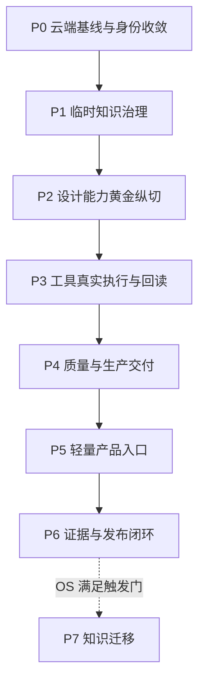

# DESIGN-LAB 全量收敛与后续执行任务包

- 任务包日期：2026-08-20
- 项目：`DTALEX66/DESIGN-LAB`
- 本地目标：`D:\All projects\DESIGN-LAB`
- 审计时云端基线：`main@a6fdc5e0ad6821f41d09a1022988d2f9212c64e6`
- 适用执行器：DeepSeek Harness / Hermes / Codex / Claude Code / OpenCode
- 文档角色：后续工作的唯一收敛任务基线；不得把历史 V4/V4.2/ODA/旧 Handoff 直接作为当前任务源
- 默认权限：允许只读审计与本地受控修改；`commit`、`push`、PR、merge、分支删除、历史重写、真实用户文件写入均需分别获得用户授权

---

## 0. 执行器总指令

你正在处理的唯一项目是 `DESIGN-LAB / 设计实验室 / design-lab`。开始任何修改前必须：

1. 从 `D:\All projects\DESIGN-LAB` 读取真实 Git 状态；
2. `git fetch --prune` 后解析 `origin/main` 的最新 SHA；
3. 如果云端已超出本任务包审计基线 `a6fdc5e`，先生成增量差异报告，再更新任务图；不得强行按旧 SHA 修改；
4. 检查工作树是否干净；发现用户变更时停止覆盖，按路径报告冲突；
5. 读取活动 SSOT、Schema、Registry、Verifier 和真实实现，不得仅根据 README、历史总结或文件名判断完成状态；
6. 规划、目录、注册记录、安装成功、工具枚举、历史成功记录均不能替代当前树的真实运行证据；
7. 任何完成声明必须包含 `taskId / status / changed paths / validation / evidence / exact SHA / remaining blockers`；
8. 不访问凭据正文，不扩大可写根，不扫描盘符根，不触碰 `E:` 保护盘；
9. `D:\All projects\Design assets` 默认只读，只允许在用户明确选择的子目录执行有界摄取；
10. 不自动运行会改变真实 Adobe、Figma、Eagle、Open Design 或其他用户文件的测试。

状态统一使用：

```text
PASS / PARTIAL / FAIL / BLOCKED / DEFERRED / NOT_EXECUTED
```

证据统一使用：

```text
E0 声明
E1 结构/握手/枚举
E2 隔离任务成功并有产物
E3 真实可编辑生产任务、读回与可重复证据
E4 exact-SHA 独立复审及发布证明
E5 长期/多环境/真人使用验证
```

---

# 1. 唯一项目定位

## 1.1 正式定义

> **DESIGN-LAB（设计实验室）是面向职业视觉设计的、AI 原生、平台中立的设计智能与生产能力层。它把设计理解、专业方法、领域能力、视觉质量、工具执行计划、生产预检、可编辑交付和能力证据组织为可组合、可执行、可验证、可回滚的设计闭环。**

它服务于职业设计师、创意总监、品牌/电商/空间等从业者、新手和 Agent 开发者，但所有用户模式共享同一套能力内核，不建立五套产品。

## 1.2 六大长期能力域

1. Design Intelligence：Brief、商业目标、Reference DNA、方向生成、Design IR、Critique、Refinement。
2. Professional Domains：Graphic、Brand、UI/UX、E-commerce、Editorial、Packaging、Spatial、Exhibition、3D、Motion、Video、Audio、Game。
3. Visual Quality：层级、版式、排版、色彩、材质、光影、动效、空间、可读性、原创性、反 AI 廉价感。
4. Creative Toolchain：Adobe、Figma、Penpot、Blender、ComfyUI、FFmpeg、Eagle 等可替换 Adapter。
5. Production & Handoff：Preflight、源文件、字体、色彩、分辨率、出血、BOM、许可证、版本、回滚和交付。
6. Research & Evidence：设计研究、方法卡、Benchmark、人工 Jury、E0-E5 证据和经验回流。

## 1.3 永久非目标

DESIGN-LAB 不得成为：

- 第二套 Photoshop、Figma、Open Design 或画布编辑器；
- 通用聊天客户端、Agent Runtime、多 Agent 框架；
- 模型网关、GPU 调度器、凭据库、通用 MCP Gateway；
- 通用知识图谱、向量数据库或 ArcheAxis 的替代品；
- 单纯 Prompt 仓、脚本仓、素材下载站、静态知识堆；
- 大师姓名模仿器、无版权来源训练仓；
- MiniGame 商业产品、广告平台或游戏运营系统。

---

# 2. 三项目边界与当前知识过渡期

| 层 | 项目/运行对象 | 唯一职责 |
|---|---|---|
| 知识与学习权威 | ArcheAxis-Knowledge-OS | 人机双向重型学习、Evidence、Candidate→Review→Verified、长期知识权威 |
| 控制与治理 | WORK-LAB | 全局配置、Work Unit、权限、策略、路由、监督、恢复、验收、只读观测；不拥有运行时 |
| 专业设计能力 | DESIGN-LAB | 设计理解、专业判断、Design IR、质量、生产预检、可编辑交付、工具计划 |
| 执行入口/宿主 | Open Design、Hermes、Codex、OpenHuman、DSH 等 | 用户自由选择，通过标准接口接入，不参与 DESIGN-LAB 产品身份 |
| 外部工具运行时 | Adobe、Figma、Blender、ComfyUI、FFmpeg、Eagle 等 | 真正执行文件和媒体操作，由 Adapter 调用并回读 |

## 2.1 当前阶段：知识暂留 DESIGN-LAB

ArcheAxis-Knowledge-OS 尚未完成稳定知识接收闭环，因此：

- 不立即迁移、删除或清空 DESIGN-LAB 的设计知识；
- DESIGN-LAB 临时承担设计知识的登记、提取、规范化、候选审核、编译和调用；
- 临时承载不得升级为“永久第二知识权威”；
- 原始大文件继续留在 `D:\All projects\Design assets`；
- OS 就绪前只生成迁移清单和兼容契约，不执行真实迁移；
- OS 就绪后，原始/审核知识进入 OS，DESIGN-LAB 长期保留 Domain Pack、评分器、Design IR、生产规则、运行投影和 Tool Contract。

## 2.2 OS 迁移触发门

只有以下条件全部满足才能启动真实迁移：

1. Candidate→Review→Verified 全链路可用；
2. Knowledge API 和对象 Schema 版本稳定；
3. 来源、许可、版本、SHA、父子关系可无损接收；
4. 支持批量导入、readback、失败回滚和重复导入幂等；
5. DESIGN-LAB 可通过稳定 Query API 获取可信知识；
6. 迁移后 Domain Pack、质量规则和生产规则仍能解析；
7. 用户明确批准迁移范围。

---

# 3. 云端审计收敛结论

## 3.1 当前事实

- 云端 `main` 审计基线为 `a6fdc5e`，最新提交是 Eagle 安装/运行登记；Web API 尚未启用。
- `main` 当前未启用分支保护，required checks 关闭，HEAD 未签名。
- 云端存在 23 个分支，没有开放 Issue 或 PR。
- 仓库约 201.8 MiB，接近项目自定 256 MiB 预算；MiniGame GIF 是主要体积来源之一。
- 仓库已拥有 21 类对象、12 个领域包、28 个左右 Adapter、110+ 工具脚本、Source Registry、SBOM、License Gate、Canonical Verify 和 Release Gate。
- Photoshop MCP 与 Illustrator MCP 目前只达到 E1；ComfyUI/MiniMax H3 有历史 E3；Open Design 有 E2 作品；Eagle 仅安装发现，不能称为已集成。
- `reports/current/PROJECT_STATUS.json`、Adapter reconciliation 和多份 Handoff 均落后于当前 HEAD。
- `PROJECT_DEFINITION.md` 仍把项目定义为 Open Design 附属增强仓，与 `PRODUCT_DEFINITION.md` 和最新决策直接冲突。
- `ROADMAP.md`、产品定义、边界合同、Product Manifest 和 CI 仍有“当前参考宿主 Open Design”残留。
- `design-lab/knowledge/tool-control/scripts` 把运行脚本放进知识层，产生边界漂移。

## 3.2 历史内容处置矩阵

| 历史内容 | 处置 | 当前解释 |
|---|---|---|
| DESIGN-LAB 身份、六能力域、中立政策 | 继承 | 长期定位 |
| Brief→方向→执行→质量→预检→交付→证据 | 继承并深化 | 产品黄金闭环 |
| 21 对象、Schema、Registry、Verifier | 继承并核验 | 不重复重建 |
| Domain Pack、Jury、Preflight、Handoff | 继承并补真实证据 | 结构存在不等于生产成熟 |
| Open Design Personal Skill/Plugin/Expert Suite | 改写 | 仅作为 `adapters/hosts/open-design` 的可选导出包 |
| “Open Design 是主入口/参考宿主/主角” | 永久退出 | 所有宿主平等，用户自由选择 |
| `PROJECT_DEFINITION.md` 旧附属仓定位 | 归档 | 只保留历史追踪，不得继续 ACTIVE |
| V4/V42/ODA4 任务 ID 和 FINAL Handoff | 归档 | 不再充当活动状态源 |
| 立即迁移知识至 ArcheAxis | 延后 | OS 就绪前暂留 DESIGN-LAB |
| MiniGame 产品规划 | 永久退出 | 只保留游戏视觉 Fixture |
| H3/ComfyUI 继续扩张 | 暂停 | 保持已验证能力，非当前优先级 |
| OpenPencil | 延后、待批准 | 先核验许可证与接口稳定性 |
| Flue | 保持隔离 | 不并入 |
| Agent Runtime、Tauri 重桌面、Neo4j/Qdrant 内置 | 排除 | 越界且重复建设 |
| 110+ PS/AI/工具脚本 | 保留但重分类 | 属于 Tool Asset，不属于知识真源 |
| 35 个 vendored 设计技能和 162 来源登记 | 保留并治理 | 需要逐项映射、提炼和权利复核 |

---

# 4. 目标目录结构

不得大拆仓重写；在现有结构上渐进收敛：

```text
DESIGN-LAB/
├─ design-lab/
│  ├─ core/
│  ├─ intelligence/
│  ├─ domain-packs/
│  ├─ quality/
│  ├─ production/
│  ├─ evals/
│  ├─ schemas/
│  ├─ adapters/
│  │  ├─ hosts/
│  │  │  └─ open-design/
│  │  ├─ agents/
│  │  └─ creative-tools/
│  │     ├─ adobe/
│  │     ├─ figma/
│  │     ├─ penpot/
│  │     ├─ blender/
│  │     ├─ comfyui/
│  │     ├─ ffmpeg/
│  │     └─ eagle/
│  ├─ tool-assets/
│  │  ├─ photoshop/
│  │  ├─ illustrator/
│  │  ├─ inkscape/
│  │  ├─ comfyui/
│  │  └─ style-dictionary/
│  ├─ knowledge/
│  │  ├─ staging/
│  │  │  ├─ source-records/
│  │  │  ├─ extracted/
│  │  │  ├─ normalized/
│  │  │  ├─ candidates/
│  │  │  ├─ reviewed/
│  │  │  ├─ mappings/
│  │  │  └─ migration-manifests/
│  │  ├─ quarantine/
│  │  ├─ projections/
│  │  └─ registries/
│  ├─ research/
│  └─ ui/                     # 轻量评审/检查入口，禁止画布编辑器化
├─ design-system/
├─ minigame-runtime/          # 游戏视觉 Fixture
├─ project-memory/
│  ├─ active SSOT
│  └─ history/
├─ reports/
│  ├─ current/                # 仅保留自动生成的当前事实
│  └─ history/
└─ scripts/
```

外置根不进入 Git：

```text
D:\All projects\Design assets
```

Git 内不得保存该绝对路径。使用本地忽略配置登记：

```text
assetRootId = design-assets-local
relative locator / content hash / rights metadata
```

---

# 5. 总体任务图



硬门禁：P0 未通过不得推进 P1；P2 未形成可执行 Design IR 前不得扩展新 Adapter；P3 没有一个 E3 工具纵切前不得宣称工具链完成；P4 人工 Jury 未完成不得发布 E4。

---

# 6. P0 — 基线、身份、SSOT 与治理收敛

## DL-GOV-100 当前云端基线重建

交付：

- `reports/current/CLOUD_BASELINE.json`
- `reports/current/CLOUD_BASELINE.md`
- 记录 branch、HEAD、origin/main、tracked count、repo size、workflow、branch protection、open PR/Issue、generatedAt。

要求：云端状态与本地状态分开；禁止把 dirty worktree 写成云端事实。

验收：所有报告绑定同一 exact SHA；旧 SHA 报告自动标记 `STALE`。

## DL-GOV-110 活动身份彻底中立化

1. 以 `PRODUCT_DEFINITION.md` 为唯一产品定义。
2. 将冲突的 `PROJECT_DEFINITION.md` 移入 history，活动位置只保留指向新 SSOT 的短说明或删除活动副本。
3. 把 `OPEN_DESIGN_ENHANCEMENT_RESEARCH.md` 移入历史或 Open Design Adapter 研究目录。
4. 从 README、Boundary、Architecture、Manifest、Roadmap、CI job 名称中移除“current reference host”“主角”“默认入口”等特殊语义。
5. Open Design 只允许出现在 `adapters/hosts/open-design`、兼容说明、来源和历史记录。

验收：活动文件扫描中，旧项目名只出现在明确的 history/source/adapter allowlist。

## DL-GOV-120 Current 报告单一事实源

- `reports/current/` 只保留自动生成或明确当前的少量报告；
- 三份 Handoff、过期 FINAL、旧时间点报告全部移入 `reports/history/YYYY-MM-DD/`；
- 建立 `CURRENT_REPORT_INDEX.json`，每份报告包含 subject SHA、generator、fresh/stale、evidence level；
- `PROJECT_STATUS`、Adapter reconciliation、Knowledge inventory、Release readiness 从注册表生成，不手写互相覆盖。

## DL-GOV-130 反漂移门禁

新增 `verify_project_drift.py`，至少检测：

- 唯一项目身份；
- 不存在默认宿主；
- 不存在第二 Agent Runtime/模型网关/数据库/编辑器；
- MiniGame 只为 Fixture；
- 大文件与外置资料边界；
- `knowledge/` 中禁止新增可执行工具脚本；
- E0/E1 不得使用 `stable/operable/production-ready`；
- current 报告 exact SHA 新鲜度；
- 未满足黄金纵切前新增 Adapter 必须失败关闭或获批准。

## DL-GOV-140 CI 和发布治理

- 将 `canonical-verify-v4.yml` 渐进迁移为无历史版本名的 `canonical-verify.yml`；
- 将 Open Design 专项 job 收敛为 Host Adapter Matrix 条件项；
- release gate 绑定当前树生成运行时 attestation；
- 管理员人工启用 `main` 分支保护、required checks、禁止直接强推；
- 签名提交或签名 release tag 作为发布要求，不强迫所有开发提交立即签名。

## DL-GOV-150 仓库体积治理

- 生成当前 blob 排名、历史包体积和新增增长预算；
- 保持总 Git 元数据预算 `≤256 MiB`，达到 `224 MiB` 进入预警；
- 评估 MiniGame 生成 GIF 是否可转 Release Artifact 或确定性重建；
- 未获批准不得重写历史；
- 任何新二进制 >1 MiB 必须有 LFS/Release Artifact/明确豁免决策。

## DL-GOV-160 历史与任务账本整理

- V4/V42/ODA4 和旧 Open Design 文档保留历史，不删除证据；
- 创建 `design-lab/config/task-ledger.yaml`；
- 历史任务映射为 `completed / superseded / deferred / rejected / active`；
- 23 个分支先生成 merged/unmerged/ahead/behind 清单，删除必须另行批准。

P0 Exit Gate：身份扫描 PASS、Current 报告同 SHA、drift gate PASS、Canonical 全绿、无用户变更被覆盖。

---

# 7. P1 — DESIGN-LAB 临时知识治理

## DL-KNW-100 建立知识暂存子目录

创建第 4 节定义的 `knowledge/staging`、`quarantine`、`projections`、`registries`，并写入：

- `KNOWLEDGE_LIFECYCLE.md`
- `TEMPORARY_AUTHORITY_POLICY.md`
- `knowledge-record.schema.json`
- `knowledge-migration-manifest.schema.json`

每条知识至少包含：`knowledgeId / title / domain / sourceRecordId / authorityStatus / reviewStatus / rightsStatus / contentHash / compiledTargets / targetAuthority / migrationStatus / version`。

固定值：

```text
authorityStatus = temporary-design-lab
targetAuthority = ArcheAxis-Knowledge-OS
migrationStatus = deferred
```

## DL-KNW-110 知识生命周期状态机

```text
registered → extracted → normalized → candidate → reviewed → compiled
                                      ↘ rejected / quarantined
```

运行时只能使用 `reviewed`、`projections` 和已编译能力；`extracted/candidate/quarantine` 禁止直接进入生产任务。

## DL-KNW-120 全量知识库存与重分类

对现有 curated、derived、ecommerce-ai、governance、methods、production、registries、sources、standards、typography、visual-quality 做逐文件分类：

- 原始/事实/方法知识：临时知识；
- 可执行规则：编译产物；
- 第三方源码：vendored source；
- 工具脚本：Tool Asset；
- 索引：只读 projection；
- 权利不明：quarantine。

修复 `DESIGN_KNOWLEDGE_ROLE_MAP.md` 中“编译规则也逆向归档”的矛盾：未来归档的是规则背后的知识、证据和经验，DESIGN-LAB 保留编译能力本体。

## DL-KNW-130 外置 Design assets 有界摄取

建立 dry-run-first 管线：

```text
用户选择子目录
→ 本地只读扫描
→ 文件类型/大小/hash
→ RightsRecord
→ SourceRecord
→ ExtractionJob
→ CandidateKnowledge
→ 人工确认
→ 编译映射
```

规则：

- 不默认扫描整个 `Design assets`；
- 不复制 PSD/AI/INDD/视频/字体/客户源文件进 Git；
- 不提交绝对路径、账号、客户名称和隐私；
- 权利不明默认 `reference-only + quarantined`；
- 大文件抽取结果进入本地忽略缓存，Git 只收结构化、可审计的小型产物。

## DL-KNW-140 Open Design 知识双向转换

把旧 Open Design 项目中的设计知识按内容而不是旧产品身份提炼：

- prompts → PromptPattern / MethodCard；
- templates → Domain Template / Brief Template / Scorecard；
- design systems → Token / Component Rule / DesignSystemProfile；
- skills/plugins → Capability Definition / Host Export Package；
- examples → BenchmarkCase / Fixture；
-运行样板 → ToolActionPlan / EvidenceRecord。

反向输出：把 DESIGN-LAB 的 Reviewed Knowledge、Domain Pack 和方法模板编译为 Open Design 可调用的 Personal Skill、Plugin、Template、Expert Suite，但输出包必须位于可选 Host Adapter 下，不能重新定义项目身份。

## DL-KNW-150 开源资料吸收治理

- 对 35 个 vendored 技能建立能力映射、上游版本、许可证、修改记录和编译目标；
- 对 162 条来源分批处理，不得一次性人工填假字段；
- 无 LICENSE 或权利不明继续 reference-only；
- 大师研究只允许方法、构成、语境、历史和可验证设计特征，不构建“仿某在世设计师”直接模仿器；
- 497 master records / 77 method cards 的结构 E1 与来源审核分开计分。

## DL-KNW-160 知识编译与可调用投影

每条 reviewed knowledge 至少可编译为一种目标：

```text
DomainPack / MethodCard / Rubric / PreflightRule /
DesignToken / PromptPattern / ToolConstraint / BenchmarkCase
```

建立 lineage：`source → extraction → reviewed knowledge → compiled target → usage evidence`。

## DL-KNW-170 隔离来源清理

- 按权利风险、使用价值、重复度排序 162 条来源；
- 可自动补 hash、文件类型、来源 URL、版本；
- 作者、授权范围、商用权、训练权必须人工或权威来源确认；
- 不可确认项保留 quarantine，不得为了清零数字而升级。

## DL-KNW-180 OS 迁移准备但不执行

- 生成 migration manifest、对象映射、批次、预估大小、冲突策略和 rollback；
- 建立 mock readback 测试；
- 任务状态固定 `DEFERRED`；
- 未满足第 2.2 节触发门不得写 ArcheAxis 仓库或 API。

## DL-KNW-190 工具脚本退出知识层

- 先生成依赖图和 hash readback；
- 将 `knowledge/tool-control/scripts` 迁往 `tool-assets` 或对应 creative-tool adapter；
- 保留兼容映射，更新 Registry、SBOM、LICENSE 和引用；
- 全量验证通过后删除旧活动路径，不丢 Git 历史。

P1 Exit Gate：知识库存 100% 分类；运行时不读取 candidate/quarantine；大文件未进入 Git；OS 迁移保持 DEFERRED；工具脚本不再新增到知识层。

---

# 8. P2 — 设计智能内核与黄金纵切

## DL-CORE-100 现有内核事实核验

核验而不是重建：13 阶段 DesignProject 状态机、21 对象、Command/ExecutionResult、Memory、Quality、Delivery、Federation E2E。为每项给出实际代码路径、正负 fixture、运行测试和当前证据级别。

## DL-INT-100 Brief 与 Design Context

统一输入：目标、受众、预算、渠道、尺寸、材料、品牌限制、must-keep、must-avoid、权利状态、交付格式、人工决策点。缺失关键商业约束时失败关闭或向用户请求，不得猜测。

## DL-INT-110 Reference DNA

建立可解释参考拆解：布局、层级、字体、颜色、材质、光影、镜头、动效、语义、商业意图、可继承特征、禁止复制特征和权利边界。

## DL-INT-120 Design IR V1 完整性

审计现有 DesignIRV1 是否覆盖：

- canvas/artboard/timebase/scene；
- text/image/vector/3D/audio/video/group/component nodes；
- styles/tokens/constraints/transform/layer order；
- editable semantics、asset refs、rights refs；
- tool-neutral operation intent；
- version、diff、rollback、round-trip。

缺口按小版本扩展；不得绑定 Photoshop、Figma 或 Open Design 私有字段。

## DL-INT-130 ToolActionPlan

标准执行链固定为：

```text
Brief → Context → Reference DNA → Directions → 人工锁定
→ Design IR → ToolActionPlan → Permission → Dry-run
→ Execute → Readback → Quality Review → Preflight
→ Editable Handoff → Evidence
```

每个动作必须声明 capability、目标、参数 schema、前置条件、风险、备份、回滚和预期 readback。

## DL-DOM-100 领域包质量盘点

对现有 12 个领域包按十要素审计：scope、brief、method、objects、workflow、rubric、preflight、handoff、evidence、examples。目录存在但内容空薄时不得记为完成。

## DL-DOM-110 三个黄金领域

优先把以下领域做深，不继续横向铺数量：

1. UI/UX：信息架构、交互、组件、状态、响应式、无障碍、设计 Token、可开发交付；
2. E-commerce：商业目标、产品主视觉、信息层级、平台规格、转化场景、批量变体；
3. Brand：策略、视觉语言、Logo 使用规范、字体/色彩/影像/版式系统、跨触点一致性。

每域至少有 1 个可运行黄金案例、1 个失败案例、1 套人工评分表和 1 个可编辑交付包。

## DL-DOM-120 其余领域冻结规则

Graphic、Editorial、Packaging、Spatial、Exhibition、3D、Motion、Video、Audio、Game 保留现有能力，不在前三个黄金领域通过前继续扩充数量。MiniGame 仅用于 Game Visual Fixture 验证。

P2 Exit Gate：一个 Brief 可稳定生成明确 Design IR 和 ToolActionPlan；三黄金领域契约完整；没有工具私有字段污染核心对象。

---

# 9. P3 — Creative Tool Adapter 真实执行闭环

## DL-ADP-100 Adapter Registry 统一

- 统一 capabilities 为 `{name, supported, evidence}` 对象，修复 Eagle 嵌套数组异常；
- 建立 canonical adapter、transport/mode、alias、supersedes 关系；
- 合并旧 Photoshop Adapter 与 Photoshop MCP 的语义重复；
- 同步 Open Design E2、ComfyUI/H3 E3、FFmpeg 实测、PS/AI/Eagle 当前真实状态；
- `exactSha` 不得为空；
- installed / connected / enumerated / executed / readback / production-ready 分开。

## DL-ADP-110 Adapter Contract 标准

所有工具统一实现：

```text
capability negotiation
plan validation
permission request
dry-run
execute
state readback
artifact readback
rollback
evidence envelope
```

Computer Use 只作最后兜底，必须有坐标/视觉前置检查、超时、截图证据、人工确认和可恢复性。

## DL-ADB-PS-100 Photoshop E3 黄金纵切

使用专用 Fixture，不碰用户真实项目：

1. 冷启动/干净会话；
2. 建立 1920×1080 分层文档；
3. 创建文本、图像/智能对象、调整层、蒙版和分组；
4. 保存 PSD；
5. 关闭并重新打开；
6. 读回尺寸、图层名/类型/顺序、字体、链接资产和关键参数；
7. 导出 PNG；
8. 执行一次可验证回滚；
9. 重复至少 3 次，记录失败率、时延和残留进程。

只有完整通过才能从 E1 升 E3。

## DL-ADB-AI-100 Illustrator E3 黄金纵切

- MCP 的 CC 2024+ 版本门保持诚实；
- 本机 Illustrator 2023 可通过受控 JSX 路径做 Fixture；
- 创建画板、文本、矢量、图层、色板和导出 PDF/SVG；
- 保存 AI、重开、读回对象树和可编辑性；
- 99 个 JSX 脚本只做能力资产，抽样验证后才能宣称相应能力可用。

## DL-ADP-OPEN-100 Open Design 可选宿主适配器

- 保留 opencode CLI、Plugin/Skill/Template/Expert Suite 转换；
- 删除默认宿主语义；
- 安装器只能管理带稳定 managed marker/upstream 的本项目对象；
- 正文相同只读 skip，用户同名内容不同则 fail-closed；
- 不写私有数据库，不覆盖用户 Workspace、配置或凭据；
- 输出与输入都必须映射 DESIGN-LAB 公共对象。

## DL-ADP-EAG-100 Eagle 资产管理适配器

人工步骤：用户在 Eagle GUI 启用 Web API。随后：

- 验证端口与版本；
- 只读查询库、文件夹、标签和资产元数据；
- 在测试库执行受控导入；
- readback asset ID/hash/tags；
- 回滚测试资产；
- 未启用 API 前保持 E1，不得显示“已集成”。

Eagle 是可选本地资产管理器，不是知识权威，也不取代 `Design assets` 原始资料边界。

## DL-ADP-MEDIA-100 ComfyUI/H3/FFmpeg

- 保留 H3/ComfyUI 历史 E3，但任何新树晋级需重新绑定当前 SHA；
- 未获本地运行授权不重新下载模型或长时间占用 GPU；
- FFmpeg 补正式 artifact/readback 后更新 Registry；
- 记录进程、模型、参数、输入 hash、输出 hash、时延、显存/内存和失败原因。

## DL-ADP-BACKLOG-100 适配器扩展门

以下全部保持 E0/VALIDATION，直到 PS 或 AI 黄金纵切完成：Figma、Penpot、Blender、Inkscape、OpenPencil、视觉模型 Provider。OpenPencil 必须先完成许可证/API 稳定性审核并获得用户批准；Flue 保持 QUARANTINED。

P3 Exit Gate：至少 Photoshop 或 Illustrator 一个 E3；同一 Fixture 可重复；产物可编辑、可重开、可读回、可回滚；Registry 与证据完全一致。

---

# 10. P4 — 视觉质量、专业方法与生产交付

## DL-QLT-100 分层质量管道

```text
确定性规则
→ 视觉/多模态模型信号
→ 专业 Rubric
→ 专家复核
→ 用户关键决策
```

模型美学分数只能是辅助信号，不能替代人工 Jury。

## DL-QLT-110 视觉质量核心

覆盖：构图、层级、排版、字体、色彩、留白、比例、材质、光影、空间、动效节奏、交互反馈、可访问性、跨格式一致、原创性、商业可信度、AI 廉价感和模板感。

每条质量规则必须包含适用域、反例、边界、严重度、自动/人工检查方式和修复建议。

## DL-QLT-120 大师方法研究治理

- 497 master records 和 77 method cards 逐步核验来源；
- 从人格/姓名模仿转为匿名方法特征、时代语境、设计推理和可解释原则；
- 在世设计师与权利敏感来源不得生成直接仿制指令；
- 大师质感应落实为构图、材料、比例、字体、工艺和决策标准，而不是风格标签堆叠。

## DL-QLT-130 Benchmark 与失败样本

- 保留 12 briefs、19 rubrics、12 evidence cards；
- 为三黄金领域补真实正例、失败例和纠正记录；
- 规则命中、模型判断、专家意见和用户选择分别记录；
- 统计 False Pass/False Reject、偏好率、质量分、时延与成本。

## DL-QLT-140 人工 Jury

人工门：五域评分目标 `≥82/100`、偏好测试 `≥70%`、12 Evidence Cards 完成人工校准、FalsePassRate 目标 `<2%`。AI 不得代填用户或专家评分。

## DL-PRD-100 Production Preflight V2

至少提供以下 Profile：

- Print：CMYK/专色、出血、安全区、字体嵌入、图片有效分辨率、PDF/X、刀版/工艺；
- Digital/UI：尺寸、像素密度、响应式、状态、对比度、资源体积、开发 Token；
- E-commerce：平台尺寸、移动安全区、文字比例、SKU/变体、压缩；
- Video/Motion：帧率、分辨率、色彩空间、时长、码率、音频轨和字幕；
- 3D/Spatial：单位、比例、贴图、色彩、材质、灯光、面数、导出格式；
- Game：图集、透明通道、尺寸、压缩、性能预算和平台适配。

## DL-PRD-110 Editable Handoff V2

交付包必须包含：可编辑源文件、导出文件、BOM、字体/素材/许可、色彩与尺寸、版本、源 hash、派生关系、工具版本、打开说明、回滚点、Preflight 和 Evidence。

## DL-PRD-120 三个真实黄金交付

依次完成 UI/UX、E-commerce、Brand 各一个真实但无客户隐私的 Benchmark 项目。每个都必须经历方向锁定、工具执行、质量复核、Preflight 和可编辑 Handoff。

P4 Exit Gate：至少一份完整可编辑商业级交付包通过 Preflight；人工 Jury 完成或明确 BLOCKED，不得伪造 E4。

---

# 11. P5 — 轻量化产品入口与前端

DESIGN-LAB 可以有前端，但它是轻量专业设计工作台/Review Surface，不是画布编辑器，不承载 Agent Runtime 或模型服务。

## DL-UI-100 信息架构

建议页面：

1. Home / 项目总览
2. New Brief / Guided Brief
3. Workflow / 当前 11 步进度
4. Directions / 方向比较与人工锁定
5. Design IR / 可解释只读树
6. Quality Review / Rubric、缺陷和修复建议
7. Production Preflight
8. Handoff Package
9. Tool Adapters / 真实能力状态
10. Knowledge Staging / 临时知识治理
11. Evidence & Benchmark
12. Settings / Host、Tool、权限映射

## DL-UI-110 界面原则

- 专业、克制、系统级、轻量、高信息密度；
- 真实数据优先，不做虚假 KPI；
- 每个 E0-E5 状态有解释和证据入口；
- 人工决策节点明显，危险写操作二次确认；
- 支持浅/深色，但不以炫光替代信息层级；
- 无广告、商城、素材交易和社交 feed。

## DL-UI-120 数据边界

前端只读取公共对象和生成状态；不得成为新事实源。所有修改通过 Contract 写入；任务执行由用户选择的 Agent/宿主完成。

## DL-UI-130 质量门

键盘操作、对比度、屏幕阅读语义、响应式、空状态、错误态、加载态、权限态、离线态完整；使用 Playwright/pixelmatch/axe 作为辅助验证，不引入 Storybook 除非确有组件库维护需求。

P5 Exit Gate：用户可从 Brief 进入任务、看到 Design IR/执行计划/质量/预检/交付，但无法在前端直接绕过权限修改真实工具文件。

---

# 12. P6 — Evidence、CI、发布与交付闭环

## DL-EVD-100 Evidence 统一

- Registry、Evidence Card、ToolRun、报告只从同一证据记录生成；
- 历史证据必须标 `historical-valid`，不得自动继承当前树；
- exact SHA 为空直接失败；
- 安装、运行、握手、枚举不高于 E1；
- E3 必须有真实任务、产物、readback、重复性和 rollback。

## DL-EVD-110 当前状态生成器

生成：

```text
PROJECT_STATUS.json
ADAPTER_EVIDENCE_RECONCILIATION.json
KNOWLEDGE_INVENTORY.json
DOMAIN_PACK_READINESS.json
RELEASE_READINESS.md
```

不得把 AST 测试方法数量描述为测试运行结果。

## DL-EVD-120 Exact-SHA CI

每次候选发布必须完成：本地完整验证、PR exact-head CI、独立只读复审、merge 后 main CI、GitHub API readback、本地 `HEAD == origin/main == GitHub main`、干净工作树。

## DL-REL-100 人工与管理员门

- A1：专业 Jury；
- A2：独立复审 + E4 Attestation；
- A3：来源人工补全；
- B3：分支保护；
- OpenPencil：单独批准；
- Eagle Web API：用户 GUI 启用；
- Adobe 真实写入：每个 Fixture 会话单独批准；
- OS 知识迁移：保持 DEFERRED。

## DL-REL-110 最终发布包

只在所有必需门通过后生成：版本标签、SBOM、许可证清单、Capability Index、Domain Pack 清单、Adapter Matrix、Benchmark/Jury、Preflight/Handoff 示例、runtime attestation、known limitations 和 rollback。

P6 Exit Gate：Release Gate 在候选 exact SHA 成功，人工门有真实签署，主分支保护生效，当前报告全部 fresh。

---

# 13. P7 — ArcheAxis 知识迁移（明确延后）

当前状态固定：`DEFERRED`。

未来执行顺序：

1. 双方 Schema 兼容审计；
2. dry-run manifest；
3. 小批量 Candidate 导入；
4. OS readback、hash、版本和来源核对；
5. DESIGN-LAB Query API 回读；
6. 运行 Domain Pack 回归；
7. 批量迁移；
8. 冻结 DESIGN-LAB 内权威副本，保留 projection/compiled assets；
9. 生成迁移证据和 rollback；
10. 用户批准后关闭临时权威状态。

禁止事项：OS 未就绪前不得为了“架构纯洁”提前移动或删除知识；不得让 DESIGN-LAB 运行链因迁移而中断。

---

# 14. 优先级与执行批次

## 第一执行批：立即完成

```text
DL-GOV-100 → 110 → 120 → 130 → 160
DL-KNW-100 → 110 → 120
DL-ADP-100
```

目标：先消除身份、状态、知识和证据四种漂移。

## 第二执行批：形成价值核心

```text
DL-CORE-100
DL-INT-100/110/120/130
DL-DOM-100/110
DL-KNW-130/140/150/160
```

目标：从知识和规则真正生成专业 Design IR 与可执行计划。

## 第三执行批：真实工具闭环

```text
DL-ADP-110
DL-ADB-PS-100 或 DL-ADB-AI-100
DL-ADP-OPEN-100
DL-ADP-EAG-100（需用户 GUI）
DL-ADP-MEDIA-100
```

目标：至少一个专业工具达到 E3，不再用连接数量代表成熟度。

## 第四执行批：质量、生产和产品入口

```text
DL-QLT-100/110/120/130/140
DL-PRD-100/110/120
DL-UI-100/110/120/130
```

## 第五执行批：发布闭环

```text
DL-EVD-100/110/120
DL-GOV-140/150
DL-REL-100/110
```

P7 知识迁移不排期，等待 ArcheAxis 触发门。

---

# 15. 每任务标准输出模板

```yaml
taskId: DL-XXX-000
status: PASS|PARTIAL|FAIL|BLOCKED|DEFERRED|NOT_EXECUTED
baseline:
  branch: main
  sha: <exact sha>
scope:
  included: []
  excluded: []
changes:
  files: []
  migrations: []
validation:
  commands: []
  result: []
evidence:
  level: E0|E1|E2|E3|E4|E5
  paths: []
  artifactHashes: []
readback:
  localSha: null
  originMainSha: null
  githubMainSha: null
risks: []
humanApprovalRequired: []
remainingBlockers: []
rollback: []
```

---

# 16. 最终验收标准

项目只有同时满足以下条件，才可称为“完成当前阶段闭环”：

1. 活动身份只有 DESIGN-LAB，不再以 Open Design 为默认宿主；
2. Current 报告全部绑定同一 exact SHA，无互相矛盾；
3. 设计知识在 DESIGN-LAB 临时目录受治理，原始大文件外置，OS 迁移明确延后；
4. 现有知识可编译成 Domain Pack、MethodCard、Rubric、Preflight 或 Benchmark；
5. 至少三个黄金领域有专业闭环，其中一个产生真实可编辑交付；
6. 至少一个专业工具 Adapter 达到 E3，并完成 reopen/readback/rollback；
7. 视觉质量和生产预检不是文档清单，而是对真实产物运行并产生报告；
8. 人工 Jury 没有被模型替代；
9. MiniGame 保持游戏视觉 Fixture，不恢复产品化；
10. 前端保持轻量能力入口，不复制画布、Agent 或模型运行时；
11. Canonical、License、Security、Evidence、MiniGame drift 和 Release Gate 全部通过；
12. 主分支保护、required checks、发布 attestation 和最终 readback 生效。

---

# 17. 最终执行原则

> **DESIGN-LAB 的进度不再以文档数量、Adapter 数量、脚本数量或测试定义数量衡量，而以“专业设计判断能否被调用、真实设计软件能否受控执行、结果能否读回检查、是否能交付可编辑商业文件、证据是否绑定 exact SHA”衡量。**

当前最重要的不是继续扩充软件名单，而是完成：

```text
知识暂存治理
→ 专业 Brief
→ Design IR
→ ToolActionPlan
→ Photoshop/Illustrator 真实执行
→ 质量 Jury
→ Production Preflight
→ Editable Handoff
→ Evidence
```

这条纵切完成后，DESIGN-LAB 才真正从“设计资料、规则与连接器集合”升级为“职业视觉设计智能与生产能力系统”。

---

# 18. 审计来源

本任务包已对照以下云端活动与历史材料：

- `README.md`
- `project-memory/PRODUCT_DEFINITION.md`
- `project-memory/PROJECT_DEFINITION.md`
- `project-memory/ARCHITECTURE.md`
- `project-memory/BOUNDARY_CONTRACT.md`
- `project-memory/ROADMAP.md`
- `project-memory/USER_MODES.md`
- `project-memory/OBJECT_MODEL.md`
- `project-memory/LESSONS.md`
- `project-memory/DL-KNW-000-external-asset-library.md`
- `project-memory/DL-KNW-001-absorption-record.md`
- `project-memory/history/*`
- `project-memory/cross-project/*`
- `reports/current/*`
- `reports/history/*`
- `KNOWLEDGE_ASSET_POLICY.md`
- `design-lab/config/product-manifest.json`
- `design-lab/adapters/adapter-registry.json`
- `.github/workflows/canonical-verify-v4.yml`
- `.github/workflows/release-gate.yml`
- 当前 `main` 提交历史、分支、主分支保护、开放 Issue/PR 状态。
