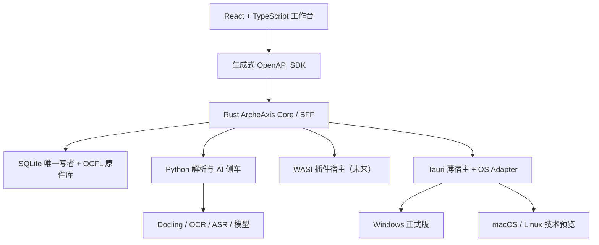
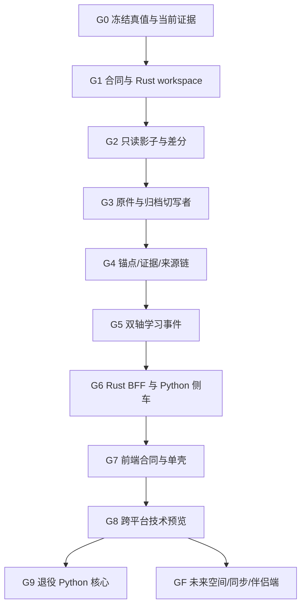

# ArcheAxis 从零语言架构审计与逐步迁移任务包

> 审计日期：2026-09-01
> 云端仓库：`DTALEX66/ArcheAxis-Knowledge-OS`
> 审计基线：`main@db13d0564ac2971d4b1eb3e3a5bff9c9256af313`
> 最新已解析发布标签：`v0.6.14@c202c5b5a4789f0dc21accaa7ccbfed4676f0573`
> 任务性质：从零重做语言与边界选择，但不做高风险整仓重写
> 当前发布优先级：Windows 11；未来保留 macOS、Linux、Web 伴侣端、移动伴侣端、2D/3D/VR/AR

## 0. 最终裁决

ArcheAxis 不应选择“全 Rust”或“全 Python”，而应采用三层语言构成：

| 层 | 最终语言 | 责任 | 不允许承担 |
|---|---|---|---|
| 权威核心 | **Rust** | Source、Anchor、Evidence、Provenance、Rights、Human Learning Event、Machine Competence、命令、审计、迁移、恢复、权限、唯一写入 | OCR、模型推理、通用文档解析器自研 |
| 产品表面 | **TypeScript + React** | Windows 工作台、未来 macOS/Linux/Web 复用 UI、可访问性、2D/2.5D/轻量 3D 呈现 | 直接访问 SQLite、决定 Verified/Mastery/Competence |
| AI/解析侧车 | **Python** | Docling、MarkItDown、OCR、ASR、模型推理、研究提取、评测、可替换学习算法适配 | 成为真相源、直接写权威表、拥有迁移与审批 |
| 合同与数据 | SQL + OpenAPI/JSON Schema；未来 WIT | 跨语言 DTO、事件、插件、导入导出、版本兼容 | 用文档口头约定代替机器校验 |

一句话结论：**Rust 管真值，TypeScript 管体验，Python 管成熟 AI 生态；SQLite/OCFL 管可迁移性，OpenAPI/WIT 管跨语言边界。**

这不是基于现有项目语言得出的妥协。若今天从空仓库开始，基于本地优先、证据不可伪造、桌面恢复、未来跨平台和 AI 生态五个约束，仍会得到相同构成。

## 1. 审计范围与证据边界

### 1.1 已核验

- 重新拉取云端 `main`，精确到 `db13d056...`，工作树只读审计且保持干净。
- 比较 `v0.6.14` 与当前 `main`：当前主线领先发布标签 **20 个提交**，包含显著前端、桌面加载、媒体与恢复修复。
- 读取根规则、系统边界、当前现实、产品计划、能力图谱、未来执行蓝图、交接摘要和发布账本。
- 审计 Python/Rust/TypeScript 生产代码、SQLite 所有权、API 表面、双 Tauri 壳、Windows 依赖、前端响应式和 CI/Release 工作流。
- 运行架构门禁、仓库约定检查、Python 全生产树 `compileall`：均通过。
- 尝试使用仓库统一测试入口；入口在 Linux 上因 `pwd -W` 立即失败，属于真实跨平台工具链缺陷。

### 1.2 未被证明

- 无法从当前环境独立读取 `db13d056...` 对应的 GitHub Actions 运行结果，因此**不得称当前 main 为 CI 绿色**。
- `docs/current/CURRENT_REALITY_2026-09-01.md` 只记录较早的 `0bb6e25...` CI 失败；`HERMES_HANDOFF.md` 又记录 `bed84a9` 成功并要求另查 `673f9ee`。这些都不是当前 SHA 的充分证据。
- 当前环境没有 Rust 工具链和前端 `node_modules`，未重跑 Cargo、Vitest、Vite、Playwright、NSIS 生命周期。
- 没有真实用户材料上的完整 Windows 点击旅程，也没有 125%/150%/200% DPI、多显示器、HDR/高对比度证据。

## 2. 当前云端事实快照

### 2.1 代码构成

以下为生产树、排除测试后的物理行数，作为迁移规模指标，不代表价值占比：

| 语言/区域 | 文件 | 行数 | 当前角色 |
|---|---:|---:|---|
| Python | 308 | 56,671 | 领域、API、SQLite、迁移、摄取、学习、RAG、研究、运行时 |
| Rust | 9 | 4,114 | Tauri 壳、Windows 进程监督、恢复、安全导航 |
| TypeScript/TSX | 30 | 5,219 | React 工作台、API 客户端、空间与恢复 UI |
| CSS | 1 | 1,877 | 单一设计系统文件与响应式布局 |

关键集中度：

- `app/`：29,879 行；`shared/`：23,388 行。
- 244 个 FastAPI 路由装饰器，其中 `knowledge_base/api.py` 92 个、`app/workspace/router.py` 62 个。
- 58 个 Python 文件直接调用 `sqlite3.connect`，约 108 处 `CREATE TABLE IF NOT EXISTS`。
- 前端 API DTO 主要手工维护；未发现 OpenAPI 生成客户端链。
- Rust 当前不是领域核心，主要是 Windows 壳和恢复；非 Windows 的恢复壳明确 `panic!`。

### 2.2 已有优点，应保留而非推倒

- 原件 SHA、Raw-first、候选默认、人工审核、权限失败关闭等核心原则正确。
- `MigrationOperator` 已有 owner、备份、manifest、指纹、租约、回滚与 provenance，比新造 ORM/迁移框架更有价值。
- SQLite + FTS5 + sqlite-vec 适合本地桌面；SQLite 官方文件格式跨平台，不能因为迁语言而换数据库。
- React 前端已明确禁止直接读 SQLite；Tauri 启动 token 只在内存中交换。
- Windows 安装、Green、Portable、SBOM、checksums、恢复壳和 Release 证据体系已形成基础。
- 能力图谱完整保留了 Visual Teaching、Simulation、Spatial Memory、3D/VR/AR 与多设备蓝图。

### 2.3 当前主要结构风险

| 等级 | 问题 | 影响 | 本任务裁决 |
|---|---|---|---|
| P0 | 当前 SHA 的 CI 状态未独立读回 | 无法判断 main 是否可迁移基线 | 先建立 Migration Baseline Receipt |
| P0 | 58 个直接 SQLite 连接点、108 处建表 | 整仓重写会出现双写、漏迁与语义漂移 | 按聚合切唯一写者，禁止双写 |
| P0 | 当前壳对非 Windows 明确失败 | 未来跨平台被宿主层锁死 | 抽出 platform-neutral core 与 OS adapter |
| P0 | 当前 main 比 v0.6.14 多 20 个提交 | 现行代码与公开交付物不同 | 迁移从 main 建证据，不把 release 冒充 current |
| P0 | 当前现实、交接、项目状态、Release Ledger 相互滞后 | 执行者可能从错误 SHA 或版本开工 | 单一生成式 Current Reality |
| P1 | API 表面过宽且两个巨型路由文件集中 | Rust 迁移和客户端兼容成本高 | 先冻结 V1 public/BFF contract |
| P1 | 前端 DTO 手写且大量宽松 `Record<string, unknown>` | 后端变更易运行时才暴露 | OpenAPI 生成 + 运行时 schema 校验 |
| P1 | UI 合同列 7 个 surface，实际主导航 9 个空间；文档仍称“六空间” | 用户模型与测试模型漂移 | UI Contract v3 单一生成源 |
| P1 | Browser smoke 只有 4 个 viewport | 不等于 Windows DPI/缩放兼容 | 增加 DPI、字体、输入、对比度矩阵 |
| P1 | CSS 在线加载 Google Fonts | 本地优先、离线和隐私边界不完整 | 自带授权字体或系统字体栈 |
| P1 | 两个 Tauri crate 通过跨目录 `#[path]` 共享代码 | 重构脆弱、构建边界不清 | 合并为 workspace crate + thin host |
| P1 | 测试启动脚本依赖 Git Bash `pwd -W` | Linux/macOS 开发与 CI 不可复用 | 用 Python/Rust 跨平台 launcher |
| P2 | 仓库跟踪旧 MSI/EXE/ZIP 和模型 | 历史膨胀、供应链与身份混淆 | 新产物只进入 Release；历史另行迁移 |

## 3. 多维视角审计

### 3.1 架构师视角

当前是“Python 模块化单体 + React/Tauri 壳”，但模块边界没有成为数据所有权边界。大量模块能直接连接同一个 SQLite，使领域约束主要依赖调用纪律而不是类型和写入端口。

正确演进不是微服务化，而是：

1. 保持单机、单仓、SQLite、本地优先。
2. 先把领域合同和写入权收敛成端口。
3. Rust 逐个接管不可伪造的聚合与恢复。
4. Python 通过进程边界提供计算结果，不直接升格为事实。
5. UI 只消费稳定 BFF/事件投影。

### 3.2 普通用户视角

用户不关心语言；用户关心：安装后能否导入真实文件、原件是否丢失、证据能否回跳、重启后是否还在、学习状态是否可信、错误是否能恢复。

因此迁移期间必须保证一条黄金流持续可用：

`导入原件 → 阅读 → 精确锚定 → 形成候选 → 人工复核 → 学习练习 → 机器候选 → 重启回读 → 导出恢复`

任何阶段若只能跑开发 API、不能跑 Windows 产品点击旅程，都不得宣布迁移完成。

### 3.3 维护者视角

- Python 开发快、AI 生态强，但当前承担过多长期真值和进程恢复责任。
- Rust 类型与所有权适合状态机、唯一写者、文件/SQLite、权限和崩溃恢复，但不适合重写 Docling、OCR、ASR 与模型生态。
- TypeScript 是目前最经济的跨桌面/Web UI 复用层，也适合未来 Babylon.js 2D/3D/空间呈现。
- C#/.NET 对 Windows 很强，但会与 Tauri/React 重复并增加未来 macOS/Linux 的宿主分叉。
- Go 适合服务器与工作流控制面，但 ArcheAxis 的关键问题是本地领域真值、Tauri 集成和嵌入式存储，Rust 更贴合。
- C++ 对性能和 3D 强，但安全与维护成本不适合作为本项目主领域语言；应复用现成引擎。

## 4. 从零语言选型

评分为 1–5，按 ArcheAxis 约束而非通用语言热度：

| 语言 | 可信状态机 | AI/解析生态 | 产品 UI | 桌面/恢复 | 跨平台 | 开发速度 | 结论 |
|---|---:|---:|---:|---:|---:|---:|---|
| Rust | 5 | 2 | 2 | 5 | 5 | 3 | 权威核心首选 |
| Python | 2 | 5 | 2 | 2 | 4 | 5 | AI/解析侧车首选 |
| TypeScript | 2 | 3 | 5 | 3 | 5 | 4 | 产品表面首选 |
| C#/.NET | 4 | 3 | 4 | 5 | 3 | 4 | 不作为主线；仅未来 Windows 特殊适配候选 |
| Go | 4 | 3 | 2 | 4 | 5 | 4 | 不新增第四主语言 |
| C++ | 4 | 4 | 3 | 4 | 5 | 2 | 只通过成熟引擎/原生库间接使用 |

### 4.1 为什么不是全 Rust

- 会重写成熟 Python 文档/AI 生态，直接违反“成熟方案优先”。
- Docling、MarkItDown、faster-whisper、OCR/评测等 Python 组件本来就适合隔离侧车。
- 迁移价值来自真值边界与恢复，不来自把所有算法翻译成 Rust。

### 4.2 为什么不是全 Python

- 当前平台监督、恢复、安全导航已经证明 Rust/Tauri 更合适。
- 领域真值、权限、追加事件、写入串行化、跨平台安装与长期维护需要更强编译期约束。
- Python 运行时和原生依赖打包仍会继续成为 Windows/未来 macOS/Linux 的交付风险。

### 4.3 为什么保留 React/TypeScript

- 当前前端已有产品合同、组件测试和浏览器 smoke，重做 UI 不产生核心价值。
- Tauri 官方支持用 Web 前端复用 Windows、macOS、Linux，并保留未来移动能力。
- React/TS 可同时承载桌面、Web 伴侣端、Canvas 与 Babylon.js 轻量 3D；无需为未来蓝图提前造第二 UI。

## 5. 目标架构

### 5.1 Rust workspace 建议

| crate | 责任 | 首次迁入内容 |
|---|---|---|
| `archeaxis-contracts` | 版本化对象、命令、事件、错误码 | Source/Anchor/Evidence/Learning DTO |
| `archeaxis-domain` | 纯状态机与不变量 | candidate/review/verified、双轴学习 |
| `archeaxis-store` | SQLite、transaction、migration port | 只读投影开始，后转唯一写者 |
| `archeaxis-archive` | hash、RawAsset、OCFL 导出/验证 | 原件保全与可迁移包 |
| `archeaxis-core` | use case、权限、outbox、receipt | 黄金流编排 |
| `archeaxis-api` | 本地 Axum BFF/OpenAPI | 替代稳定后的 FastAPI 路由 |
| `archeaxis-sidecar-protocol` | Python job/result/error/cancel | JSON Lines/本地 socket，版本化 |
| `archeaxis-platform` | path/process/keyring/dialog 抽象 | 无 OS 特有 API |
| `archeaxis-platform-windows` | JobObject、WebView2、NSIS/路径 | 当前 Windows 实现迁入 |
| `archeaxis-desktop` | Tauri commands、窗口、生命周期 | 合并两个壳的薄入口 |

### 5.2 Python 侧车建议

保留并强化现成能力，不迁写：

- `docling-worker`：PDF/Office/图片统一 DoclingDocument 结果。
- `media-worker`：ffmpeg + faster-whisper + VAD。
- `ocr-worker`：Tesseract/RapidOCR；结果含引擎、版本、语言、置信、损失。
- `research-worker`：网页/GitHub quarantine 与候选提取。
- `model-worker`：LiteLLM/本地模型调用，只返回 candidate result。
- `evaluation-worker`：质量、CER/WER、Teach-back 候选评分。

所有侧车必须：锁版本、声明许可证、单独健康检查、可取消、资源限额、无权读取全库、无权写权威表、输出带输入 hash 与工具版本。

### 5.3 进程边界

短期保留 HTTP 兼容；长期建议：

- UI ↔ Rust：本地 loopback Axum + 一次性 token，或 Tauri command；公开合同仍用 OpenAPI。
- Rust ↔ Python：优先独立进程 + JSON Lines/本地 socket；不优先 PyO3 内嵌，避免 Python 崩溃拖垮核心并保留跨平台替换能力。
- 跨项目：只用版本化中立协议，不依赖 WORK/DESIGN 的内部语言。
- 插件：未来用 WASI Component Model/WIT 做能力与权限边界；在核心迁移稳定前不引入。

## 6. 数据与真值迁移原则

### 6.1 永久唯一权威链

`Original Source → Precise Anchor → Evidence → Claim/Conclusion → Human Learning Event → Machine Competence → Provenance/Receipt`

| 数据 | 权威 Owner | 存储 | 侧车权限 |
|---|---|---|---|
| RawAsset/Source | Rust core | 内容寻址文件 + SQLite metadata；OCFL export | 只读显式输入 |
| Anchor/Evidence/Claim | Rust core | SQLite append/versioned | 只能提交 candidate draft |
| Human Learning Event | Rust core | append-only event | 只能提交观察结果 |
| Machine Competence | Rust core | 状态机 + evidence binding | 不得自报 verified/level |
| 索引/向量/图谱 | 可重建投影 | SQLite FTS/vector 或外置索引 | 可重建、可删除 |
| 模型/解析输出 | Python adapter | job artifact/candidate | 不是真相 |
| UI 状态 | TypeScript | 本地展示偏好 | 不得覆盖领域状态 |

### 6.2 迁移硬规则

1. 同一聚合在任一时刻只能有一个写者。
2. 允许双读和差分；禁止 Python/Rust 双写。
3. 每次切换前创建 verified backup、逻辑 fingerprint、schema manifest、OCFL/原件 hash 清单。
4. Rust 先只读影子，输出必须与 Python 当前实现逐字段比较。
5. 迁移失败保留原数据库和旧运行时；不得在原文件上做不可逆就地升级。
6. 每个状态改变都必须有 command ID、actor、expected revision、receipt 和 rejection path。
7. 索引、统计、UI projection 必须可从权威事件重建。

## 7. 当前 Windows 与未来跨平台蓝图

### 7.1 发布层级

| 阶段 | Windows | macOS/Linux | Web | Android/iOS |
|---|---|---|---|---|
| 当前迁移 | 唯一正式发布端 | 只做编译/单测准备 | 不发布产品 | 停止开发 |
| Core 稳定后 | 正式安装/升级/恢复 | 技术预览、无稳定承诺 | 只读/投影 PoC | 仍不启动 |
| 同步合同稳定后 | 完整本地优先 | 可选正式发布 | 伴侣端，不是真相源 | 可选伴侣端评估 |
| 空间能力成熟后 | 2D/3D/可选 XR | 同语义合同 | Babylon.js/WebXR 呈现 | 仅在价值与安全证明后 |

### 7.2 未来 3D/VR/AR

- `SpatialMemoryPackage` 必须先是引擎无关 Rust/JSON 合同：World、Palace、Room、Locus、Object、Route、Anchor、Fallback、AssetLedger。
- 2D/2.5D/轻量 3D 优先复用 Babylon.js，继续走 TypeScript 产品表面。
- 重型仿真或原生 XR 优先把 Godot 作为外置引擎/Adapter，不自研渲染引擎。
- 每个空间资产必须有文本/2D fallback，VR/AR 不得成为知识真值存储。
- WebGPU/WebXR 能力按设备探测降级，不能用“支持 WebGPU”推断“支持 XR”。

### 7.3 未来同步

- 同步对象是事件、版本、内容 hash 与 receipt，不是复制正在打开的 WAL 文件。
- 云端只能是同步/中继，不得成为第二真相源。
- 冲突通过 expected revision、append-only supersedes 和人工裁决处理。
- Web/移动伴侣端默认读投影；写命令必须经过同一 Rust domain policy。

## 8. 成熟开源优先复用矩阵

| 缺口 | 首选成熟方案 | 方式 | 不做什么 |
|---|---|---|---|
| 桌面跨平台 | Tauri 2 | 保留并重构薄宿主 | 不重写 WinUI/Qt 壳 |
| 本地 HTTP/BFF | Axum + Tokio/Tower | Rust core API | 不自研网络框架 |
| 本地存储 | SQLite | 保留；Rust 统一写端口 | 不换分布式数据库 |
| 原件长期可迁移 | OCFL 1.1 | 吸收规范与 validator | 不发明私有归档格式 |
| 精确锚点 | W3C Web Annotation | 吸收对象模型 | 不为每种格式造互斥锚点 |
| 来源链 | PROV-O + 内部 receipt | 吸收语义映射 | 不让模型文本充当 provenance |
| 学习调度 | `open-spaced-repetition/fsrs-rs` | 资格化后接 Rust | 不复写 FSRS 数学实现 |
| 文档理解 | Docling | Python 侧车 | 不翻译成 Rust |
| Office/轻转换 | MarkItDown 等 | Python adapter/fallback | 不承诺无损编辑 |
| ASR | faster-whisper/ffmpeg | Python/外置二进制 | 不训练自有 ASR |
| OCR | Tesseract/RapidOCR | Python/外置二进制 | 不自研 OCR |
| 插件 ABI | WASI Component Model + WIT | 未来资格化 | 当前不抢跑 |
| 2D/3D/WebXR | Babylon.js | UI renderer | 不自研 3D 引擎 |
| 重型仿真/XR | Godot | 外置工程/Adapter | 不把 Godot 场景当真值 |

官方依据：

- [Tauri 2 跨平台能力](https://v2.tauri.app/)
- [Tauri 架构](https://v2.tauri.app/concept/architecture/)
- [SQLite 单文件跨平台格式](https://www.sqlite.org/onefile.html)
- [SQLite WAL](https://www.sqlite.org/wal.html)
- [Axum 文档](https://docs.rs/axum/latest/axum/)
- [Docling 架构](https://docling-project.github.io/docling/concepts/architecture/)
- [W3C Web Annotation Data Model](https://www.w3.org/TR/annotation-model/)
- [W3C PROV-O](https://www.w3.org/TR/prov-o/)
- [OCFL 1.1](https://ocfl.io/1.1/spec/)
- [FSRS Rust](https://github.com/open-spaced-repetition/fsrs-rs)
- [WebAssembly Component Model](https://component-model.bytecodealliance.org/)
- [Babylon.js 创建与跨平台](https://www.babylonjs.com/creation/)
- [Godot 功能与平台](https://docs.godotengine.org/en/stable/about/list_of_features.html)

## 9. 迁移总 DAG

## 10. 逐步迁移任务包

### G0 — 建立不可争议基线（预计 3–5 个工作日）

#### AXM-G0-001 当前 SHA 证据收口

- 输入：`main@db13d056...`。
- 动作：读取 exact-SHA CI；若无运行则触发正式 CI；记录执行/跳过的 job，不只看总状态。
- 产物：`migration-baseline-receipt.json`，绑定 commit/tree、locks、CI、Windows runtime、测试集合。
- 验收：任何人可从 receipt 重算 SHA；当前失败必须显示失败，不得修饰。

#### AXM-G0-002 权威文档去漂移

- 生成单一 Current Reality；修正 v0.6.11/v0.6.14、六空间/九空间、旧 SHA、Green/local/Release 混用。
- HERMES handoff 保留历史但只在顶部指向生成式当前事实。
- 验收：同一能力在状态页、handoff、release ledger、UI contract 不出现互斥 CURRENT。

#### AXM-G0-003 黄金语料与快照

- 固定一组用户可公开或项目拥有权利的 PDF、扫描件、网页、DOCX、PPTX、XLSX、音频、视频、Markdown/Canvas。
- 导出当前 DB schema、logical fingerprint、RawAsset hash、API response、截图、错误路径与性能基线。
- 验收：fresh workspace 和 existing workspace 均可重放；无客户私密材料进入仓库。

#### AXM-G0-004 迁移冻结规则

- 冻结新领域表、新路由和第二数据库；紧急修复需单独 exception receipt。
- 宣布“无双写、每聚合唯一写者、可回滚”规则。
- 退出条件：G1 开始后不存在未登记的 schema 变更。

### G1 — 合同优先与 Rust 骨架（预计 1–2 周）

#### AXM-G1-001 建 Rust workspace

- 新建第 5.1 节 crates；不接生产写入。
- 合并当前两个 Tauri crate 的共享源码为正规 crate，不再跨目录 `#[path]`。
- 验收：Windows/Linux/macOS 三平台 `cargo check`；Windows 原壳行为不变。

#### AXM-G1-002 Contract v2

- 从 Python Pydantic 当前对象生成/冻结 JSON Schema/OpenAPI fixtures。
- Rust 使用 Serde 严格拒绝未知真值字段；TS 客户端从 OpenAPI 生成。
- 必须覆盖 Source、Anchor、Evidence、Claim、LearningEvent、MachineCompetence、Receipt、Error。
- 验收：Python→JSON→Rust→JSON 与 Rust→JSON→Python 黄金往返；不丢字段、不偷偷默认 verified。

#### AXM-G1-003 平台端口

- 定义 `PathResolver`、`ProcessSupervisor`、`KeyStore`、`DialogPort`、`Power/Idle`、`Updater` traits。
- 当前 Windows 逻辑迁入 `archeaxis-platform-windows`。
- 验收：domain/store crates 中搜索不到 `cfg(windows)`、盘符、LOCALAPPDATA、PowerShell、JobObject。

#### AXM-G1-004 跨平台测试入口

- 用 Python 或 Rust 小型 launcher 替代 `pwd -W` 依赖；Windows Git Bash 仅作兼容包装。
- 验收：Windows/Linux/macOS 同一命令选择相同测试；临时目录仍限制在项目运行根。

### G2 — 只读影子与差分（预计 2 周）

#### AXM-G2-001 Rust 只读存储

- 使用成熟 SQLite Rust binding，读取数据库副本/导出快照，不打开生产 DB 写权限。
- 实现 schema/version、Source、Anchor、Evidence、Learning event、Machine level 的严格读取。
- 验收：黄金库逐行/逐字段 fingerprint 与 Python 相同；未知 schema fail closed。

#### AXM-G2-002 状态机差分

- Rust 实现 candidate/review/verified/superseded、human M0–M7、machine K0–K8 纯状态机。
- 对同一事件序列同时运行 Python 与 Rust，比较状态、拒绝原因、receipt。
- 验收：至少覆盖重复命令、乱序、冲突 revision、伪造 verified、重放、撤销、损坏事件。

#### AXM-G2-003 影子观测

- Windows 运行时中 Rust 只读计算 projection，结果仅写迁移诊断 artifact。
- 不展示给普通用户、不参与业务决策。
- 退出条件：连续两个候选版本黄金流零语义差异；任何差异有裁决记录。

### G3 — 原件与归档切换唯一写者（预计 2–3 周）

#### AXM-G3-001 Rust RawAsset/Source

- 先迁内容 hash、原件落盘、approved root、MIME/魔数、source revision、rights/provenance metadata。
- Python 解析器只接收 Rust 明确授权的只读文件句柄/临时副本。
- 验收：导入后原件 hash、路径、重启读回、重复导入、权限失败与取消均一致。

#### AXM-G3-002 OCFL 导出与验证

- 复用 OCFL 1.1 规范与 validator；不自创归档标准。
- 验收：空环境仅凭导出包恢复 Source identity、versions、fixity、rights/provenance；原库不需要存在。

#### AXM-G3-003 切换门

- 切换前 verified backup；切换时 Python Source 写端口关闭，Rust 成为唯一写者。
- 回滚：停止新核心，恢复备份并重启旧 Python 运行时；新格式数据保留为只读迁移包。
- 禁止：Rust/Python 同时写 Source 表。

### G4 — Anchor/Evidence/Provenance（预计 2–3 周）

#### AXM-G4-001 标准化 Anchor

- 将 W3C Web Annotation 的 Target/Selector 思路映射到 PDF 页/坐标/文本 quote、网页、音视频时间码、Office block。
- 保留 source revision、re-anchor、stale/orphaned。
- 验收：内容未变可精确回跳；内容变更显示 STALE/ORPHANED，不静默漂移。

#### AXM-G4-002 Evidence 状态机

- Rust 接管 EvidenceBundle、Claim、review、conflict、supersedes、rights、scope。
- Python/外部系统只能提交 candidate；不得发送 verified、human mastery 或 machine level。
- 验收：所有越权字段 fail closed；审计链可从结论回到原件。

#### AXM-G4-003 Provenance/Receipt

- 内部 append-only receipt 映射 PROV-O 语义；工具、版本、输入 hash、actor、时间、决策、拒绝均可查。
- 验收：删除 Python sidecar 后仍可验证已发生事实；侧车日志不是唯一证据。

### G5 — 人类学习与机器能力（预计 3–4 周）

#### AXM-G5-001 Learning Event Store

- Rust 接管 human learning append-only event、幂等、revision、projection rebuild。
- FSRS 使用 `fsrs-rs` 资格化，不自行复写算法；先用冻结参数与 Python 当前结果差分。
- 验收：due queue、练习、错题、teach-back、迁移学习和重启回读保持一致。

#### AXM-G5-002 双轴防火墙

- Human mastery 与 Machine competence 永久分开；一侧结果不自动提升另一侧。
- Machine competence 必须绑定 approved evidence、scope、允许/禁止任务、评测与人工审批。
- 验收：模型自报 level、客户端自报 verified、一次答对直接满级全部被拒绝。

#### AXM-G5-003 学习可解释性

- UI 显示“为什么到期、依据什么证据、哪里错、如何恢复”，不显示虚假单一百分比。
- 验收：小白用户无需理解内部 ID；专家可以展开完整 evidence/provenance。

### G6 — Rust BFF 与 Python 侧车化（预计 3–4 周）

#### AXM-G6-001 Rust BFF

- 用 Axum/Tower 实现稳定的 `/api/v2`，先代理尚未迁移的 Python use case。
- 统一 token、限流、错误码、correlation ID、SSE/job 状态。
- 验收：旧 `/api/v1` 仍可回滚；新客户端没有直接依赖 FastAPI 内部路由。

#### AXM-G6-002 Sidecar Protocol v1

- 定义 job/start/progress/result/error/cancel/timeout/resource receipt。
- 支持 Docling、OCR、ASR、research、model、evaluation adapter。
- 验收：侧车未安装、崩溃、超时、输出畸形、版本不兼容都有诚实状态与重试；核心不崩溃。

#### AXM-G6-003 Python 去数据库化

- 按 adapter 逐个撤销 DB 路径；输入由 Rust 发送，输出只回 candidate/result。
- 用架构门禁禁止 sidecar import `sqlite3` 和权威 storage 包。
- 验收：拔掉每个 Python sidecar 后核心仍能浏览、验证、导出和恢复已有知识。

#### AXM-G6-004 路由收敛

- 244 路由分类为 Public、BFF、Internal Adapter、Legacy、Remove。
- `knowledge_base/api.py` 与 `workspace/router.py` 拆为用例端口，不机械逐路由翻译。
- 验收：Public route 有消费者、schema、错误合同和退役日期；无消费者路由不得迁移。

### G7 — 前端合同、离线与单壳（预计 2–3 周）

#### AXM-G7-001 UI Contract v3

- 统一 9 个当前空间、黄金流、未来模块隐藏规则、truth states、用户术语。
- 从同一源生成导航、测试清单和文档表，消除“六空间/九空间”漂移。
- 验收：不存在空白未来入口；UNKNOWN/STALE/FAILED 不显示为成功。

#### AXM-G7-002 生成式客户端

- 用 OpenAPI 生成 TS types/client；业务层加严格运行时校验。
- 删除重复手工 DTO，仅保留 UI view model。
- 验收：后端破坏性变更在 CI 编译/合同门就失败，不等到用户点击。

#### AXM-G7-003 Windows 体验矩阵

- Viewport：1920×1080、1366×768、1280×800、1024×768。
- DPI：100%、125%、150%、200%；单/双显示器；键盘、鼠标、触控板；减少动画、高对比度、放大文本。
- 验收：无横向溢出、遮挡、不可达按钮；关键路径有真实 Tauri WebView 截图与点击证据。

#### AXM-G7-004 离线与字体

- 删除运行时 Google Fonts 请求；采用授权自带字体或系统字体栈。
- 验收：断网启动、导入本地材料、阅读、学习、备份可用；网络能力明确显示离线。

#### AXM-G7-005 合并桌面壳

- 只保留一个生产 Tauri host；recovery 作为同一 host 的受限模式/窗口，而非第二产品壳。
- 验收：启动失败仍能备份/恢复/安全退出；无第二套真值客户端。

### G8 — 跨平台技术预览（Core 稳定后，预计 3–6 周）

#### AXM-G8-001 三平台 CI

- Windows：完整产品、安装、升级、恢复。
- macOS/Linux：core/store/contracts/sidecar protocol 的 build/test；随后加入 Tauri smoke。
- 验收：平台特有失败有 adapter 错误，不污染 domain。

#### AXM-G8-002 路径、进程与凭据适配

- Windows：LOCALAPPDATA/JobObject/WebView2/NSIS。
- macOS：Application Support、Keychain、签名/notarization 独立决策。
- Linux：XDG、Secret Service、WebKitGTK、包格式独立决策。
- 验收：同一 workspace export 可跨系统恢复；不得复制活动 WAL 充当同步。

#### AXM-G8-003 平台资格化

- macOS/Linux 初期只标 `TECH_PREVIEW`，不得因能编译即称可用。
- 正式发布需单独完成 installer、升级、卸载、权限、长路径、字体、输入法、GPU、恢复与 SBOM。

### G9 — 退役 Python 核心（至少跨两个候选发布）

#### AXM-G9-001 退役清单

- Python 保留：解析、AI、研究、评测 adapters。
- Python 删除：权威 DB 写入、迁移 owner、权限决定、审核状态机、核心 BFF。
- 每个删除项需 `consumer=0`、迁移 receipt、rollback tag 和替代测试。

#### AXM-G9-002 旧 API/DB 兼容窗口

- 保留只读兼容至少两个候选版本；旧写接口返回明确升级错误，不静默丢弃。
- 退出：真实升级测试覆盖 v0.6.14 与迁移前最后稳定版。

#### AXM-G9-003 正式切换

- 发布身份绑定 Rust core/schema/protocol/sidecar locks。
- Setup/Green/Portable 或新跨平台产物均需 install/start/restart/recover/export/uninstall 与独立下载 hash 读回。

### GF — 未来蓝图，不抢占当前迁移

#### AXM-GF-001 WASI 插件资格化

- 仅在核心权限与合同稳定后评估 Component Model/WIT。
- 插件默认无文件、网络、模型和 DB 权限；能力显式授予并可撤销。

#### AXM-GF-002 Spatial Memory 2D → 3D

- 先实现 engine-neutral `SpatialMemoryPackage` 与 2D 文本/地图 fallback。
- 再用 Babylon.js 做 2.5D/3D renderer；重型仿真/XR 通过 Godot adapter。
- 学习效果、性能与可访问性通过后才进入正式导航。

#### AXM-GF-003 Web/移动伴侣端

- 当前不投入 Android/iOS。
- 未来先做只读投影、离线缓存和恢复；写命令仍通过 Rust policy。
- 只有同步冲突、端到端加密、设备撤销和数据删除规则成熟后才评估正式移动端。

## 11. 每阶段统一验收门

| Gate | 必须通过 |
|---|---|
| Truth | Source/Anchor/Evidence/Learning/Machine 状态无语义差分 |
| Data | 唯一写者、backup、fingerprint、restart、rollback |
| Contract | OpenAPI/Schema 双向、未知字段 fail closed、错误码稳定 |
| Security | 权限最小化、sidecar 隔离、无凭据/私密路径泄漏 |
| Product | Windows Tauri 真实点击黄金流，不以 mock/API-only 代替 |
| Accessibility | 键盘、焦点、缩放、减少动画、高对比度 |
| Performance | 启动、导入、检索、内存、8GB 显存降级基线无重大回退 |
| Supply chain | lock、license、SBOM、checksum、第三方版本与回滚 |
| Release | exact-SHA CI 与发布 run 分开记录，下载后独立读回 |

任一 Gate 失败：该聚合写者保持旧实现，Rust 新实现退回只读影子；不得为了“完成迁移”降低真值语义。

## 12. 快速执行节奏

### 前 72 小时

1. 读取 `db13d056...` exact-SHA CI；生成 baseline receipt。
2. 冻结 schema/route 扩张；建立 migration branch 与 owner 表。
3. 固定黄金语料、数据库、API、截图、性能与恢复证据。
4. 修复跨平台测试 launcher 的 `pwd -W` 阻塞。
5. 建 Rust workspace 空骨架与三平台 `cargo check`，不接生产写入。

### 前 2 周

1. Contract v2 + OpenAPI 生成 TS client。
2. Rust Source/Anchor/Evidence 只读模型与差分工具。
3. Tauri 平台端口抽取，Windows 行为保持不变。
4. UI Contract v3 收口六/九空间与状态词漂移。
5. 移除在线字体依赖，补 Windows DPI/高对比度测试设计。

### 4–6 周可见成果

- Rust 对当前数据库进行只读 truth audit。
- Windows 用户仍使用原产品，但诊断可发现状态/来源链差异。
- Source/RawAsset 具备首个 Rust 唯一写者候选和完整回滚。
- Python 解析仍完整复用，不为迁移重写 AI 能力。

### 3–6 个月目标

- Rust 接管 Source/Anchor/Evidence/Learning/Machine truth、迁移、恢复和 BFF。
- Python 收缩为可插拔侧车。
- 单一 Tauri 壳；Windows 正式版稳定，macOS/Linux 达技术预览。
- 未来 Spatial/Web/移动能力拥有稳定合同，但不以空页面冒充实现。

工期取决于真实黄金语料、Windows 发布资格和现有 DB 复杂度。不得把上述时间当作无条件承诺；每阶段以 Gate 证据决定是否前进。

## 13. 禁止事项

- 禁止整仓一次性重写。
- 禁止 Rust 与 Python 双写同一权威数据。
- 禁止为了 Rust 化重写 Docling/OCR/ASR/FSRS/3D 引擎。
- 禁止引入微服务、Kafka、Kubernetes、Neo4j 作为迁移捷径。
- 禁止当前恢复移动端开发；只保留未来合同与平台抽象。
- 禁止把“macOS/Linux 能编译”描述为跨平台产品完成。
- 禁止 Web/移动端或云服务成为第二真相源。
- 禁止把 future blueprint 从能力图谱删除，也禁止将其提前放入普通导航。
- 禁止使用单一模型评分替代人工知识/学习审批。
- 禁止无 exact-SHA、安装态、重启回读和回滚证据的“完成”。

## 14. 最终完成定义

语言迁移不是“Python 文件变少”或“Rust 行数变多”。只有同时满足以下条件才完成：

1. Rust 是 Source/Anchor/Evidence/Human Learning/Machine Competence 的唯一权威写者。
2. Python 侧车可逐个删除而不破坏已有知识的浏览、验证、导出和恢复。
3. React/TypeScript 只通过生成式合同访问核心，无法伪造真值。
4. v0.6.14/迁移前稳定版可安全升级，失败可恢复旧库。
5. Windows 安装、启动、黄金流、重启、恢复、导出、卸载全部通过。
6. macOS/Linux 至少完成真实技术预览资格，而不是仅理论支持。
7. Spatial/3D/VR/AR、Web/移动伴侣和同步拥有引擎无关合同与数据所有权边界。
8. 所有成熟开源组件有 URL、锁定版本、许可证、SBOM、调用位置、替代项、回滚和退出条件。
9. Current Reality、Capability Atlas、UI Contract、代码、测试、Release 对同一能力给出一致状态。

最终架构不是“Rust 项目”，而是一个能在 Windows 现在交付、未来跨系统扩展、原件和证据可恢复、AI 组件可替换的 ArcheAxis Knowledge OS。
