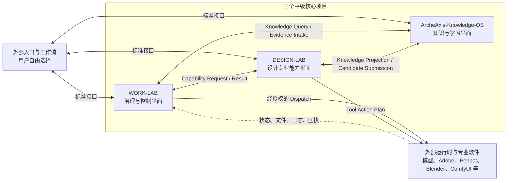

# DeepSeek Harness 三项目完整任务包

> 任务包 ID：`TP-20260819-TRI-PROJECT-FEDERATION-V2`  
> 版本：`2.0.0`  
> 日期：`2026-08-19`  
> 执行器：DeepSeek Harness（外部、可替换）  
> 目标仓库：`ArcheAxis-Knowledge-OS`、`WORK-LAB`、`DESIGN-LAB`  
> 执行模式：多仓库、顺序写入、Exact-SHA、Fail-Closed、人工关键节点

---

## 0. 给 DeepSeek Harness 的直接指令

你负责执行本任务包，但你不是三个项目的产品组成部分。不得把 DeepSeek Harness、Hermes、Codex、OpenHuman、Open Design、CC Switch 或其他工作流软件写入三个项目的核心产品身份、领域模型或强制依赖。

这些软件是用户自行选择的外部入口、Agent、Harness、配置工具或运行时。它们可以并且应当被 WORK-LAB 管理其官方基线、用户配置、兼容状态和 Adapter，但必须以注册数据存在，而不是写死成核心类型。

执行前必须完整读取本文件。不得只执行其中某一阶段后声称整体完成。

### 0.1 最高优先级规则

1. 不得自动 `commit`、`push`、创建 PR、merge、release 或修改云端设置。
2. 每个仓库同一时间只允许一个写入者；禁止多个 worker 并发写同一仓库。
3. 任何修改前，记录本地分支、HEAD、`origin/main`、ahead/behind、dirty 文件和 remote。
4. 用户已有未提交内容必须保留；如与任务文件重叠，立即停止该仓库的写入并报告。
5. 所有完成声明必须绑定 Exact SHA、实际执行命令、退出码、测试结果和证据路径。
6. “代码存在、脚本存在、文档声明、Mock 通过”不等于能力完成。
7. 外部工具、模型或软件未安装时，状态必须为 `NOT_EXECUTED` 或 `BLOCKED`，不得伪造成功。
8. 在迁移 readback、哈希和回滚验证完成前，不得删除任何知识、配置、素材或历史记录。
9. 不得修改以下外部目录中的实际内容，除非获得单独人工批准：

   ```text
   D:\All projects\DSH
   D:\All projects\Design assets
   D:\All projects\OS External Configuration
   D:\All projects\Model library
   ```

10. 禁止将公司客户设计项目资料混入三个个人研发项目。

---

## 1. 云端审计基线

本任务包以 2026-08-19 已核验的云端 `main` 为基线。执行时必须再次 fetch 并复核，不能假设这些 SHA 仍是最新值。

| 仓库 | 审计时 `main` HEAD | 审计时最新提交 |
|---|---|---|
| `DTALEX66/ArcheAxis-Knowledge-OS` | `9def792acafd49e3d1ac12f19b767d3c42016837` | `docs: video conversion research — pipeline recommendation...` |
| `DTALEX66/WORK-LAB` | `979ec88837b4f7bfffa8d3ab3dfe05b364f6a01f` | `docs(handoff): WORK-LAB 2026-08-19 summary...` |
| `DTALEX66/DESIGN-LAB` | `275702b482f5b5bb9da57e3e9863036824010c8e` | `docs(handoff): 2026-08-19 cleanup + full-push closure summary` |

若执行时 `origin/main` 已更新：

- 记录新旧 SHA；
- 对新增提交进行增量审计；
- 不得把本任务包中的旧 SHA 写成当前事实；
- 不得自动 merge/rebase；
- 生成 `BASELINE_DRIFT_REPORT.md` 后等待人工确认。

---

## 2. 三项目唯一正确架构

### 2.1 架构原则

三个项目平级独立，不是父子项目，不共享数据库，不互相直接导入源码，也不能把整个三项目包装成以某一个项目为边界的单体系统。



### 2.2 三项目职责

#### ArcheAxis-Knowledge-OS

唯一定位：本地优先、证据驱动、人机双向重型学习与可信知识治理系统。

必须同时包含：

- 人类学习工作空间；
- 阅读、标注、笔记、课程、练习、复习和能力成长；
- 原始资料、Evidence、Candidate、Review、Verified Knowledge；
- AI 学习、机器知识、失败模式、经验提炼和候选知识生成；
- 来源、版本、可信度、版权和知识图谱；
- 将可信知识编译成 Skill、Rule、Domain Capability Package 的能力。

不得变成：

- AI-only 知识库；
- 普通 RAG；
- Agent Runtime；
- 工作流调度器；
- 模型网关；
- DESIGN-LAB 或 WORK-LAB 的内部数据库。

#### WORK-LAB

唯一定位：跨项目、跨工作流、跨 Agent 和跨运行时的任务治理、配置控制、调度、监督、恢复和验收控制面。

必须拥有：

- Work Unit；
- 权限和策略决策；
- 能力、软件、运行时和 Adapter 注册；
- 软件官方基线与用户配置控制；
- 任务状态机、检查点、恢复、人工批准和验收；
- Evidence Envelope；
- 严格只读 Observer；
- Exact-SHA、门禁、审计和可追溯性。

不得变成：

- 实际任务执行器；
- Agent Runtime；
- 模型网关；
- 聊天客户端；
- 专业设计知识系统；
- 长期知识真源。

#### DESIGN-LAB

唯一定位：面向职业视觉设计全链路的设计智能、专业判断、质量控制、生产预检和可编辑交付能力系统。

必须覆盖：

- 平面、品牌、UI/UX、电商、编辑、包装；
- 空间、展厅展馆、3D；
- 动画、视频、音频、游戏视觉；
- Design Brief、Reference DNA、Design IR；
- 大师质感与风格分析，但不得成为大师模仿器；
- 构图、排版、色彩、材质、光影、层级、品牌一致性；
- AI 味、廉价感、模板感和视觉缺陷检查；
- Production Preflight、Editable Handoff、Evidence、Benchmark；
- Creative Tool Adapter 和 Tool Action Plan。

不得变成：

- 第二套 Photoshop、Figma 或 Blender；
- 通用 Agent Runtime；
- 模型网关；
- 单纯 Prompt 仓、素材站或静态资料库；
- 绑定 Open Design 的配套仓库。

---

## 3. 三条合法业务路径

### 3.1 人类学习路径

```text
用户 ↔ ArcheAxis
```

人类阅读、学习、研究、标注、练习和复习不需要经过 WORK-LAB 或 DESIGN-LAB。

### 3.2 简单设计辅助路径

```text
外部入口 ↔ DESIGN-LAB ↔ ArcheAxis
```

一次设计评审、配色分析、排版检查或简单设计计划可以直接调用 DESIGN-LAB；需要知识时查询 ArcheAxis。

### 3.3 受治理的专业生产路径

```text
外部入口
  → WORK-LAB Work Unit
  → ArcheAxis Knowledge Query
  → DESIGN-LAB Design IR / Tool Action Plan
  → WORK-LAB 权限批准
  → 外部运行时执行
  → 状态与文件回读
  → DESIGN-LAB 质量复核和生产预检
  → WORK-LAB 验收
  → ArcheAxis Candidate / Evidence Intake
```

只有高风险、跨软件、多步骤、可恢复、需审计的任务才必须由 WORK-LAB 接管。

---

## 4. 知识、配置、状态和资产归属

| 对象 | 权威位置 |
|---|---|
| 可复用知识正文、方法、规范、案例知识 | ArcheAxis |
| 人类学习记录和能力成长 | ArcheAxis |
| Candidate、Review、Verified Knowledge | ArcheAxis |
| 编译后的 Skill、Rule | 对应运行项目，来源必须指向 ArcheAxis |
| 设计 Domain Capability Package | DESIGN-LAB |
| Work Unit、检查点、恢复和任务状态 | WORK-LAB |
| 软件官方配置基线和兼容矩阵 | WORK-LAB，原始官方说明进入 ArcheAxis 或外部缓存 |
| 用户真实配置和机器覆盖 | `OS External Configuration` |
| Secret | 凭据系统或加密文件；项目只存 Secret Reference |
| 设计中间态、质量报告、预检和交付包 | DESIGN-LAB |
| 原始大型设计资产 | `Design assets`，ArcheAxis 保存索引、来源、版权和提炼记录 |
| 本地模型 | `Model library`，项目只保存 Model Reference |

禁止“把所有东西都迁进 ArcheAxis”。代码、运行状态、编译产物和大文件不属于知识正文。

---

## 5. WORK-LAB 配置控制面专项任务

### 5.1 废止错误解释

以下旧解释立即失效：

```text
删除或移除 WORK-LAB 中所有工作流软件配置。
```

新的强制解释：

```text
只从核心产品身份、核心领域类型和强制依赖中移除外部软件绑定。
所有工作流软件的官方基线、用户配置、兼容矩阵、Adapter、证据和状态继续由 WORK-LAB 管理。
```

### 5.2 六层配置模型

```text
Official Baseline
  → WORK-LAB Compatibility Baseline
  → User Profile
  → Project Override
  → Machine Overlay
  → Session Override
  → Effective Config
  → Diff / Approval / Apply / Readback / Drift Detection / Rollback
```

配置优先级：

```text
不可覆盖的安全策略
  > Session Override
  > Project Override
  > User Profile
  > Machine Overlay
  > Compatibility Baseline
  > Official Baseline
```

### 5.3 新增契约

建立或稳定：

```text
SoftwareRegistrationV1
OfficialBaselineV1
CompatibilityProfileV1
UserConfigurationProfileV1
MachineOverlayV1
SessionOverrideV1
SecretReferenceV1
EffectiveConfigurationV1
ConfigurationDiffV1
ConfigurationApplyPlanV1
ConfigurationReadbackV1
ConfigurationDriftV1
ConfigurationRollbackV1
```

每个注册软件至少记录：

```text
softwareId
displayName
category
officialRepository
officialDocumentation
officialReleaseSource
currentBaselineVersion
baselineDigest
supportedPlatforms
capabilities
configurationSchema
compatibilityStatus
adapterId
evidenceLevel
secretFields
lastReadbackAt
```

### 5.4 迁移现有工作流配置

需要登记但不得硬编码的现有对象：

```text
Hermes
Codex
OpenHuman（tinyhumansai/openhuman，不是 OpenHands）
Open Design
DeepSeek Harness
CC Switch
GitHub
未来其他 Agent、Harness 和入口
```

迁移流程：

1. 清点现有软件配置文件、字段、用户覆盖和 Secret；
2. 生成原始 manifest 和内容哈希；
3. 转换为 Software Registry；
4. Secret 转换为引用，禁止明文复制；
5. 生成 Effective Config；
6. 对比迁移前后字段数量和值；
7. 执行只读配置回读；
8. 验证回滚；
9. readback 通过后才允许清理重复旧文件。

### 5.5 Observer 强制边界

Observer 必须：

- 严格只读；
- 真实数据源；
- `unknown != zero`；
- 不采集 Prompt/Response 正文和 Secret；
- 不批准、不重试、不回滚、不修改配置、不直接执行自愈；
- 对写请求返回拒绝；
- 自愈建议只能提交给治理层。

当前云端已有 React 控制塔。不得依据旧文档自动退回 Vanilla JS，也不得仅因新前端存在便宣称数据真实。应单独审计前端框架决策和每个指标的数据来源。

---

## 6. 三项目联邦契约

### 6.1 所有权

ArcheAxis 拥有：

```text
KnowledgeQueryV1
KnowledgeProjectionV1
CandidateSubmissionV1
CandidateReceiptV1
EvidenceIntakeV1
LearningRecordV1
ProvenanceRecordV1
RightsRecordV1
```

WORK-LAB 拥有：

```text
WorkUnitV1
CapabilityRegistrationV1
SoftwareRegistrationV1
RuntimeRegistrationV1
PermissionDecisionV1
DispatchRequestV1
DispatchReceiptV1
CheckpointV1
ApprovalV1
RecoveryPlanV1
AcceptanceResultV1
EvidenceEnvelopeV1
```

DESIGN-LAB 拥有：

```text
DesignBriefV1
DesignContextV1
DesignIRV1
DomainCapabilityPackageV1
DesignReviewV1
QualityAssessmentV1
ProductionPreflightReportV1
EditableHandoffPackageV1
ToolActionPlanV1
```

### 6.2 公共信封字段

所有跨项目消息必须具有：

```text
schemaVersion
messageId
producer
consumer
correlationId
workUnitId（如适用）
sourceCommit
contentHash
classification
rightsStatus
createdAt
idempotencyKey
```

### 6.3 禁止耦合

- 禁止共享数据库；
- 禁止跨仓库相对路径导入；
- 禁止读取另一个项目内部实现目录；
- 禁止复制另一个项目的权威 Schema 后手工维护；
- 禁止 WORK-LAB 重新拥有 `domain-pack`；
- WORK-LAB 只能引用 `CapabilityPackageReference`；
- `memory-record` 必须限定为带 TTL 的运行上下文，不是长期知识。

### 6.4 联邦注册位置

WORK-LAB 可以保存三项目联邦注册表和传输协议，但不因此成为另外两个项目的父项目。

建议：

```text
WORK-LAB/00-governance/federation/
├─ federation-registry.v1.json
├─ federation-envelope.v1.schema.json
└─ THREE_PROJECT_FEDERATION_CONTRACT.md
```

其他仓库只能保存自动生成、只读、带来源 SHA 和 content hash 的投影，不允许手工复制后独立漂移。

---

## 7. ArcheAxis 修复任务

### AA-P0-001：重新生成当前状态

- 修复 `SYSTEM_BOUNDARY.md`、当前产品计划与真实 HEAD 不一致；
- 旧阶段、旧执行器和旧功能状态不得继续作为当前事实；
- 所有状态绑定当前 Exact SHA。

### AA-P0-002：稳定跨项目知识 API

实现或补全：

- 批量 Candidate Submission；
- 幂等键；
- 权限和调用方身份；
- Candidate Receipt；
- Verified Knowledge 回读；
- 分页、错误码、速率和版本协商；
- 来源、版权、可信度字段；
- 写入后的 hash readback。

### AA-P0-003：保留人类学习核心

新增任何机器接口时，必须验证：

- 人类学习 Workspace 未降级；
- 阅读、标注、笔记、复习和能力成长仍为一级入口；
- AI 生成内容默认只能进入 Candidate；
- 未经 Review 不得进入 Verified。

### AA-P1-001：外置资产索引

为 `Design assets` 建立 `ExternalAssetRecord`，只保存：

```text
URI / path token
content hash
media type
source
rights
extraction status
derived knowledge IDs
```

不得复制大型原件进入 Git。

### AA-P1-002：未完成摄取能力真实状态

逐项报告：PDF、Office、Markdown/TXT/HTML、图片/OCR、音频/ASR、视频字幕/关键帧、URL/Web。

状态只允许：

```text
PASS
PARTIAL
FAIL
NOT_EXECUTED
BLOCKED
```

不得将 SenseVoice 技术验证等同于完整音频知识转化闭环。

---

## 8. WORK-LAB 修复任务

### WL-P0-001：定位与注册表去硬编码

- 核心定位改为客户端、Harness、Agent 和工具中立；
- 外部软件名称迁入 `software-registry`、`adapters`、`compatibility`、`evidence` 或历史目录；
- 保留全部实际配置和用户选择；
- 不得用删除名称的方式删除能力。

### WL-P0-002：纠正专业能力越界

- 删除 WORK-LAB 对 `domain-pack` 的所有权；
- 改为通用 `CapabilityPackageReference`；
- DESIGN-LAB Schema 通过 URI、版本、Exact SHA、digest 引用。

### WL-P0-003：运行记忆降级为上下文缓存

`memory-record` 改为：

```text
runtime-context-record
TTL required
non-authoritative
source reference required
```

长期经验必须提交 ArcheAxis Candidate。

### WL-P0-004：Observer 写入否定测试

为所有写路径建立测试，验证 Observer 无法：

- 修改 Work Unit；
- 批准；
- 重试；
- 回滚；
- 修改配置；
- 调用执行器；
- 写入 Secret。

### WL-P0-005：配置控制面

完成第 5 章全部契约、迁移、Diff、Apply Plan、Readback、Drift 和 Rollback。

### WL-P1-001：当前证据真实性

重新生成 `CURRENT_STATE`，不得继续以：

```text
live_readback: not-run
UNVERIFIED_MAIN_CI
```

同时又声称能力正式完成。无法运行的部分保留未验证状态。

### WL-P1-002：仓库减重

- 生成 Git 对象、LFS、大文件和历史体积报告；
- DSH 必须保持外置；
- 不得用历史重写或删除进行自动减重；
- 提供可恢复方案后等待人工批准。

---

## 9. DESIGN-LAB 修复与增强任务

### DL-P0-001：彻底完成身份中立化

活动身份统一：

```text
DESIGN-LAB
设计实验室
design-lab
DTALEX66/DESIGN-LAB
D:\All projects\DESIGN-LAB
```

`OPEN DESIGN`、`OPEN-DESIGN-Assistance`、`Design Intelligence Layer` 不得继续作为活动产品名。

Open Design 只能是可选入口和 Adapter，不得是默认宿主、当前参考主角或架构前提。

### DL-P0-002：知识角色重分类

对 `design-lab/knowledge` 先生成依赖图，再决定迁移；禁止盲目重命名。

最终角色：

```text
权威可复用知识 → ArcheAxis
DESIGN-LAB 只读知识投影/缓存 → 非权威
编译后的设计 Domain Pack → DESIGN-LAB
设计结果与评价 → DESIGN-LAB
可复用新经验 → ArcheAxis Candidate
```

### DL-P0-003：证据状态对齐

在当前 Exact SHA 上重新核验：

- 测试总数；
- Adapter Registry；
- Evidence Card；
- Open Design E1/E2；
- Photoshop Smoke 与 G1；
- ComfyUI；
- MiniMax H3；
- MiniGame 游戏视觉 fixture；
- 162 个 quarantined source 和 active source；
- 包体积和预算。

Handoff、Registry、Status JSON 必须一致；证据不足时降级，不得补写虚假证据。

### DL-P0-004：MiniGame 边界

`minigame-runtime` 保留为游戏视觉设计、游戏 UI、动效、资产管线和质量验证 fixture，不得恢复成独立 MiniGame 产品，也不得迁回 WORK-LAB。

### DL-P0-005：外置设计资料转化链

对 `D:\All projects\Design assets` 建立：

```text
SourceRecord
RightsRecord
ExtractionJob
CandidateKnowledge
MethodCard / Rubric / ReferenceSet 编译产物
Domain Pack source refs
```

大型原始资料永远外置。未明确版权的资料保持 `QUARANTINED`。

### DL-P1-001：Design Token 和 UI/UX 质量底座

评估并采用：

- `style-dictionary/style-dictionary`：Design Token 编译；
- `storybookjs/storybook`：组件、状态、文档和隔离测试；
- `microsoft/playwright`：截图、交互和视觉回归；
- `dequelabs/axe-core`：WCAG 自动检查。

采用前必须完成许可证、依赖体积、锁文件、离线能力和撤销方案审计。

### DL-P1-002：专业工具 Adapter

建立分级 Adapter：

```text
STABLE CANDIDATE
├─ Penpot MCP
├─ ComfyUI API
└─ Style Dictionary

VALIDATION
├─ Blender MCP
├─ Krita AI Diffusion
└─ OpenPencil

QUARANTINED EXPERIMENT
└─ Flue
```

所有写操作必须遵循：

```text
Design Brief
→ Design IR
→ Tool Action Plan
→ WORK-LAB Permission Decision
→ Dry Run / Preview
→ 人工关键节点
→ Adapter 执行
→ 状态和文件回读
→ Quality Review
→ Preflight
→ Editable Handoff
```

### DL-P1-003：OpenPencil 试点

OpenPencil 仅作为可选 AI 原生 UI/UX 画布试点，不替代 DESIGN-LAB。

验证：

- `.fig`/`.pen` 读写；
- 设计树查询；
- Lint；
- Token 提取；
- HTML/CSS 导入；
- 可编辑文件导出；
- MCP/CLI；
- Windows/Tauri；
- 回滚和文件哈希。

按 E0→E1→E2→E3 逐级提升。

### DL-P1-004：Flue 隔离试验

Flue 只能位于受限 Adapter 后：

- 禁止任意脚本透传；
- 命令模板白名单；
- 参数 Schema；
- 文件路径沙箱；
- 高风险操作人工批准；
- 执行前备份；
- 执行后 JSON 回读；
- Photoshop/Illustrator/Blender 先做无损 smoke；
- 未通过不得进入正式 Adapter Registry。

### DL-P2-001：研究而非并入

以下项目只进入 Research Registry：

- Open AI Design Agent：只提炼 Brief 分解、Brand Kit、交付组合思想；不并入 Muapi 依赖和模型聚合核心；
- UIClip：只作为 UI 自动质量信号，不替代人工 Jury；
- OpenCut：等待 Editor API、MCP 和 Headless 稳定；
- Remotion：许可证审查后才能作为外部 Adapter；
- Backstage、Temporal、Kestra：不属于 DESIGN-LAB。

---

## 10. WORK-LAB 开源组件引入任务

### WL-OSS-001：chezmoi 适配评估

目标：吸收跨机器模板、Diff、Apply、密码管理器和配置加密能力。

不得：

- 将 WORK-LAB 退化为 dotfiles 管理器；
- 让 chezmoi 成为产品身份；
- 未预览直接 apply。

### WL-OSS-002：SOPS Secret Adapter

- 支持 YAML、JSON、ENV；
- 只在内存或受控临时文件中解密；
- 日志和 Observer 不得显示明文；
- Git 中只允许加密内容或 Secret Reference；
- 验证密钥缺失、错误密钥、轮换和恢复。

### WL-OSS-003：OPA 策略试点

先迁移三类规则：

```text
Observer 禁止写入
高风险工具操作需要人工批准
配置安全字段禁止低层覆盖
```

旧引擎与 OPA 双跑对比，不一致即阻断；未通过一致性测试前不得替换旧门禁。

### WL-OSS-004：OpenTelemetry

- 建立统一 Trace/Metric/Log Envelope；
- Observer 只读消费；
- 敏感字段过滤；
- correlationId/workUnitId 贯穿；
- 后端不可用时任务核心逻辑不能伪装正常遥测。

### WL-OSS-005：Langfuse

作为可选 LLM 观测后端：

- 只发送允许的 metadata、token、latency、cost、model、status；
- 默认不发送 Prompt/Response 正文；
- 不成为唯一事实源；
- 本地不可用时降级为 WORK-LAB 标准事件。

### WL-OSS-006：Dagger

仅用于可容器化的 Exact-SHA 构建、测试和验证。桌面设计软件任务不得强行容器化。

### WL-OSS-007：Renovate

用于监控依赖和注册软件官方版本：

- 默认只建报告或待批准更新；
- 禁止 automerge；
- AGPL 组件保持外部服务方式；
- 版本更新不得自动提升 Compatibility Baseline。

### WL-OSS-008：拒绝整体替代

不得用 Backstage、Temporal、Kestra、Dagger、n8n 或其他项目整体替换 WORK-LAB。它们只能替换成熟度不足的子系统或作为执行后端。

---

## 11. 端到端契约测试

至少建立以下不依赖真实外部软件的 fixtures。

### E2E-001：人类学习闭环

```text
Learning Record
→ Evidence
→ Candidate
→ Review Fixture
→ Verified Projection
→ Learning Workspace Readback
```

### E2E-002：直接设计辅助

```text
Design Brief
→ Design IR
→ Knowledge Query
→ Quality Assessment
→ Editable Handoff Package
```

### E2E-003：受治理设计生产

```text
Work Unit
→ Knowledge Query
→ Capability Request
→ Tool Action Plan
→ Permission Decision
→ Mock Runtime Receipt
→ Design Review
→ Acceptance
→ Evidence Intake
→ Candidate Receipt
```

### E2E-004：配置闭环

```text
Official Baseline
→ Compatibility Baseline
→ User Profile
→ Machine Overlay
→ Effective Config
→ Diff
→ Approval
→ Mock Apply
→ Readback
→ Drift
→ Rollback
```

### 必测失败路径

- Adapter 不存在；
- 外部软件未启动；
- 契约版本不兼容；
- 权限拒绝；
- 人工批准缺失；
- Secret 缺失或泄漏；
- 知识未验证；
- 版权不允许；
- 执行超时；
- 输出文件缺失；
- hash 不一致；
- Observer 尝试写入；
- 配置 readback 不一致；
- 回滚失败；
- 同一 idempotency key 重复提交。

---

## 12. 知识迁移试点

正式批量迁移前只迁移三个代表对象：

1. 一个 WORK-LAB 治理规则；
2. 一个 DESIGN-LAB MethodCard 或 Rubric；
3. 一个外置设计资料 SourceRecord。

每个对象必须具备：

```text
原始路径或 URI
原始哈希
来源
Rights Status
Candidate ID
提交回执
ArcheAxis 回读
编译产物引用
迁移前后哈希关系
回滚记录
```

通过条件：

- ArcheAxis 可回读；
- WORK-LAB/DESIGN-LAB 可通过引用继续使用；
- 原始资料未丢失；
- 权威关系明确；
- 回滚成功。

否则禁止批量迁移。

---

## 13. 执行顺序与任务 DAG

```text
P0 基线冻结
  ↓
P1 文档和边界纠偏
  ↓
P2 三项目联邦契约
  ↓
P3 ArcheAxis 知识 API
  ↓
P4 WORK-LAB 配置控制面与边界修复
  ↓
P5 DESIGN-LAB 身份、知识角色和证据修复
  ↓
P6 开源组件独立 PoC
  ↓
P7 三项目 Fixture E2E
  ↓
P8 三对象知识迁移试点
  ↓
P9 Exact-SHA 全量验证
  ↓
人工决定 commit / push / PR / merge
```

不得跳过 P0、P2、P3 直接做批量知识迁移。

---

## 14. DeepSeek Harness 执行方式

### 14.1 工作区

```text
D:\All projects\ArcheAxis-Knowledge-OS
D:\All projects\WORK-LAB
D:\All projects\DESIGN-LAB
```

对每个仓库创建任务级 worktree。推荐分支名仅供人工创建或批准：

```text
task/tri-federation-20260819
```

DSH 不得自行创建并推送远端分支。

### 14.2 单写者原则

可以并行进行只读审计，但写入阶段严格顺序：

```text
ArcheAxis writer 完成并退出
→ WORK-LAB writer
→ DESIGN-LAB writer
→ 集成测试只读/临时 fixture
```

### 14.3 每阶段输出

```text
taskId
repository
baselineSha
workingSha
filesRead
filesAdded
filesModified
filesDeleted
commands
exitCodes
tests
evidence
risks
rollback
status
```

状态枚举固定：

```text
PASS
PARTIAL
FAIL
NOT_EXECUTED
BLOCKED
```

禁止使用含糊的 `DONE` 代替证据状态。

---

## 15. 总验收门禁

只有全部满足，才能报告任务包完成：

### 架构

- 三项目平级，不出现错误父子关系；
- 外部工作流软件不进入核心产品身份；
- WORK-LAB 仍完整管理其官方基线和用户配置；
- 不共享数据库和内部源码；
- 每个契约有唯一 Owner。

### ArcheAxis

- 人类学习与 AI 学习均为一级能力；
- Candidate→Review→Verified 不可绕过；
- 批量写入、幂等、回执和回读已验证；
- 不能被描述为 Agent OS。

### WORK-LAB

- 不再拥有设计 Domain Pack；
- 不保存长期权威知识；
- Observer 写操作全部被拒绝；
- 配置迁移前后字段和哈希 readback 一致；
- Secret 无明文泄漏；
- DSH 保持外部可替换。

### DESIGN-LAB

- 活动命名只使用 DESIGN-LAB；
- Open Design 只是可选 Adapter；
- MiniGame 是游戏视觉 fixture，不是独立产品；
- 设计知识投影和权威知识角色清楚；
- Adapter Registry、Evidence、Handoff 和 Status 一致；
- 设计资料大型原件未进入 Git。

### 开源组件

- 每项引入都有许可证、版本、来源、SBOM/依赖、撤销和降级方案；
- GPL/AGPL/特殊许可证项目未经 Rights Review 不得复制源码进入仓库；
- 新项目必须先 PoC，再进入正式依赖；
- 不因开源组件引入而改变三个项目定位。

### 工程

- 状态文件绑定当前 Exact SHA；
- 全部 fixture 通过；
- 失败路径通过；
- 无 Mock 冒充真实软件能力；
- 工作树最终干净，或完整保留并列出用户原始 dirty 内容；
- 未自动 commit、push、PR、merge 或 release。

---

## 16. 人工批准点

以下动作必须停止并请求用户批准：

1. 删除或移动已有配置、知识、设计资产；
2. 修改 `D:\All projects\OS External Configuration`；
3. 安装系统级软件或服务；
4. 写入真实 Adobe、Penpot、Blender、ComfyUI 项目文件；
5. 解密或迁移 Secret；
6. 修改 GitHub ruleset、Actions Secret、branch protection；
7. 重写 Git 历史或进行仓库减重；
8. commit、push、PR、merge、tag、release；
9. 提升 Evidence 等级；
10. 启动全量知识反向迁移。

---

## 17. 最终交付文件

每个仓库分别生成：

```text
reports/current/
├─ CLOUD_BASELINE_2026-08-19.md
├─ CLOUD_BASELINE_2026-08-19.json
├─ FEDERATION_MIGRATION_REPORT.md
├─ FEDERATION_MIGRATION_STATUS.json
├─ EXACT_SHA_VERIFICATION.json
├─ OPEN_SOURCE_ADOPTION_REPORT.md
├─ CONTRACT_CONFORMANCE_REPORT.md
└─ REMAINING_HUMAN_GATES.md
```

WORK-LAB 额外生成：

```text
CONFIGURATION_INVENTORY.json
CONFIGURATION_MIGRATION_READBACK.json
SOFTWARE_COMPATIBILITY_MATRIX.md
OBSERVER_READ_ONLY_PROOF.json
```

DESIGN-LAB 额外生成：

```text
ADAPTER_EVIDENCE_RECONCILIATION.json
DESIGN_KNOWLEDGE_ROLE_MAP.md
EXTERNAL_ASSET_INDEX_REPORT.json
DESIGN_TOOL_POC_MATRIX.md
```

ArcheAxis 额外生成：

```text
KNOWLEDGE_API_CONFORMANCE.json
CANDIDATE_ROUNDTRIP_PROOF.json
HUMAN_AI_LEARNING_PARITY_AUDIT.md
INGESTION_REALITY_MATRIX.json
```

---

## 18. 最终汇报格式

DSH 最终只按以下结构汇报：

```text
任务包 ID：
执行时间：

一、基线
- ArcheAxis：branch / baseline SHA / final working SHA / dirty
- WORK-LAB：branch / baseline SHA / final working SHA / dirty
- DESIGN-LAB：branch / baseline SHA / final working SHA / dirty

二、任务状态矩阵
- taskId / status / evidence path / exact SHA

三、实际修改
- added
- modified
- deleted

四、验证
- commands
- exit codes
- passed
- failed
- not executed
- blocked

五、迁移 readback
- source count
- destination count
- hash matched
- hash mismatched
- rollback verified

六、开源组件
- adopted
- adapter-only
- research-only
- rejected
- license status

七、未完成与风险
- P0
- P1
- P2

八、人工批准点
- commit
- push
- PR
- merge
- release
- destructive migration

九、最终结论
- 不允许用一个总 DONE；必须分别报告三个项目和每个闭环状态。
```

---

## 19. 最终不可漂移定义

```text
ArcheAxis-Knowledge-OS
= 人机双向重型学习与可信知识治理系统

WORK-LAB
= 工作流、配置、权限、任务和验收治理控制面

DESIGN-LAB
= 职业视觉设计智能、质量和生产交付能力系统

外部软件
= 用户自由选择、可注册、可配置、可替换的入口或运行时
```

任何新增能力必须先回答：

1. 它属于学习/知识、治理/控制、还是设计专业能力？
2. 谁拥有权威数据？
3. 是否可通过契约引用，而不是复制？
4. 是否把外部工具误写成项目身份？
5. 是否有真实 readback、证据和回滚？

无法回答时，不得进入主架构。

---

## 20. 研究来源

- ArcheAxis：<https://github.com/DTALEX66/ArcheAxis-Knowledge-OS>
- WORK-LAB：<https://github.com/DTALEX66/WORK-LAB>
- DESIGN-LAB：<https://github.com/DTALEX66/DESIGN-LAB>
- DeepSeek Harness：<https://github.com/deepseek-ai/deepseek-harness>
- OpenHuman：<https://github.com/tinyhumansai/openhuman>
- chezmoi：<https://www.chezmoi.io/>
- SOPS：<https://github.com/getsops/sops>
- Open Policy Agent：<https://github.com/open-policy-agent/opa>
- OpenTelemetry Collector：<https://github.com/open-telemetry/opentelemetry-collector>
- Langfuse：<https://github.com/langfuse/langfuse>
- Dagger：<https://github.com/dagger/dagger>
- Renovate：<https://github.com/renovatebot/renovate>
- Style Dictionary：<https://github.com/style-dictionary/style-dictionary>
- Storybook：<https://github.com/storybookjs/storybook>
- Playwright：<https://github.com/microsoft/playwright>
- axe-core：<https://github.com/dequelabs/axe-core>
- Penpot MCP：<https://github.com/penpot/penpot-mcp>
- OpenPencil：<https://github.com/open-pencil/open-pencil>
- ComfyUI：<https://github.com/comfy-org/ComfyUI>
- Krita AI Diffusion：<https://github.com/Acly/krita-ai-diffusion>
- Blender MCP：<https://github.com/ahujasid/blender-mcp>
- Flue：<https://github.com/SFKislev/Flue>
- UIClip：<https://uimodeling.github.io/uiclip/>
- OpenCut：<https://github.com/opencut-app/opencut>

