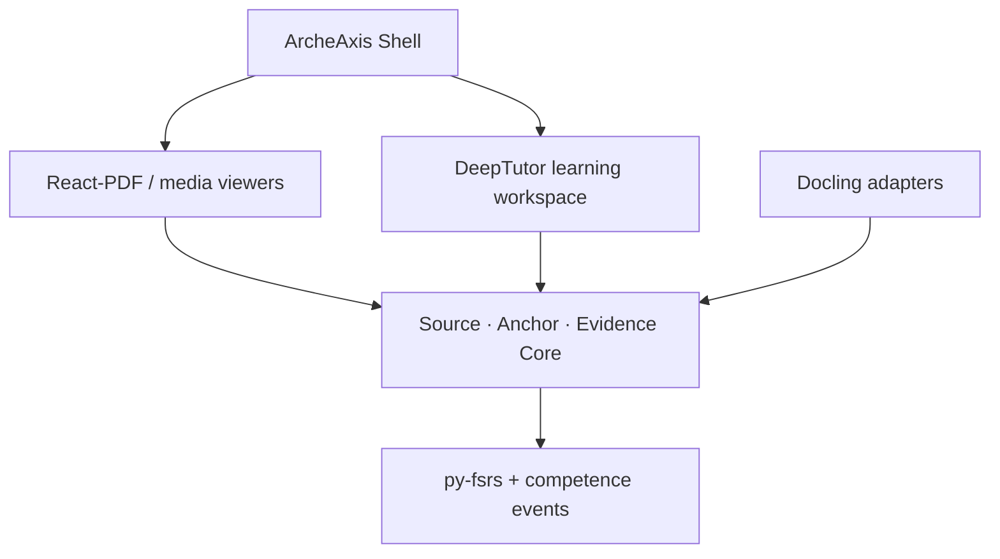
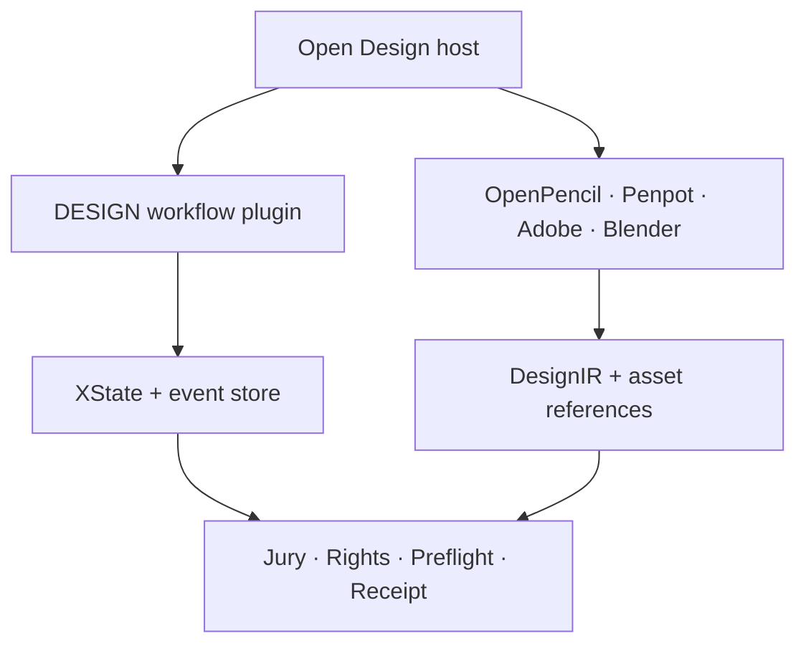
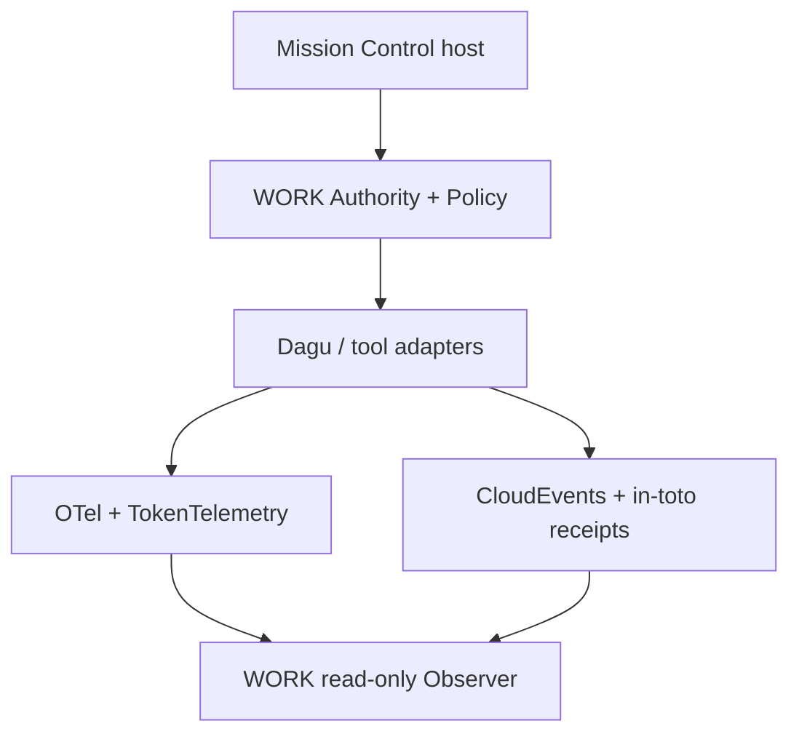

# 三项目云端仓库重新审计：前端优先、开源优先、多角色裁决

**审计日期：** 2026-08-31  
**审计对象：** ArcheAxis Knowledge OS、DESIGN-LAB、WORK-LAB 云端 `main`  
**审计性质：** 只读审计；未修改、提交、推送或发布三个仓库  
**裁决原则：** 遇到通用问题先调研成熟产品、开源项目与行业标准；优先整包采用、官方插件、适配器或外置服务，不默认独立自研。

---

## 1. 执行结论

三个仓库都有新提交，但截至本次审计，**三个当前 `main` 都不能同时满足“可安装、可连续完成核心工作、状态可信、可发布”四个条件**。

| 项目 | 当前云端 `main` | 当前 CI | Release | 前端真实状态 | 总体裁决 |
|---|---|---|---|---|---|
| ArcheAxis | `500fa778664c7a09ac973ccbb0d304d88f32f848` | 失败：`browser-smoke`，继而总门禁失败 | 最新公开版 `v0.6.14`，源码落后于 `main` | 有完整桌面壳和九空间，但关键学习/证据闭环仍弱，移动端提交打破既有 UI Contract | **接近可体验，不是当前可发布版** |
| DESIGN-LAB | `33488c882d267d683250ae684caf28d0916d9099` | `Canonical Verify` 成功 | 无 Release | 没有真正可运行的中央产品前端；Open Design 仍为 E0/未启动，Review Surface 是 Markdown 生成器 | **结构绿色，产品未成形** |
| WORK-LAB | `e5231f0f605d1515ed12958267b394c9de1da20c` | 失败：Observer、Integration、Workflow Assistance | 最新 `v0.1.0-native-observer`，明显落后于 `main` | 两套 Observer 并存；React 未进入有效 CI；没有真正可写的 Control Surface | **当前真值不可信，不可发布** |

最重要的判断不是“三个项目还要补多少页面”，而是：

1. **ArcheAxis 应停止扩张通用壳层，采用成熟阅读、解析、学习组件，把独有工程量集中在 Source、Anchor、Evidence、Provenance 与人机掌握真值。**
2. **DESIGN-LAB 应立即把 Open Design 资格化为正式宿主，把 OpenPencil/Penpot 当编辑宿主，而不是继续等待自研前端。**
3. **WORK-LAB 应采用成熟 Control Plane 和执行/遥测组件，撤销假实时、假健康、假完成；WORK 自己只保留权威、策略、审批、适配器和回执。**

### 当前产品成熟度

采用统一口径：E0 候选、E1 登记、E2 原型、E3 集成、E4 实测、E5 发布。

| 项目 | 前端 | 后端/领域真值 | 真实黄金流程 | 发布成熟度 |
|---|---:|---:|---:|---:|
| ArcheAxis | E3 | E3 | E2–E3 | 旧版 E5；当前 `main` E3 |
| DESIGN-LAB | E1–E2 | E1–E2 | E0–E1 | E0 |
| WORK-LAB | Observer E2–E3；Control E1 | E2 | E1–E2 | 旧 Observer E5；当前 `main` E2 |

---

## 2. 审计范围与证据边界

本轮检查了：

- 三仓当前 `main` 的精确 SHA、提交变化和根级规则；
- 总结、交接、状态、任务包权威索引和 Release 声明；
- 前端入口、响应式规则、桌面壳、API 映射、加载/空态/未知态；
- 后端领域模型、运行时适配、状态来源、人工门禁、回执和供应链；
- GitHub Actions 当前运行结果及可在源码中复现的失败原因；
- DESIGN-LAB 新增视觉资产的视觉与可交付性；
- 成熟开源项目的当前官方仓库、许可证、发布状态和适合的融合方式。

本轮没有在真实 Windows 11 桌面上逐点击运行三个产品，也没有登录私有外部服务。因此“云端源代码和 CI 可证明的事实”与“真实桌面运行仍需验收的事项”在报告中严格分开。

---

## 3. 跨项目的前端总审计

### 3.1 三个项目不是缺同一种前端

| 维度 | ArcheAxis | DESIGN-LAB | WORK-LAB |
|---|---|---|---|
| 主要用户 | 学习者、研究者、知识工作者 | 设计师、设计负责人、非专业委托方 | 架构师、工程师、治理负责人 |
| 前端任务 | 阅读、锚定、证据、学习、复习、知识交换 | Brief、方向、生产协同、人审、预检、交付 | 配置、审批、执行、观测、追责、恢复 |
| 应采用的成熟底座 | React-PDF/PDF.js、DeepTutor、Docling、React Aria/Radix/Mantine | Open Design、OpenPencil、Penpot、Storybook | Mission Control、Dagu、TokenTelemetry、OTel/Grafana |
| 自研应保留 | 精确锚点、证据链、学习与机器掌握真值 | 专业设计知识、质量门、Jury、Rights、Preflight、Receipt | Authority、Canonical Config、Policy、Adapter、Approval、Receipt |
| 明确不再自研 | PDF 阅读器、通用学习 Chat/Quiz 壳、组件库 | 完整设计画布、完整 Photoshop/Figma 替代品、通用 Agent 壳 | 通用任务看板、工作流引擎、遥测栈、第三套 Observer |

### 3.2 共同前端缺陷

1. **“结构存在”常被写成“产品完成”。** DESIGN 的静态门禁绿色、WORK 的任务权威索引全完成、Arche 的空间入口存在，都不能证明用户完成过一次真实工作。
2. **状态真值没有统一落在 UI。** WORK 最严重：缺失遥测被映射成 `0`、`idle` 或 `healthy`；DESIGN 的 E0 宿主可在高层规则里被写成正式宿主；Arche 的界面功能入口强于锚点和掌握度证据。
3. **重复壳层多于黄金流程。** WORK 有 React Observer、静态 Observer、静态 Mission Control；Arche 有较重自研桌面壳和两套 Tauri 工程；DESIGN 反而没有真正中央宿主，却积累了大量结构文件与能力声明。
4. **自动化覆盖错位。** CI 多数验证文件、Schema、清单和静态合同，真正的浏览器交互、桌面运行、人工审批、写后读回和跨软件产物验证不足。

### 3.3 前端统一完成定义

以后任何“前端完成”至少要同时具备：

- 可从全新环境安装和启动；
- 新用户无需阅读仓库文档即可完成一条核心流程；
- Loading、Empty、Offline、Unknown、Error、Partial、Success 七种状态可区分；
- 可访问性键盘路径、焦点、标签和对比度通过自动与人工检查；
- Windows 11 桌面、1366×768、1920×1080、窄窗口至少四档验收；
- 每次关键写操作有服务端回读和不可伪造回执；
- 视觉回归、E2E、桌面 smoke 与 Release 构建在 CI 中使用同一产品入口；
- 截图、录屏、日志、产物哈希和版本信息组成证据包。

---

## 4. ArcheAxis Knowledge OS：架构师与普通用户视角

### 4.1 产品定位裁决

ArcheAxis 的稳定内核仍然成立：它是**本地优先、证据驱动的人机双向重型学习与可信知识 OS**，不是普通 RAG、聊天页或通用 Agent OS。

从架构角度，它最有价值的不是九个导航入口，而是下列领域对象能否成为统一真相源：

`Original Source → Precise Anchor → Evidence → Claim/Conclusion → Human Learning Event → Machine Competence → Provenance/Receipt`

从用户角度，产品必须让“我正在看什么、我标了哪里、这个结论凭什么、我是否真的学会、机器是否真的能复用”始终可见。

### 4.2 当前做得好的地方

- 当前仓库已有较完整的本地桌面壳、空间导航、Inspector/活动区域和后端合同基础。
- Source、Anchor、Provenance、学习/机器掌握的领域方向比通用学习工具更有差异化。
- 最新提交复用了官方 Tauri 文件选择器，说明“官方组件优先”路线是可行的。
- 当前 Actions 中 Python 测试、lint、安全、桌面构建、安装生命周期等主体作业通过；失败集中在前端浏览器契约，故障面相对清晰。
- 第二套 Tauri 现已明确为 Recovery，先前两个同身份桌面壳的问题已有缓解。

### 4.3 前端关键问题

#### P0：当前 `main` 的浏览器 smoke 失败

移动端提交在窄屏保留 56px 纵向图标栏，而 `a0_browser_smoke.py` 的现有合同要求窄屏 rail 接近全宽、呈横向/底部形态。结果不是“测试太严格”，而是**UI Contract 和实现发生分叉**。在裁决新合同前，不能简单删除断言或把测试改绿。

建议：用真实用户任务先裁决移动导航。优先采用 [React Aria](https://github.com/adobe/react-spectrum)、[Radix Primitives](https://github.com/radix-ui/primitives) 或 [Mantine](https://github.com/mantinedev/mantine) 的可访问导航/抽屉/标签模式，停止继续手写基础交互组件。

#### P0：第一工作空间黄金测试仍被跳过

`ClosedLoopSpaces.test.tsx` 中“四库健康”关键测试仍为 `it.skip`。一个 OS 壳可以渲染九个空间，但如果首次工作区、导入、锚定、证据和学习不能连续验收，入口越多，用户越难判断产品究竟完成了什么。

#### P0：阅读器不能支撑精确证据链

当前资料库对 PDF 使用浏览器 `<iframe sandbox="">`，证据锚点主要靠手填页码。它缺少：

- 文本选择锚点；
- 区域/坐标锚点；
- 搜索、缩放与命中高亮；
- 锚点点击回跳；
- 对音视频的时间码锚点；
- 原件哈希变化后的失效与迁移提示。

这类功能不应从 PDF 渲染层开始自研。采用 [React-PDF/PDF.js](https://github.com/wojtekmaj/react-pdf/blob/main/packages/react-pdf/README.md) 作为阅读层，只自研 ArcheAxis 独有的 Anchor/Selector/Provenance 适配和持久化。

#### P1：当前视觉更像通用暗色仪表盘，弱化了学习主线

历史 OSUI 预览是较清晰的三栏学习工作台；当前代码转向大量深色卡片、渐变与九空间导航。视觉并非不能暗色，而是：

- 新用户首先看到系统结构，不是当前学习对象；
- 术语如 FSRS、M/K level、delta 直接暴露给普通用户；
- Teach-back 要用户手填概念、参考答案和关键词，像内部调试表单；
- Source/Anchor 与复习、测验、讲解之间的上下文连接不够强。

用户层文案应说“今天该复习什么”“这个结论来自哪里”“你刚才漏掉了哪一点”；FSRS 参数、机器掌握层级和置信变化进入 Inspector 高级区。

#### P1：两套 Tauri 虽已区分，仍需明确发布所有权

根 Tauri 是正式产品，`desktop` 是 Recovery 且不打 bundle。应进一步固定：唯一正式安装包、Recovery 的触发条件、数据兼容版本、升级/回滚和 CI 责任，防止恢复壳再次演化成第二产品。

### 4.4 后端与系统架构问题

- Source、Anchor、Evidence、Learning Event、Machine Competence 必须共享稳定 ID 与版本语义，不能由各页面自行拼装 DTO。
- 学习掌握和机器掌握必须由服务端事件计算；客户端只提交答题/讲解/验证证据，不能自报“已掌握”。
- 文件导入、OCR、解析、切块、嵌入是通用基础设施，不应继续扩写定制解析器。优先采用 [Docling](https://github.com/docling-project/docling) 的统一文档模型与本地解析能力，通过 Adapter 转成 ArcheAxis Source/Anchor。
- 间隔重复算法采用官方成熟实现 [py-fsrs](https://github.com/open-spaced-repetition/py-fsrs)，ArcheAxis 只保存学习事件、参数版本和可重算结果。
- DeepTutor 不应替代 ArcheAxis 的证据真值层，但它已经提供完整的教学、测验、研究、可视化、课程、掌握和沉浸阅读表面，适合成为默认 Learning Workspace/sidecar，而不是只当 README 参考。[DeepTutor](https://github.com/HKUDS/DeepTutor/blob/main/README.md)

### 4.5 推荐目标架构

这里的融合边界很清楚：成熟项目承担阅读、解析和通用教学表面；ArcheAxis 保留不可替代的原件、精确锚点、证据链和双向掌握真值。

### 4.6 14 天应证明的可用纵切

1. 新建工作区并导入一份 PDF；
2. PDF 由 React-PDF/PDF.js 展示，Docling 解析；
3. 用户选择一段文字或一个区域形成精确 Anchor；
4. 由 Anchor 创建 Evidence 和 Claim，点击可回跳原文；
5. 一键进入 Learning Workspace，自动生成讲解/测验，不要求用户手填参考答案；
6. 学习结果作为事件写回，py-fsrs 生成下次复习；
7. 机器知识候选只有在服务端验证后才提升状态；
8. 重启应用后数据、锚点、学习计划和回执可恢复；
9. 浏览器、Tauri、窄窗口和安装包使用同一条 E2E 证据。

在这条纵切完成前，暂停新增空间、主题效果、通用 Agent、ASR 工作台和完整 Job Center。

---

## 5. DESIGN-LAB：设计师与小白用户视角

### 5.1 产品定位裁决

DESIGN-LAB 必须有前端，但不是重造 Photoshop、Figma 或 Blender。它应是：

**Brief → 方向锁定 → 宿主生产 → 人工 Jury → 权利检查 → 技术预检 → 交付与回执**

设计师需要专业上下文、版本比较、批注、质量门和宿主软件联动；小白用户需要模板化 Brief、可理解的方向选择、清楚的审批动作和“不懂专业术语也不会误交付”的保护。

### 5.2 当前做得好的地方

- 根规则已明确人工审美门禁不能被生产模式绕过。
- 仓库已经形成设计系统、技能、质量和适配器的结构化目录。
- 新视觉资产说明项目能形成方向稿和展示材料；Nebula 设计系统可作为第一套垂直样板。
- Canonical Verify 当前成功，说明清单/合同层没有立即崩溃。

但这些优点仍停留在结构和样板层，未形成产品闭环。

### 5.3 前端关键问题

#### P0：没有真正可运行的中央前端

仓库的根规则写 Open Design 是正式宿主，但产品清单又写“无默认宿主”；Open Design Adapter 仍是 E0、unsupported、runtime not started。当前 Review Surface 只是 Python 生成的 Markdown，不是可交互的版本对比、批注和审批界面。

因此 DESIGN 当前不是“前端还不够漂亮”，而是**产品入口尚未落地**。

解决方法不应是新建另一个 React 应用。直接资格化 [Open Design](https://github.com/nexu-io/open-design) 为正式主界面和插件宿主。其当前仓库许可证为 Apache-2.0，最新发布为 `open-design-v0.21.1`；本仓清单中旧版本和许可证信息必须纠正，并锁定具体 tag/SHA。

#### P0：人审门禁只存在于规则，没有可操作 UI

设计师需要看到：

- Brief 与已锁定方向；
- 版本 A/B 和局部放大；
- 批注位置与负责人；
- Jury 每一项判断及理由；
- 拒绝后回到哪个生产步骤；
- Rights/Preflight 的阻断原因；
- 批准后生成的不可变交付回执。

小白用户则只应看到“要你决定什么、差异在哪里、批准会发生什么、还能否撤回”。专业检查细节放到展开层。

#### P0：状态绿色，但核心后端仍是 TODO

`design-lab-core/src/index.js` 只有很薄的内存 Map；DesignIR 读写、Jury、Rights、Preflight、Receipt 均返回 `not-implemented`。这意味着即使接上漂亮前端，也没有可持久化的工作流真值。

不要自研状态机。采用 [XState](https://github.com/statelyai/xstate) 定义并可视化 `Brief → Direction → IR → Human Gate → Jury → Rights → Preflight → Delivery`，持久化事件和产物引用；DESIGN 只实现专业门禁规则。

#### P1：新增视觉资产“可看”，但不可生产交付

本轮检查的 8 张 PNG 视觉统一、展示感较强，但存在：

- 标牌文字有明显生成式乱码；
- 多张图强烈偏向深蓝金色豪华酒店风，与“不是酒店大堂”“金色限制使用”的反参考冲突；
- 所谓 construction detail 是概念渲染，不是可施工 CAD/节点详图；
- 没有可编辑 CAD、3D、矢量源文件、图层、字体、材质表和尺寸依据；
- sidecar 将素材简单标成 MIT、sourceId 为空，只写“ComfyUI + SDXL 1.0”，缺模型/权重/工作流版本、输入来源、哈希和商业使用依据。

因此这些文件只能标为“AI 概念参考图”，不能进入正式施工、品牌或客户交付包，也不能用仓库许可证替代素材来源与模型许可记录。

#### P1：小白用户没有渐进式引导

当前目录和概念偏工程化。小白入口应从四个问题开始：做什么、给谁看、必须包含什么、什么时候交；随后只给 2–3 个方向卡片和明显的选择理由。DesignIR、Adapter、MaterialX、OCIO 等术语不应成为首屏负担。

### 5.4 设计宿主与开源融合

| 问题 | 成熟项目 | 融合方式 | DESIGN 保留什么 |
|---|---|---|---|
| 中央产品壳、预览、插件、CLI/MCP | [Open Design](https://github.com/nexu-io/open-design) | 固定 tag/SHA 的正式宿主；写 DESIGN 插件 | Brief、门禁、Jury、Rights、Receipt |
| 可编辑矢量/UI 画布 | [OpenPencil](https://github.com/open-pencil/open-pencil) | 外置/嵌入式编辑宿主；通过 CLI/MCP/SDK 读写回传 | DesignIR 映射、质量规则、回执 |
| 成熟协作设计与原型 | [Penpot](https://github.com/penpot/penpot) + [Penpot MCP](https://github.com/penpot/penpot-mcp) | 外置服务/宿主适配器 | 项目编排和验证，不复制画布 |
| 流程状态 | [XState](https://github.com/statelyai/xstate) | 内嵌状态机库 | 专业状态与人工门禁定义 |
| 组件展示与视觉回归 | [Storybook](https://github.com/storybookjs/storybook) | 插件/设计系统工作台 | DESIGN 规则和品牌组件 |
| 资产、颜色、材质交换 | OpenAssetIO、OpenColorIO、MaterialX | 按官方标准和 Adapter 接入 | 所有权、来源、质量门、交付 |

[OpenPencil](https://github.com/open-pencil/open-pencil) 当前明确仍在活跃开发且存在粗糙边缘，因此适合锁版本的编辑宿主，不适合把 DESIGN 的唯一真相源迁入其私有模型。Penpot 采用 MPL-2.0，也应保持服务/适配边界，避免把其代码直接混入核心。

### 5.5 推荐目标架构

### 5.6 14 天应证明的可用纵切

1. 安装锁定版本的 Open Design，加载 DESIGN 插件；
2. 小白用向导创建一个真实 Brief；
3. 设计师选择并锁定方向，状态机记录不可悄改的事件；
4. 从 OpenPencil 或 Penpot 创建/修改一个真实可编辑资产；
5. 写回 DesignIR、预览图、源文件路径、版本和哈希；
6. Review Surface 支持 A/B、放大、坐标批注、拒绝与再提交；
7. 人工 Jury 为强制门，自动评分只能提供建议；
8. Rights 与 Preflight 至少各有一个真实阻断案例；
9. 通过后输出包含源文件、导出件、许可、字体/素材、检查结果和回执的交付包；
10. 全新 Windows 环境可重装并重开该项目。

在此之前，不再新增独立画布、通用聊天壳、只生成 Markdown 的“Review UI”或不可编辑的“pixel-perfect”能力声明。

---

## 6. WORK-LAB：架构师与工程师视角

### 6.1 产品定位裁决

WORK-LAB 不是一个监控页面，而是：

- **可写 Control/Governance Plane：** 权威配置、策略、预算、任务、审批、适配器、恢复；
- **严格只读 Observer：** 展示真实运行状态、阻塞、成本、日志、证据和漂移。

DSH、Hermes、Codex、Dagu、Mission Control、TokenTelemetry 都只能是可替换 Adapter 或外置运行时，不能成为 WORK 的领域真相源。

### 6.2 当前做得好的地方

- 根规则已经明确 Control 与 Observer 的职责边界。
- 仓库有较多权威、配置、Adapter、Receipt 和供应链合同基础。
- Observer 已经有 React/Tauri 和静态服务两条可视入口，可以提炼 WORK 独有的真值展示。
- Actions 已经把 Observer、供应链、集成、Token 监测和工作流辅助拆成作业，失败面可定位。

### 6.3 前端关键问题

#### P0：Observer 仍在伪装真实与健康

当前 live server 的 `/api/v1/events` 明确返回 `status: stub`，但快照却声明 transport `LIVE`、`fresh`、`eventStreamConnected: true`，并使用当前时间填充时间戳；Git SHA、DSH 与 Dagu 版本还有硬编码。Hermes 数据缺失时，部分结果变成空数组和空 totals，前端继续把缺失状态显示为 `0`、`idle`、`healthy` 或“无错误”。

这违反 Observer 的第一原则：**未知必须是 UNKNOWN，不得被数值零或绿色状态掩盖。**

应该建立统一 `TelemetryValue<T>`：

- `value`
- `state: known | unknown | stale | error | partial`
- `observedAt`
- `source`
- `reason`
- `confidence`

任何 KPI、图表、资源数、成本、Agent 状态都只能从这个合同渲染。

#### P0：两套 Observer 和一个伪 Mission Control 并存

- React `frontend/src` 约 1,078 行，已经打入 Tauri；
- 静态 `web/` 约 4,765 行，当前 Python live server 服务这一套；
- `apps/mission-control/index.html` 是自写静态页，不是上游 Mission Control，且硬编码示例运行和日期。

继续维护三套页面只会制造第三种真相。应：

1. 资格化上游 Mission Control 为可写 Control Surface；
2. 选择 React Observer 作为唯一 WORK 独有只读壳；
3. 将静态 Observer 降为故障恢复/诊断页面，或在替代验证后删除；
4. 删除伪 Mission Control 页面，不再维护假交互。

#### P0：React 产品线没有进入真正的 Observer CI

当前 Observer 作业先有 skeleton 失败；本地继续执行会因为未安装 `jsonschema` 出现 `ModuleNotFoundError`。工作流没有构建/测试 React Observer，而名为 token-monitor 的成功构建属于另一应用。当前红灯不是偶发云故障，而是依赖声明和 CI 路径都不完整。

#### P1：响应式与可用性不足

React 中存在固定四列 KPI 和 `1fr + 320px` 布局，但 Tauri 最小宽度 320。窄窗口必然拥挤。状态离线时，顶层 KPI 仍可能显示运行数 0、Agent 数 0，仅有小字提示 offline；工程师很容易把“没有数据”误读为“系统没有任务且健康”。

### 6.4 后端、权威与工程问题

#### P0：任务包权威存在假完成

`taskpack-authority-index.json` 将 R2、WLR-000..130 全部标为 completed/FROZEN，但仓库中的实际任务包仍是旧 R1、旧 SHA，并保留 TODO/条件任务。`RELEASE-0.1-USABLE.md` 也在承认 WLR-060 CI、WLR-110 上游工具和跨项目流程未完成的同时声称 0.1 usable。

需要用机器校验建立单一权威链：

`用户决定 → 当前任务包文件+哈希 → task ID → 代码提交 → 测试证据 → Release`

任何一环缺失都不能标 completed。

#### P0：当前 `main` CI 确实失败

当前运行中 Observer、Integration、Workflow Assistance 失败。Integration 的供应链脚本可复现发现 `.github/workflows/wlr-060-gates.yml` 中 4 个 checkout action 缺版本注释；同一工作流还用 `|| echo 'STUB pending'` 和 `|| true` 吞掉失败。这些是明确的假绿机制，必须移除。

#### P0：遥测依赖通过相对路径和 `sys.path` 注入

live server 通过跨目录相对路径导入 TokenTelemetry；最新清理又删除了仓内复制品，形成脆弱的环境偶然性。采用上游 [TokenTelemetry](https://github.com/VasiHemanth/tokentelemetry) 作为固定版本的外置 collector/dashboard，通过 HTTP/JSON 或事件协议接入，不在 WORK 进程里导入其源码。

#### P1：费率与汇率硬编码

前端写死 DeepSeek 费率和 CNY 7.2。费用计算应由带生效时间、币种、来源和版本的后端 Price Catalog 提供；未知价格显示 UNKNOWN，不显示估算为精确成本。

### 6.5 开源优先的融合裁决

| 能力 | 成熟项目/标准 | 裁决 | 理由与边界 |
|---|---|---|---|
| 可写 Control Surface | [Mission Control](https://github.com/builderz-labs/mission-control/blob/main/README.md) | **采用宿主** | MIT，已有任务、Agent、审批、支出、API、实时流；但官方自称 alpha，须锁 tag/SHA，WORK Authority 通过 Adapter 注入，不深 fork |
| DAG 执行、重试、人工任务 | [Dagu](https://github.com/dagucloud/dagu) | **外置运行时** | 单文件、多平台、Web UI、DAG/重试/人工任务/MCP；GPL-3.0，不能拷贝进 WORK 核心，也不能成为权威源 |
| Token/客户端观测 | [TokenTelemetry](https://github.com/VasiHemanth/tokentelemetry) | **外置采集器** | MIT，覆盖 Hermes/Codex 等；用 API 适配，不用 `sys.path` |
| 通用遥测管道 | [OpenTelemetry Collector](https://github.com/open-telemetry/opentelemetry-collector) | **采用标准和 Collector** | Apache-2.0，接收/处理/导出信号，避免自研 telemetry bus |
| 大规模观测可视化 | [Grafana](https://github.com/grafana/grafana) | **外置可选** | AGPL-3.0，只作为独立安装的深度观测工具；WORK Observer 仍显示治理真值 |
| 策略引擎 | [OPA](https://github.com/open-policy-agent/opa) | **条件 sidecar** | Apache-2.0；复杂策略出现后采用，当前先把策略合同和决策回执做对 |
| 事件/回执/Agent 协议 | [CloudEvents](https://github.com/cloudevents/spec)、[in-toto Attestation](https://github.com/in-toto/attestation)、[MCP](https://github.com/modelcontextprotocol/modelcontextprotocol) | **吸收规范** | 使用公开标准定义事件、证明和适配器，不造新的通用协议 |

### 6.6 推荐目标架构

### 6.7 14 天应证明的可用纵切

1. 固定并原样安装 Mission Control、Dagu、TokenTelemetry；保存版本、许可证、启动、重启、卸载证据；
2. Control 创建一条真实任务，请求 WORK Authority 审批；
3. 批准后由 Dagu 执行，失败可重试，人工步骤可暂停；
4. 执行事件使用 CloudEvents 风格，关键产物形成 in-toto 风格回执；
5. OTel/TokenTelemetry 提供真实信号；断开数据源后 Observer 明确显示 UNKNOWN/STALE；
6. Observer 全程只读，任何写请求均被服务端拒绝并测试；
7. Mission Control 中的修改经 WORK Authority 服务端回读后才显示成功；
8. 修复当前 Actions，删除所有吞错分支，React Observer 构建与 E2E 必须属于同一 required job；
9. 发布新的安装包和迁移说明，而不是继续复用旧 `v0.1.0-native-observer` 名称。

---

## 7. 开源复用总裁决

### 7.1 六种状态

| 状态 | 含义 |
|---|---|
| `ADOPT_HOST` | 上游承担完整产品壳/宿主，项目写薄插件与适配器 |
| `EMBED_LIBRARY` | 许可证与架构允许，将成熟库作为依赖嵌入 |
| `EXTERNAL_RUNTIME` | 独立进程/服务，通过稳定 API 接入，避免许可证和真值耦合 |
| `ADOPT_SPEC` | 吸收开放标准、数据模型与测试夹具，不复制实现 |
| `TIMEBOX_POC` | 限时验证；到期没有真实回读证据就退出 |
| `REJECT/RETIRE` | 与边界冲突、重复建设、无维护或制造第二真相源 |

### 7.2 当前推荐台账

| 项目 | 组件 | 状态 |
|---|---|---|
| ArcheAxis | React-PDF/PDF.js | `EMBED_LIBRARY` |
| ArcheAxis | Docling | `EXTERNAL_RUNTIME` / Adapter |
| ArcheAxis | py-fsrs | `EMBED_LIBRARY` |
| ArcheAxis | DeepTutor | `ADOPT_HOST`（Learning Workspace），不接管证据真值 |
| ArcheAxis | React Aria/Radix/Mantine | 三选一 `EMBED_LIBRARY`，限时 bake-off 后固定 |
| DESIGN-LAB | Open Design | `ADOPT_HOST` |
| DESIGN-LAB | OpenPencil | `EXTERNAL_RUNTIME` 或宿主插件 |
| DESIGN-LAB | Penpot + MCP | `EXTERNAL_RUNTIME` |
| DESIGN-LAB | XState | `EMBED_LIBRARY` |
| DESIGN-LAB | 自研完整画布 | `REJECT` |
| WORK-LAB | Mission Control | `ADOPT_HOST` |
| WORK-LAB | Dagu | `EXTERNAL_RUNTIME` |
| WORK-LAB | TokenTelemetry/OTel | `EXTERNAL_RUNTIME` + `ADOPT_SPEC` |
| WORK-LAB | 静态伪 Mission Control | `RETIRE` |
| 三项目 | 通用 Agent Runtime、第三套聊天壳、重复遥测/解析器 | `REJECT` |

### 7.3 所有新问题的强制处理顺序

今后遇到功能缺口或故障，执行顺序固定为：

1. 明确用户任务、输入输出、真相源和失败状态；
2. 搜索官方标准和成熟维护项目；
3. 核验精确仓库身份、许可证、最近发布、Windows 支持、API、退出路径；
4. 原样安装上游并完成最小真实任务；
5. 比较 `ADOPT_HOST / EMBED_LIBRARY / EXTERNAL_RUNTIME / ADOPT_SPEC`；
6. 只有在没有合格上游，或确属项目独有领域真值时，才批准自研；
7. 自研批准必须记录“检索过什么、为何不适用、最小自研边界、未来替换接口”；
8. 每次融合必须有锁版本、SBOM、许可证、数据所有权、升级、回滚和卸载测试。

“参考过某项目”“写了 Adapter 清单”“复制了 README”均不算复用完成；只有真实启动、调用、读回和回滚才达到 E3/E4。

---

## 8. 立即停止事项

### 三项目共同停止

- 停止新增通用聊天壳、通用 Agent Runtime、重复任务看板、重复遥测管道；
- 停止以文件存在、Schema 通过、静态页面渲染代替真实产品验收；
- 停止把 UNKNOWN 转成 0、健康、成功、idle；
- 停止未经许可证、来源、模型/权重、版本和哈希核验就把第三方或生成资产标为可商用；
- 停止任务包、状态页、Release Note 与当前代码分别维护“完成状态”；
- 停止在替代方案尚未真实运行前删除旧入口；替换需先双跑、迁移、回滚，再退役。

### ArcheAxis 停止

- 暂停新空间和视觉效果扩张；
- 不再自研 PDF 渲染器、通用解析器、FSRS 算法或完整教学壳；
- 不再让学习页面脱离当前 Source/Anchor 上下文。

### DESIGN-LAB 停止

- 不再自研中央画布或第二套 Open Design；
- 不再把 PNG 概念图描述为施工图、可编辑交付或 pixel-perfect 能力；
- 不再以 Markdown 文件代替人工 Review Surface。

### WORK-LAB 停止

- 不再维护第三套 Observer 或伪 Mission Control；
- 不再通过 `|| true`、STUB echo、动态当前时间制造假绿/假实时；
- 不再从相邻目录直接导入外部项目源码；
- 不再让前端自行决定价格、汇率或系统健康。

---

## 9. 执行优先级

三个项目不应同时全面重构，但可以并行做三个小型资格化；真正的工程顺序建议如下：

| 顺序 | 时间盒 | 项目 | 目标 | 退出门 |
|---:|---:|---|---|---|
| 1 | 2–3 天 | WORK-LAB | 修正权威链、UNKNOWN、CI 吞错；原样安装三上游 | 当前 `main` required CI 全绿且无吞错 |
| 2 | 3 天 | DESIGN-LAB | Open Design/OpenPencil/Penpot 资格化，选定正式宿主链 | 可启动、可创建并读回一个真实可编辑资产 |
| 3 | 3 天 | ArcheAxis | React-PDF、Docling、DeepTutor、py-fsrs 资格化 | 一个 PDF 可解析、锚定、学习、重启恢复 |
| 4 | 7–10 天 | 三项目各自 | 完成各自 0.1 黄金纵切 | E2E、桌面、回执、恢复证据齐全 |
| 5 | 后续 | 跨项目 | `WORK 发令 → DESIGN 执行 → ArcheAxis 沉淀 → WORK 回执` | 真实数据、无共享数据库、全链可追踪 |

这里的优先级不是让 WORK 决定其他两个产品的内部实现，而是先修复治理和观测假真值；三个项目仍保持独立仓库、独立数据所有权和独立发布。

---

## 10. 最终评分与发布判断

评分只反映当前云端 `main`，不是对愿景的评分。

| 项目 | 产品边界 | 前端可用性 | 后端真值 | 自动化可信度 | 开源复用落地 | 当前发布判断 |
|---|---:|---:|---:|---:|---:|---|
| ArcheAxis | 8/10 | 5/10 | 6/10 | 6/10 | 4/10 | 暂停发布当前 `main`，保留旧 v0.6.14 |
| DESIGN-LAB | 7/10 | 2/10 | 2/10 | 4/10 | 2/10 | 不可发布；先形成 Open Design 黄金纵切 |
| WORK-LAB | 8/10 | 3/10 | 3/10 | 2/10 | 2/10 | 不可发布；先消除假真值与红 CI |

### 最终裁决

- **ArcheAxis 最接近产品，但目前最需要的是“读—锚—证据—学—复习”的深度，不是更多 OS 表面。**
- **DESIGN-LAB 的核心缺口不是设计理论，而是把成熟宿主真正接进来，并让人审、权利、预检和可编辑资产形成运行闭环。**
- **WORK-LAB 的核心缺口不是更多仪表盘，而是让控制、执行、遥测、权威和回执拥有一条不说谎的链。**

三个项目接下来都应以“上游承担通用能力，本项目只实现独有领域真值”为架构原则。先交付三条真实、可恢复、可验证的 0.1 黄金流程，再扩边界。

---

## 11. 主要在线依据

- WORK-LAB 当前失败运行：[GitHub Actions run 33396382418](https://github.com/DTALEX66/WORK-LAB/actions/runs/33396382418)
- ArcheAxis 当前失败运行：[GitHub Actions run 33398982478](https://github.com/DTALEX66/ArcheAxis-Knowledge-OS/actions/runs/33398982478)
- DESIGN-LAB 当前成功的静态 Canonical Verify：[GitHub Actions run 33398341612](https://github.com/DTALEX66/DESIGN-LAB/actions/runs/33398341612)
- 上游身份与能力：本报告各章节所链接的官方 GitHub 仓库、README、规范与发布页。

