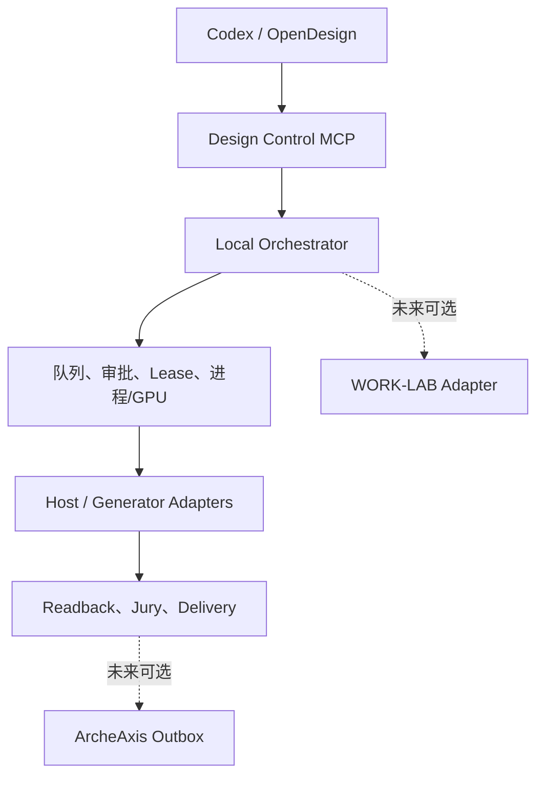
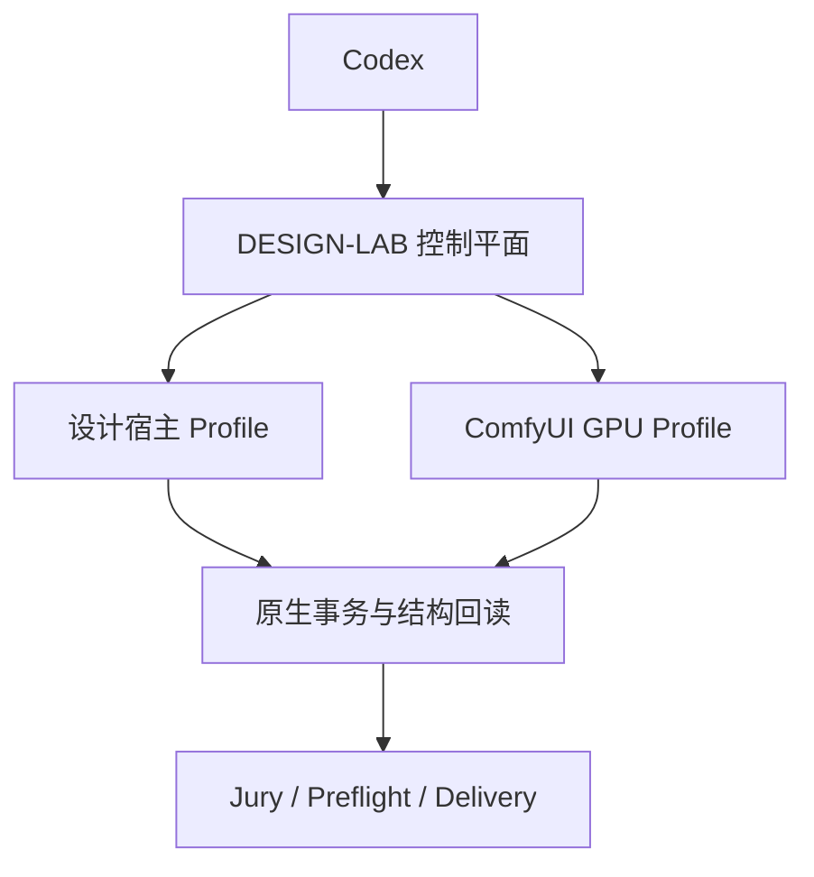
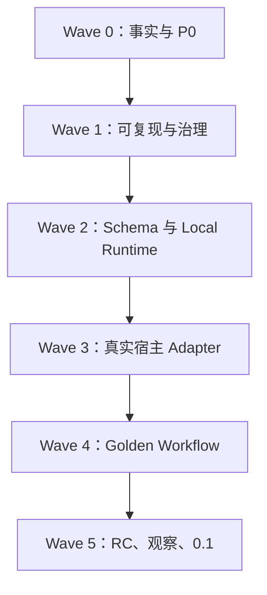
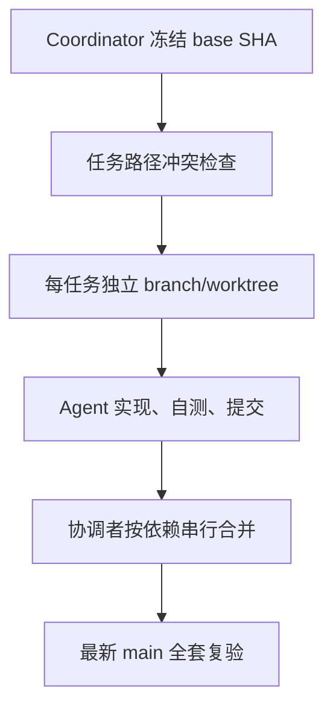

# DESIGN-LAB｜2026-09-04 完整执行任务包

> Taskpack ID：`DL-TP-20260904-STANDALONE-FIRST`  
> 版本：`v1.4-operational-closure`  
> 状态：`READY_FOR_COORDINATOR_PREFLIGHT`  
> 目标仓库：`DTALEX66/DESIGN-LAB`  
> 审计基线：`main@2aca27f69b1909251640382ed3b4195cf9accd9b`  
> 上位方案：`DESIGN-LAB-COMPLETE-REPAIR-AND-MIGRATION-PLAN-2026-09-04.md` v2.5  
> 历史证据清单：`DESIGN-LAB-HISTORY-EVIDENCE-MANIFEST-2026-09-04.csv`  
> 历史任务索引：`DESIGN-LAB-HISTORY-TASK-ID-CROSSWALK-2026-09-04.csv`  
> 项目用途：`PERSONAL_RESEARCH_NONCOMMERCIAL`  
> 默认运行：`standalone_full`  
> 深度调研截止：`2026-09-04`  
> 机器任务账本：`DESIGN-LAB-TODAY-JOB-LEDGER-2026-09-04.yaml`  
> 发布时间目标：先 `0.1.0-alpha`，未满足 DoD 不发布
> 当前规模：58 个 current 任务、38 个 PR 切片；Wave 0 之后 50 个任务仅登记不抢跑

---

## 0. 给执行者的开工指令

你正在修复和深化 `DESIGN-LAB`。不要把 WORK-LAB、ArcheAxis、HERMES 或任何未安装的跨项目组件当作工作前提。先读取本任务包和上位总方案，再检查仓库 `AGENTS.md`、`.project/manifest.yaml`、现行 CI 与当前分支状态。

执行原则：

1. 先确认远端 `origin/main` 是否仍为本任务包记录的 exact SHA；若已变化，先做增量差异审计并更新基线，不得盲目套补丁。
2. 使用新分支执行，每个 PR 单一主题、可验证、可回滚；不直接推送 `main`，不强推，不改写历史。
3. 保留用户已有改动；发现脏工作树先识别来源，不覆盖、不删除未知内容。
4. 先修 P0 真值、测试隔离和依赖锁，再迁目录、加运行时或接真实宿主。
5. 每一项能力必须经过 `probe → prepare → execute → observe → readback → rollback`；声明、截图或“返回 OK”不能作为完成证据。
6. WORK-LAB、ArcheAxis 必须默认关闭；DESIGN-LAB 在二者未安装时仍须完成完整设计生产闭环。
7. 当前仅限个人研究、非商业使用；禁止商业交付、收费服务、对外托管和受限模型/素材再分发。

首轮只允许安全、可恢复的本地改动。覆盖正式文件、登录账号、接受许可、UAC、公开发布、创建 Release、合并 PR 必须人工确认。

### 0.1 本轮完整对话覆盖表

| 用户要求 | 最终裁决 | 落点 |
|---|---|---|
| 载入项目、不要再丢历史 | 16 段完整对话、历史 ZIP、交接/审计文档、云端审计和机器清单共同构成历史基线 | 本节、§6.2、§15 |
| 多角度审计、先调研同行 | 只吸收经一手资料验证的接口/架构模式；剩余问题转真实机器资格赛 | §1.5、§16 |
| 软件太多，能否收敛 | 固定一个 DESIGN-LAB 控制平面、一个 ComfyUI GPU 执行器；按任务只启一个原生宿主 | §1.3、§1.6 |
| 工作流软件相互配合 | 使用版本化 ActionPlan/AssetManifest/Receipt 和受限 Adapter，不用剪贴板、私有 DB 或共享运行目录 | §1.2、§3、§6 |
| Codex 控制 CorelDRAW/Adobe | 原生 API/COM/UXP/MCP 优先，语义 UIA 只兜底，坐标和输入注入禁止进入正式链 | §1.4、R2-005、R2-008、R3-001/002/003/008 |
| H3 本地运行 | ComfyUI 原生 H3 Base 768p、断网、无静默云回退；地域未解决前下载/安装/运行均阻断 | R0-006、R3-004/005/009 |
| 全面审计云端最新更新 | 当前审计基线固定到 exact SHA；远端变化必须先做增量差异审计 | §2、R0-001 |
| 仓库规范与语言迁移 | Python 核心、TypeScript 薄宿主/审查面、Schema-first、单锁文件、Strangler 迁移 | §4、R1、R2 |
| 多 Agent 并行快速写入 | 一任务一 branch/worktree、路径租约、权威文件串行、协调者统一合并 | R1-006、§9.1、YAML ledger |
| 这些交给 DESIGN-LAB 还是 WORK-LAB | 当前全部设计域能力交给 DESIGN-LAB；WORK-LAB 只保留未来可选外层 Provider | §1.2、R0-008、R2-006/007 |
| 全部收敛到本项目、暂时不能跨项目联动 | 控制平面、状态、Adapter、审批、证据和 UIA 全在 DESIGN-LAB；外部项目缺席不降级 | §1.2、R0-008、R2-006/007 |
| 个人研究、非商业 | 作为项目全局用途，不等于自动获得模型/软件/素材许可 | R0-006、§8 |
| 今天给完整任务包 | 本文件为唯一人工入口，YAML 为机器派工伴随文件；旧方案全部只读映射 | §6、§10、§15 |
| 继续深化、同行调研有无新结果 | 第三轮只补齐可操作 Workbench、宿主会话、运行追踪、进程树、兼容性和 Design CI；0.1 停止扩张新软件 | §0.2、R2-003/018–021、R3-013、R4-005 |
| 日常使用不应先开终端 | 提供无可见终端的本地启动器和可实际审批/接管/交付的 Review Console；CLI 仍供高级用户 | R2-003、§3.6 |

历史覆盖统计来自 2026-09-04 已生成的机器清单：36 份 DESIGN-LAB 直接文档、6 个历史 ZIP 内 473 个文件，以及跨项目/本轮附件；清单含 536 条数据记录，其中 532 个真实物化文件、4 个传输占位、300 个唯一内容 hash、224 个重复 hash 组。完整对话归档为 8,961,542 bytes、229,424 行、16 段项目对话，SHA-256 为 `df78b7fe3b109f6d0fdc646147f5c37c476689acca53a816c3a58a959069c0cf`。派生的历史任务索引扫描 284 个去重后的可读内容 hash，登记 1,450 个逐位置 occurrence、527 个原始 ID、774 个 source+conversation 实体和 178 个裸 ID 碰撞组；其 SHA-256 为 `74c5b7cc132f626ad839e2a36566af92e650886cffeb4d7d41c290c657aa393c`。

这里的“完整”只覆盖当前可访问的对话归档、文件、历史包和 Git 记录；已删除、未共享、其他账号或从未进入这些系统的材料无法凭空证明。未来发现新材料时，只能追加到证据清单并重新计算覆盖，不能推翻或遗忘本基线。

### 0.2 v1.4 第三轮深化的收口

本轮不再扩张软件名单，而是把“能连上”收口成“真能日常用、可中断、可接管、可恢复、可审计”：

| 新闭环 | v1.3 的缺口 | v1.4 的硬结果 |
|---|---|---|
| 操作界面 | 当前仓库只有 Markdown Review Surface 生成器 | 可用的本地 Review Console；Brief、Plan/Diff、进度、预览、审批/驳回、接管、交付完整闭环；正常启动无可见终端 |
| 安全改稿 | 只有 ActionPlan/双回读，尚无锁定内容与变更集 | `DesignContext + ChangeSet + semantic/visual DesignDiff`，每次批准的只是明确差异 |
| 宿主会话 | 尚无统一 host/document ownership 与人工活动仲裁 | HostSession/DocumentSession Broker；区分 attach/launch、已有未保存文档、modal/focus/revision、心跳和 reconciliation |
| 诊断与隐私 | evidence 有设计，但没有跨 MCP/job/host 的统一 RunTrace | W3C trace context + OpenTelemetry 本地信号；证据与可采样 telemetry 分离；默认不外传，支持脱敏诊断包 |
| 进程生命周期 | ProcessSupervisor 未限定子进程树与资源 | Windows Job Object 只管 DESIGN-LAB 自己启动的 helper/bridge/Comfy worker；温和取消后才终止，永不误杀用户已打开的设计宿主 |
| 版本与插件 | 只有 source lock 和单项资格赛 | Host/Plugin/OS/locale/DPI 兼容矩阵、安装/卸载/回滚收据和每版 recovery canary |
| 回归与生产保真 | Jury 与 Golden Workflow 已有，结构/视觉差异尚未成为 CI | Design CI 同时验证 must-keep、对象树、字体/色彩/链接和批准的感知阈值；基线不得自动更新 |

到 v1.4 为止，0.1 的架构选型与软件组合已收敛。继续广泛搜索不再作为开工前置；剩余不确定性只能用目标 Windows 机、真实宿主版本、部署地域和 GPU 实测消除。

---

## 1. 今日对话的最终裁决

### 1.1 项目定位

DESIGN-LAB 是宿主中立的专业设计生产层，负责：

- Brief、DesignIR、Profile、ActionPlan 与 AssetManifest；
- 设计方法、Domain Pack、Rubric、Visual Jury；
- CorelDRAW、Adobe、OpenDesign、ComfyUI/H3 等设计宿主 Adapter；
- 设计域本地调度、队列、审批、lease、进程/GPU、恢复和证据；
- Rights、Preflight、结构回读、版本关系和 Delivery Receipt；
- 一个只读/审批导向的薄 Review Surface。

DESIGN-LAB 不是第二个 Photoshop/Figma/OpenDesign，不是通用 Agent OS、企业 IAM、模型聚合网关、收费平台或跨项目数据库。

### 1.2 Standalone-first 是硬约束

设计域全部纵向能力收敛到本仓：



- WORK-LAB：未来只可作为跨项目外层调度 Provider，不拥有设计 Adapter 或设计运行真值。
- ArcheAxis：未来只接收获批的 `KnowledgeCandidate`，不进入设计运行热路径。
- 当前两者均为 `enabled=false`，安装、启动、测试、Golden Workflow、恢复和发布不得依赖它们。
- 禁止读取外部项目私有数据库、运行目录或内部进程状态。

### 1.3 软件组合收敛

| Profile | 默认软件 | 说明 |
|---|---|---|
| 核心运行 | Codex + DESIGN-LAB | 必装；DESIGN-LAB 只承担设计域编排、控制、证据和交付 |
| 默认创作 | 核心运行 + OpenDesign + Photoshop + ComfyUI | 结构化创作、栅格精修、本地 GPU 队列；H3 不再被隐含为必装 |
| Windows 平面/印前 | 默认创作 + CorelDRAW **或** Illustrator (Beta) | 按文件/任务二选一；不要求同时常驻 |
| H3 本地生成 | ComfyUI 原生 H3 节点 + 外置模型卷 | 仅在地域许可、模型锁、硬件 canary 和断网测试全部通过后启用 |
| 云协作 | Figma MCP | 明确标记 `remote/beta/seat-gated`，不作为离线默认或本地真值 |
| 长文档/动效 | 按任务启用 InDesign、Premiere、After Effects、Blender | 不进入 0.1 默认安装；时间线边界优先 OTIO |
| 资格候选 | OpenPencil、Penpot、Inkscape、Krita、MiniMax Design | 经过同一资格赛后按 Profile 选择，不全部堆叠 |

不默认安装 Power Automate、AutoHotkey、UiPath、SGLang、DVC、MLflow、第二个 Agent 桌面壳或多个 Photoshop MCP。0.1 的唯一 GPU 媒体执行器是固定版本 ComfyUI；只有出现多 GPU/并发服务的实测需求时，才另立 ADR 评估 SGLang Provider。

### 1.4 控制软件的技术优先级

1. 宿主官方接口：Illustrator Beta MCP、Corel COM/VGCore、Photoshop/Adobe UXP、脚本 DOM、CLI。
2. 语义 UI Automation：DESIGN-LAB 内部受限 `winapp ui`/UIA Provider，仅补标准对话框。
3. 视觉/坐标：只允许人工探索，不得进入正式 Adapter；正式 Fixture 坐标点击必须为零。

### 1.5 同行深度审计后的吸收裁决

| 同行/标准 | 已验证的成熟模式 | DESIGN-LAB 吸收 | 明确不吸收 |
|---|---|---|---|
| OpenDesign | Agent/runtime 使用声明式定义，通用引擎统一探测、启动、流解析和取消；同一 daemon API 服务 UI/CLI | 只吸收“定义文件 + 通用引擎”，且仅用于设计宿主/Provider | 不复制 Electron/Next/Express/SQLite 产品壳；不继承 `bypassPermissions`、`--yolo` 等宽权限姿态（[官方架构](https://github.com/nexu-io/open-design/blob/main/docs/architecture.md)、[Agent Adapter](https://github.com/nexu-io/open-design/blob/main/docs/agent-adapters.md)） |
| AYON | DCC Host、Connector、Binary Distribution 职责分开；Creating 与 Publishing 两阶段 | 拆分 Adapter 种类；引入 Prepare/Create → Validate/Publish/Deliver | 不引入 AYON Server、工作室数据库、生产追踪和农场调度（[Addon 类型](https://docs.ayon.dev/docs/dev_addon_creation/)、[发布流程](https://docs.ayon.dev/docs/dev_publishing/)） |
| OpenAssetIO | Host/Manager 解耦；用 entity reference 和 traits 代替固定文件路径 | 实现最小 `AssetRef + TraitSet + RuntimeBinding`，机器路径保持 opaque | 不建设完整资产管理系统或第二数据库（[官方设计](https://docs.openassetio.org/OpenAssetIO/)） |
| OpenTimelineIO | 版本化时间线、adapter、media linker | 动效/剪辑交接使用 OTIO；DesignIR 只引用，不自造时间线 IR | 不复制媒体进时间线；不重写已有时间语义（[OTIO 0.18.1](https://opentimelineio.readthedocs.io/en/v0.18.1/)） |
| Illustrator Beta MCP | 官方内置 MCP，当前可用 40 个 Illustrator 工具/动作 | 快速资格赛；版本/客户端绑定证据；失败自动降级 | Beta 不升级为无条件默认，不用历史 smoke 代表当前能力（[Adobe 官方说明](https://helpx.adobe.com/illustrator/desktop/connect-with-other-apps-and-tools/about-using-ai-tools-with-illustrator.html)） |
| Adobe for creativity | 官方连接器以 50+ 策划过的专业动作组合跨应用任务，并在过程中向用户取输入、把资产交回原生软件 | 借鉴 outcome-first recipe 与人机交接，不让 Agent 直接编底层脚本 | 云账号/客户端依赖不进入本地必需链（[Adobe 官方介绍](https://blog.adobe.com/en/publish/2026/04/28/adobe-for-creativity-connector)） |
| Figma MCP | 可写入原生 frame/component/variable/auto-layout | 作为云协作 Profile，适合设计系统驱动的结构化任务 | Full seat、编辑权限、20 KB 响应、无图片/自定义字体和 Beta 质量意味着不能承诺离线/全功能（[Figma 官方限制](https://developers.figma.com/docs/figma-mcp-server/write-to-canvas/)） |
| Adobe UXP / Corel COM | 宿主原生 modal/history/command group 可形成单步 Undo 和回滚 | 统一 `NativeTransaction` 合同，强制 finally、取消、回读和状态恢复 | 不把“脚本返回成功”当提交成功（[Photoshop executeAsModal](https://developer.adobe.com/photoshop/uxp/2022/ps-reference/media/executeasmodal)、[Corel CommandGroup](https://community.coreldraw.com/sdk/api/draw/27/m/document.begincommandgroup)） |
| Microsoft winapp/UIA | 大部分命令走 UIA pattern；click/drag/send-keys 属于真实输入注入 | 只开放 inspect/search/get/set/invoke/wait/screenshot 的受限子集 | 输入注入默认拒绝；锁屏、UAC、提权或 selector 歧义直接人工（[Microsoft 官方说明](https://learn.microsoft.com/en-us/windows/apps/dev-tools/winapp-cli/ui-automation)） |
| ComfyUI | 稳定队列/历史/中断/WS 进度接口；原生 H3 支持 | 唯一本地 GPU 执行器；prod/staging 隔离 Profile；模型卷只读 | standalone_local 禁 Partner Nodes、在线装节点、自动更新和远程回退（[Server routes](https://docs.comfy.org/development/comfyui-server/comms_routes)、[Partner Nodes](https://docs.comfy.org/tutorials/partner-nodes/overview)） |
| Power Automate Desktop / Flamenco | 成熟 RPA 使用 selector/retry/会话排他；渲染管理使用 job→task→command 和 worker 事件 | 借鉴 selector bundle、单会话排他和 durable job graph | 0.1 不依赖 PAD、云队列、Blender 农场或 Kubernetes（[PAD unattended](https://learn.microsoft.com/en-us/power-automate/desktop-flows/run-unattended-desktop-flows)、[Flamenco jobs](https://flamenco.blender.org/usage/jobs-tasks-commands/)） |

### 1.6 成熟搭配的最终答案

最成熟的收敛方式不是寻找一个“全能设计软件”，而是固定一个控制平面、一个 GPU 执行器，再按任务选择一个原生设计宿主：



- OpenDesign 是默认结构化创作宿主，不是 DESIGN-LAB 的运行内核。
- Photoshop 是默认栅格精修宿主；CorelDRAW 或 Illustrator Beta 是按任务启用的矢量/印前宿主。
- ComfyUI 是唯一 GPU 执行器；H3 是其下的许可门控模型 Profile，不是第二个调度服务。
- Figma 是远程协作 Profile；WORK-LAB、ArcheAxis 仍是未来可选外层 Adapter，不进入当前热路径。
- 每个 Profile 都必须用同一套 `probe → prepare → execute → observe → readback → rollback → publish` 证据升级，不能用品牌、截图或“有人演示过”代替资格赛。

### 1.7 MiniMax 四种身份必须分开

| 身份 | 当前定位 | 默认状态 |
|---|---|---|
| `minimax-design-host` | MiniMax Design Windows 产品；只可能成为条件式创意/生成副宿主 | `CANDIDATE_NOT_QUALIFIED` |
| `minimax-api-provider` | 付费、联网、预算受控的云生成 Provider | `DISABLED` |
| `minimax-h3-runtime` | 本机 ComfyUI 下的 H3 Base 模型 Profile | `BLOCKED_BY_LICENSE` |
| `minimax-comfy-snapshot` | 上游环境/恢复研究材料，不是第二套 ComfyUI 产品 | `REFERENCE_ONLY` |

四者不得复用同一个 adapter ID、rights 状态、证据或“已接入”文案。MiniMax Design 只有完成签名/卸载、数据与网络边界、真实 Campaign、专业可编辑性、Human Jury 和 Adopt/Hold/Reject 资格赛后，才可进入可选 Profile；没有公开 SDK 时只允许探测应用、打开受控交换目录、监测导出和生成 `HostExportReceipt`，不做 UI 点击或私有数据库写入。Qwen-Image-Layered/RGBA 分层只算独立 PoC，不等于 PSD、AI、SVG 或像素级可编辑复刻。

---

## 2. 当前事实与阻塞项

### 2.1 已验证仓库事实

| 项目 | 当前事实 |
|---|---|
| 审计 SHA | `2aca27f69b1909251640382ed3b4195cf9accd9b` |
| 基线提交 | 2026-09-04 02:16:38 +08:00，`chore(normalize): complete DL-DIR-MIG-R1 cleanup — third-party source out of Git (#114)`（[exact commit](https://github.com/DTALEX66/DESIGN-LAB/commit/2aca27f69b1909251640382ed3b4195cf9accd9b)） |
| 当前树 | 1,371 个跟踪文件，约 23.46 MB |
| 语言存量 | 175 Python、94 JavaScript；没有 Rust、没有 TypeScript 基线 |
| Review Surface | 当前只有 `design-lab/scripts/generate_review_surface.py` 及验证/测试生成 Markdown；不是可交互 Review Console |
| 运行闭环扫描 | 当前树未找到可执行 HostSession/DocumentSession Broker、Operation/Attempt reconciliation、owned Job Object、统一 RunTrace 或真实前端实现；这些是本任务包新任务，不得写成已有能力 |
| 聚合验证 | `49/49 PASS` |
| Node Fixture | `300/300 PASS` |
| Python 全套 | 507 tests；3 failures、3 errors、6 skipped |
| 重建证据单测 | 34 tests；1 failure |
| Git 状态 | 无 tag；manifest 的 `1.0.0` 与真实发布状态冲突 |

### 2.2 P0 阻塞

| ID | 问题 | 必须结果 |
|---|---|---|
| `DL-TP-P0-001` | manifest 指向不存在文档但验证仍通过 | 引用缺失/越界必须 fail-closed |
| `DL-TP-P0-002` | manifest、AGENTS、Roadmap 存在多套 taskpack/baseline | `.project/manifest.yaml` 成为机器 SSOT |
| `DL-TP-P0-003` | 活跃代码/测试仍写 `.hermes` | 运行写入统一到 ignored `.project-local/` |
| `DL-TP-P0-004` | 测试共享仓库级状态、扫描边界不明确 | 每测独立 temp root；三种顺序与 20 次重复全绿 |
| `DL-TP-P0-005` | evidence promotion 使用过期 journal hash | seal→hash→promote；失败完整回滚 |
| `DL-TP-P0-006` | 无 `pyproject.toml`/lock，存在隐藏依赖 | `pyproject.toml + uv.lock`，clean install 可复现 |
| `DL-TP-P0-007` | host-neutral 与默认 OpenDesign 被混为矛盾 | `core.hostNeutral=true`；默认 Profile 可为 OpenDesign |
| `DL-TP-P0-008` | 非商业用途已定，但 H3 地域/披露仍未解决 | Rights Decision；不满足时 H3 fail-closed |
| `DL-TP-P0-009` | Adobe generic MCP 模板被误当桌面控制器 | 撤销 Photoshop/Acrobat 错误能力映射 |
| `DL-TP-P0-010` | MCP protocol/server/host capability 混在同一记录 | 拆成三层，历史 smoke 不进入 current support |
| `DL-TP-P0-011` | 公开 Actions 页显示 Canonical Verify #122 绑定当前 SHA，但本次快照不足以独立证明结果；Release Gate 尚无 run | 发布状态保持 `NOT_RELEASED/UNVERIFIED`；R1-003 补真触发，R5-001 在 exact SHA 重跑 |

任何 P0 未完成时，不得宣称仓库全绿、生产可用或发布 0.1。

---

## 3. 目标代码与运行结构

```text
DESIGN-LAB/
├─ .project/
│  ├─ manifest.yaml
│  ├─ source-locks/
│  └─ generated-files.json
├─ .project-local/                 # ignored；唯一运行写入根
├─ pyproject.toml
├─ uv.lock
├─ package.json                    # TS surface 启动时才建立
├─ package-lock.json
├─ src/design_lab/
│  ├─ core/
│  ├─ ir/
│  ├─ jobs/
│  ├─ context/
│  ├─ diff/
│  ├─ control_mcp/
│  ├─ runtime/
│  │  ├─ orchestrator/
│  │  ├─ queue/
│  │  ├─ profiles/
│  │  ├─ leases/
│  │  ├─ approvals/
│  │  ├─ registry/
│  │  ├─ processes/
│  │  ├─ sessions/
│  │  └─ windows_control/
│  ├─ observability/
│  ├─ federation/                  # 可选；默认关闭
│  │  ├─ work_lab/
│  │  └─ archeaxis/
│  ├─ quality/
│  ├─ rights/
│  ├─ preflight/
│  └─ cli/
├─ packages/review-surface/
├─ integrations/
│  ├─ definitions/                 # 声明式定义；不得含任意命令文本
│  ├─ hosts/{open-design,coreldraw,photoshop,illustrator,indesign,premiere,after-effects}/
│  ├─ optional-hosts/{openpencil,figma,penpot,blender}/
│  ├─ providers/{comfyui,minimax-h3}/
│  ├─ connectors/                  # 外部服务；0.1 默认空/关闭
│  ├─ distributions/               # 只描述获取/校验；不分发受限二进制或权重
│  ├─ formats/{ffmpeg,otio,ocio}/
│  └─ registry.yaml
├─ schemas/
├─ domain-packs/
├─ fixtures/
├─ tests/{unit,contract,integration,golden}/
├─ docs/{current,decisions,runbooks}/
└─ reports/{current,history}/
```

`.project-local/` 至少包含 `state/`、`events/`、`runs/`、`evidence/`、`checkpoints/`、`approvals/`、`runtime-bindings/`、`queues/`、`cache/`、`tmp/`、`locks/`、`telemetry/`、`support-bundles/`、`ui/`。测试必须把根指向临时目录。

### 3.1 最小运行内核

| 模块 | 责任 | 关键限制 |
|---|---|---|
| `LocalOrchestrator` | 编译/执行 ActionPlan，串接多设计宿主 | 不调度非设计项目 |
| `JobQueue` | 本机长任务、GPU、并发、预算 | 0.1 不做分布式集群 |
| `LeaseManager` | document/host/GPU 唯一 lease | 不共享跨仓锁数据库 |
| `ApprovalStore` | 高风险写、发布、许可与降级批准 | Agent 不能自批 |
| `RuntimeRegistry` | 软件实例、版本、端口、GPU、模型、secret ref | secret/绝对路径不进 Git |
| `ProcessSupervisor` | 本机 bridge、ComfyUI、H3 worker、受限 helper | 不开放任意 shell |
| `HostSessionBroker` | 宿主实例、交互用户会话、文档与 revision 绑定 | 不默认接管已打开/未保存文档 |
| `WindowsControlProvider` | 设计软件 allowlist 的 UIA 兜底 | 禁止全桌面 RPA、坐标点击 |
| `EvidenceRecorder` | Event、readback、Receipt、checkpoint、rollback | 日志/截图不等于成功 |
| `RunTraceRecorder` | 跨 MCP、orchestrator、adapter、host/job 的诊断关联 | telemetry 可采样，不是业务证据 |
| `ProfileResolver` | 选择 local/cloud、host、provider、版本和权限组合 | 不在运行中静默改 Profile |

0.1 采用模块化单体：同一 Python 主进程、同一运行根、一个本地 SQLite 运行状态库、无第二数据库、无重桌面壳、无常驻分布式服务。

### 3.2 唯一本地状态库与崩溃恢复

`.project-local/state/design-lab.db` 是队列、lease、审批、operation receipt、schema migration 和 transactional outbox 的唯一事务真值；`events/` 不再维护第二套可变真值，只允许导出/诊断投影。大体积 preview、截图、原生文件和 evidence bundle 保存在内容寻址文件系统，数据库只存 hash、相对路径和状态。

| 存储环境 | Journal 策略 | 并发策略 | 结论 |
|---|---|---|---|
| 本机固定磁盘、已验证文件系统 | `WAL + synchronous=FULL` | 多读、单写；统一 writer actor | 默认开发/生产 |
| 本机直连移动盘、可靠锁定已验证 | `DELETE + synchronous=FULL` | 单进程、单连接写；不启并行 worker 写 DB | `portable_workspace` |
| 网络盘、同步盘、未知虚拟文件系统 | 不打开活动 DB | 只允许导入/导出只读快照 | fail-closed |

必设 `foreign_keys=ON`、有界 `busy_timeout`、显式 transaction、schema migration 版本和启动 `quick_check`；收到 `SQLITE_BUSY` 只能有界退避，不能无限重试。SQLite 官方说明 WAL 依赖同机共享内存、网络文件系统不可用且同一 WAL 同时只有一个 writer；SQLite 版本必须锁定到已修复 2026 WAL-reset bug 的版本线（≥3.51.3 或官方回移修复版）。[SQLite WAL 官方说明](https://www.sqlite.org/wal.html)

- 每次状态变更与 outbox event 在同一 transaction 提交；不得出现“任务完成但事件未写”或反向情况。
- 数据库备份只用 SQLite Backup API 生成一致性 snapshot，不直接复制正在运行的 `.db/-wal/-shm` 文件。[SQLite Backup API](https://www.sqlite.org/backup.html)
- 启动恢复顺序：文件系统/权限 probe → DB quick check → 未完成 transaction/job 扫描 → host/document reconciliation → lease generation 重建 → 人工确认高风险恢复。
- evidence 文件先写临时文件、fsync、hash、atomic rename，再在 DB 中提交引用；孤儿文件由只读扫描报告，不自动删除。

### 3.3 CapabilityEvidence 等级与失效规则

| 等级 | 名称 | 能证明什么 | 不能证明什么 |
|---|---|---|---|
| E0 | `DECLARED` | definition/schema 存在 | 软件已安装或能运行 |
| E1 | `PROBED` | executable、版本、权限/端口可探测 | 合同正确或真实编辑成功 |
| E2 | `CONTRACT_VERIFIED` | schema、mock/replay、拒绝路径通过 | 当前真实宿主能完成任务 |
| E3 | `HOST_VERIFIED` | exact host/plugin/source-lock 下真实 execute、双回读、rollback 通过 | 长期稳定、升级后仍成立 |
| E4 | `SUSTAINED` | 20 次 Fixture、故障矩阵、恢复与 TTL 均通过 | 未来版本永久可用 |

`CapabilityEvidence` 必须绑定：capability/integration/recipe ID、definition hash、代码 SHA、host/plugin/OS/locale/DPI 指纹、权限 manifest、Fixture hash、证据时间、TTL 和 supersedes ref。current capability 只能从未过期、未被 supersede、且与当前 definition/code/source-lock 完全匹配的证据生成。

- Beta/云 MCP：TTL 7 天；host/client、席位、权限或 API 版本变化立即失效。
- UIA selector bundle：每次运行重新 probe；跨 host 版本、locale、DPI、窗口类或 selector 歧义立即失效。
- 稳定原生 API：TTL 30 天，但 host/plugin/hash 变化立即失效。
- 模型文件 hash 本身不按时间失效；许可证、获取源和允许用途在安装、发布或 license hash 变化时必须重新审核。
- E3/E4 证据过期后自动降级到仍成立的最高等级，不删除历史，不“沿用上次成功”。

### 3.4 ProfileResolver 硬过滤与评分

Agent 不得自由决定用哪个软件。`ProfileResolver` 先做硬过滤，再按固定权重排序，并输出可审查的选择依据。

硬过滤：Rights/地域、offline 要求、目标格式、原生可编辑性、宿主/版本可用、所需 recipe、回滚能力、许可/席位、网络与成本上限。任一硬条件不满足直接剔除，不用高分补偿。

| 软评分项 | 权重 |
|---|---:|
| 原生格式与编辑保真 | 30 |
| 结构化 readback | 20 |
| NativeTransaction/rollback | 15 |
| 当前 E3/E4 稳定性 | 15 |
| 吞吐与批处理 | 10 |
| 安装/维护成本 | 5 |
| 隐私与可观测成本 | 5 |

同分顺序：已有原生文件所属宿主 → 用户 Profile 偏好 → 转换次数更少 → 更高当前证据等级。Profile 切换、云端降级、格式转换或付费调用必须显示差异并按风险矩阵审批；运行中不静默切换。

### 3.5 移动硬盘与跨机器运行边界

必须区分“工作区可携带”和“软件环境可搬运”：

- 可携带：Git 工作区、`.project/`、锁文件、schema、source locks、去隐私的 Fixture、外置模型/素材的 hash manifest、离线 wheel/node 包。
- 机器本地重建：`.venv`、npm install 产物、SQLite 活动 DB、credential store、Adobe/Corel 插件安装、软件许可证、GPU 驱动与 COM 注册。Python 官方明确说明 venv 应视为可删除重建，不能移动/复制到新位置；使用 `uv sync --locked` 重建。[Python venv](https://docs.python.org/3/library/venv.html)、[uv lock/sync](https://docs.astral.sh/uv/concepts/projects/sync/)
- 路径只通过 `RuntimeBinding` 绑定 `machine_id + volume_id + logical_root`；Git、JobSpec、Receipt 不写盘符或用户名。
- `design-lab doctor --profile portable_workspace` 必查：文件系统、可用空间、volume identity、锁/rename/fsync、DB journal 资格、模型 hash、host/plugin/driver、credential ref 和断网依赖。
- 正常拔盘：停止接单 → 完成/暂停原子动作 → checkpoint → DB backup snapshot → hash 清单 → 关闭所有 handle → 标记 `PORTABLE_CLEAN`。意外拔盘后只能进入 `RECOVERY_REQUIRED`，重连后先 quick check/reconciliation，不自动续跑。

### 3.6 Review Console 与无终端日常入口

0.1 的规范用户界面是同一 Python runtime 按需启动的本地 Web 投影，TypeScript 只负责表现。当前仓库的 `generate_review_surface.py` 只是 Markdown 诊断导出，不得继续当作“前端已完成”证据。

- 正常入口：图形模式 Python launcher/快捷方式启动 runtime 并打开系统浏览器；全程无可见 console window。CLI 保留为高级入口，但不是日常使用前置。
- 生命周期：单实例锁；第二次启动只激活已有 UI；先收到 `UI_READY` 才打开浏览器；启动失败用原生小错误框和本地日志告知，不闪现终端。
- 功能只有：Overview、Brief/DesignContext、Plan/DesignDiff、Queue/Attempts、Timeline、Approvals、Preview/Readback、Runtime/Plugin Health、Delivery。不做画布、通用聊天、文件管理器或 Agent fleet 后台。
- UI 不直读 SQLite，只读 outbox/read-model 投影；approve/reject/takeover 只提交给 ApprovalStore，不直调宿主。UI 崩溃不取消 job，恢复后显示 stale/reconnecting。
- 服务只绑定 `127.0.0.1:<random-port>`；每次启动生成高熵短期 session secret；严格验证 Host/Origin/custom CSRF header；禁止 wildcard CORS、远程导航、任意 host object 和 token 持久化。“loopback”不等于“已认证”。
- 关键操作路径以 WCAG 2.2 AA 为目标：键盘可达、焦点可见、状态不只靠颜色、进度/错误可读。[WCAG 2.2](https://www.w3.org/TR/WCAG22/)

0.1 不引入 Electron、Tauri 或第二个守护进程。未来若要包装 WebView2，只能作为可删除的薄 launcher：标准用户权限、默认无 host objects、专用可清理 UDF，并经单独 ADR/前向兼容测试。[WebView2 安全](https://learn.microsoft.com/en-us/microsoft-edge/webview2/concepts/security)、[UDF](https://learn.microsoft.com/en-us/microsoft-edge/webview2/concepts/user-data-folder)

### 3.7 外部副作用的真实可靠性语义

不对 Photoshop/Corel/Adobe/Figma 等外部宿主声称 exactly-once。发生“宿主已改，但 Receipt 未落库”时，任何自动重放都可能二次修改。因此必须分开：

| 对象 | 身份语义 | 核心规则 |
|---|---|---|
| `OperationIntent` | 一次逻辑设计改动 | `operation_id/idempotency_key`、目标、预期 revision、审批、pre-state 在 effect 前事务提交 |
| `JobAttempt` | 某个 worker 的一次尝试 | 每次 `attempt_id` 不同；记录 heartbeat、deadline、lease generation、error class |
| `OperationReceipt` | 可证明的实际结果 | 与双回读同事务提交；仅退出码/Promise resolved 无效 |
| `OUTCOME_UNKNOWN` | effect 可能发生，结果不可确定 | 先 `RECONCILING`；A2/A3 禁止自动重派；只有幂等 A0/A1 按有界 RetryPolicy 重试 |

Lease generation 只能 fencing DESIGN-LAB 自己的 DB/bridge dispatch，不能倒逼已进入外部宿主的调用停止。后者必须依靠 broker 串行、expected revision、NativeTransaction、宿主状态回读和人工核对。这一语义不需 Temporal/Redis/Kafka/etcd；仍由单个 SQLite 事务库实现。[Temporal 外部副作语义](https://docs.temporal.io/activity-definition)、[MCP Cancellation](https://modelcontextprotocol.io/specification/2026-07-28/basic/patterns/cancellation)

### 3.8 诊断、审计与进程边界

- canonical audit/evidence 不采样，与 intent/receipt/outbox 事务化；运行 telemetry 可关闭、可丢失、默认只留本地，绝不参与业务裁决。
- 跨组件传播 W3C `traceparent`，记录 `trace_id/span_id/correlation_id/causation_id`；OpenTelemetry 只用兼容字段，Collector/OTLP exporter 默认关闭。[W3C Trace Context](https://www.w3.org/TR/trace-context/)、[OpenTelemetry](https://opentelemetry.io/docs/specs/otel/)
- 日志属性用 allowlist；不收集 prompt、作品像素/文字、客户内容、token、credential、用户名或绝对路径。默认 14 天或 2 GiB 先到即轮转；导出支持包需人工预览脱敏报告。[OpenTelemetry 敏感数据](https://opentelemetry.io/docs/security/handling-sensitive-data/)
- `ProcessSupervisor` 用 Windows Job Object 管理 DESIGN-LAB 启动的 helper/bridge/ffmpeg/Comfy 进程树、限制 CPU/RAM/进程数/时间、核算并防止孤儿进程；正常顺序为 graceful cancel → deadline → tree terminate → wait/readback。绝不纳入用户已启动的 Photoshop/Corel/Illustrator。[Windows Job Objects](https://learn.microsoft.com/en-us/windows/win32/procthread/job-objects)
- Job Object 只是生命周期/资源边界，不是文件、网络、凭据、GPU 或恶意代码沙箱。这些仍需低权限用户、ACL、只读模型卷、审批的防火墙规则和 staging 资格赛。

---

## 4. 语言迁移裁决

| 语言 | 用途 | 当前动作 |
|---|---|---|
| Python 3.12+ | 核心合同、CLI、MCP facade、Local Runtime、队列/lease/审批、Corel COM、质量/权利/预检 | 主语言；建立 `pyproject.toml` 和 `uv.lock` |
| TypeScript strict | 薄 Review Surface、维护中的 Node/浏览器 Adapter、Adobe UXP 源码 | 渐进迁移；只建一个 workspace/lock |
| JavaScript/JSX | 编译产物、必须保留的 Adobe legacy runner、上游/Fixture | 不暴露自由脚本；不再扩展通用 runtime |
| JSON/YAML | 跨语言 schema、manifest、event、evidence、receipt | schema-first；禁止手工多份状态 |
| C#/.NET | Python COM/UIA 压测失败后才允许的 Windows helper | 需 ADR、基准、最小边界和卸载路径 |
| Rust/Tauri | 0.1 不使用 | 不建重桌面壳，不为假想性能提前迁移 |

禁止把 94 个 JavaScript 文件机械全转 TypeScript。先迁仍在维护且属于产品边界的代码。

### 4.1 Strangler 语言迁移顺序

迁移不是按扩展名清零，而是按运行责任逐条替换：

1. `inventory`：生成源码/入口/调用者/测试/宿主/维护状态清单，标注 `active | fixture | vendored | generated | historical | dead-candidate`。
2. `contract-freeze`：先冻结 JSON Schema、错误码、事件和 golden fixture；未冻结接口不迁语言。
3. `facade`：旧入口只调用新 Python/TS facade；不同时保留两套业务真值。
4. `parity`：旧/新实现对同一输入比较结构输出、错误、side effect 和性能预算。
5. `switch`：Profile/manifest 只切一个默认实现；旧实现进入 deprecation，不双写。
6. `observe`：至少两个 release 或明确批准的观察窗，检查调用/回滚/恢复证据。
7. `remove`：确认零 current 引用、零运行依赖、历史已索引后再删除；删除独立 PR，可恢复 tag/bundle 明确。

边界固定：Python 拥有领域/运行真值；TypeScript 只拥有 Review Surface 和 Adobe/浏览器宿主源码；遗留 JS/JSX 只能从注册 recipe 调用；C# 仅作为测量后获批的窄 Windows helper；Rust/Tauri 不进入 0.1。跨语言只走版本化 JSON Schema + stdio/loopback IPC，不共享内存对象或复制数据库模型。

---

## 5. 执行波次与依赖关系



不得跨过失败波次。真实宿主开发可以在 Wave 2 合同冻结后并行做资格赛，但不能合入未通过 P0 门的主线。

---

## 6. 任务卡

### Wave 0｜事实冻结与 P0 修复（2–4 天）

#### `DL-TP-R0-001` 冻结唯一前向基线

- 优先级：P0
- 修改：`.project/manifest.yaml`、current report 索引、历史标记、决策 ledger。
- 动作：将本任务包和 v2.5 总方案登记为 current；旧 taskpack/report 保留但加 `historical/superseded`，不得删除历史证据。生成不可变 `history-baseline.json`，封存本轮 source-set、完整对话归档 hash/字节数/行数/对话数、历史清单 hash/记录数和 Git 基线；后续新材料只能产生 append-only delta。
- DoD：机器只解析出一个 current taskpack、一个 current baseline SHA、一个 product version；可按旧 task ID、路径、内容 hash、对话 ID 找回原记录；同一 source-set 重建得到相同 baseline hash；新增历史不会覆盖既有行或重用证据 ID。
- 证据：生成后的 current index、`history-baseline.json`、manifest/history manifest hash、检索 Fixture、无手工漂移 diff。

#### `DL-TP-R0-002` 修复 manifest 引用门

- 优先级：P0；依赖：R0-001。
- 修改：manifest validator 与对应 contract tests。
- 动作：对文档、脚本、schema、taskpack、artifact 引用做存在性、realpath、仓库边界和权威性校验。
- DoD：缺失文件、目录穿越、软链接逃逸、指向 historical 文件均稳定失败；正确引用通过。
- 证据：正/反 Fixture、错误码、CI 日志。

#### `DL-TP-R0-003` 统一 `.project-local`

- 优先级：P0。
- 修改：活跃代码、测试、workflow、policy、ignore 和运行根解析器。
- 动作：禁止新写 `.hermes`；所有 run/evidence/cache/tmp/locks 改用显式 `PROJECT_LOCAL_ROOT`。
- DoD：`rg` 在活跃执行路径中找不到 `.hermes` 写入；测试结束仓库根无运行残留。
- 证据：legacy-path negative test、工作树扫描。

#### `DL-TP-R0-004` 重建证据原子回滚

- 优先级：P0。
- 动作：固定顺序为 `build → validate → seal → hash → stage → atomic swap → receipt`；拆分 `before_swap/after_backup/after_promote` 失败注入。
- DoD：34/34；每个失败点恢复旧 bundle、无残留、错误码稳定；promotion 只接受 sealed bundle。
- 证据：旧/新 bundle hash、RollbackReceipt、临时目录扫描。

#### `DL-TP-R0-005` 测试隔离

- 优先级：P0；依赖：R0-003、R0-004。
- 动作：每测唯一 temp root；验证器必须显式传 scope；清理逻辑不能扫描仓库全局运行目录。
- DoD：Python 全套在固定、倒序、随机顺序全绿；污染敏感模块重复 20 次；工作树干净。
- 证据：三份测试报告、seed、清理扫描。

#### `DL-TP-R0-006` 项目级 Rights Decision

- 优先级：P0。
- 动作：固定 `PERSONAL_RESEARCH_NONCOMMERCIAL`；所有组件继承；记录素材/人物/商标/声音、模型、输出披露和再分发限制。0.1 无论是否收费都禁止向第三方分发 H3 Works（权重、派生模型或其修改件）；输出只可在适用地域内分享，公开样例必须让受众直接看到 AI 生成标识，不能只藏在 Receipt/metadata。
- H3 特别门：由操作者声明真实下载、部署、使用和展示地域，并保存适用许可证 hash、AUP 版本/日期与书面授权引用；不得用 IP、账号或缓存位置猜测。地域门覆盖权重、工作流、输出、备份、移动硬盘、远程桌面显示、导出和交付；进入排除地域且无有效书面授权时，`minimax-h3-local` 必须 `BLOCKED_BY_LICENSE`。
- DoD：商业交付/托管和任何 H3 Works 第三方分发为 forbidden；向排除地域分享/交付输出、地域/授权未知、设备跨境、许可/AUP hash 漂移、到期或权限撤销均 fail-closed；公开输出缺可见 AI 标识时阻断；变更用途需新 ADR。
- 证据：RightsDecision、territory declaration、license/AUP hash、authorization ref、sidecar、跨境/到期/撤权拒绝测试。

#### `DL-TP-R0-007` 修正 Adapter Registry 事实

- 优先级：P0。
- 动作：拆 `control-plane`、`server-installation`、`host-capability`；撤销 generic Adobe MCP 的 Photoshop/Acrobat 操作声明；合并重复 Photoshop identity。
- DoD：无 execute/readback/rollback current evidence 的能力不得标 supported；历史连接只记 historical smoke。
- 证据：registry generator 测试、current capability diff。

#### `DL-TP-R0-008` Standalone-first ADR

- 优先级：P0。
- 输出：`docs/decisions/ADR-*-standalone-design-runtime.md`。
- 必写：DESIGN 拥有完整设计域 Adapter 与 Local Runtime；WORK/ArcheAxis 默认关闭；外部只能通过版本化公共合同连接；无私有 DB/目录读取。
- DoD：启动、测试、恢复、Golden Workflow 不探测或要求外仓；所有旧冲突文档标记 superseded。

### Wave 1｜仓库可复现与规范（3–5 天）

#### `DL-TP-R1-001` Python 项目与锁文件

- 新建：`pyproject.toml`、`uv.lock`。
- 收敛现有 requirements；显式声明 `jsonschema`、resvg 路径/版本及测试工具。
- DoD：clean clone 后一条 locked install；系统 Python 隐式包不存在时仍可完成测试。

#### `DL-TP-R1-002` SSOT 与生成报告

- 修改：统一 registry/manifest reader，修复 `generate_current_reports.py` 旧路径。
- DoD：current reports 只能从 manifest、schema、registry 和 exact-SHA evidence 生成；生成后 `git diff --exit-code`。

#### `DL-TP-R1-003` CI 触发与门禁

- 覆盖：`.project/**`、`schemas/**`、`src/**`、`packages/capabilities/**`、`integrations/**`、`workflows/**`、Rights 与 release 文件。
- DoD：每个权威目录都有触发 Fixture；Action 固定完整 SHA；最小 permissions；依赖下载校验 hash。

#### `DL-TP-R1-004` 仓库治理

- 新建/修订：`SECURITY.md`、`CONTRIBUTING.md`、`.github/CODEOWNERS`、依赖更新策略、`RELEASE.md`、ADR 索引。
- DoD：branch protection 无鉴权证据时保持 `UNKNOWN`，不得伪报；Rights/schema/integration 改动需对应 owner。

#### `DL-TP-R1-005` 版本语义

- 拆分 `schema_version` 与 `product_version`。
- 当前产品回到 `0.1.0-alpha.N`；无 tag/release 时保持 `NOT_RELEASED`。
- DoD：manifest、CLI、报告、tag/release 规则一致。

#### `DL-TP-R1-006` 多 Agent 独立工作区与合并协议

- 每任务一个 branch、一个 Git worktree、一个 owner；主 worktree 只供协调者审计/合并，Codex、DSH、HERMES 等不得共享同一工作树写文件。
- branch 命名：`agent/<agent-id>/<task-id>-<slug>`；每个任务声明 base SHA、owned paths、forbidden paths、depends_on、validation 和 rollback。
- 默认 worktree 根为 ignored `.project-local/agent-workspaces/`；若 Git/工具不支持仓内 linked worktree，只能使用经批准且 allowlist 的统一 `AGENT_WORKSPACE_ROOT`，不得各 Agent 自选外部路径。
- 同一 authoritative path scope 不能并行占有；manifest、lockfile、schema index 和 generated report 由 merge coordinator 串行更新。
- DoD：两个模拟 Agent 并行处理不相交任务，提交独立、工作树无串写；冲突任务在派工前拒绝；合并后从最新 main 全套重验。[Git worktree](https://git-scm.com/docs/git-worktree)

#### `DL-TP-R1-007` 依赖更新与生产提升策略

- 建 Dependabot/依赖审查配置、source-lock freshness 检查、staging canary 和 rollback bundle 规则；所有 Action 固定完整 SHA。统一生命周期为 `DISCOVERED → FETCHED → VERIFIED → STAGED → CANARY_PASSED → PROMOTED → ACTIVE`，失败只能进入 `QUARANTINED | DISABLED | ROLLED_BACK`；始终保留 current 与 last-known-good。
- 自动化只开 PR，不批准、不合并、不直接改 prod lock；版本更新分组/每周/7 天 cooldown/上限 3，安全修复独立优先队列。
- `UpdateReceipt` 必须绑定旧/新 source-lock、host/plugin/runtime/OS 兼容性、权限差异、迁移、canary 与 rollback 结果；权限扩大、host minVersion 或签名变化必须重新审批和资格化。Comfy/vendor snapshot 仅为恢复线索；卸载后仍扫依赖残留。
- DoD：活跃 job/document 期间禁止提升；模拟旧版本回滚、超大下载、hash 不符、license/permission 变化、mix-and-match、stale metadata 与卸载残留均 fail-closed；prod 可恢复到上一个已验证 source-lock。不建设完整 TUF 仓库。

#### `DL-TP-R1-008` MiniGame 游戏视觉 Fixture 冻结边界

- `minigame-runtime` 只保留为游戏 UI/HUD、皮肤、图标、交互反馈、场景氛围和视觉资产规范的回归 Fixture；不是小游戏平台、活动产品或发布入口。
- README、AGENTS、manifest、测试和 current 文档禁止 IAA/广告位、商业化、运营、发版路线、新内容包和平台扩张；历史原文只可存在于 history allowlist。
- DoD：防漂移测试覆盖允许/拒绝词和身份；保留原视觉测试价值；不删除历史；不把多端 build 兼容脚本宣传为产品发行能力。

### Wave 2｜核心合同、本地运行与语言骨架（4–7 天）

#### `DL-TP-R2-001` 核心 Schema

- 至少覆盖：JobSpec、ExecutionEnvelope、RunEvent、CapabilityEvidence、RightsDecision、JuryDecision、DeliveryReceipt；补 ActionPlan、AssetManifest、RuntimeBinding、OperationIntent、JobAttempt、RetryPolicy、OperationReceipt、AuditEvent、ProjectionCursor、DesignContext、ChangeSet、DesignDiff、HostSession、DocumentSession，且均可独立版本化。
- 每个可产生副作用的 schedulable Job 恰好绑定一个 immutable OperationIntent；多步骤 ActionPlan 拆为多个 Job。一个 Operation 可有多个 JobAttempt 和多种 append-only Receipt；`operation_id/idempotency_scope/idempotency_key/request_hash` 在重试间稳定，`attempt_id` 每次不同。JSON Schema 表达身份/基数规则；SQL PK/UNIQUE 与 authoritative receipt CAS 由 R2-013 强制。所有 schema 使用 JSON Schema 2020-12，并明确扩展字段、拒绝未知字段和跨版本转换的各自策略（[JSON Schema 2020-12](https://json-schema.org/draft/2020-12)）。
- DoD：Python/TypeScript contract test；破坏性修改必须升级 schema major；注入“宿主已产生副作用但 receipt 尚未提交即崩溃”，恢复后仍只有一个逻辑 operation、多个 attempt，且不得盲目重改文档。

#### `DL-TP-R2-002` `src/design_lab` 与单一 CLI

- 建立规范包结构和 `design-lab` CLI。
- 旧入口只转发并产生 deprecation event；两个 release 后再删除。
- DoD：核心导入不启动 UI/宿主/网络；所有写入经统一 runtime root。

#### `DL-TP-R2-003` 可用 Review Console 与无终端入口

- 一个 npm workspace、一个 lock；静态 TypeScript `strict=true`、`noImplicitAny=true`，由同一 Python runtime 按需在 `127.0.0.1:<random-port>` 提供；不新增 Electron/Tauri/WebView2 或第二守护进程。现有 Markdown Review Surface 只保留为可导出快照，不算 UI 完成。
- 正常入口为 GUI-mode Python launcher/快捷方式：启动单实例 runtime、等待 `UI_READY`、打开默认浏览器，日常使用不出现终端；CLI 仍供高级用户。页面至少覆盖 Overview、Brief、Plan/DesignDiff、Queue/Attempts、Timeline、Approvals、Preview/Evidence、Runtime/Plugin Health、Delivery。
- UI 只读 runtime read-model API，不直接打开 SQLite/消费 outbox、不保留第二事实源。`approve/reject → ApprovalStore`；`cancel → LocalOrchestrator.ControlIntent`；`takeover → LeaseManager.TakeoverIntent`；UI 永远只提交 intent，不直调 Adapter。`ControlIntent` 绑定 kind、target、actor、expected state version、approval ref、expiry 与 idempotency key；UI 崩溃/重启不取消 job。
- 每个 runtime instance 生成可在该会话内复用的短期 `session_secret`；每次 approval/cancel/takeover 另发一次性 `action_nonce`，绑定 action、plan/diff hash、revision、actor、expiry。GUI launcher 经 current-user ACL 本地激活通道取得一次 bootstrap ticket；secret 不进 URL query/log/Referer。校验 Host/Origin/CSRF，禁止 wildcard CORS、远程导航、token 持久化、service worker、远程 asset 和 native host object；设置 CSP `default-src/connect-src 'self'`、`frame-ancestors 'none'`、`base-uri 'none'`、no-referrer 与 approval API no-store，所有内容按不可信文本转义。
- DoD：刷新/重启后状态由规范 rows/AuditEvent 投影恢复；过期/重复 action nonce、其他 origin 和错路由 intent 均拒绝；断线显示 stale/reconnecting；键盘可完整审批和接管，目标达到 WCAG 2.2 AA（[WCAG 2.2](https://www.w3.org/TR/WCAG22/)）。依赖：R2-001、R2-007、R2-013、R2-019、R2-020、R2-021。

#### `DL-TP-R2-004` Adapter SPI

- 分类固定为：`HostAdapter`、`ProviderAdapter`、`ConnectorAdapter`、`FormatAdapter`、`BinaryDistributionAdapter`；宿主编辑、外部连接、媒体生成、格式交换和二进制获取不得混成同一万能插件。
- 每个 Adapter 由声明式 definition 描述 ID、版本探测、能力、权限、入口、超时和 stream/event 格式；通用引擎统一执行，不允许每个宿主复制一套调度/取消/审批逻辑。
- 生命周期固定：`probe/prepare/execute/observe/readback/rollback`；交付再分为 `create/validate/publish/deliver`，创建元数据与正式发布不得合并。
- 错误至少区分：权限、版本、host busy、revision conflict、modal、timeout、license、readback mismatch。
- DoD：mock/replay Adapter 通过幂等、取消、超时、恢复、回读和回滚合同；新增宿主在已有 stream 类型下只增加 definition 与宿主实现，不改通用引擎。

#### `DL-TP-R2-005` Design Control MCP

默认只暴露：

`design_probe`、`design_inspect`、`design_plan`、`design_execute_recipe`、`design_observe`、`design_preview`、`design_readback`、`design_undo`、`design_export`、`design_handoff`。

- 禁止 `execute_js`、`run_macro_text`、`shell`、任意路径、任意菜单 ID 和坐标点击。
- 优先注册 outcome recipe，例如 `replace_text_preserve_layout`、`apply_brand_system`、`generate_artboard_variants`、`export_delivery_package`；raw `batchPlay`/COM/Figma JS/ExtendScript/Python 只存在于 Adapter 内部，不作为 Agent 工具。
- 客户端只可提交 runtime/design_plan 签发的 `operation_ref`、run/client request ID、capability ref、host/document session ID、expected revision、deadline、evidence policy 与 opaque approval ref。principal、PID/HWND、active window/selection、lease fences/generation、current capability evidence 和批准绑定必须由服务端实时解析；operation ID 不接受客户端自造，approval ref 验证后不透传 Adapter/宿主，trace context 只关联不授权。
- 结构化结果必须包含 `status/effect/pre_state_digest/post_state_digest/readback/undo/warnings/evidence_refs/error`；不得只返回自然语言“成功”。
- 本地默认使用 stdio；启动命令完整显示并固定来源/哈希。MCP 状态句柄必须随机、短时、与当前 principal/run 绑定，持有 handle 不等于授权。
- 若未来使用 HTTP/OAuth：禁止 token passthrough，校验 audience/PKCE/精确 redirect URI，并对 metadata/redirect 做 SSRF 与私网阻断；当前 0.1 不实现远程 MCP。
- DoD：Codex 只连接该命名空间；所有宿主原子接口藏在 Adapter 后；越权在 schema 层被拒绝；网络/任意进程/根外路径均有拒绝测试（[MCP 官方安全实践](https://modelcontextprotocol.io/docs/2026-07-28/tutorials/security/security_best_practices)）。

#### `DL-TP-R2-006` 本地五对象合同

- `CapabilityRef`：Registry → Local Orchestrator。
- `ExecutionEnvelope`：Local Orchestrator → executor。
- `RunEvent`：executor → Local Observer。
- `OperationReceipt`：单个逻辑副作用/attempt → job/evidence；`RunReceipt` 只承载生成/运行 provenance，`DeliveryReceipt` 聚合最终交付，三者不可互换。
- `KnowledgeCandidate`：DESIGN → local outbox。
- DoD：本地路径是规范实现；未来 federation 只映射同一 schema，外部组件关闭时行为不降级。

#### `DL-TP-R2-007` Local Design Runtime

- 实现 LocalOrchestrator、JobQueue、LeaseManager、ApprovalStore、RuntimeRegistry、ProcessSupervisor、EvidenceRecorder。
- secret 仅存 OS credential store；仓库和 event 只保存 opaque ref/指纹。
- 同一 `document_id` 只有一个写 lease；人工接管后重新 inspect/plan。
- 所有主动文档修改按 host/session/document 串行；渲染、导出、转码和推理转入 durable job，MCP 立即返回 job ID，不保持长调用。
- 本任务只交付 runtime happy path、组件接口与 mock ProcessSupervisor/operation coordinator；Operation/Attempt/retry/reconciliation 和具体 Windows 自有进程 containment 由 R2-018 唯一实现，lease CAS/takeover 由 R2-012 实现，避免多个 PR 争写同一职责。
- DoD：单进程完成 mock 跨宿主 happy path、durable long-job registration、GPU 排队接口和审批流；WORK/ArcheAxis 未安装仍通过；同一文档并发写被接口层拒绝。完整五边界故障、取消、恢复和进程树验收以 R2-018 为准。

#### `DL-TP-R2-008` DESIGN Windows Control Provider

- 路径：`src/design_lab/runtime/windows_control/`。
- 使用固定版本 `winapp ui`，为 JSON 结果做版本 adapter；进程、窗口、可执行文件 hash、控件均 allowlist。
- 仅开放 `inspect/search/get-property/get-value/set-value/invoke/wait-for/screenshot`；`click/hover/drag/touch/pen/wheel/send-keys` 属于输入注入，默认在 schema 和进程两层拒绝。
- selector 以目标窗口为根，组合 ancestor chain + AutomationId + ControlType + 所需 ControlPattern；AutomationId 只要求同一容器中有意义，可能缺失且不承诺跨 build 稳定，RuntimeId 仅作当前桌面会话内比较。slug 只作本轮短时引用并验证 stale；歧义不自动猜测。只支持已知打开/保存/导出对话框（[AutomationId 边界](https://learn.microsoft.com/en-us/dotnet/framework/ui-automation/use-the-automationid-property)）。
- broker 必须运行在目标应用相同的交互用户 session 与 integrity level；Session 0、锁屏、会话断开/切换、UAC、自动提权、UIAccess 绕过和不同用户进程均 fail-closed。每步以 AutomationId/control pattern 执行后，必须由 UIA 属性和业务状态独立回读；`SendInput` 返回值永不作为成功证据。
- DoD：UIA 写步骤 <5%；坐标点击和输入注入均为 0；同 ID 多实例、缺 ID、控件重建、build 变化、缺所需 pattern、锁屏/UAC/提权/不唯一 selector 均 fail-closed，绝不降级 SendInput；仅两个已知对话框先过 20 次 Fixture，且 UIA 路径默认 non-certifying，除非输出与应用状态均独立验证（[winapp UIA 边界](https://learn.microsoft.com/en-us/windows/apps/dev-tools/winapp-cli/ui-automation)、[UIA 安全边界](https://learn.microsoft.com/en-us/windows/win32/winauto/uiauto-securityoverview)）。

#### `DL-TP-R2-009` 声明式 Integration Definition

- 建立版本化 schema：`IntegrationDef`、`CapabilityDef`、`PermissionManifest`、`ProbeResult`、`EvidenceTTL`。
- definition 只能声明固定 executable ref、固定参数模板、权限、能力和解析器 ID；不得携带 shell 字符串、任意 URL、任意脚本正文或根外路径。
- DoD：重复 ID、未知解析器、未固定来源、权限扩大、Beta 证据过期均 fail-closed；OpenDesign/Figma/Illustrator Beta 能力过期自动降为 E1/E2。

#### `DL-TP-R2-010` AssetRef、Trait 与 OTIO 边界

- 建立最小 `AssetRef`：逻辑 ID、版本、内容 hash、trait set、rights ref、runtime binding ref；机器绝对路径只存在 `.project-local/runtime-bindings/`。
- 图像/字体/色彩/模型/交付物 trait 可扩展；宿主读取前解析，交付后写回新版本，不覆盖原引用。
- 动效/剪辑使用 OTIO/OTIOZ Adapter；DesignIR 只保存 OTIO ref、范围和意图，不复制时间线 schema。
- DoD：同一 AssetManifest 可在两台不同路径布局的 Fixture 中解析一致；Git 扫描不到盘符/用户名；OTIO round-trip 不丢时间范围和外部媒体引用。

#### `DL-TP-R2-011` NativeTransaction 与双重回读

- 统一合同：`checkpoint → open mutation scope → mutate → close/rollback scope → fresh semantic/visual readback → accept/reject evidence`；分别记录 `host_scope_closed/rollback_requested/rollback_verified/evidence_accepted`。每个命令明确标注 `atomic | undoable | compensatable | irreversible`，并返回 `rollback=confirmed|partial|impossible`。Undo/history/command group 不得被统称为数据库式事务，也不能把证据接受混成宿主 commit。
- 映射：Photoshop modal/history、Premiere `executeTransaction`、Corel command group、Figma undo checkpoint、Blender undo operator、InDesign UndoMode。
- 语义回读至少含对象 ID/层级/几何/文字/样式/链接/revision/dirty；视觉回读含 preview/screenshot/export hash。两者必须绑定同一 transaction ID。
- DoD：按宿主/版本生成 Transaction & Compensation Matrix；异常、超时、人工取消、宿主忙和 readback mismatch 都会关闭 group/history并保留隔离副本；只有确认 effect 未发生或 fresh DOM/revision 回读证明已恢复 checkpoint 才释放 lease/允许 `rollback=confirmed`，否则 lease 转 `RECONCILING`；API 成功、Undo 调用成功或 `commit=false` 均不能单独证明；只有双重回读一致才可 accept evidence；补偿自身是新 Operation，风险取原动作与补偿动作较高者，不可逆动作逐次人工审批且禁止重试。

#### `DL-TP-R2-012` Lease fencing、取消与人工接管

- Lease 至少保存 `resource_key/holder_run_id/generation/acquired_at/renew_time/expires_at/state/takeover_requested`，状态为 `ACTIVE | RECONCILING | HUMAN_OWNED | RELEASED | BLOCKED`；只有 RELEASED 可重新获取。新 dispatch、effect-authorizing transition 和 terminal-state advancement 对 active generation 做 CAS；迟到 receipt/audit/evidence 即使 generation 过期仍可 append-only 入库并标 `stale_fence=true`，但不得自动推进终态、释放资源或声明成功，只能触发 reconciliation。generation 只能 fencing 自有 DB/bridge，不能阻止外部迟到副作用。
- MCP cancellation 只代表协作式取消请求，绝不等同 rollback；取消后必须 inspect 真实状态，再决定 undo、补偿或隔离。
- 人工接管顺序：停止新动作 → 等当前原子动作或超时 → cancel → 禁输入注入 → 双重快照 → generation+1 转 HUMAN → reconciliation 后再恢复。
- 多资源 job 将排序后的 `lease_fences[]` 在一个事务中全取或全不取，禁止逐个持有等待；HUMAN_OWNED 后若还需自动修改，必须新建 plan/job/approval，不恢复旧 attempt。
- 同一 boot 内 lease deadline/renew 使用 monotonic elapsed time；UTC 只供审计。进程/OS 重启后原 ACTIVE lease 一律 suspect/invalid，generation 增加并 reconciliation 后才能再分配。GPU lease 只是应用级 fencing：锁定批准的 GPU UUID/PCI bus，每次启动解析并核对当前 CUDA ordinal 后再传数字 `--cuda-device`，并发 1 且检查可见 active context/余量；外部进程竞争仍可能存在。WDDM 无进程显存数据时记 `UNAVAILABLE`，不得据此推断空闲或编估算；应用不自动执行 GPU reset。
- DoD：模拟 wall-clock jump、sleep/resume、进程/OS 重启、stale bridge、PID reuse、GPU 枚举顺序变化、外部 GPU 竞争、旧 worker 复活、重复消息和人工抢占；UUID/PCI bus/ordinal 不一致或余量不足即排队/失败；旧 generation 的自有提交/dispatch 被拒绝，迟到外部 effect 被发现并 reconciliation，不得宣称其“不可能发生”。

#### `DL-TP-R2-013` SQLite LocalStateStore

- 新建 `.project-local/state/design-lab.db` schema 与内置 migration runner；队列、lease、approval、operation receipt、run state、transactional outbox 共用同一事务库。
- 固定磁盘资格通过才启 WAL；portable 用 DELETE/single-writer；network/同步盘拒绝。SQLite runtime 锁到已修复 WAL-reset bug 的版本线。
- `OperationIntent.operation_id` 为 PK、`job_id` UNIQUE，`UNIQUE(idempotency_scope,idempotency_key)`；同 key 不同 request hash 返回 `IDEMPOTENCY_CONFLICT`。`JobAttempt` 强制 `UNIQUE(job_id,attempt_no)`；OperationReceipt 以自身 receipt_id 为 PK，可追加迟到/重复/reconciliation receipt，不对 operation_id 做 UNIQUE。job 以 CAS 选择 `authoritative_receipt_id`，冲突迟到回执转 `PAUSED_NEEDS_USER(RECEIPT_CONFLICT)`。
- 主 runtime writer actor 是唯一 SQLite writer；worker/bridge 不直开写连接。首次 dispatch 前只插入一次 immutable intent；claim transaction 原子创建 attempt 并全取 lease；dispatch transaction 只 CAS fences、将 PREPARED→DISPATCHING 并写 AuditEvent/outbox，不重复创建 attempt。readback/evidence 先 seal/hash/atomic-promote，再同事务提交 receipt refs、状态、AuditEvent/outbox。
- outbox 以 event_id/global sequence 至少一次投影，在同一 SQLite 原子更新 read-model/ProjectionCursor；gap 停止并从规范 rows + AuditEvent 重建，所有固定 projector 越过 cursor 且一致性 snapshot 完成后才 compact。`.project-local/events/` 是派生导出，不能恢复或裁决状态。
- portable DELETE-mode DB 只在一次已验证本机会话使用；跨机器必须 clean close 后用 Backup API snapshot 创建新 active DB，重建 runtime/boot ID 与 leases，禁止携带 WAL/SHM。
- DoD：kill -9/断电模拟、BUSY、重复/冲突/迟到 receipt、receipt 前崩溃、outbox gap/重复投影、migration 中断、DB 损坏、online backup/restore 与跨机 snapshot 全有 Fixture；状态和投影不分叉，未核实 A2/A3 不自动重试。

#### `DL-TP-R2-014` CapabilityEvidence 当前能力索引

- 实现 E0–E4、evidence TTL、host fingerprint、supersedes/downgrade 和 current index generator。
- 历史报告、旧代码 SHA、Beta 过期、host/plugin/locale/DPI 变化均不得继续产生 current E3/E4。
- DoD：时间推进、版本变化、权限撤销、definition hash 变化和证据 supersede 的 property/contract tests 全绿。

#### `DL-TP-R2-015` ProfileResolver

- 实现 hard-filter + 100 分固定评分 + deterministic tie-break；输入包含 artifact/format/editability/offline/rights/cost/host evidence。
- 输出 ranked candidates、剔除原因、转换次数、所需审批和 selected Profile；不能直接启动软件。
- DoD：CDR→Corel、AI→Illustrator、PSD→Photoshop、cloud-offline→剔除 Figma、H3 rights unresolved→剔除 H3 等 Golden cases 稳定；相同输入结果可复现。

#### `DL-TP-R2-016` Portable Workspace Doctor

- 实现 `design-lab doctor --profile portable_workspace`、RuntimeBinding 和 clean/eject/recovery 状态；`.venv`、active DB、credential 不跨机复制。
- worktree 位于移动盘时使用 `git worktree lock --reason` 防止未挂载时被 prune；移动/盘符变化后用受控 repair/rebind，不手改 `.git` 元数据。[Git portable worktree](https://git-scm.com/docs/git-worktree)
- 可选 `./.config/configuration.winget` 只声明免费 CLI/build prerequisites；`toolchain.lock.json` 固定 Windows build range、架构、Python/uv、Node/npm、SQLite、FFmpeg、ExifTool、resvg 与 Git，doctor 显示 expected/actual drift。固定验证 `uv lock --check`、`uv sync --locked`、`npm ci` 和 offline cache hash。
- 不自动装 Adobe/Corel/GPU driver/宿主插件，不接受 license/UAC；非 Microsoft DSC resource 未经 source-lock/安全审核不得运行。devcontainer 仅跑 core/schema/CI，不能承载 GUI host、COM/UXP 或生产 GPU runtime。
- 若使用 Windows Sandbox，默认 `.wsb` 配置不合格；资格 Profile 必须显式禁 network/clipboard、在系统支持时启用 Protected Client、固定内存，模型/输入只读映射，仅允许专用空白 exchange 可写。vGPU 需单独批准攻击面并跑 CUDA canary；不兼容时改用离线 VM/第二机，不降低配置（[Windows Sandbox 配置](https://learn.microsoft.com/en-us/windows/security/application-security/application-isolation/windows-sandbox/windows-sandbox-configure-using-wsb-file)、[AppContainer isolation](https://learn.microsoft.com/en-us/windows/win32/secauthz/appcontainer-isolation)）。
- DoD：不同盘符/机器 ID、意外拔盘、只读模型卷、空间不足、文件系统不合格、路径越界、断网恢复 Fixture 全部有确定结果；Sandbox 配置归一化后逐项断言无网络/剪贴板、模型/输入不可改、exchange 外不可写，退出后 exchange 经扫描/hash 才提升；新 Sandbox/VM 可复现核心测试，但报告必须注明真实边界，不能笼统声称“已沙箱化”。

#### `DL-TP-R2-017` 旧树有界迁移、第三方处置与最终清理

- 先生成逐文件 disposition：`keep | move | adapt-minimum | externalize | quarantine | historical | delete-candidate`，覆盖仍存在的 `knowledge/`、`intelligence/`、`design-system/`、`project-memory/`、`minigame-runtime/`、旧 `opendesign-assistance/` 和导出/二进制目录。
- 历史 `SourceRecord`、Source Registry、`CollectionManifest` 与当前 `AssetManifest` 必须逐项定名和迁移，不能把来源治理、集合摄取和跨宿主资产交接压成一个宽泛 schema；图片/PDF/Markdown/JSON/CSV/压缩包等多格式摄取必须先识别、解包预算、hash、来源/权利和失败处置，再进入 KnowledgeCandidate。
- 仓库体积门保留历史约束：`224 MiB` 预警、`256 MiB` 硬上限、新二进制默认拒绝；另一个旧任务曾写 `220 MiB` 预警，只作为 source-qualified 历史差异，R0-001 必须形成 ADR 选择唯一 current 阈值，不能两个数字同时冒充现行政策。
- 第三方整仓副本只保留 source lock、license、SBOM、必要 patch/Fixture 和经 Rights 审查的最小方法卡；不把 vendor 代码改名后继续内置。
- 所有迁移使用小批 `git mv`、引用更新和可回滚提交；未知文件不得被通配删除。只有 current 引用为零、clean clone/locked install/全测试/宿主回读通过、历史清单已更新且有人批准后，才能删除旧活动目录。
- DoD：根目录只剩当前产品、受控 Fixture、history 与权威文档；无完整未经资格化的第三方仓库、客户素材、运行缓存或重复事实源；旧路径拒绝测试和恢复 tag/bundle 可验证。

#### `DL-TP-R2-018` Operation、Attempt、未知结果与自有进程协调

- 依赖：R2-001、R2-007、R2-011、R2-012、R2-013。把一个用户批准的逻辑 `Operation` 与多个 `JobAttempt` 分开；所有 retry 保持 operation/idempotency scope/key/request hash 不变，每次 attempt 独立编号、deadline、heartbeat、错误分类和 checkpoint。DISPATCHING 后没有确定 receipt 即进入未知结果。
- 外部宿主产生副作用后、receipt 落库前崩溃时，状态必须进入 `OUTCOME_UNKNOWN → RECONCILING`；先查宿主 document revision/DOM、导出物、history/job ID 和证据 hash，再判 `SUCCEEDED | COMPENSATING | PAUSED_NEEDS_USER`。无法证明未执行时，A2/A3 禁止自动 replay；系统不宣称外部副作用 exactly-once（[Temporal Activity 可靠性语义](https://docs.temporal.io/activity-definition)）。
- `CANCEL_REQUESTED` 只有 adapter ack 后进入 reconciliation，核对真实终态才可 `CANCELLED`；重试策略有限次数、总 deadline、明确 code。A2/A3 的 unresolved unknown 永不自动重试；已证明 effect 未开始或显式幂等的 A0/A1 才可重试。
- 具体 ProcessSupervisor containment 归本任务：主 runtime 持有 Job handle；自有 helper/bridge/renderer/Comfy suspended 创建→禁止 breakaway/KILL_ON_JOB_CLOSE/completion port→assign 核验→resume；只能终止同时匹配 PID+creation time+executable hash+runtime marker 的自有树，绝不终止用户宿主。CPU/RAM/process hard cap 仅在 Profile 实测后可选。
- DoD：五个故障边界、迟到/冲突回执、宿主完成但 bridge 死亡、cancel/complete 竞态、重启 reconciliation、nested job/assign failure/breakaway/runtime crash/启动瞬间子孙进程均有 Fixture；同一文档不重复编辑，不确定态阻断同资源后续 dispatch，关闭后无 identity-matched 孤儿进程。

#### `DL-TP-R2-019` DesignContext、ChangeSet 与 DesignDiff

- 依赖：R2-001、R2-010、R2-011。`DesignContext` 固定 brief、intent、target profile、must-keep/must-change、change budget、尺寸/版式、品牌 token、字体/色彩/ICC、链接/rights、参考物、源/目标 revision；不把 prompt 当设计真值。
- `ChangeSet` 只列可执行语义操作及 selector/object ID、预期前态、影响域和回滚级别。`DesignDiff` 同时给出 semantic diff（对象树、文字、几何、层/页/artboard、样式、字体、色彩、链接、rights/revision）和 visual diff（同尺寸渲染、感知差异热区/阈值）；像素 diff 不能独自批准专业改稿。
- 审批绑定 `context_hash + changeset_hash + diff_hash + expected_revision + expiry`；宿主/文档版本、must-keep 或影响域变化必须重新 inspect/plan/approve。UI 中默认先显示超预算、字体替换、色彩空间变化、链接丢失和不可逆动作。
- DoD：无变化、允许变化、越过 change budget、隐藏文字改动、字体替换、对象位移、链接断裂、外部人工编辑、视觉相似但结构损坏等 Fixture 都有确定结论；拒绝后重做生成新版本链，不覆盖旧批准对象。

#### `DL-TP-R2-020` HostSession / DocumentSession Broker

- 依赖：R2-001、R2-007、R2-012、R2-014。先分 `session_kind=LOCAL_GUI | LOCAL_HEADLESS | REMOTE_SERVICE` 与 transport，再区分 `ATTACH_EXISTING`/`LAUNCH_OWNED`。HostSession 公共字段记录精确产品/版本/build、adapter/plugin、capabilities、heartbeat 与 ownership；LOCAL_GUI 才记录 executable hash、PID+creation time、HWND、logon session、integrity、locale/DPI/modal/focus，LOCAL_HEADLESS 记录 server process/build，REMOTE_SERVICE 记录 endpoint identity、account/seat/entitlement/OAuth state 的 opaque ref。互斥字段不得伪填。
- DocumentSession 记录稳定文档 ID/path ref、revision、dirty/read-only、checkpoint、lease 和 last human change；active/selection/window 等字段 capability-gated nullable。不适用必须是 `NOT_APPLICABLE`，未知必须是 `UNKNOWN` 且禁止写入。
- 预先存在且有未保存更改的文档不得被自动接管、关闭、另存或加入 Job Object；必须在 Review Console 展示差异并由用户选择 attach read-only、显式接管或复制到隔离工作副本。外部人工改动、窗口/文档切换、modal、session lock/disconnect 和 heartbeat 丢失均暂停写入并 reconciliation。
- broker 只采集控制所需的窗口/文档状态，不记录键盘内容、剪贴板、其他应用或屏幕常驻视频；事件必须能与 operation/attempt/trace 关联。只有 R2-018 identity-matched 的 DESIGN-LAB-owned helper/bridge/renderer/Comfy 子进程树可被强制终止，不误杀用户宿主。
- DoD：Photoshop GUI、InDesign Server、Figma Remote 三种 schema Fixture 不伪造 PID/HWND/selection；PID reuse、同版本多实例、多文档切换、dirty pre-existing document、Save As 改 ID、host restart、modal、锁屏、人工同时编辑和 plugin 重载均有 Fixture；任何 session 身份/适用性不确定时写动作 fail-closed。

#### `DL-TP-R2-021` 规范审计、RunTrace 与诊断包

- 依赖：R2-001、R2-005、R2-013、R2-018、R2-020。AuditEvent 是 SQLite 规范审计行，必含 event/sequence/schema/timestamps、actor/action/object/result/reason、operation/attempt/trace/span/correlation/causation、redaction/evidence refs；outbox 只是同事务投递 envelope。operational telemetry 可关闭、可丢失、默认仅本机。二者共享 W3C/OTel 兼容字段，但 trace 只跨 DESIGN-LAB 控制边界，不宣称 Adobe/Corel 内部传播（[W3C Trace Context](https://www.w3.org/TR/trace-context/)、[OpenTelemetry 敏感数据处理](https://opentelemetry.io/docs/security/handling-sensitive-data/)）。
- 最少追踪 queue wait/depth、job/attempt duration、heartbeat age、retry exhaustion、cancel latency、lease stale reject、`OUTCOME_UNKNOWN`/reconciliation、SQLite busy/integrity、host/plugin health。metric label 禁止 operation/document/user/hash 等高基数字段；默认 allowlist，禁止 prompt/作品/素材、绝对路径、用户名、token/credential、客户数据。
- telemetry/exporter 故障不得阻塞运行；A2/A3 effect 前 canonical intent/audit 无法提交必须 fail-closed。14 天/2 GiB 只作为默认 telemetry 上限，portable Profile 更低；canonical audit/evidence 依项目 retention，磁盘压力不得自动删除，只可显式人工 purge。低水位先停 telemetry。
- Support Bundle 先生成 manifest、redaction report、用户可审清单与导出后完整性校验；无外部签名/不可变锚时只能称 `integrity-verifiable-after-export`，不能称 tamper-evident。
- DoD：跨 MCP→job→bridge→host-session→readback 的 trace 可还原；log injection、redaction、高基数拒绝、rotation、磁盘压力、exporter unavailable、clock skew、trace 断链和 support-bundle 漏敏/完整性测试全部通过。

### Wave 3｜真实设计宿主与本地 H3（15–25 天）

#### `DL-TP-R3-001` Illustrator Beta 官方 MCP 快速资格赛

- 先独立验证同机 Codex 连接、Illustrator Beta 已打开、local HTTP bearer、当前 tool inventory，以及实际可用的创建、检查、编辑、预览、导出与恢复动作；“接受/拒绝/Undo”不得预设为 MCP 原语。不把协议连通等同于 40 个宿主动作都可用。
- 每次 mutation 绑定 active-document fingerprint/expected revision 与逐次批准；bearer 只以 OS credential opaque ref 保存，日志/Receipt/Support Bundle 必须脱敏，并有生成、轮换、撤销 canary。active document 切换立即暂停写入。
- DoD：20 次 Fixture 无卡死；AI/SVG/PDF/PNG 回读；旧 key 在 regeneration 后拒绝，任何证据包无 bearer；按实际 schema 记录每个已测工具，未测工具不升级；记录 Illustrator Beta、MCP/客户端版本、active document 与证据 TTL；网络/登录/交互桌面前提明确，失败/过期自动降级且不污染稳定能力。

#### `DL-TP-R3-002` CorelDRAW COM MVP

- Python `pywin32` + VGCore/COM；每实例专用 STA actor/mailbox，宿主/文档修改串行。
- 首批 recipe：创建印刷文档、导入品牌资产、标识墙布局、CSV 替换、色板/样式、印前检查、PDF/SVG/PNG 导出。
- 默认在 `Document.Clone` 或 `SaveAsCopy` 的隔离工作副本执行；`BeginCommandGroup` 后立即进入 `try/finally`，`EndCommandGroup`、`Optimization/EventsEnabled` 和窗口刷新无条件恢复。异常顺序固定为关闭 group → Undo 或丢弃 Clone → DOM 回读；未闭合 group 可能破坏 undo stack，因此一旦 canary 失败，同一文档 hard fail（[Corel Document API v26](https://community.coreldraw.com/sdk/api/draw/26/c/document?lang=vb)）。
- DoD：CDR/PDF/SVG/PNG 结构回读；一个 recipe 一步 Undo；20 次无卡死/状态泄漏；command group 每个异常边界均关闭；worker crash 后原件不变，工作副本已回滚或隔离。

#### `DL-TP-R3-003` Photoshop UXP 真执行

- 替换当前 `NOT_EXECUTED` stub；实现受签名/source-lock 管理的持久 UXP 插件 + loopback broker，不用一次性 `.psjs` 充当外部 Agent bridge。DOM-first，`batchPlay` 只补缺口；所有状态写入都在已 await 的 `executeAsModal` 内执行（[UXP scripting](https://developer.adobe.com/photoshop/uxp/2022/scripting/how-it-works/)、[executeAsModal](https://developer.adobe.com/photoshop/uxp/2022/ps-reference/media/executeasmodal)）。
- 每次 `batchPlay` 检查每一个返回 descriptor；使用 `isCancelled/onCancel/reportProgress`，记录 modal collision/timeout/cancel；成功才 `resumeHistory(commit=true)`，异常/取消必须 `commit=false`，不得吞取消。
- loopback bridge 只监听 `127.0.0.1`；Manifest v5 声明 host minVersion、network/IPC/filesystem 的实际最小权限，安装后以目标读写目录 canary 验证，权限扩大需重新审批。文件默认 plugin sandbox 或经用户授予的持久 token，不以 `fullAccess` 省事。
- DoD：PSD 图层、文字、Smart Object/蒙版、保存、导出、重开 DOM 回读、单一 history state、断桥不重复写；Promise resolved 不能单独判成功；取消/异常真实回滚并保留 evidence。

#### `DL-TP-R3-004` ComfyUI 稳定 Adapter

- 使用稳定 HTTP/WS：`/prompt`、`/ws`、`/history/{prompt_id}`、`/queue`、`/interrupt`；SDK beta 不做核心依赖。
- 固定 commit、前端和有效启动参数：`--listen 127.0.0.1`、`--front-end-root <sealed-local>`、`--disable-auto-launch`、`--disable-api-nodes`、`--disable-all-custom-nodes`，并固定 input/output/temp/user、GPU、VRAM reserve；cache 只允许互斥的 `--cache-none | --cache-ram <GB> | --cache-lru N` 之一，首次资格默认 `--cache-none`，HF cache 由独立环境变量治理。启动时将 effective config 与 source-lock 逐项比对。禁止 CORS、asset system、未经验证的 `--fast`、Manager、Partner/API 节点和自动更新（[ComfyUI 启动参数](https://docs.comfy.org/development/comfyui-server/startup-flags)）。
- 定义 `comfy-staging` 与 `comfy-prod` 隔离 Profile，不同时运行；H3 原生 prod baseline 的 custom-node 白名单必须为空。模型卷可共享但 prod 只读，staging 不得写入 prod 环境或 source-lock。
- Windows Firewall 按路径匹配，因此每个 Python/Comfy/ffmpeg/helper 的精确路径还必须由启动 preflight 独立核对二进制 hash，再验证出站阻断；环境变量离线模式只是附加证据。浏览器不直连 Comfy；adapter 只代理所需路由。loopback 本身不提供同用户进程认证，若 AppContainer/VM/ACL 隔离不能阻止第二本地进程，CapabilityEvidence 必须明确该残余信任，不能宣称“已认证”。
- 关闭状态机为停止接单 → 保存 queue/history → 有界 `/interrupt` → 轮询 `/queue`、WS、`/history/{prompt_id}` 到终态 → `/free` → receipt/checkpoint → graceful signal；超时先记 `INTERRUPTED_UNKNOWN`，再终止自有 Job Object。公开路由没有文档化 shutdown API，不能假造一个（[ComfyUI server routes](https://docs.comfy.org/development/comfyui-server/comms_routes)）。交付 Profile 使用 `--disable-metadata` 或经过等价净化，完整 prompt 只留受保护 RunReceipt。
- DoD：队列、进度、取消/完成竞态、卡死 node、历史、重连、输出 hash、重启 reconciliation 和失败恢复均可验证；effective command 恰有一个 cache mode；同路径二进制替换会因 hash 失败；连续完成冷启动/推理/取消/恢复/关闭的 socket/防火墙负向测试，零成功出站、零静默云回退；未授权 browser origin/第二本地进程不能调用 prompt/queue/interrupt/userdata，否则明确降级残余风险；ExifTool 证明交付媒体无 prompt/token/用户名/内部路径；关闭后端口、自有进程树、GPU context/显存和部分产物均达到已定义终态。

#### `DL-TP-R3-005` MiniMax H3 Base 本地链

- 默认走 ComfyUI 0.30.0+ 原生 H3 节点，首批只启用 T2VA/FL2VA；0.1 不并行部署 SGLang，不使用第三方 Easy/GGUF/动态 core patch。
- 只把 `H3-Base-FL2VA` 768p 称为完全本地；官方完整 2K 链依赖托管 Context-IR/Regenerate-2K，必须标 `hybrid_cloud`；独立本地超分不得冒充官方 H3 2K（[官方仓库](https://github.com/MiniMax-AI/MiniMax-H3)）。
- **许可硬门**：H3 Community License 排除欧盟、英国、韩国和美国；非商业研究不豁免。`deployment_territory=UNRESOLVED` 或位于排除地域且无书面授权时，状态必须为 `BLOCKED_BY_LICENSE`，不得下载/安装/运行/展示输出（[官方许可证](https://huggingface.co/MiniMaxAI/MiniMax-H3/blob/main/LICENSE)）。
- 模型放仓库外；`models.lock.json` 对每个文件保存上游仓库/完整 commit、原文件、转换者/方法、precision/backend、size/SHA-256、license hash、Comfy/workflow hash 与 offline_verified。Comfy 仓库包含 repack/pruned/quantized 及第三方转换文件，不得笼统标为“原始 BF16”；初始只取 T2VA/FL2VA 必需项，Ref2VA、embedding、Turbo LoRA 默认排除（[Comfy H3 模型卡](https://huggingface.co/Comfy-Org/MiniMax-H3)）。
- 历史交接给出的目标机期望配置为 Windows 11、64 GB RAM、RTX 5060 8 GB VRAM，但必须在开工时重探；不据此承诺可运行。启动前记录 GPU UUID/driver/mode、VRAM/RAM/disk 并跑 768p cold canary；任何“24 GB 最低配置”也只算未验证候选。OOM 只生成待批的新降级计划。
- 本地进程不得含 API token/partner node/remote endpoint；H3 运行时不能继承下载者 token/cache。RunReceipt 精确记录实际权重变体、VAE/text encoder precision、territory、license/AUP hash 和公开 AI 披露。
- 固定一个去除 Turbo LoRA、embedding、Ref2VA 分支的规范 API workflow；递归解析出的全部模型引用必须与 `models.lock.json` 集合完全相等。每个转换文件还记录父 digest、转换 recipe hash 和逐文件 RightsDecision；safetensors 在 PyTorch 加载前解析 header/shape/dtype 并核对解码内存预算，不能只查扩展名。
- DoD：许可已批准时从空 HF cache、仅含批准文件的环境，在无 API token、无 custom/partner node、OS 级断网条件下完成原生 `1344×768`、24 fps Base canary且无云回退；小尺寸 preview 不算 768p 通过。未知许可、父链断裂、同名错 hash、截断/超大声明 safetensors、workflow 引用排除文件均在加载前失败。许可未批准时下载/安装/挂载/运行/展示拒绝测试通过；向第三方导出 H3 Works、向排除地域交付输出或公开样例缺可见 AI 标识均拒绝。H3 输出不得用于改进其他 AI 模型；重打包权重与原始权重未做 A/B 时显式写 `EQUIVALENCE_UNVERIFIED`。

#### `DL-TP-R3-006` OpenDesign 默认 Profile

- 核心继续 host-neutral；运行默认为 OpenDesign。
- OpenDesign 通过 Adapter/CLI/API 作为宿主或前端；DESIGN-LAB 不复制其 Electron/daemon/SQLite，也不重做 Codex 模型调用、上下文、工具、resume/cancel Agent loop。
- 吸收知识时只沉淀 MethodCard、DomainPack、Rubric、来源与 rights，不整仓复制上游。
- DoD：完成 UI/矢量结构化 Fixture；原生节点、component/token、约束、导出和回读可验证。

#### `DL-TP-R3-007` Figma、OpenPencil 与其他候选资格赛

- Figma 单列 `cloud-collab-beta`，Remote MCP first；桌面 MCP/UIA 只有显式降级。每次会话先 `whoami`、工具清单、seat/文件权限和无破坏 draft canary；当前官方规则下 mutation 硬门为 Full seat + 文件 edit permission，Dev/read-only/无 edit permission 自动降级，不得由总分抵消。记录响应大小、图像资产/自定义字体、rate limit 与当前 Beta 能力（[Figma Remote MCP](https://developers.figma.com/docs/figma-mcp-server/remote-server-installation/)、[write-to-canvas 限制](https://developers.figma.com/docs/figma-mcp-server/write-to-canvas/)）。
- mutation 前创建命名 version-history checkpoint，小步修改并设置 undo boundary；每块都做节点/metadata 结构回读与视觉验证，失败时触发 undo。命名版本只是人工恢复点，不能假定有自动恢复 API；Beta 输出必须经人工或独立视觉 QA 才能 production certify。
- OpenPencil 参加可编辑矢量对比；Penpot、Blender、Inkscape、Krita、MiniMax Design 按实际 Profile 后置。
- DoD：Full writer、Dev seat、无 edit permission 三种账户 Fixture；后两者在调用前阻断。超当前响应上限、包含图片或自定义字体时必须分块或明确 `UNSUPPORTED`，不得静默丢失。同一 Fixture 比较可编辑性、回读、稳定性、许可、维护成本；任一硬门失败、总分 <78 或 rollback/readback 不达线不进默认链。

#### `DL-TP-R3-008` Adobe 按宿主拆分

- InDesign、Premiere、After Effects 只有在对应 Golden Workflow 获批后启动。
- UXP/JSX/CLI 各自最小 Adapter；不做“Adobe 全家桶万能插件”。InDesign 拆为 Desktop Plugin 与真正无 UI 的 Server IDJS Profile；Server 资格化还需目标 InDesign 与 InDesign Server 均已合规安装/授权，并先跑输入/输出目录 read/write/delete canary。Server 禁止 selection/window/dialog/clipboard，以稳定 ID/label 与绝对绑定路径寻址，并用 `doScript(...ENTIRE_SCRIPT...)`/BackgroundTask 的终态、alerts 和产物回读验收。
- Premiere 只将 Action + `executeTransaction` 标为 undoable；proxy/relink/saveAs 等非撤销动作先 checkpoint 并按补偿矩阵执行。`saveAs()` 后现有 Project handle 已指向新副本，必须立即刷新 guid/path/revision；若下一副本仍应从原件派生，须显式重开并核对原件 hash/revision。EncoderManager 的 `Promise<boolean>` 只表示受理，必须等待 queue/progress/complete/error/cancel 终态且探测成品；逐 25.6/26.2/26.3 版本生成能力矩阵。
- After Effects 拆成 GUI Authoring Broker 与 `aerender` Worker；authoring 需要既有实例/权限偏好、`.aep` checkpoint 和 readback，undo group 不算异常自动回滚；`aerender` 记录版本/build、exit code、stdout、timeout 和产物，部分文件进 quarantine。Blender 批处理走 `--background`。
- 长导出/渲染立即返回 job ID；保留 queued/running/progress/completed/failed/cancelled、重试性和产物收据。DoD：缺任一 InDesign 产品/授权或路径 canary 失败即禁用 Server Profile；Premiere 连续派生两个副本均从重新打开且已核对的原件开始；每个宿主/Profile 独立 source lock、权限、Fixture、evidence、recovery canary 和卸载路径；断开 MCP 不丢 job；不阻塞 0.1。

#### `DL-TP-R3-009` 离线模型供应链与生成证据

- 采用一份 CycloneDX 1.7 SBOM/ML-BOM，许可证字段使用 SPDX expression/LicenseRef；不同时维护两份相互漂移的 BOM。
- 模型下载只接受完整 commit + 精确文件白名单 + 预期大小/hash；逐文件记录原始来源、父 digest、转换者/recipe hash、精度和许可。下载缓存、token path 与提升后的只读模型库完全分离；生产无 `HF_TOKEN`，设置 Hub offline/disable implicit token/telemetry/update check 和 `DO_NOT_TRACK`，但这些不能替代 OS 防火墙与 socket 负向测试。
- 模型/节点视为主动内容；H3 原生 baseline 只接受 safetensors，且仍做资源限制、来源和 hash 验证。Manager/custom-node install 可执行 Git/pip/install script，prod 禁止。离线包另含按 `OS/arch/Python/CUDA/Torch ABI/platform tag` 独立锁定的 wheelhouse、节点归档和许可文本；安装使用 `--no-index --find-links ... --require-hashes`。Comfy snapshot 仅为恢复线索，不视为完整环境证明。
- 每次生成的 `RunReceipt.json` 绑定 workflow API JSON、prompt/seed/采样参数、所有输入/模型/LoRA/VAE/text encoder hash、Comfy/node/Python 版本、GPU/driver/backend、输出媒体参数、耗时、离线/外呼标记、Rights/Jury 决策。
- C2PA 只作为可选出口层，不能代替 Rights/质量/真实性判断；外部 Receipt 与内容 hash 始终保留。SLSA 0.1 只声称实际达到的 Build L1，不自建常驻签名服务。
- DoD：全新离线环境可从批准包恢复并执行 canary；第二平台 tag 不同则必须使用另一份批准 wheelhouse；任何缺件、hash 不符、隐式依赖、在线安装或出口访问都 fail-closed。Comfy `--deterministic` 不得宣传像素完全一致，精确输出 hash 只是身份附加证据。

#### `DL-TP-R3-010` MiniMax Design Windows 候选资格赛

- 合并执行旧 `DL-MM-010/011/020/021/022/030/050`：官方来源、Authenticode/版本、安装/更新/卸载、文件/注册表/进程树、网络目的地、数据根、删除残留、崩溃恢复、真实 Campaign、专业可编辑性、一次 `REJECT → REWORK → ACCEPT`。
- 与 OpenDesign/OpenPencil/Photoshop 跑同一 Brief，比较首次可用时间、人工步骤、成本、品牌一致性、图层/文字/mask/font/link 保真、close/reopen readback 和导出完整性。
- 若无公开 SDK，最薄 Host Adapter 只做版本探测、打开受控 exchange、监测导出、格式/恶意文件检查、hash 和 `HostExportReceipt`；禁止 UI 点击和读取/写入产品私有 DB。
- DoD：只有数据边界、权利、两个 Golden case、可编辑性、Jury、回读和替代路线全部通过才 `ADOPT_OPTIONAL`；否则 `HOLD_MANUAL_RESEARCH` 或 `REJECT`，不进入默认链。

#### `DL-TP-R3-011` MiniMax API Provider（可选云 Profile）

- 与本地 H3/runtime 完全分离；实现预算上限、超时、取消、幂等 task ID、轮询、下载 hash、rate limit、网络/账号/数据披露和无凭据日志。
- 默认关闭；离线 Profile、未批准资产、未知成本或 Rights 不满足时直接剔除，不能作为本地 H3 的静默回退。
- DoD：成功、失败、超时、重复回调、超预算、下载 hash 不符和取消均有 contract test；每次调用有成本/数据/来源 Receipt。

#### `DL-TP-R3-012` 自动分层与矢量重建 PoC

- 以 Qwen-Image-Layered 官方模型/蓝图为候选，与现有 LayerD、SAM/BiRefNet、VTracer/结构重建路线盲测；不复制 MiniMax 快照运行时。
- 指标至少包含前景/背景 IoU、alpha 边缘污染、遮挡补全、文字完整率、重组 SSIM/LPIPS、语义命名、人工修图时间、PSD/开放编辑器重开保真。
- BF16 大模型不默认部署到 8 GB GPU；仅在经验证量化/offload 或独立高显存环境运行。RGBA layer batch 必须再经 LayerIR、文字/蒙版/混合模式重建和宿主回读，不能宣称自动 PSD/AI/SVG。
- DoD：以量化结果作 `ADOPT_COMPONENT | HOLD | REJECT`；不阻塞 0.1，不以单张演示图升级能力。

#### `DL-TP-R3-013` 宿主/插件兼容矩阵、安装与回滚

- 依赖：R1-007、R2-014、对应宿主 Adapter。为每个 Profile 生成 `session kind/transport + OS build/architecture/locale/DPI + host version/build + adapter/plugin version/hash/signature + account/seat/entitlement/auth state/feature flags + permission manifest + schema/API level` 兼容键；不适用字段显式 N/A。安装前 probe，未知组合默认 E1、禁止写生产文档。
- 安装器只能 staged、显式、可卸载：先验证来源/签名/hash/权限与 host minVersion，再做隔离 canary，最后由用户批准 promotion；不得代用户接受 EULA/UAC、登录账户或更新宿主。保留 current/LKG 插件、配置备份、安装/卸载/回滚 Receipt 和残留扫描。
- 每次 host/plugin/OS/locale/DPI/permission 变化都运行 recovery canary：打开自有 Fixture 副本 → 小变更 → readback → undo/rollback → 导出 → 关闭/重开；失败自动降级 CapabilityEvidence，活跃 job/document 期间禁止切版。
- DoD：升级成功、签名/hash 失败、permission delta、host 太旧/太新、插件 crash、授权撤销/OAuth 过期/seat 变化、迁移失败、卸载残留和 LKG 回滚均有真实或隔离 Fixture；rollback 后旧版可通过同一 canary，生产原件不受影响。

### Wave 4｜Golden Workflow、质量与真实交付（6–10 天）

#### `DL-TP-R4-001` Quality/Visual Jury 与不可绕过门

- 固化 100 分 Rubric、通用通过线 82，以及 Direction、Quality、Rights、Production、Release 五类决定；Domain/Rights/Preflight blocker 不能被均分或“production mode”覆盖。
- 自动模型只生成建议和结构化 Critique，不能批准自身输出；每条流程至少一次 `REJECT → REWORK → ACCEPT`，保留父子版本与理由。
- DoD：批准/驳回/重做、审批过期、Reviewer 冲突和 blocker 全有 schema/状态机测试；只有真人决定才能进入 accepted/delivered。

#### `DL-TP-R4-002` 核心 Golden Workflow 包

- 运行 GW-01 品牌视觉、GW-02 电商 Campaign、GW-04 Codex→Corel/Illustrator→Photoshop/导出；H3 许可已清用 GW-03A，否则必须运行 GW-03B 拒绝路径。GW-05 动效作为可选。
- 每条记录 Brief、Plan、Profile 选择、原生文档、版本、质量/权利/Preflight、回读、Undo/rollback 和 Delivery Receipt；禁止只交截图或扁平预览。
- DoD：Accept 与 Reject→Rework→Accept 均真实发生；输出可重开、结构回读一致、交付包 hash/字体/色彩/尺寸/格式/权利可审计。

#### `DL-TP-R4-003` 跨宿主 AssetManifest 与无剪贴板交接

- 跑通 ComfyUI/自有素材 → Photoshop → CorelDRAW 或 Illustrator → PDF/SVG/PNG/源文件；每段只交换 `AssetRef/AssetManifest/RunReceipt` 和受控文件，不使用剪贴板、窗口抓取或共享私有数据库。
- 检查 ICC/色彩、画布/出血、字体、链接资产、alpha、像素密度、版本和 Rights sidecar；任何转换都产生新版本，不能覆盖原引用。
- 每一跳采用 `single-writer staging → close/fsync → hash seal → ACL/read-only promotion → receiver private copy`，并生成 DesignDiff，证明 must-keep、文字/字体、对象/层级、几何、色彩、链接和目标格式。禁止用系统剪贴板、拖放、屏幕 OCR/截图或共享可写目录传递规范内容；截图仍可作为视觉 evidence，但不得成为下一宿主输入。
- DoD：seal 后篡改、双 writer、接收中断、旧版本重放、字体替换、ICC 变化、链接丢失和外部人工改动稳定阻断；断开任一宿主只从 manifest/hash 一致的 sealed checkpoint 恢复；跨软件链仅由 DESIGN-LAB 本地运行时完成，WORK-LAB/ArcheAxis 保持关闭。

#### `DL-TP-R4-004` 全新环境与移动工作区重放

- 在第二台合规机器或全新隔离环境重放至少一条只含自有/许可清晰素材的 Golden Fixture；使用锁文件和离线包重建，不复制 `.venv`、活动 DB 或凭据。
- wheelhouse 必须匹配目标 OS/architecture/Python/CUDA/Torch ABI/platform tag；不同 tag 使用独立审批包。记录真实隔离机制及其边界，不能把 Job Object、普通用户或 Hub offline 统称为“沙箱”。Windows Sandbox Profile 必须显式 network/clipboard off、Protected Client on（若支持）、固定 memory、模型/输入只读和唯一空白 exchange 可写；vGPU 需单独批准/CUDA canary，不兼容则改离线 VM/第二机。
- DoD：默认 `.wsb` 被拒；配置归一化逐项断言，不能联网/读剪贴板/修改模型或输入/exchange 外写；关闭后 exchange 扫描/hash/promotion；路径/盘符不同但逻辑 AssetRef 一致；断网、意外中断、重新绑定、backup restore、host 缺失、平台 tag 不同和隔离边界负向测试均有确定结果与恢复证据。

#### `DL-TP-R4-005` Design CI 与跨宿主保真回归

- 依赖：R2-019、R3-013、R4-001–004。CI 分两层：每个 PR 跑 schema/contract/mock/self-owned Fixture；目标 Windows runner 的 scheduled/manual gate 必须通过已登录、未锁定、与宿主同 integrity level 的 interactive-session broker，运行获批宿主组合、授权/权限/recovery canary 与 Golden Workflow。Session 0、锁屏/断连、OAuth 过期或 seat/license 撤销时显示 `NOT_RUN`/downgrade；没有真实宿主 runner 时也必须显示 `NOT_RUN`，不能用 mock 绿灯代替 E3。
- baseline 由人工审核的 source document、semantic manifest、指定渲染和阈值组成并固定 hash；任何 baseline 更新必须独立 PR、展示前后 DesignDiff、原因和 reviewer，测试代码不得自动“接受新截图”。
- 必查 must-keep、对象树/层级、文字、几何、字体、色彩/ICC、链接/rights、可重开原生结构和 approved perceptual threshold；生成媒体以参数、结构、语义/感知区间验收，不能要求跨 GPU 精确像素相同。
- DoD：真实缺字体、结构扁平化、ICC 漂移、链接断裂、未批准视觉变化、host/plugin/authorization 版本漂移、Session 0/锁屏和 runner 缺失都会给出稳定失败/`NOT_RUN`/降级；交互 runner 恢复后必须重跑完整 recovery canary，跨宿主升级只在新矩阵通过后更新 E3/E4。

### Wave 5｜发布、观察与交接（4–6 天 + 14 天）

#### `DL-TP-R5-001` `0.1.0-rc.1` 发布候选与证据包

- 生成产品/Schema 版本、release notes、checksums、CycloneDX BOM、许可清单、source locks、构建 provenance/attestation、安装/升级/卸载/rollback 包。
- 不自动推送、创建 Release 或签名；全部产物先在本地 staging 审核，SLSA/C2PA 只声明实际验证等级。
- DoD：clean clone + locked install + 全套 CI/Golden/rights/release gate 通过；所有产物 hash 互相引用且可离线验证。

#### `DL-TP-R5-002` 14 天观察与 `0.1.0` 放行

- 观察 crash、失败恢复、CapabilityEvidence TTL、依赖/许可到期、性能退化、宿主升级和误报；P0/P1 出现即停止放行并回退 RC。
- 建 Rights termination/revocation runbook：立即停接相关任务、阻断 H3 Works 访问/挂载、撤销 capability/credential，清点权重/派生模型、输出、备份/移动介质和下游。许可证明确删除/销毁义务先直接作用于 H3 Works；用户输出另行清点并按适用条款与书面意见人工裁决。任何删除都先列明范围、下游通知和证据并经人工授权，DESIGN-LAB 不自动销毁用户数据。
- DoD：14 天无未解决 P0/P1、无证据漂移、无许可过期、默认 Profile 可重复；许可到期/地域变化/授权撤回演练可阻断挂载、运行、展示与交付；由用户明确批准后才创建 `0.1.0` tag/release。

#### `DL-TP-R5-003` 身份/迁移完成报告与新会话交接

- 复核 GitHub 名称、origin、默认分支、README/CI/clone URL、本地目录和旧身份 allowlist；已完成的 rename 不重复执行。
- 输出 exact SHA、任务/PR/测试、真实能力等级、剩余 blocker、Rights、回滚点、history manifest 增量和下一任务；旧 taskpack 只读保留。
- DoD：新会话从当前 manifest、任务包、YAML ledger 和 evidence index 可无歧义恢复，不再依赖聊天记忆猜测状态。

### 历史已承诺任务的保留与重解释

以下四个 ID 状态固定为 `NON_DISPATCH_HISTORICAL_COMMITMENT`：不计入 58 个 current task、不直接派工，但其范围由所列 current task 承接；不得因架构收敛而丢失。

#### `DL-OD-KNW-001` OpenDesign 知识吸收

- 清点 OpenDesign 设计 Skill、模板、专家和行业方法；区分通用设计知识与宿主专属知识。
- 经来源登记、去重、Rights 审查和中立化后，转换为 MethodCard、DomainPack、Rubric、Scenario、QualityRule、PreflightRule 或 ToolCapability。
- 禁止复制上游完整知识库或把 OpenDesign 变成 DESIGN-LAB 的唯一依赖。

#### `DL-OD-PROJECTION-001` DESIGN-LAB → OpenDesign 投影

- `DomainPack → Skill`、`MethodCard → Expert Template`、`Scenario → Workflow`、`Rubric → Review Skill`、`DesignCommand → Plugin Contract`、`Preflight → Handoff Checklist`。
- 投影包是可重新生成的宿主适配产物；DESIGN-LAB schema/方法仍为权威。

#### `DL-DESIGN-ASSETS-001` 外置资料有界摄取

- `D:\All projects\Design assets` 是用户本机外置原件库/受控暂存区，不是 Git 目录、运行依赖或最终知识真值。
- 默认不扫描整盘或整库；只有用户明确选择的子目录可只读摄取。
- 产出 Collection Manifest、SourceRecord、内容 hash、来源/权利状态、知识卡、方法卡、失败案例卡、Benchmark 和本地 KnowledgeCandidate。
- 不复制 PSD/AI/INDD/视频/字体/客户源文件进 Git；不保存绝对路径、客户隐私或凭据。

#### `DL-TRI-LAYER-CONTRACT-001` 可选跨项目协议

- 保留 KnowledgeRequest、DesignCapabilityRequest、DesignPlan、DesignCommand、ToolRun、Artifact、QualityReport、HandoffPackage、KnowledgeCandidate 的版本化定义。
- `WorkUnit` 仅是未来 WORK-LAB Adapter 的可选外层对象；DESIGN-LAB 本地 `ExecutionEnvelope` 是当前规范路径。
- 该任务在 0.1 只做 schema、mock 和 compatibility test；不得形成 WORK-LAB/ArcheAxis 运行依赖。

### 6.1 高频旧任务承接摘要

裸 `legacy_id` 不是唯一键：历史中 `DL-P0-*`、`DL-P1-*`、`DL-MIG-003`、`DL-R*` 等曾在不同文档甚至同一对话引用的不同 taskpack 中复用。唯一键固定为 `source content SHA-256 + conversation_id（无则 null）+ line/record locator + original_id`；任何查找先走历史任务索引，禁止只凭字符串猜含义。本轮 current task 因此统一使用不与旧记录碰撞的 `DL-TP-R*`/`DL-TP-P0-*`。

下表只是高频人工阅读摘要，不是完整机器路由；完整 occurrence、碰撞组、标题、source hash、record ID、状态以及 current/candidate targets 见 `DESIGN-LAB-HISTORY-TASK-ID-CROSSWALK-2026-09-04.csv`。旧记录不删除；处置状态只允许 `MAPPED_CURRENT`、`SUPERSEDED_WITH_SCOPE_PRESERVED`、`HISTORICAL_ONLY`、`REQUIRES_REQUALIFICATION` 或 `SOURCE_QUALIFIED_REVIEW_REQUIRED`。

| 旧 ID | 当前承接任务 | 状态与说明 |
|---|---|---|
| `DL-MIG-000` | `DL-TP-R0-001` | `MAPPED_CURRENT`；冻结 exact SHA 与回滚基线 |
| `DL-MIG-001` | `DL-TP-R1-008` | `MAPPED_CURRENT`；MiniGame 仅保留游戏视觉 Fixture 边界 |
| `DL-POS-001` | `DL-TP-R0-001`、`DL-TP-R1-002` | `MAPPED_CURRENT`；活动身份和 SSOT 收敛 |
| `DL-ARC-001` | `DL-TP-R2-001`、`DL-TP-R2-009` | `MAPPED_CURRENT`；manifest/schema/IntegrationDef |
| `DL-MIG-002` | `DL-TP-R2-002`、`DL-TP-R2-017` | `MAPPED_CURRENT`；规范包与旧树迁移 |
| `DL-ADP-001` | `DL-TP-R0-007`、`DL-TP-R2-004/009/014` | `SUPERSEDED_WITH_SCOPE_PRESERVED`；Adapter policy/registry/evidence |
| `DL-ADP-002` | `DL-TP-R3-004`、`DL-TP-R3-009` | `MAPPED_CURRENT`；ComfyUI 合同与离线供应链 |
| `DL-ADP-003` | `DL-TP-R0-006`、`DL-TP-R3-005` | `REQUIRES_REQUALIFICATION`；H3 合同受地域许可门控 |
| `DL-ADB-PS-001` | 逐来源为 `DL-TP-R3-003/013` 候选或承接 | 裸 ID 有范围碰撞；真实宿主证据仍为 `REQUIRES_REQUALIFICATION`，只能按 crosswalk 行判断 |
| `DL-QLT-001` | `DL-TP-R2-019`、`DL-TP-R4-001/005` | `MAPPED_CURRENT`；DesignDiff、质量/Jury、Design CI 与人工门 |
| `DL-PRD-001` | `DL-TP-R2-019/020`、`DL-TP-R4-002/003/005` | `MAPPED_CURRENT`；Preflight、会话安全、可编辑交付与跨宿主保真 |
| `DL-EVD-001` | `DL-TP-R2-014/021`、`DL-TP-R5-001` | `SUPERSEDED_WITH_SCOPE_PRESERVED`；旧 E5 拆为宿主能力 E0–E4、规范审计/RunTrace 与独立交付/发布证据 |
| `DL-MIG-003` | 逐来源承接 `DL-TP-R0-001`、`DL-TP-R1-002`、`DL-TP-R5-003` | 同号曾表示“活动文档统一”和“仓库/本地身份切换”；裸 ID 查询必须返回 `AMBIGUOUS` |
| `DL-REL-001` | `DL-TP-R5-001/002` | `MAPPED_CURRENT`；RC、观察和人工发布门 |
| `DL-DIR-000`、`DL-DIR-010`、`DL-DIR-020` | `DL-TP-R0-001/002/003`、`DL-TP-R1-006`、`DL-TP-R2-017` | `MAPPED_CURRENT`；隔离执行面、资产清单、allowlist 和零外溢根 |
| `DL-DIR-030`、`DL-DIR-040` | `DL-TP-R1-007`、`DL-TP-R2-017` | `MAPPED_CURRENT`；逐项资格化、最小吸收、完整副本退出 |
| `DL-DIR-050`、`DL-DIR-060` | `DL-TP-R2-002/004/009`、`DL-TP-R3-*` | `MAPPED_CURRENT`；能力树和宿主/执行器适配迁移 |
| `DL-DIR-070`、`DL-DIR-080` | `DL-TP-R1-008`、`DL-TP-R2-010/017` | `MAPPED_CURRENT`；design-system/project-memory/MiniGame/导出/二进制处置 |
| `DL-DIR-090`、`DL-DIR-100` | `DL-TP-R0-003`、`DL-TP-R1-002`、`DL-TP-R2-013/017` | `MAPPED_CURRENT`；引用/工具发现和运行数据迁移 |
| `DL-DIR-110`、`DL-DIR-120` | `DL-TP-R0-005`、`DL-TP-R2-017` | `MAPPED_CURRENT`；全测试后才清理旧目录 |
| `DL-MM-001` | `DL-TP-R0-007`、§1.7 | `MAPPED_CURRENT`；四种 MiniMax 身份拆分 |
| `DL-MM-002` | `DL-TP-R0-006`、`DL-TP-R3-005` | `REQUIRES_REQUALIFICATION`；H3 Rights 重核 |
| `DL-MM-010`、`DL-MM-011` | `DL-TP-R3-010` | `REQUIRES_REQUALIFICATION`；Windows 安装签名、数据和网络边界 |
| `DL-MM-020`、`DL-MM-021`、`DL-MM-022` | `DL-TP-R3-010`、`DL-TP-R4-001/002` | `REQUIRES_REQUALIFICATION`；Campaign、可编辑性与 Human Jury |
| `DL-MM-030` | `DL-TP-R3-010` | `REQUIRES_REQUALIFICATION`；无 SDK 时仅最薄文件交换 Host Adapter |
| `DL-MM-031` | `DL-TP-R3-011` | `REQUIRES_REQUALIFICATION`；独立云 API Provider、默认关闭 |
| `DL-MM-032` | `DL-TP-R3-004` | `MAPPED_CURRENT`；使用官方稳定 ComfyUI，不维护第二套 fork |
| `DL-MM-040` | `DL-TP-R3-012` | `REQUIRES_REQUALIFICATION`；分层/矢量 PoC，不作 PSD/AI 承诺 |
| `DL-MM-050` | `DL-TP-R3-010/012` | `MAPPED_CURRENT`；每个候选独立 Adopt/Hold/Reject |
| `DL-P0-001`～`DL-P2-002` | 逐 source hash/conversation 行承接 | DSH 包、完整对话归档等复用了 `DL-P0/P1/P2`；同号可分别表示身份、知识、真实设计闭环、Review Surface、领域或资产，禁止聚合映射 |

`DL-POS`、`DL-ARC`、`DL-CORE`、`DL-INT`、`DL-DOM`、`DL-QLT`、`DL-ADP`、`DL-ADB`、`DL-PRD`、`DL-EVD`、`DL-MIG`、`DL-DIR`、`DL-MM` 等无数字尾缀的写法是旧命名空间或范围简称，不是独立可执行任务。`DL-xxx`/`DL-CORE-XXX` 是范围占位；`DL-GV-001～003` 在索引中展开三项。旧 `OD-*`、`ODA4-*`、`V4-*`、`V42-*` 等结构化编号逐项列入 crosswalk 并保持 `HISTORICAL_ONLY`，不能直接进入 current 队列。上一版摘要中的 `DL-CTL-*` 与 `DL-P1-005`～`008` 在封存 source set 中无对应 occurrence，已从历史任务表删除；它们不得被反向伪造成旧任务。

### 6.2 历史任务 ID 的完整性规则

- 文件级基线仍以 536 行 History Evidence Manifest 为准；task-ID crosswalk 是其派生检索层，不替代文件证据。固定 source-set 为 532 个物化记录/300 个内容 hash，其中 284 个去重后的 Markdown/text/JSON/YAML/code 内容实际可读并被扫描。
- crosswalk 当前固定为 1,450 行逐位置 occurrence、527 个原始 ID、774 个 `original_id + source hash + conversation` 实体、178 个碰撞原始 ID；SHA-256=`74c5b7cc132f626ad839e2a36566af92e650886cffeb4d7d41c290c657aa393c`。独立严格定义扫描得到 421 个 canonical definition occurrence/385 个原始 ID，已全部被该宽索引覆盖；历史资料中的“804”是某审计记录的用户消息数，不是 task occurrence，禁止混用。旧修复方案中超出当前波次编号的 17 个 ID 已逐 source hash 完成人工裁决，当前 `SOURCE_QUALIFIED_REVIEW_REQUIRED` 为 0；其中 `DL-R5-009` 的历史 30 天观察期与当前 14 天冲突，保留为 `REQUIRES_REQUALIFICATION`，只给 `DL-TP-R5-002` 候选、不直接派工。
- 每个 occurrence 保存 source hash、全部 History record IDs/路径别名、会话、行/列 locator、标题/上下文及 hash、碰撞组、处置、current/candidate targets；重复内容 hash 合并扫描，但不丢任何物理 record/path alias。相同 source set 重建必须字节稳定。
- `TASK_DEFINITION/STRUCTURED_TASK` 可映射；`TASK_REFERENCE/DOCUMENT_REFERENCE/RANGE_PLACEHOLDER/NAMESPACE_REFERENCE/CITATION_SNIPPET` 只定位不派工。`REQUIRES_REQUALIFICATION` 只能填 `candidate_targets`，不能填 `current_targets`；只有 `MAPPED_CURRENT` 或 `SUPERSEDED_WITH_SCOPE_PRESERVED` 可写 current target，且目标必须属于本任务包 58 个任务。
- current queue 只接受本任务包 58 个 `DL-TP-R*`；四个 commitment ID 和全部 legacy/V* 只能经明确 current target 进入队列，绝不直接执行。
- R0-001 在真实仓库重建索引并比对本文件随附 crosswalk：同一 source-set 必须零遗漏、零 key 重用；裸 ID 有多个 source-qualified entity 时 API 必须返回 `AMBIGUOUS` 候选数组，不能猜一个；未来新增材料只追加新 occurrence/delta。

---

## 7. Golden Workflow 与真实验收

### 7.1 核心与可选流程

| ID | 流程 | 关键验收 |
|---|---|---|
| `GW-01` | Brief → Comfy/许可已清的可选 H3 → Photoshop → Jury → PSD/导出包 | 图层可编辑、字体/色彩/画布正确、幂等、Reject→Rework；H3 禁用时核心流程仍成立 |
| `GW-02` | DesignIR → OpenDesign/结构化宿主 → token/component 回读 → Jury | 原生节点、组件、token、响应式约束、导出 hash |
| `GW-03A` | Rights 已清 → Comfy queue → H3 Base local → FFmpeg probe → Jury | 断网、模型/工作流 hash、音视频参数、失败恢复、许可门；只在许可地域/授权成立时运行 |
| `GW-03B` | Rights 未清/排除地域 → 请求 H3 | `BLOCKED_BY_LICENSE`；不下载、不启动、不产出，保留完整拒绝证据 |
| `GW-04` | Codex → Design Control MCP → Corel/Illustrator → Photoshop/导出 → readback/Undo/Jury | 真控设计软件、跨宿主 AssetManifest、一步 Undo、完整 Receipt |
| `GW-05` | DesignIR → Figma cloud Profile → 原生结构回读 → 人工审查 | 只在席位/权限成立时运行；分批写入、rate-limit 处理、无离线承诺 |

### 7.2 桌面控制 Fixture

全部 Fixture 使用合成占位、自有素材或已单独记录明确许可的素材；“品牌/电商/合作伙伴”等仅描述专业设计场景，不授权商业交付或使用真实客户资产。

| ID | 真实任务 | 必须证据 |
|---|---|---|
| `CF-01` | 240×120 cm 合成品牌 LOGO 墙：6 分区、44 个占位 | 原生对象/文字可编辑；尺寸/单位/间距；PDF/SVG/PNG hash；一步 Undo |
| `CF-02` | 940×270 cm 文化走廊单墙：异形三层底板、主体高 150–160 cm、公开栏 | 图层/组、材料厚度、出血/专色/字体 preflight；重开一致 |
| `CF-03` | 分层 PSD 视觉：人物蒙版、背景、装饰、Smart Object、透明导出 | 单一 history state；蒙版/Smart Object/alpha 回读；断桥不重复写 |
| `CF-04` | H3 Base FL2VA 本地片段 → 首尾帧/音轨/预览 → Adobe handoff | 许可通过才执行；断网、workflow/model hash、帧率/音频/色彩、AssetManifest；否则验证 fail-closed |
| `CF-05` | 宿主已完成编辑、receipt 前 bridge 崩溃 | 一个 Operation、多 attempt；进入 `OUTCOME_UNKNOWN`，readback/reconcile 后不重复改稿 |
| `CF-06` | Agent 规划后用户在原生软件外部改字、移动对象并留下 unsaved change | session/revision 漂移被发现；旧批准失效；DesignDiff 展示 must-keep 与新变化，人工决定接管/复制/停止 |

每个适用 Fixture：20 次正常路径 + 宿主忙 + 人工中途编辑 + 保存失败 + 取消/完成竞态 + modal/bridge crash。只有真实 execute/readback/rollback 或 reconciliation 全通过才可升级 E3。

### 7.3 性能与稳定性线

| 指标 | 0.1 目标 |
|---|---:|
| 本地 probe/inspect 调度 p95（不含冷启动） | ≤500 ms |
| Review Console 本地导航/审批确认 p95 | ≤1 s；断线必须显式显示 stale |
| 正常日常启动可见终端窗口 | 0 |
| 20 个原子编辑组成的 recipe | MCP 往返 ≤3 次 |
| 用户可见 Undo | 1 步或明确 checkpoint restore |
| UIA 占写步骤 | <5% |
| 坐标点击 | 0 |
| 输入注入（click/drag/send-keys 等） | 0（0.1 正式 Fixture） |
| 同 Fixture 连跑 | 20 次，0 卡死、0 悬空 modal、0 越界写 |
| 正常关闭 | 0 个 DESIGN-LAB 自有孤儿进程、0 个残留监听端口 |
| 故障恢复 | 100% 恢复旧 revision 或保留隔离副本 |
| 未知外部结果 | 100% 进入 reconciliation；A2/A3 盲目 replay 为 0 |
| readback | 100% 绑定宿主版本、结构摘要、preview/native hash |

生成式媒体不承诺跨 GPU、量化方式或 attention backend 的逐像素一致：同一冻结硬件 Profile 可用输出 hash/严格像素阈值；跨硬件只比较结构、时长、分辨率、音轨、关键帧和经批准的感知阈值。

---

## 8. 质量、权利和发布门

### 8.1 质量门

- 通用质量总分 100，通过线 82。
- Domain、Rights、Preflight blocker 不能由平均分掩盖。
- 自动评分最多进入 `HUMAN_REVIEW_REQUIRED`；不得自动 `DELIVERED`。
- 每条 Golden Workflow 至少一次 Accept 和一次 Reject→Rework→Accept。

### 8.2 运行状态机

```text
DRAFT
→ INTAKE_VALIDATED
→ RIGHTS_CLEARED
→ PLANNED
→ RUNNING
→ READBACK_VERIFIED
→ AUTO_REVIEWED
→ HUMAN_REVIEW_REQUIRED
HUMAN_REVIEW_REQUIRED → ACCEPTED → PREFLIGHTED → DELIVERED
HUMAN_REVIEW_REQUIRED → REWORK_REQUIRED → PLANNED(new iteration)
HUMAN_REVIEW_REQUIRED → BLOCKED
```

每个状态变化先写 SQLite 规范行和 transactional outbox；UI/read-model 投影可由 outbox 重建。导出的 `.project-local/events/` 只供诊断/交换，不能重建、覆盖或裁决 queue、lease、approval、receipt。Reject 产生结构化 Critique，新迭代保留父子关系，不覆盖旧版。

单次控制/作业使用独立子状态机：

```text
QUEUED → PREFLIGHT
PREFLIGHT → AWAITING_APPROVAL | LEASED | FAILED_TERMINAL
AWAITING_APPROVAL → PREFLIGHT | CANCELLED
LEASED → EXECUTING | CANCELLED
QUEUED | PREFLIGHT | AWAITING_APPROVAL | RETRY_WAIT → CANCELLED  [dispatch 未开始]

EXECUTING → VERIFYING | CANCEL_REQUESTED
EXECUTING → FAILED_RETRYABLE  [已证明 effect 未开始或显式幂等]
EXECUTING | VERIFYING → OUTCOME_UNKNOWN  [effect 可能开始且无确定 receipt]

CANCEL_REQUESTED → CANCEL_ACKNOWLEDGED | CANCEL_NOT_POSSIBLE
CANCEL_ACKNOWLEDGED → RECONCILING
CANCEL_NOT_POSSIBLE → EXECUTING | VERIFYING | OUTCOME_UNKNOWN

OUTCOME_UNKNOWN → RECONCILING
RECONCILING → SUCCEEDED | CANCELLED | COMPENSATING | PAUSED_NEEDS_USER
COMPENSATING → ROLLED_BACK | FAILED | PAUSED_NEEDS_USER

FAILED_RETRYABLE → RETRY_WAIT
RETRY_WAIT → PREFLIGHT | RETRY_EXHAUSTED
FAILED_TERMINAL | RETRY_EXHAUSTED → PAUSED_NEEDS_USER | FAILED

EXECUTING | VERIFYING → PAUSING → HUMAN_OWNED → RECONCILING
HUMAN_OWNED 后若恢复自动修改 → 新 plan/job/approval；旧 attempt 不恢复
```

`CANCELLED` 在 dispatch 后只可由 reconciliation 核对真实终态得到；取消请求不等于回滚。A2/A3 的 unresolved `OUTCOME_UNKNOWN` 禁止自动重派；幂等 A0/A1 也必须经过有限 RetryPolicy 和重新 PREFLIGHT，复核 revision/rights/approval expiry。补偿是独立 Operation。退出码、MCP `isError=false`、截图或进度到 100% 均不是业务成功；必须以结构回读、文档 revision、产物 hash 与事务收据联合确认。

### 8.3 Source Lock

所有外部工具/模型记录 exact URL、版本/commit、许可证及 license hash、获取时间、文件白名单/size/hash、补丁、允许用途、reviewer、证据 TTL 和退出方案。不得提交完整第三方仓库、`node_modules`、虚拟环境、模型权重、安装包、浏览器 profile、真实客户素材或受限导出。

- 软件与 AI/ML 组件统一生成一份 CycloneDX 1.7 BOM；许可表达使用 SPDX ID/expression 或明确 `LicenseRef-*`。
- 构建 provenance 描述 source、builder、inputs、时间与产物 hash；默认最低目标是可验证的 SLSA Build L1。只有实际生成、签名并验证 GitHub artifact attestation 后，才按当时规范评估是否达到 L2；不把自写 JSON 或未验证声明误称为更高等级。
- C2PA Content Credentials 为可选交付增强；它证明声明与内容的绑定/历史，不证明内容真实、合法或高质量，且不能取代外部 `RunReceipt.json`。
- Custom node、UXP plugin、COM helper、MCP server 均按可执行代码审计；Registry/签名/扫描不能取代运行权限和离线出口控制。

### 8.4 动作风险与审批矩阵

| 级别 | 典型动作 | 默认策略 | 自动重试 |
|---|---|---|---|
| A0 `READ_ONLY` | probe、inspect、search、preview、get status | 自动执行；记录 target 与 evidence | 允许有界重试 |
| A1 `REVERSIBLE_LOCAL` | 新建临时文档、scratch 内确定值编辑、生成预览 | 需要 lease/precondition/NativeTransaction；可按批准 recipe 自动 | 只允许幂等 set/有 receipt 动作 |
| A2 `WORKING_DOCUMENT_WRITE` | 修改已有工作文档、保存新版本、项目根内导出 | 必须先显示 plan/diff/Undo；首次 recipe 或范围变化需审批 | 先查 operation receipt 与 readback，禁止盲重放 |
| A3 `DESTRUCTIVE_OR_EXTERNAL` | 覆盖、删除、close-without-save、正式发布、账号/付费/云上传、许可降级 | 每次人工审批；短时单用途 token；不能批量预批准 | 禁止自动重试 |
| A4 `PROHIBITED` | UAC/2FA/凭据代输、关闭安全控制、任意 shell/脚本、根外写、坐标/输入注入、越权 H3 | schema 和执行层双重拒绝 | 不适用 |

MCP annotation、客户端显示的“只读”、进程退出码和 Agent 自报均不是风险真值。服务端依据 recipe manifest、解析后的目标、实际 effect 和当前 policy 重新定级；运行中若动作升级风险，必须暂停并重新审批。

### 8.5 依赖、插件和模型的 staging → prod 提升

不自动把“最新版”装入生产 Profile。所有更新只进入 staging，按以下顺序提升：

`DISCOVERED → FETCHED → VERIFIED → STAGED → CANARY_PASSED → PROMOTED → ACTIVE`

失败路径固定：`DISCOVERED/FETCHED/VERIFIED → QUARANTINED`；`STAGED/CANARY_PASSED → DISABLED | QUARANTINED`；`PROMOTED/ACTIVE → ROLLING_BACK → ROLLED_BACK`。`PROMOTED` 仅表示内容已进入生产 slot，`ACTIVE` 才是在无受影响 job/document 时原子切换 current pointer；rollback 必须把 pointer 指回通过同一 canary 的 LKG。提升键包含 source-lock、host/plugin/runtime/OS 兼容键和 permission manifest hash。

- 借鉴 TUF 的 freshness、rollback、freeze、mix-and-match 和下载 size 上限安全属性，但 0.1 不自建 TUF 仓库。[TUF Security](https://theupdateframework.io/docs/security/)
- GitHub Actions 第三方 action 固定完整 commit SHA；Dependabot 版本更新按生态分组、每周、至少 7 天 cooldown、open PR 上限 3，不自动合并；安全更新可更快，但仍走 dependency review 和测试。[GitHub Dependabot](https://docs.github.com/code-security/reference/supply-chain-security/dependabot-options-reference)、[Dependency review](https://docs.github.com/en/code-security/how-tos/secure-your-supply-chain/manage-your-dependency-security/configure-dependency-review-action)
- RuntimeRegistry 拥有 verify/promote/rollback 决策；ProcessSupervisor 只在停机窗口运行 allowlisted installer/rollback 子进程并收集退出与 readback，不成为包管理器。Plugin/custom node/model 必须保留可用 LKG；内容寻址 blob 可复用，不强制重复整包，但须证明在离线恢复窗口内可取得；prod 无在线包管理器权限。
- GitHub artifact attestation 可作为发布 provenance；只有生成并验证真实 attestation 时才可按 GitHub 当前说明评估 SLSA Build L2，否则维持 L1。Attestation 关联来源/构建，不证明软件安全。[GitHub artifact attestations](https://docs.github.com/en/actions/concepts/security/artifact-attestations)
- 离线验签包要同时保存 artifact、attestation bundle 和 trusted root；trusted root 有新鲜度/撤销盲区，导入新材料前更新。[GitHub offline verification](https://docs.github.com/actions/security-for-github-actions/using-artifact-attestations/verifying-attestations-offline)

---

## 9. PR 切片

```text
PR-01  manifest/doc refs + SSOT
PR-02  project-local + test isolation
PR-03  reconstruction atomic evidence
PR-04  pyproject/uv.lock/resvg
PR-05  CI filters + governance
PR-06  multi-agent worktree protocol + machine ledger
PR-07  dependency update staging/promotion policy
PR-08  MiniGame frozen visual-fixture boundary
PR-09  legacy tree inventory + third-party disposition
PR-10  schemas + Adapter SPI
PR-11  standalone Design Runtime ADR + local contracts
PR-12  LocalStateStore + Orchestrator/queue/lease/approval/supervisor
PR-13  Design Control MCP facade + registry truth
PR-14  declarative IntegrationDef + CapabilityEvidence TTL
PR-15  AssetRef/Trait/RuntimeBinding + OTIO boundary
PR-16  NativeTransaction + dual readback + lease fencing
PR-17  ProfileResolver + portable workspace doctor
PR-18  bounded legacy-tree migration + cleanup gates
PR-19  DESIGN winapp semantic UIA qualification
PR-20  Illustrator Beta official MCP qualification
PR-21  CorelDRAW COM STA recipes
PR-22  Photoshop UXP real execution
PR-23  ComfyUI loopback prod/staging adapter
PR-24  H3 local FL2VA + models lock + Rights gate
PR-25  OpenDesign profile without copied agent loop/shell
PR-26  Figma/OpenPencil/MiniMax Design candidate qualification
PR-27  optional MiniMax API + layered/vector PoC
PR-28  long-job adapters: Premiere/AME, aerender, Blender background
PR-29  Golden workflows + Jury + cross-host handoff/recovery
PR-30  optional federation mock adapters
PR-31  CycloneDX/RunReceipt/provenance/RC observation
PR-32  OperationIntent/JobAttempt/OUTCOME_UNKNOWN reconciliation + owned Job Objects
PR-33  DesignContext/ChangeSet/semantic-and-visual DesignDiff
PR-34  HostSession/DocumentSession Broker + human-change arbitration
PR-35  canonical audit/RunTrace/projections/redacted support bundle
PR-36  usable Review Console + no-visible-terminal launcher
PR-37  host/plugin compatibility matrix + staged installer/LKG rollback
PR-38  Design CI + cross-host fidelity baselines
```

每个 PR 必须包含：任务 ID、变更边界、测试命令及结果、风险、回滚方法、证据路径、文档/manifest 影响。目录迁移、行为变更和依赖升级不得塞入同一巨型 PR。

编号不是合并顺序；下表固定最容易重叠的唯一 ownership，其他 PR 在实施前也必须把相同字段写入 PR manifest：

| PR | task IDs / 唯一责任 | depends_on_prs | migration owner |
|---|---|---|---|
| PR-10 | R2-001/R2-004；JSON contracts 与 Adapter SPI，不写 DB migration | PR-04 | schema registry coordinator |
| PR-12 | R2-007/R2-013；runtime happy path、SQLite/outbox persistence，只定义 lease/supervisor 接口 | PR-10/11 | LocalStateStore owner |
| PR-16 | R2-011/R2-012；NativeTransaction、lease CAS/resource gate/takeover | PR-12/14 | lease migration owner |
| PR-32 | R2-018；Operation coordinator、RetryPolicy、cancel/reconciliation、具体 Windows owned-process containment | PR-12/16 | operation migration owner |
| PR-34 | R2-020；HostSession/DocumentSession Broker | PR-14/16/32 | session migration owner |
| PR-35 | R2-021；AuditEvent、projector、telemetry、support bundle | PR-13/32/34 | audit migration owner |
| PR-36 | R2-003；Review Console 与 launcher，不新增 DB schema | PR-35 | UI owner |

这些 PR 的 `owned_paths` 不得相交；所需 schema/manifest/migration 变化由各自 manifest delta 交给表中唯一 coordinator 串行应用。

### 9.1 多 Agent 快速并行但不串写



执行协议：

1. Coordinator 读取机器 ledger，确认 `base_sha`、任务依赖和 owned/forbidden path 没有重叠；先创建工作区，再向 Codex/DSH/HERMES 派工。
2. Agent 只能在自己的 worktree 与 branch 写入；不得修改主 worktree、不得自行 push/merge/main rebase、不得跨任务清理文件。
3. Agent 完成后提交机器可读 handoff：commit SHA、changed paths、测试与精确结果、未解决问题、回滚点；未提交改动不进入合并。
4. Coordinator 在最新 main 上验证 base drift、变更边界和 task DoD，再按依赖顺序 cherry-pick/merge；冲突返回原 Agent 工作区，不在主线临时修。
5. 每次合并后运行受影响测试；一组完成后运行全套。main 失败立即停止后续合并，并回退该 PR，不让队列继续堆叠。
6. GitHub Merge Queue 仅在实际账户/仓库支持并且 `merge_group` CI 已配置时使用；否则本地 coordinator queue 是规范路径。GitHub 官方说明 Merge Queue 有账户/组织可用性限制，且 required checks 必须监听 `merge_group`。[GitHub Merge Queue](https://docs.github.com/repositories/configuring-branches-and-merges-in-your-repository/configuring-pull-request-merges/managing-a-merge-queue)

并行只允许不重叠 ownership scope。以下始终串行：`.project/manifest.yaml`、`uv.lock`、`package-lock.json`、schema registry/index、generated current reports、release manifest、数据库 migration head。CODEOWNERS 负责路由审查，但不能替代路径 lease；branch ruleset 无鉴权证据时继续报告 `UNKNOWN`。

---

## 10. 今天第一轮执行清单

“今天的任务包”是今天形成的完整前向基线，不要求一天内做完全部工程。第一轮执行只完成以下闭环：

1. 读取仓库 `AGENTS.md` 和当前 manifest；确认本地/远端 SHA、分支、工作树、tag、CI 文件。
2. 若 `origin/main` 不是 `2aca27f...`，生成增量差异审计并更新 Taskpack Baseline；不要继续修改。
3. 建执行分支和任务 ledger，登记 `DL-TP-R0-001` 至 `DL-TP-R0-008`。
4. 重跑并保存 49/49、300/300、507 tests 的真实基线；不得清理失败来伪造全绿。
5. 完成 PR-01：SSOT、无效文档引用门、历史/current 标记。
6. 并行准备 PR-02 的 `.project-local` root 与 PR-03 的证据 seal/hash/promotion/rollback；先合并/验证 PR-03。
7. 在 PR-03 绿色后合并 PR-02，并执行依赖 R0-003/R0-004 的 R0-005 全量测试隔离；确认测试不写仓库根。
8. PR-04（`pyproject.toml + uv.lock`）只登记为 Wave 1 第一项，本轮不执行；Wave 0 全绿并另行派工后才进入 clean install。
9. 起草并通过 Standalone-first ADR 与项目级非商业 Rights Decision；H3 地域未确认前保持受限状态。
10. 把 `DL-TP-R1-001` 至 `DL-TP-R5-003` 的全部 50 个后续任务登记为 `REGISTER_ONLY`，并登记 §6.2 source-qualified crosswalk；禁止第一轮越过 P0 直接安装宿主或模型。
11. 输出“第一轮完成报告”：exact SHA、提交/PR、测试数、失败数、剩余 P0、工作树状态、证据 hash。

第一轮退出条件：Wave 0 的 P0 测试、真值、Rights 与隔离基础稳定；R1-001 仍是下一波 reproducibility gate。若当日无法完成，必须在最后一个绿色、可回滚 PR 停止，不带红测试进入下一波。

### 10.1 机器派工账本

同目录的 `DESIGN-LAB-TODAY-JOB-LEDGER-2026-09-04.yaml` 是本任务包的机器派工伴随文件，不是第二份产品真值。它只固化任务依赖、风险、路径租约、交接格式与停止条件；仓库实施后由 `.project/manifest.yaml` 接管 current 状态。

账本初始为 `NOT_READY`，必须由 Coordinator 在真实仓库完成四项只读解析后才能改成 `READY`：exact `origin/main` SHA、`AGENTS.md`/CI 命令、每个任务的实际 owned paths、分支保护/merge queue 可用性。任何字段为 `UNRESOLVED`，或远端 SHA 与冻结基线不同，均停止派工并先做增量审计。

首轮调度固定为：

1. `Gate 0`：只执行 `DL-TP-R0-001`，冻结 exact baseline、current/historical 边界和 authoritative paths。
2. `Parallel A`：仅在路径租约无交集后并行 `DL-TP-R0-002/003/004/006/007/008`；Agent 不得直接修改 manifest/lock/current report，所需变化以 manifest delta 交给 Coordinator。
3. `Gate B`：`DL-TP-R0-005` 等 `DL-TP-R0-003/004` 合并后执行，验证隔离和重建回滚在最新 main 上成立。
4. `Integration`：Coordinator 按依赖逐个合并，每次跑受影响测试，整组后跑全套；任何红灯立即停队列。

YAML 账本不得包含 token、账号、机器绝对路径或未验证测试命令；派工前填充的路径必须为仓库相对路径，命令必须来自仓库 `AGENTS.md`、CI 或已验证脚本。

---

## 11. 0.1 完成定义

- [ ] clean clone + locked install 成功。
- [ ] 49/49、300/300、Python 507 tests 全绿，或新总数有正式变更说明。
- [ ] 测试后工作树干净；仓库根无 `.hermes`/临时 evidence。
- [ ] 所有 manifest/doc/script/schema/contract 引用存在且不越界。
- [ ] `history-baseline.json` 封存 16 段对话归档、历史清单与 source-set hash；§6.2 crosswalk 的 1,450 行可按 occurrence key/旧 ID/path/hash/conversation/locator 定位，421 个严格 canonical definition 零遗漏，碰撞裸 ID 返回 `AMBIGUOUS`；新增材料只形成 append-only delta；MiniGame 保持视觉 Fixture，旧产品/平台身份不能回流。
- [ ] Operation/Attempt/Receipt 分离；五个副作用故障边界、`OUTCOME_UNKNOWN → RECONCILING`、取消竞态和 A2/A3 禁止盲重试全部通过。
- [ ] Review Console 可从无可见终端入口启动并完成 Brief、Plan/DesignDiff、进度、预览、审批/驳回、接管和交付；UI 不直连 DB，重启不取消 job。
- [ ] HostSession/DocumentSession Broker 能识别多实例、pre-existing dirty document、人工外部改动、modal/锁屏/断连并 fail-closed。
- [ ] canonical audit 与可选 telemetry 分离；跨 MCP/job/host trace、脱敏轮转、磁盘压力和 reviewed support bundle 测试通过；默认无外部 exporter。
- [ ] OpenDesign、Photoshop、ComfyUI 三个默认链 Adapter 达 current-SHA E3；H3 是独立许可门控 Profile。
- [ ] CorelDRAW 或 Illustrator Beta 至少一个矢量宿主达 E3。
- [ ] Design Control MCP 只有高层 allowlist；20 次 Fixture 零卡死、零坐标、零输入注入、一步 Undo。
- [ ] 每个启用宿主/插件组合都有精确 compatibility key、安装/卸载/权限 Receipt、recovery canary 与可验证 LKG 回滚；未知版本不写生产文档。
- [ ] Design CI 在 mock 与真实 Windows gate 间明确区分；must-keep、对象树、字体、ICC、链接、可编辑重开和批准视觉阈值均受人工基线保护。
- [ ] WORK-LAB、ArcheAxis 未安装/关闭时，跨宿主、长时、GPU、高风险设计任务仍完成。
- [ ] GW-01/02/04 有真实证据；每条至少一次 Reject→Rework→Accept；GW-03A 或 GW-03B 按真实许可状态通过，GW-05 不阻塞 0.1。
- [ ] H3 许可已清时：Base 768p 断网运行、无静默云回退；许可未清时：下载/安装/运行均 fail-closed。
- [ ] 项目与所有输出保持个人研究、非商业；商业/托管/再分发拒绝路径通过。
- [ ] Delivery Receipt 绑定输入、输出、软件、模型、workflow、审批和 evidence hash。
- [ ] DESIGN-LAB 自有 helper/bridge/Comfy 进程树可温和关闭并有界清理；用户预先启动的设计宿主永不被 Job Object/强杀接管。
- [ ] product version、tag、release notes、CycloneDX BOM、checksum、provenance/attestation 一致；未满足的 SLSA/C2PA 等级不宣称。
- [ ] 旧 taskpack、旧 SHA、历史 E3 不影响 current capability index。

不阻塞 0.1：Rust/Tauri、完整桌面壳、所有设计软件 Adapter、MiniMax Design/云 API 的 Adopt、自动分层 PoC、完全本地 2K H3、通用长期记忆、内置模型网关、全 Git 历史瘦身。

---

## 12. 禁止事项

- 不把 WORK-LAB/ArcheAxis 重新设为启动、复杂任务或 UIA 的必需前提。
- 不新建第二套 Adapter、第二个 registry、第二个运行目录或第二个数据库。
- 不把 generic Adobe MCP 模板、社区 Photoshop MCP 或历史 smoke 写成官方/当前桌面能力。
- 不用 OCR/视觉坐标点击承担正式软件控制。
- 不把自然语言直接透传给 JS/JSX/VBA/PowerShell/shell。
- 不把 MCP tool annotation、客户端审批、进程 exit 0 或 capability 自报当成服务端安全边界。
- 不自动接受软件许可、登录、2FA、付费、UAC、覆盖正式文件或公开发布。
- 不在正式 Profile 使用 `bypassPermissions`、`--yolo`、`--allow-all-tools`、`danger-full-access` 等宽权限启动姿态。
- 不把 H3 Base 768p 与含托管模块的 2K 链混称为“完全本地”。
- 不在 H3 权利门前下载权重；不让 H3 输出进入其他模型的训练、蒸馏或改进流程。
- 不在 Comfy prod 在线安装节点/依赖，不启用 Partner/API Nodes，不把 snapshot 当完整离线安装包。
- 不因项目是个人非商业研究而忽略 H3 地域、披露、可接受使用和禁止训练其他模型等条款。
- 不删除历史归档来制造整洁；历史只读，current 由 SSOT 生成。
- 不把目录搬迁、语言重写、依赖大升级和功能开发合并为一次不可回滚重构。

---

## 13. 最终交付物

执行结束至少交付：

1. 更新后的 `.project/manifest.yaml` 与 current/historical 索引。
2. P0 修复代码、测试和 evidence bundle。
3. `pyproject.toml`、`uv.lock`、单一 npm workspace/lock（若 TS 已启动）。
4. Standalone-first、Rights、语言边界、Host/Profile、UIA 安全 ADR。
5. 版本化 Schema、Adapter SPI、Design Control MCP、Local Runtime。
6. IntegrationDef、AssetRef/Trait/RuntimeBinding、NativeTransaction、lease fencing、Operation/Attempt/Reconciliation、DesignContext/ChangeSet/DesignDiff 与双重回读合同。
7. 可用 Review Console、无可见终端 launcher、HostSession/DocumentSession Broker、规范审计/RunTrace、脱敏 Support Bundle 和自有进程树治理。
8. Illustrator/CorelDRAW/Photoshop/ComfyUI/H3/OpenDesign/Figma 的 compatibility key、source lock、权限 manifest、安装/回滚 Receipt 与资格报告；MiniMax Design/API/分层候选给出 Adopt/Hold/Reject 或明确未启动，不伪报集成。
9. CF-01 至 CF-06、GW-01/02/04 及按许可选择的 GW-03A/03B 的真实 run/evidence/Receipt，以及 Design CI 保真报告。
10. CODEOWNERS、SECURITY、CONTRIBUTING、RELEASE、CI 门、CycloneDX BOM、已验证且只声称实际达到等级的 build provenance/attestation，以及可选 C2PA。
11. `0.1.0-rc.1` 观察报告与 Rights 撤权/终止演练；达标后才允许 `0.1.0`。
12. `history-baseline.json`、历史证据清单增量、旧 ID→当前 ID 重定向报告，以及一份简洁 handoff：当前 SHA、已完成任务、剩余 blocker、下一任务、证据入口和恢复说明。

---

## 14. 汇报格式

每次阶段汇报必须使用事实，不使用“应该已经”“大概成功”：

```text
Baseline SHA:
Branch / commit / PR:
Completed task IDs:
Files changed:
Tests run and exact results:
Real-host evidence level:
Rights status:
WORK-LAB / ArcheAxis disabled test:
Remaining P0/P1:
Rollback point:
Worktree status:
Next task:
```

若未跑真实宿主，只能写 E0/E1/E2；若未取得 branch ruleset 鉴权证据，只能写 `UNKNOWN`；若 H3 部署地域未解决，只能写 `UNRESOLVED/BLOCKED`，不得自行推断许可。

---

## 15. 本任务包的权威关系

- 本任务包 v1.4：今天全部对话与第三轮深研形成的唯一人工执行入口和任务顺序；替代本文件 v1.0–v1.3，但旧版本保留在版本历史。
- `DESIGN-LAB-TODAY-JOB-LEDGER-2026-09-04.yaml`：同版本机器派工伴随文件；在 Coordinator 完成 preflight 前保持 `NOT_READY`。
- v2.5 总方案：历史、审计证据、研究依据和详细架构说明。
- `DESIGN-LAB-HISTORY-EVIDENCE-MANIFEST-2026-09-04.csv`：历史文件级覆盖清单。
- `DESIGN-LAB-HISTORY-TASK-ID-CROSSWALK-2026-09-04.csv`：历史任务逐 occurrence 的唯一机器路由；禁止使用裸 ID 或人工并集合并替代。
- `DESIGN-LAB完整项目对话与时间线汇报.md`：16 段原始对话时间线；只作历史证据，不直接派工。
- `DESIGN-LAB-Project-Identity-Architecture-Migration-TaskPack-2026-08-13.md`、`DESIGN-LAB-DIRECTORY-MIGRATION-CLEANUP-TASKPACK-2026-09-01.md`、`DESIGN-LAB-MINIMAX-DESIGN-INTEGRATION-AUDIT-2026-09-02.md` 与 `DESIGN-LAB-NEW-CHAT-HANDOFF-2026-09-02.md`：通过 §6.2 crosswalk 保留，均不得成为第二 current taskpack。
- 仓库 `.project/manifest.yaml`：实施后成为机器 SSOT。
- `reports/history/`：只读历史，不提供当前能力。

若出现冲突：用户当前明确指令 > 当前仓库 `AGENTS.md` > 本任务包 > v2.5 总方案 > current generated report > historical 文档。任何新材料以新增证据追加，不改写旧历史。

---

## 16. 深度调研证据索引与剩余实测

本节 URL 是供人复核的发现索引，不是 release-grade Source Lock。R0-001/R1-007 必须生成 `research-sources.lock.json`：每条记录 publisher、published/updated（可得时）、`observed_at=2026-09-04`、内容 digest、许可证、Git/Hugging Face 完整 commit/revision 与本地只读快照 ref；`main/latest` 只能作发现入口。URL 内容或 digest 变化必须标 `STALE/REQUIRES_REQUALIFICATION`，不得静默刷新。无法取得合法快照时保存元数据/digest 和访问证据，不复制受版权或许可限制的全文。

### 16.1 设计宿主与同行架构

- [OpenDesign architecture](https://github.com/nexu-io/open-design/blob/main/docs/architecture.md) 与 [Agent adapters](https://github.com/nexu-io/open-design/blob/main/docs/agent-adapters.md)：声明式 runtime definition、单一 engine，以及不应复制的 daemon/SQLite/宽权限边界。
- [AYON addon purposes](https://docs.ayon.dev/docs/dev_addon_creation/) 与 [Publishing](https://docs.ayon.dev/docs/dev_publishing/)：Host/Connector/Binary Distribution 分工及 Creating/Publishing 两阶段。
- [OpenAssetIO basic design](https://docs.openassetio.org/OpenAssetIO/)：Host/Manager 解耦、entity reference 与 traits。
- [OpenTimelineIO 0.18.1](https://opentimelineio.readthedocs.io/en/v0.18.1/)：时间线 schema、adapter、media linker 与版本化。
- [Illustrator Beta MCP](https://helpx.adobe.com/illustrator/desktop/connect-with-other-apps-and-tools/about-using-ai-tools-with-illustrator.html)、[Figma write to canvas](https://developers.figma.com/docs/figma-mcp-server/write-to-canvas/)：官方原生写入面的能力和 Beta/权限限制。
- [Photoshop executeAsModal](https://developer.adobe.com/photoshop/uxp/2022/ps-reference/media/executeasmodal)、[Premiere Project/Transaction](https://developer.adobe.com/premiere-pro/uxp/ppro-reference/classes/project)、[Corel BeginCommandGroup](https://community.coreldraw.com/sdk/api/draw/27/m/document.begincommandgroup)：宿主原生事务、取消、Undo 和回滚依据。
- [Photoshop UXP scripting](https://developer.adobe.com/photoshop/uxp/2022/scripting/how-it-works/) 与 [Manifest v5](https://developer.adobe.com/photoshop/uxp/2022/guides/uxp-guide/uxp-misc/manifest-v5/)：一次性脚本的 IPC/并发限制、持久插件权限和 minVersion，支持 R3-003 的 broker/permission canary 裁决。
- [Corel Document API v26](https://community.coreldraw.com/sdk/api/draw/26/c/document?lang=vb)：Clone、SaveAsCopy、Undo/Redo 和外部 COM 控制；command group 只是 undo 单元，不是异常自动回滚。
- [InDesign Server object model](https://developer.adobe.com/indesign/uxp/scripts/tutorials/ids-object-model/)、[Premiere EncoderManager](https://developer.adobe.com/premiere-pro/uxp/ppro-reference/classes/encodermanager)、[Figma Remote MCP](https://developers.figma.com/docs/figma-mcp-server/remote-server-installation/)：Desktop/Server 分档、编码受理与终态分离、Remote MCP 优先。

### 16.2 自动控制、安全与长任务

- [MCP 2026-07-28 Tools](https://modelcontextprotocol.io/specification/2026-07-28/server/tools)、[Security Best Practices](https://modelcontextprotocol.io/docs/2026-07-28/tutorials/security/security_best_practices)、[Cancellation](https://modelcontextprotocol.io/specification/2026-07-28/basic/patterns/cancellation)：schema、用户控制、本地 server 风险、handle 绑定与“cancel 不等于 rollback”。
- [winapp UI Automation](https://learn.microsoft.com/en-us/windows/apps/dev-tools/winapp-cli/ui-automation) 与 [UIPI guidance](https://learn.microsoft.com/en-us/troubleshoot/power-platform/power-automate/desktop-flows/ui-automation/uipi-issues)：语义 UIA、输入注入、锁屏/UAC/完整性边界。
- [After Effects automated rendering](https://helpx.adobe.com/after-effects/desktop/render-and-export/automate-rendering/automated-rendering-network-rendering.html) 与 [Blender command line](https://docs.blender.org/manual/en/latest/advanced/command_line/arguments.html)：长渲染应转后台 job/worker，而非占住桌面控制调用。
- [Temporal Activity definition](https://docs.temporal.io/activity-definition) 与 [Retry policies](https://docs.temporal.io/encyclopedia/retry-policies)：外部副作用与完成回执之间存在崩溃窗口，需逻辑 Operation/Attempt、有限重试和 reconciliation；本项目只吸收语义，不引入 Temporal 服务。
- [Windows Job Objects](https://learn.microsoft.com/en-us/windows/win32/procthread/job-objects)：自有子进程树治理能力；不构成宿主沙箱，也不应接管用户启动的设计软件。
- [W3C Trace Context](https://www.w3.org/TR/trace-context/)、[OpenTelemetry Python](https://opentelemetry.io/docs/languages/python/) 与 [OWASP Logging](https://cheatsheetseries.owasp.org/cheatsheets/Logging_Cheat_Sheet.html)：跨层 correlation、稳定度边界、审计字段与敏感数据治理；支持“规范审计不依赖可选 telemetry”的裁决。
- [RFC 8252 loopback redirect](https://www.rfc-editor.org/info/rfc8252/) 与 [OWASP CSRF Prevention](https://cheatsheetseries.owasp.org/cheatsheets/CSRF_Prevention_Cheat_Sheet.html)：loopback 不是身份边界，Review Console 仍需随机端口、短期 nonce、Host/Origin 和 CSRF 防护。

### 16.3 本地 H3、ComfyUI 与供应链

- [ComfyUI server routes](https://docs.comfy.org/development/comfyui-server/comms_routes)、[Startup flags](https://docs.comfy.org/development/comfyui-server/startup-flags)、[MiniMax H3 tutorial](https://docs.comfy.org/tutorials/video/minimax/minimax-h3)、[Partner Nodes](https://docs.comfy.org/tutorials/partner-nodes/overview)：队列/进度/中断、原生 H3、禁用 API/custom nodes 与外呼边界。
- [MiniMax H3 repository](https://github.com/MiniMax-AI/MiniMax-H3) 与 [MiniMax H3 License](https://huggingface.co/MiniMaxAI/MiniMax-H3/blob/main/LICENSE)：768p 本地 Base、2K 混合链、地域和下游用途限制。
- [Comfy H3 model card](https://huggingface.co/Comfy-Org/MiniMax-H3)：模型文件存在 repack、prune、quantize 和第三方转换，必须逐文件记录来源与精度，不能用仓库级“官方”代替 provenance。
- [Hugging Face downloads](https://huggingface.co/docs/huggingface_hub/guides/download) 与 [offline variables](https://huggingface.co/docs/huggingface_hub/package_reference/environment_variables)：固定 revision、缓存校验和断网模式。
- [PyTorch Security](https://github.com/pytorch/pytorch/blob/main/SECURITY.md)、[Safetensors](https://huggingface.co/docs/safetensors/en/index) 与 [pip repeatable installs](https://pip.pypa.io/en/stable/topics/repeatable-installs/)：模型视为主动内容、safetensors 仍需资源边界、wheelhouse 与平台 tag/ABI 绑定。
- [Windows Firewall](https://learn.microsoft.com/en-us/windows/security/operating-system-security/network-security/windows-firewall/configure-with-command-line) 与 [NVIDIA SMI](https://docs.nvidia.com/deploy/nvidia-smi/index.html)：按二进制路径阻断出站；WDDM/GPU reset/compute mode 的限制，支持“GPU lease 不是显存硬隔离”的裁决。
- [Windows Sandbox `.wsb` 配置](https://learn.microsoft.com/en-us/windows/security/application-security/application-isolation/windows-sandbox/windows-sandbox-configure-using-wsb-file) 与 [AppContainer isolation](https://learn.microsoft.com/en-us/windows/win32/secauthz/appcontainer-isolation)：网络、剪贴板、vGPU、映射目录和 Protected Client 必须显式资格化；默认设置不等于离线安全边界。
- [CycloneDX](https://cyclonedx.org/)、[SPDX specifications](https://spdx.dev/use/specifications/)、[SLSA Build Provenance](https://slsa.dev/spec/v1.2/build-provenance)、[C2PA 2.4](https://spec.c2pa.org/specifications/specifications/2.4/index.html)：BOM、许可、构建与媒体来源证据。

### 16.4 全网调研不能替代的七项实测

1. H3 实际部署国家/地区，以及是否有 MiniMax 书面授权；在此之前保持 `UNRESOLVED/BLOCKED_BY_LICENSE`。
2. 目标机器 GPU、RAM、SSD、驱动和散热；历史交接期望为 Windows 11、64 GB RAM、RTX 5060 8 GB VRAM，但必须重探，并用 768p cold canary 测峰值 VRAM/RAM、首帧和整段耗时。
3. 实际 Adobe/Corel 版本、build、界面语言、DPI、插件组合及真实授权状态；逐兼容键建立 CapabilityEvidence TTL、安装/回滚和 recovery canary。
4. Comfy 完全断网环境所需的 platform-specific wheelhouse、节点归档、前端、模型文件、有效启动参数、token/cache 分离及每个子进程出站阻断；不能只验证 Hub offline 或联网快照恢复。
5. Photoshop/Corel/Illustrator 的真实多实例、已有未保存文档、modal、人工同时编辑、bridge crash 和 host restart；必须验证 HostSession/DocumentSession reconciliation，不从 API 文档推断流畅度。
6. Review Console 在目标浏览器/Windows 账户上的无终端启动、单实例、键盘操作、WCAG、CSRF/重放/断线和低磁盘场景；这些不能由静态 Markdown 生成器替代。
7. 当前 exact SHA 的 GitHub required checks、Canonical Verify 结果、Release Gate 和目标交付格式的 C2PA 保留情况；公开页面快照不足时继续标 `UNVERIFIED/NOT_RUN`，无论 C2PA 是否保留都留外部 Receipt/hash。

停止继续泛搜的条件已经满足：架构选择与安全边界均有一手资料，剩余高价值问题必须由目标机器、目标软件版本和实际部署地域的资格测试回答。
