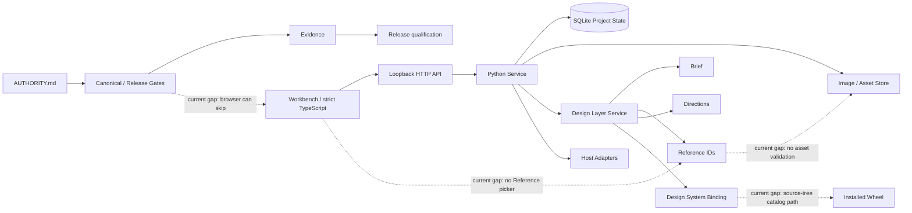
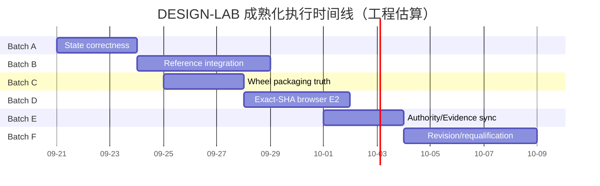
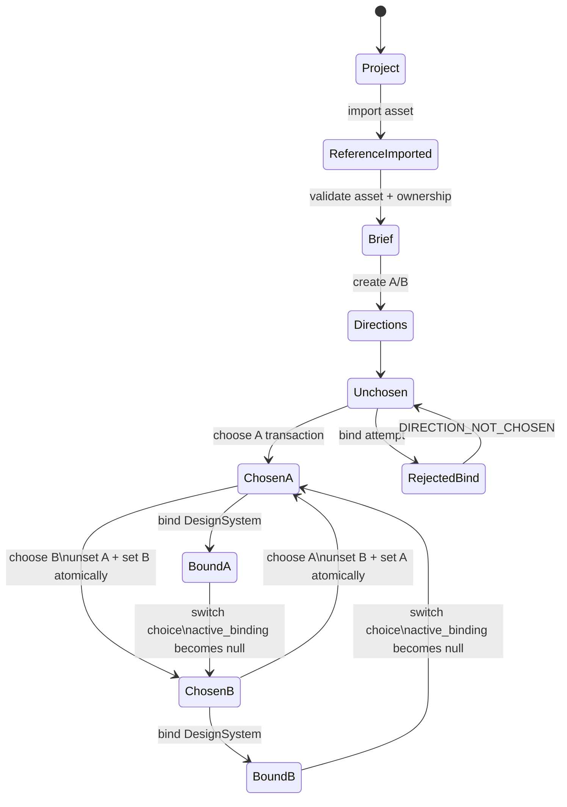

# DESIGN-LAB 全量深度调研与成熟化方案

## Executive Summary

本报告以 **2026-09-19（America/Phoenix）** 为审计时点，重新读取了 `DTALEX66/DESIGN-LAB` 的实时 GitHub 主线、远端 refs、开放 PR/Issue、Releases、tags、当前 Actions run、当前 run artifact、Authority 链、Workbench、Design Layer、SQLite schema、HTTP contract tests、browser E2E、Python packaging 配置、Canonical/Release workflows 与 `reports/current`。仓库本身也明确规定审计必须以 **live remote → Authority → index → AGENTS → 当前代码/CI → reports projection** 的顺序取证，而不能把 Handoff 或 `reports/current` 当实时真值。

**核心结论是：DESIGN-LAB 已经跨过“纯治理/知识仓库”阶段，拥有真实 Workbench、Python backend、SQLite state、严格 TypeScript/Vite/pnpm 构建链和第一条 Design Layer 产品纵切；但当前 `main` 仍不应被描述为完整的 `Project → Brief → Reference → Direction → DesignSystem` E2 产品闭环。** 真实实现更接近：

> `Project → Brief → Direction → Choice → DesignSystem`

Reference 在 UI 中尚未接入，backend 也没有验证 reference asset 的真实存在与 project ownership；Direction 单选没有数据库级 invariant；无选择时 backend 会制造一个“假 chosen_direction”；未 chosen 的方向仍可 bind Design System；`active_binding` 还可能属于另一个方向；Brief `constraints` 的 TypeScript/后端序列化类型不一致。相关缺口都直接存在于当前主线代码和测试中。    

实时 `main` 为 **`cb2163a2ad6db7bd12ee1ca07c1d3eb2badc328e`**；最新 main Canonical Verify run 为 **#198 / run `35390771963`，SUCCESS**。官方 Python job log显示 `1412` 个 tests、`7` 个 skipped、总体 `OK`，并通过 549 项 unified verifier、493 项 product-manifest verifier、239 项 runtime-contract verifier、10 项 visual-scoring verifier和 49 项 aggregate verifier；但 browser test 的实现明确规定，在 clean runner 没有本地 Playwright cache/Chromium 时直接 `skipTest`，而当前 Workbench CI job 又只做 typecheck、Vite build、Node unit 和 packaging/static checks，因此**绿色 Canonical CI 不是 exact-SHA Chromium E2E 证明**。  

当前 run 的 GitHub Actions artifact 数量是 **0**；仓库没有 GitHub Release，也没有 Git tag。与此同时，`release-gate.yml` 已设计为手动 `workflow_dispatch`，通过 `upload-artifact` 产生 exact-SHA runtime evidence attestation，因此“Release Gate workflow 已存在”和“当前 release evidence artifact 已存在”是两个不同事实；后者现在不成立。   

本轮还发现一个比单纯 stale documentation 更重要的治理问题：**顶层 Authority 与机器可读 capability evidence ladder 已发生语义冲突。** `AUTHORITY.md R2` 定义 `E4 = INDEPENDENT_ACCEPTANCE`、`E5 = RELEASED/REPEATABLE`；但 `design-lab/config/capability-status.json` 仍定义 `E4 = release`、`E5 = commercial`。这意味着 release/evidence verifier 即使结构上全绿，也可能在“E4/E5 到底代表什么”这一层与最高 Authority 不一致。 

因此，成熟化方向不应该是继续大规模扩能力或新增治理层，而应按 **Batch A–F** 收口：

**A：状态正确性 → B：真实 Reference → C：wheel 安装态 → D：exact-SHA 浏览器 CI → E：Evidence/Authority 收敛 → F：版本化、发布资格和 Host E3 准备。**

在此之前，最诚实的最终产品声明仍是：

> **CONTROLLED_RUNTIME_READY / 第一条产品纵切接近 E2，但 exact-SHA browser E2 尚未成立。**

不能提升为 `REAL_HOST_WORKFLOW_E3`、`HUMAN_ACCEPTED_E4` 或 `RELEASED_E5`。Authority 对 E0–E5 的定义是当前最高证据口径。

## Live Baseline 与证据边界

**实时云端基线**

| 项目 | 2026-09-19 实时事实 | 证据 |
|---|---|---|
| Repository | `DTALEX66/DESIGN-LAB` | GitHub live repository |
| Default branch | `main` | GitHub live repository |
| main SHA | `cb2163a2ad6db7bd12ee1ca07c1d3eb2badc328e` | main commit API / exact-SHA CI |
| main 最新内容 | PR #124 browser E2E merge | commit API |
| 产品版本 | `0.1.0-alpha.0` | `pyproject.toml` |
| Authority | `DL-AUTHORITY-2026-09-18-R2` | `AUTHORITY.md` |
| 远端 branches | 当前 API 枚举 **32 refs：main + 31 non-main** | branches API |
| Open PR | **1：#125** `docs(decisions): E-SLICE session convergence record` | PR API |
| Standalone open Issues | **0** | issue search API |
| Releases | **0** | releases API |
| Tags | **0** | git matching refs/tags API |
| 最新 main CI | Canonical Verify #198 / run `35390771963` / SUCCESS | Actions API |
| 当前 run artifacts | **0** | Actions artifact API |
| Release workflow | 存在，手动 `workflow_dispatch` | workflow source |
| Release 状态 | `NOT_RELEASED` | projection 明确写入 |
| Branch protection | branch record 显示 main `protected=true`；具体规则读取 **403** | branches API；本轮 protection endpoint 未授权 |
| Detailed protection rules | **未授权/403** | 需要 repository administration / branch-protection read capability |

PR #125 的 head 为 `docs/e-slice-session-summary-20260919`，base 是当前 `main@cb2163a2…`，内容是 PR #122–#124 的 session convergence 文档，不是新的 runtime implementation。

**当前远端分支清单**

GitHub API 当前返回下列 refs；由于本轮实时调用没有对 **31 个 non-main refs 全部逐支重新执行 compare API**，下表不把旧 `reports/current/BRANCH-*` 的 ahead/behind 数字冒充 2026-09-19 实时关系。任何 merge/delete 决策前都必须重新 `compare main...branch`。Authority 本身也要求 old branch 做 semantic classification，而不是按 branch 名或 unique commits whole-merge。 

| 分类 | Branches | 当前处理态 |
|---|---|---|
| 正式真值 | `main` | CURRENT |
| 当前 Open PR | `docs/e-slice-session-summary-20260919` | ACTIVE / PR #125 |
| Authority | `codex/deepseek-authority-r1`, `feat/dl-authority-convergence-r2` | 需 compare；Authority 主体已在 main |
| E-slice | `feat/e-slice-browser-e2e`, `feat/e-slice-vertical-1` | 已有对应主线 PR 历史；删除前仍需 compare |
| UCR | `feat/ucr-convergence`, `feat/ucr-p0a-truth`, `feat/ucr-report-truth`, `docs/ucr-handoff-20260918` | semantic cleanup candidates |
| Docs | `docs/bundle-readme`, `docs/core-readme`, `docs/lessons-ledger`, `docs/oda4-0803-audit`, `docs/oda4-1101-gate`, `docs/oda4-1104-report`, `docs/roadmap-sync` | historical/semantic compare |
| Feature residuals | `feat/adapter-contracts-e0`, `feat/minimax-h3-e3`, `feat/oda4-0118-1005-0807`, `feat/score-sheet-template` | 逐 commit semantic audit |
| Fix residuals | `fix/aggregate-14`, `fix/codex-review-r1`, `fix/design-lab-governance-closure-r4`, `fix/quarantine-evidence`, `fix/r4-h3-prod-e3`, `fix/registry-categories`, `fix/verify-all-skins`, `fix/verify-all-toolchain` | 禁止 whole merge，逐项等价核验 |
| Migration | `migration/dl-directory-convergence-r1` | 高风险 historical/migration branch |
| Tests | `test/evidence-helpers`, `test/jury-preflight` | semantic compare |

**CI 真实含义**

当前 `canonical-verify.yml` 有独立 Python、Authority、Top Authority、MiniGame、Workbench、generated-artifact、license/secret、Open Design 等 jobs。Workbench job明确执行 pinned pnpm、`--frozen-lockfile`、strict TypeScript、Vite build、Node unit smoke、packaging verifier和 committed-build drift check。

本轮直接读取 run `35390771963` 的官方 Python job log，观察到：

| 验证 | 实际结果 |
|---|---:|
| `VERIFY_RESULT` | `OK total=549 failed=0` |
| `VERIFY_PRODUCT_MANIFEST_V3` | `OK total=493 failed=0` |
| `VERIFY_RUNTIME_CONTRACTS_V3` | `OK total=239 failed=0` |
| `VERIFY_VISUAL_SCORING_V3` | `OK total=10 failed=0` |
| `VERIFY_DESIGN_LAB` | `OK total=49 failed=0` |
| Style Master | 497 masters / 77 cards / 47 lineages / 47 analyses |
| Python tests | **1412 run / 7 skipped / OK** |
| Evidence Cards | 12 cards / human calibration required / authoritative accepts=0 |
| Human Jury | deterministic check OK，但 log 明确仍要求 human review |
| Evidence binding | ancestor binding 被判定 `requiresRequalification=true` |

GitHub 官方文档确认 workflow run logs 是 GitHub Actions 判断具体 job/step 执行结果的正式入口，REST API 也支持按 run/job 获取 runs 和 logs。citeturn2search0turn2search1

但是 browser E2E 当前源码在没有 `node_modules/playwright` 本地 cache 或 Chromium 时执行 `skipTest`；它甚至明确写出“clean CI checkout … skips HONESTLY”。因此 1412 tests 的绿色结果不能自动等价为 Chromium E2 已执行。

**Artifact list**

当前 exact-SHA Canonical run 的 artifact collection 是：

```text
run_id: 35390771963
total_count: 0
artifacts: []
```

这是 API 直接返回值。

Release workflow 则已经包含 `upload-artifact` 设计：理论上成功执行后会上传 `dl-release-evidence-${{ github.sha }}`，其中包括 attestation 与 `artifacts.sha256`；因此后续成熟化验收应把“artifact upload + API query + ZIP download + hash readback”做成真正 E5 前置，而不是只检查 workflow YAML 存在。

**`reports/current` 不能作为 live baseline。**

`PROJECT_STATUS.md` 明确写的是“生成投影”，subject SHA 是旧的 `619cd223...`，subject type 是 dirty `WORKTREE`，且生成时间不代表重新测试；`RELEASE_READINESS.json` 也明确标注 `fresh:false`、同一旧 SHA、dirty worktree。 

因此报告中的 current state 均以 GitHub live main/CI 为主，projection 只用于发现 stale state。



## 全量风险与差距

下面的优先级不是“文件是不是存在”，而是按**产品状态错误、证据错误、安装后失效、发布误判**的影响排序。

**P0 — 必须先解决**

| ID | 风险 / 根因 | 影响 | 最小复现 | 成熟修复 | 必须增加的回归 |
|---|---|---|---|---|---|
| P0-A | Direction 没有单选 invariant；`choose_direction()` 只把目标设 `chosen=1`，不会取消同 Brief 其他 chosen；SQL 也无 partial unique constraint。 | 一个 Brief 可产生两个“最终方向”，Human Choice 失去确定性 | 创建 A/B → choose A → choose B → 查询 rows | `BEGIN IMMEDIATE` 内先取消旧 chosen，再设新 chosen；数据库增加 `WHERE chosen=1` 唯一索引 | two-choice switch、并发 choose、rollback、idempotent retry |
| P0-B | `get_design_layer()` 无真实 chosen 时 fallback 到 `directions[-1]`。 | 用户未选择也产生虚假决策事实 | create direction，不 choose，GET design-layer | 没有 `chosen=1` 时严格 `chosen_direction=null` | `no_choice_returns_null` |
| P0-C | bind API 不检查 direction `chosen=1`。 | 绕过 UI 可把设计系统绑定到未批准方向 | create direction → 不 choose → POST bind | backend fail-closed `DIRECTION_NOT_CHOSEN` | bind-before-choice = 409/422，DB 0 rows |
| P0-D | `active_binding` 由项目最后一个 binding 推断，而不是当前 chosen direction 的 binding。 | 可出现 `chosen=B`、`active_binding=A` 的自相矛盾 readback | choose A→bind A→choose B→GET | active binding 必须 query 当前 chosen direction；B 未 bind 时 `null` | switch-after-bind regression |
| P0-E | Reference 是名义节点，不是真资产关系。Workbench 创建 Brief 时固定 `reference_asset_ids: []`；HTTP test 直接传不存在的 `img-aaaa…` 仍要求 201。 | “Reference vertical slice”属于过度表述；跨 Project/假 ID 可进入 Brief | POST Brief 带 fake `img-<64hex>` | UI asset picker + backend existence/ownership validation + project-scoped read | valid/missing/cross-project/duplicate/reference browser E2E |
| P0-F | Brief `constraints` contract 是 `string|null`，backend 却把非空字符串封装成 JSON object，再 `json.loads` readback。 | TS 与 runtime value 不同，Workbench 可显示 `[object Object]` | create Brief with `"constraints":"..."` → readback | 新写入存 JSON string；legacy dict兼容读；后续迁移规范化 | non-null roundtrip + legacy row |
| P0-G | Browser E2E clean CI 可 skip；Canonical 没有安装 Playwright/Chromium 的 dedicated browser job。 | 当前 exact-SHA E2 证据不成立 | clean runner执行测试 | 加 dedicated `workbench-browser-e2e`，CI 环境缺 browser = FAIL，不是 SKIP | exact-SHA full UI→DB readback |
| P0-H | `design_layer.py` 从 repo-root `design-lab/design-systems` 读 catalog，而 wheel force-include 没把该目录收入当前 package。 | checkout 正常，isolated installed wheel 可能 catalog 为空 | build wheel → 临时目录安装 → `/api/design-systems` | package resource + `importlib.resources`，禁止 repo-root dependency | wheel inventory + `python -I` installed smoke |
| P0-I | Authority evidence ladder 与 capability-status ladder 冲突。Authority：E4 independent acceptance/E5 released；配置：E4 release/E5 commercial。 | 机器 Gate 与最高治理口径可能对同一个 E4/E5 做不同判断 | 比较两文件 enum/claim | 以 R2 Authority 为准迁移 schema/config/verifier/test | authority/evidence semantic consistency gate |

其中 P0-E 可以复用当前资产层已有的 project-scoped读取语义：`image_assets.py` 查询资产时已经把 `project_id`、`asset_id` 和有效版本绑在一起，所以不应再为 Reference 创建第二资产系统。

**P1 — P0 绿后收口**

| ID | 风险 / 根因 | 影响与修复方向 |
|---|---|---|
| P1-A | Brief/Direction/Binding 有 `version`、`superseded_by` 结构，但实际创建基本固定 `version=1`；binding 注释声称 rebind append revision，代码未形成 lineage。 | 当前应称 “version-ready schema”，不能称 complete versioning；Batch F 增加 append-only revision/event lineage |
| P1-B | `creative-toolchain` 状态仍记录 E3，但 exact-SHA CI log已把祖先 evidence 判为 `requiresRequalification=true`；config 本身仍展示 runtime-pass E3。 | Release verifier 必须计算 `effectiveEvidence`，而不是只读 recordedEvidence |
| P1-C | `reports/current` 是旧 dirty worktree projection，却仍用 `current` 命名。 | UI/Agent 易误读；生成物要显式 `projection`, `subjectSha`, `fresh=false` |
| P1-D | Authority §15 仍把 Authority landing、strict TS、Vite、pnpm、browser E2E、第一条纵切列成剩余 P0，而这些部分已部分/大部落地。 | TaskPack 会重复派工；应改 `CLOSED_WITH_REGRESSION_GUARD` 或精确残差 |
| P1-E | `authority-index` 仍把 AGENTS “Authority first read”视为 drift，而 AGENTS 当前已经要求先读 Authority。 | Gate 覆盖范围与语义状态不同步 |
| P1-F | `LANGUAGE-POLICY.md` 还声称 root package.json/lockfile/product Node build 不存在；当前三者都存在。 | 技术政策失真；同步即可，不需重开语言迁移 |
| P1-G | Canonical current run artifacts=0；release workflow能上传 artifact，但现有 Canonical 不保留 browser/wheel证据。 | 对 E2/E5 需要可下载 readback；增加短生命周期 test evidence artifacts |

**P2 — 工程成熟度提升**

P2 不阻止产品纵切 E2，但建议在稳定后完成：标准化 Playwright dependency/config；拆分超大 aggregate Python suite 为 smoke/contract/full lanes，同时保留 nightly/full gate；增加 SQLite migration version table 和 schema migration verifier；将 stale branch reports 从“实时判断输入”降为 generated audit aids；对所有 remaining branches 做 API compare 后形成新的 residual matrix；将 package inventory、SBOM、wheel hash、browser trace/screenshot 统一纳入 evidence bundle。

**Capability evidence matrix**

下面同时列“仓库当前记录”和“按 R2 Authority 可安全声明的有效值”。后者是审计判断，不是对仓库文件的修改。Capability source-of-truth 仍记录 design intelligence/visual quality/professional domains/production handoff 为 E1，creative-toolchain 为 E3，release-evidence 为 E1。

| Capability | Recorded | Authority-safe current judgement | 主要缺口 |
|---|---:|---:|---|
| research-evidence | E1 | E1 | runtime qualification |
| design-intelligence | E1 | E1；E2 接近但 exact-SHA browser 未证明 | Reference + CI browser |
| visual-quality | E1 | E1 | controlled runtime + human calibration |
| professional-visual-domains | E1 | E1 | runtime scenarios |
| production-handoff | E1 | E1 | editable delivery runtime |
| creative-toolchain | E3 | **historical E3，不应自动作为 current E3** | requalification |
| style-master-method | E1 | E1 | research closure |
| release-evidence | E1 | E1 | independent acceptance + formal release |
| Asset/task service | E1 | E1 | runtime task proof |
| Planar decomposition | E1 | E1 | real OCR/trace/host mapping |
| Generation protocol | E1 | E1 | real execution |

最重要的是：**Recorded evidence 和 Release-effective evidence 必须分栏**，而不是通过覆盖旧 E3 来“修数据”。Authority 已明确“历史证据不能自动提升新的 SHA/Host/Adapter/Tool 版本”。

## 成熟化 Roadmap

推荐总工作量约 **14–23 人日**；如果 Backend/Frontend/DevEx 三个角色适度并行，工程日历约 **3–4 周**。这是项目实施估算，不包含真实 Photoshop/Illustrator E3、独立 Human Jury E4 或正式 Release E5。

| Batch | 目标 | 主要角色 | 估算 | Exit condition |
|---|---|---|---:|---|
| A | Design Layer state correctness | Python/SQLite engineer + QA | 2–3 人日 | single-choice/null/bind/active-binding/constraints 全绿 |
| B | Real Reference integration | Full-stack + QA | 3–5 人日 | 真 asset picker + ownership validation + browser path |
| C | Packaging truth | Python packaging/DevEx | 2–3 人日 | isolated wheel完整运行 Design Layer |
| D | Exact-SHA Browser E2 | Frontend/DevEx | 2–4 人日 | GitHub clean runner Chromium PASS，0 skip |
| E | Authority/Evidence convergence | Architecture + QA/DevEx | 2–3 人日 | E0–E5 只有一个语义真值，stale projections修正 |
| F | Revision/requalification/release hardening | Backend + Release engineer | 3–5 人日 | version lineage + effective evidence + release-preflight |

**Batch A — Correctness**

先不改大架构，只修 state invariant。Direction 唯一性应该以 **Brief** 为 scope，因为 Direction 当前显式属于 Brief；选择动作使用 SQLite `BEGIN IMMEDIATE`，避免两个并发 choose 都从“没有 chosen”状态成功提交。数据库 partial unique index作为最后一道防线。

同时改 read model：`chosen_direction` 只来自真实 `chosen=1`；`active_binding` 只来自当前 chosen direction；未 chosen 禁止 bind；constraints 正常化并兼容历史错误对象。

Rollback：代码与 schema index拆成独立 migration；若 migration发现现存 duplicate chosen rows，不自动猜测用户意图，fail closed并生成 remediation report。

**Batch B — Reference**

不创建第二资产层。Workbench 的现有 Asset list 增加 `selectedReferenceAssetIds`；Brief POST携带真实 IDs。Backend 在同一业务事务中校验每个 ID：

`exists && asset.project_id == request.project_id && asset active`

不存在、跨项目、已删除全部拒绝。

第一阶段保留当前 JSON `reference_asset_ids` contract以控制迁移范围；成熟后可以追加规范化 join table用于 relational integrity 和 provenance。

Rollback：UI picker feature flag/commit revert；backend validation只能在数据库无 invalid historical reference 时直接启用，否则需要先 audit legacy rows。

**Batch C — Packaging**

不要再由运行时代码推导 repository root 去找 Design System catalog。将 catalog 放入 wheel package namespace，使用 `importlib.resources`。`pyproject.toml` 现在已 force-include Workbench、state schemas、reconstruction 和 Adobe JSX，却没有 `design-lab/design-systems`，所以当前设计需要修正。

验收必须从空临时目录安装 wheel，并启用 `python -I`，保证没有 repo CWD/sys.path 帮忙。

**Batch D — Browser CI**

把 browser E2E 从“工具存在才跑”变为“专用 CI job 保证工具存在”。普通本地 unittest 可以继续 honest skip；但 dedicated `workbench-browser-e2e` job 绝对不能以 skip 为 success。

要求至少保存：

`browser-e2e-summary.json`、服务 readback、失败 screenshot/trace。

这样 E2 证据才能绑定 exact SHA，而不是绑定开发者工作站 cache。

**Batch E — Evidence/Governance**

这一批必须修的是“语义”，不是多写文档：

1. 以 Authority R2 统一 E0–E5；
2. `capability-status.schema/config` 与 verifier同步；
3. `requiresRequalification=true` 不能满足当前树较高 evidence floor；
4. Authority §15 把已完成事项关掉；
5. `LANGUAGE-POLICY` 同步当前 TS/Vite/pnpm reality；
6. `authority-index` 移除已消失的 AGENTS drift；
7. reports明确投影性质。

Release workflow本身的 exact-SHA attestation模式是正确方向，应保留。

**Batch F — Versioning 与 release hardening**

P0 全部通过后再实现真正 revision：

`Brief v1 → Brief v2`  
`Direction v1 → Direction v2`  
`Binding v1 → Binding v2`

不要为了 `superseded_by` 偷偷把所谓 append-only history改成随意 mutable rows。更成熟的设计是**内容对象 immutable + choice/binding/revision event append-only**；当前的 `chosen` 可作为 materialized state，但 decision history另存事件。

真实 Adobe E3不放入这一阶段的默认完成条件。没有 owner 授权和真实 Host，就只能准备 contract/test/evidence harness，不能制造 E3。



## 技术实现蓝图

**Direction 选择事务**

现有问题发生在 `choose_direction()` 和 schema 缺少唯一约束之间。 

建议的 SQLite migration：

```sql
-- Migration must FIRST abort if existing duplicate choices exist.
SELECT brief_id, COUNT(*) AS n
FROM design_direction
WHERE chosen = 1
 AND superseded_by IS NULL
GROUP BY brief_id
HAVING COUNT(*) > 1;

-- Apply only when the query above returns zero rows.
CREATE UNIQUE INDEX IF NOT EXISTS ux_design_direction_one_chosen_per_brief
ON design_direction(brief_id)
WHERE chosen = 1
 AND superseded_by IS NULL;
```

不要自动用 `MAX(direction_id)` 修复历史 duplicate choice；那是在替用户做设计决策。迁移检测到冲突应 fail closed并列出 Brief IDs。

事务伪代码：

```python
def choose_direction(project_id, direction_id, actor, actor_kind, idempotency_key):
 with db.transaction(mode="IMMEDIATE") as cx:
 direction = cx.execute(
 """
 SELECT direction_id, brief_id, project_id, chosen
 FROM design_direction
 WHERE direction_id = ? AND project_id = ?
 AND superseded_by IS NULL
 """,
 (direction_id, project_id),
 ).fetchone()

 if direction is None:
 raise ApiError("DIRECTION_NOT_FOUND", 404)

 record_or_replay_intent(
 cx,
 scope=f"choose:{direction['brief_id']}",
 idempotency_key=idempotency_key,
 payload={
 "direction_id": direction_id,
 "actor": actor,
 "actor_kind": actor_kind,
 },
 )

 cx.execute(
 """
 UPDATE design_direction
 SET chosen = 0
 WHERE brief_id = ?
 AND project_id = ?
 AND chosen = 1
 AND direction_id <> ?
 AND superseded_by IS NULL
 """,
 (direction["brief_id"], project_id, direction_id),
 )

 cx.execute(
 """
 UPDATE design_direction
 SET chosen = 1,
 actor = ?,
 actor_kind = ?
 WHERE direction_id = ?
 AND project_id = ?
 """,
 (actor, actor_kind, direction_id, project_id),
 )

 return read_direction(cx, project_id, direction_id)
```

对于两个 concurrent choose，`BEGIN IMMEDIATE + unique partial index` 能让最终数据库状态仍满足最多一个 chosen。

**Bind 必须从 chosen 状态推导**

```python
direction = cx.execute(
 """
 SELECT direction_id, chosen
 FROM design_direction
 WHERE project_id = ?
 AND direction_id = ?
 AND superseded_by IS NULL
 """,
 (project_id, direction_id),
).fetchone()

if direction is None:
 raise ApiError("DIRECTION_NOT_FOUND", 404)

if not direction["chosen"]:
 raise ApiError("DIRECTION_NOT_CHOSEN", 409)
```

read model 不应再取项目全局最新 binding：

```sql
SELECT b.*
FROM design_system_binding AS b
JOIN design_direction AS d
 ON d.direction_id = b.direction_id
WHERE d.project_id = :project_id
 AND d.chosen = 1
 AND d.superseded_by IS NULL
ORDER BY b.version DESC, b.binding_id DESC
LIMIT 1;
```

如果当前 chosen direction 没有 binding：

```json
{
 "chosen_direction": { "...": "..." },
 "active_binding": null
}
```

而不是回退到旧方向的 binding。

**Reference 真实性**

当前 HTTP test 用一个没有导入的 `img-aaaa...` 作为 reference 就能成功，这应该改成负面测试。

推荐 service API：

```python
def require_reference_assets(cx, project_id: str, asset_ids: list[str]) -> list[str]:
 normalized = list(dict.fromkeys(asset_ids))

 if len(normalized) != len(asset_ids):
 raise ApiError("DUPLICATE_REFERENCE_ASSET", 400)

 for asset_id in normalized:
 row = cx.execute(
 """
 SELECT asset_id, project_id
 FROM asset
 WHERE asset_id = ?
 AND project_id = ?
 AND asset_kind = 'raster'
 """,
 (asset_id, project_id),
 ).fetchone()

 if row is None:
 # A second project-independent lookup can distinguish
 # NOT_FOUND from PROJECT_MISMATCH without leaking unnecessary data.
 raise ApiError("REFERENCE_ASSET_NOT_FOUND", 404)

 return normalized
```

更理想的长期模型是：

```sql
CREATE TABLE design_brief_reference (
 brief_id TEXT NOT NULL,
 project_id TEXT NOT NULL,
 asset_id TEXT NOT NULL,
 ordinal INTEGER NOT NULL,
 PRIMARY KEY (brief_id, asset_id),
 UNIQUE (brief_id, ordinal),
 FOREIGN KEY (brief_id)
 REFERENCES design_brief(brief_id)
);
```

跨 project ownership仍应在 transaction/service 层强制检查，除非 asset schema提供可安全引用的 composite key。

**Constraints 兼容迁移**

```python
def decode_constraints(raw: str | None) -> str | None:
 if raw is None:
 return None

 value = json.loads(raw)

 if isinstance(value, str):
 return value

 # Backward compatibility for current buggy rows.
 if (
 isinstance(value, dict)
 and set(value) == {"constraints"}
 and isinstance(value["constraints"], str)
 ):
 return value["constraints"]

 raise StateCorruptionError("INVALID_BRIEF_CONSTRAINTS")
```

新写入：

```python
constraints_json = (
 json.dumps(constraints, ensure_ascii=False)
 if constraints is not None
 else None
)
```

这样就重新满足 Workbench `string | null` 合同。

**Pytest / unittest 回归示例**

仓库当前主要测试 harness 使用 `unittest`，因此无需为这一小块引入第二测试框架：

```python
def test_switching_direction_preserves_single_choice(self):
 pid = self._project()
 brief = self._brief(pid, references=[])

 a = self._direction(pid, brief["brief_id"], title="A", key="dir-a")
 b = self._direction(pid, brief["brief_id"], title="B", key="dir-b")

 status, _ = self.request(
 "POST",
 f"/api/projects/{pid}/directions/{a['direction_id']}/choose",
 {
 "actor": "ALEX",
 "actor_kind": "human",
 "idempotency_key": self.key("choose-a"),
 },
 )
 self.assertEqual(status, 200)

 status, _ = self.request(
 "POST",
 f"/api/projects/{pid}/directions/{b['direction_id']}/choose",
 {
 "actor": "ALEX",
 "actor_kind": "human",
 "idempotency_key": self.key("choose-b"),
 },
 )
 self.assertEqual(status, 200)

 layer = self.request(
 path=f"/api/projects/{pid}/design-layer"
 )[1]["design_layer"]

 chosen = [d for d in layer["directions"] if d["chosen"]]
 self.assertEqual([d["direction_id"] for d in chosen], [b["direction_id"]])
 self.assertEqual(
 layer["chosen_direction"]["direction_id"],
 b["direction_id"],
 )
```

Reference 测试必须先真实 import asset：

```python
def test_brief_rejects_cross_project_reference(self):
 owner = self._project("Owner")
 other = self._project("Other")

 asset = self._import_png(owner)

 status, body = self.request(
 "POST",
 f"/api/projects/{other}/briefs",
 {
 "title": "Other brief",
 "goals": ["test ownership"],
 "constraints": None,
 "reference_asset_ids": [asset["asset_id"]],
 "idempotency_key": self.key("cross-project-ref"),
 },
 )

 self.assertIn(status, {400, 404})
 self.assertEqual(body["error"], "REFERENCE_ASSET_PROJECT_MISMATCH")
```

**Playwright E2E**

当前 browser harness已经用真实 Python loopback service + Chromium；应保留这个优点，只把 dependency provisioning 和 skip semantics修正。

目标脚本应真正走：

```javascript
const { chromium } = await import("playwright");

const browser = await chromium.launch({ headless: true });
const page = await browser.newPage();

const consoleErrors = [];
page.on("console", msg => {
 if (msg.type() === "error") consoleErrors.push(msg.text());
});

await page.goto(process.env.E2E_SERVICE_URL + "/workbench");

// Project
await page.getByRole("button", { name: /create project/i }).click();

// Import real reference
await page.setInputFiles(
 'input[type="file"]',
 "design-lab/tests/fixtures/reference.png"
);

// Select it as Reference
await page.getByRole("checkbox", { name: /reference/i }).check();

// Brief
await page.getByLabel("Brief title").fill("Exact SHA E2E");
await page.getByRole("button", { name: /create brief/i }).click();

// Direction + human choice
await page.getByLabel("Direction title").fill("Warm editorial");
await page.getByRole("button", { name: /create direction/i }).click();
await page.getByRole("button", { name: /choose/i }).click();

// Design system
await page.getByLabel("Design system").selectOption("uiux-commercial-light");
await page.getByRole("button", { name: /bind/i }).click();

await page.getByText(/uiux-commercial-light/i).waitFor();

if (consoleErrors.length) {
 throw new Error(JSON.stringify(consoleErrors));
}

await browser.close();
```

最终还应通过 API 或 test hook读取 persisted state，而不能只看 DOM：

```javascript
const readback = await page.evaluate(async () => {
 const response = await fetch(window.__TEST_READBACK_ENDPOINT__);
 return response.json();
});

if (readback.design_layer.briefs[0].reference_asset_ids.length !== 1) {
 throw new Error("reference persistence readback failed");
}
```

**Wheel packaging**

当前 catalog repo-path依赖应改为 package resource：

```python
from importlib.resources import files

def catalog_root():
 return files("design_lab").joinpath(
 "resources",
 "design-systems",
 )
```

对应 Hatch 配置可采用：

```toml
[tool.hatch.build.targets.wheel]
packages = ["src/design_lab"]

[tool.hatch.build.targets.wheel.force-include]
"design-lab/design-systems" = "design_lab/resources/design-systems"
```

更干净的长期做法是直接把 manifests 的 authoritative package copy放在：

```text
src/design_lab/resources/design-systems/
```

然后避免 source tree 与 installed tree 各一套逻辑。

构建/验证，不发布：

```bash
python -m pip install build twine
python -m build

python -m twine check dist/*
python -m zipfile -l dist/*.whl

python -m venv .project-local/task-runtime/wheel-smoke/venv
.project-local/task-runtime/wheel-smoke/venv/bin/pip install dist/*.whl

cd "$(mktemp -d)"
/path/to/venv/bin/python -I -c \
 "from design_lab.design_layer import DesignLayer; print('IMPORT_OK')"
```

Installed smoke 的真正 exit condition 是创建项目后完成：

```text
GET /api/design-systems
POST project
import reference
POST brief
POST direction
POST choose
POST bind
GET design-layer
```

全部成功，而且执行 CWD 不在 Git checkout。

**GitHub Actions exact-SHA Browser job**

```yaml
workbench-browser-e2e:
 name: Workbench exact-SHA Chromium E2E
 runs-on: ubuntu-latest
 timeout-minutes: 15

 steps:
 - name: Checkout exact target SHA
 uses: actions/checkout@11bd71901bbe5b1630ceea73d27597364c9af683

 - name: Setup Python
 uses: actions/setup-python@a26af69be951a213d495a4c3e4e4022e16d87065
 with:
 python-version: "3.12"

 - name: Install Python lock
 run: |
 python -m pip install uv
 uv sync --locked

 - name: Setup Node
 uses: actions/setup-node@49933ea5288caeca8642d1e84afbd3f7d6820020
 with:
 node-version: "22"

 - name: Install pinned pnpm
 run: npm install -g pnpm@11.22.0

 - name: Install JS dependencies
 run: pnpm install --frozen-lockfile

 - name: Install locked Playwright Chromium
 run: pnpm --filter @design-lab/workbench exec playwright install --with-deps chromium

 - name: Rebuild Workbench
 run: |
 pnpm --filter @design-lab/workbench typecheck
 pnpm --filter @design-lab/workbench build
 git diff --exit-code -- apps/workbench/build

 - name: Run browser E2E — skipping forbidden
 env:
 E2E_REQUIRED: "1"
 run: |
 .venv/bin/python -m unittest \
 design-lab.tests.test_workbench_design_layer_e2e -v

 - name: Upload E2 evidence
 if: always()
 uses: actions/upload-artifact@65c4c4a1ddee5b7f698f8297e8f3f4f7e4b8c1a2
 with:
 name: workbench-e2-${{ github.sha }}
 path: .project-local/task-artifacts/browser-e2e/
 if-no-files-found: error
```

关键规则：

```python
if e2e_required and browser_missing:
 self.fail("CI E2E prerequisite missing")
else:
 self.skipTest("local optional E2E prerequisite missing")
```

也就是说：**local optional 可 skip，exact-SHA CI required 不可 skip。**

**Evidence requalification**

推荐把 recorded 和 effective 分离：

```python
LEVEL = {
 "E0": 0,
 "E1": 1,
 "E2": 2,
 "E3": 3,
 "E4": 4,
 "E5": 5,
}

def effective_evidence(record, current_sha, current_structural_pass):
 recorded = record["evidenceLevel"]

 if record.get("requiresRequalification"):
 return "E1" if current_structural_pass else "E0"

 if record.get("subjectSha") != current_sha:
 return "E1" if current_structural_pass else "E0"

 return recorded
```

Release gate比较的是：

```python
LEVEL[effectiveEvidence] >= LEVEL[minimumRequiredEvidence]
```

而不是：

```python
LEVEL[recordedEvidence] >= LEVEL[minimumRequiredEvidence]
```

这与 Authority 的“历史证据不能自动提升新的 SHA/Host/Adapter/Tool version”一致。



## 验证与量化验收

成熟化不能以“代码 review 看起来合理”为验收。每一个 Batch 都必须绑定 exact commit SHA 和明确输出。

**产品纵切 E2 验收矩阵**

| 检查 | 量化标准 |
|---|---|
| Direction uniqueness | 每个 active Brief：`SUM(chosen) <= 1`，数据库级 constraint |
| No fake choice | 无 `chosen=1` 时 API `chosen_direction == null` |
| Binding legality | unchosen bind 100% fail closed；0 DB side effects |
| Active binding consistency | `active_binding.direction_id == chosen_direction.direction_id`，否则 null |
| Reference authenticity | 100% reference IDs 可读、存在、属于 project |
| Cross-project isolation | 100% cross-project references fail |
| Constraints | `string → persisted → string`，类型不漂移 |
| Idempotency | 相同 key+payload返回同 identity；不同 payload同 key = 409 |
| Browser E2E | GitHub clean runner real Chromium；**0 skip** |
| Browser console | 0 uncaught error / 0 console error |
| Persisted readback | DOM 与 backend state一致 |
| Wheel install | 非 repo CWD、`python -I` 完整 vertical slice成功 |
| Wheel inventory | 无 `.git`, `.project-local`, credentials, caches |
| Design System catalog | installed wheel返回预期 catalog，不依赖 repo root |
| Build truth | Vite rebuild后 `git diff --exit-code` |
| Canonical | 所有 required jobs success |
| Artifact | browser/wheel evidence artifact可 API query/download/hash |
| Evidence | evidence subject SHA == GitHub run `head_sha` |
| Requalification | stale/ancestor E3绝不能满足 current E3 floor |

**Browser exact-SHA 证明**

最低 evidence record：

```json
{
 "kind": "workbench-browser-e2",
 "subjectSha": "<github.sha>",
 "browser": {
 "engine": "chromium",
 "version": "<read-back>"
 },
 "workflowRunId": "<run-id>",
 "scenario": [
 "create-project",
 "import-reference",
 "create-brief",
 "create-direction",
 "choose-direction",
 "bind-design-system",
 "persisted-readback"
 ],
 "consoleErrors": 0,
 "result": "PASS"
}
```

**Wheel installed smoke**

不接受：

```text
pip install -e .
```

作为 installed package 证明。

必须：

```text
sdist/wheel build
→ install wheel into clean venv
→ change CWD outside repository
→ python -I
→ start service
→ catalog read
→ full E-slice
→ DB readback
```

这会直接抓住当前 `PROJECT_ROOT/design-lab/design-systems` 这一类 source-checkout 隐性依赖。

**Release Evidence**

Release Gate 当前架构已经包含 exact checkout、structural verify、capability evidence floors、human acceptance/release gate、runtime attestation、artifact upload 和 SHA readback，是合理的 release qualification backbone。

但真正允许 E5 前必须增加三个不可绕过条件：

| 条件 | 规则 |
|---|---|
| SHA binding | attestation subject必须 == release SHA |
| Evidence freshness | `requiresRequalification=true` = floor不满足 |
| Artifact readback | upload后通过 Actions API重新 query + download + SHA256校验 |

当前 Authority 定义 E4 是独立验收、E5 是已发布/可重复，所以 release workflow和 machine schema也必须用这个定义，而不能继续沿用 capability-status 的旧 `E4=release/E5=commercial`。 

**任务优先级与成本**

| Priority | 工作 | 人日 | 风险降低 |
|---|---|---:|---|
| P0 | direction invariant + read model | 1–1.5 | 极高 |
| P0 | Reference real integration | 3–5 | 极高 |
| P0 | constraints + bind semantics | 0.5–1 | 高 |
| P0 | installed wheel resources | 2–3 | 极高 |
| P0 | exact-SHA browser CI | 2–4 | 极高 |
| P0 | evidence ladder统一 | 1–2 | 极高 |
| P1 | requalification verifier | 1–1.5 | 高 |
| P1 | version/supersession | 2–4 | 高 |
| P1 | reports/policy/TaskPack sync | 1 | 中 |
| P1 | branch semantic convergence | 1–3 | 中 |
| P2 | CI lane optimization/trace | 1–2 | 中 |

最合理的资源组合不是大量人力，而是 **1 名 Python/SQLite 主程 + 1 名 Workbench/TS 工程师 + 1 名 DevEx/QA 兼职角色**。涉及 Evidence Authority 时由技术负责人审核，涉及 Adobe E3/Human E4 时再引入真实 Host operator / independent reviewer。

## 复现来源、API 与审计限制

本报告的优先来源均是仓库或 GitHub 官方原始源：live branch/PR/issues/releases/tags/Actions APIs、`AUTHORITY.md`、`authority-index.json`、`AGENTS.md`、`pyproject.toml`、root package manifests、Workbench contracts/source、Design Layer source、state SQL、HTTP/browser tests、Canonical workflow、Release Gate和 current projections。GitHub 官方文档确认 workflow runs 可以通过 REST API枚举、按 SHA过滤，并可获取 logs；job logs也可通过 GitHub UI/API下载。citeturn2search0turn2search1

**Git / refs 复现**

```bash
git clone https://github.com/DTALEX66/DESIGN-LAB.git
cd DESIGN-LAB

git fetch --all --prune --tags

git rev-parse origin/main
git branch -r
git tag --list

git log origin/main -1 --format='%H %cI %s'
```

**GitHub REST baseline**

```bash
OWNER=DTALEX66
REPO=DESIGN-LAB
API=https://api.github.com/repos/$OWNER/$REPO

curl -L \
 -H "Accept: application/vnd.github+json" \
 -H "Authorization: Bearer $GITHUB_TOKEN" \
 "$API/branches?per_page=100"

curl -L \
 -H "Authorization: Bearer $GITHUB_TOKEN" \
 "$API/pulls?state=open&per_page=100"

curl -L \
 -H "Authorization: Bearer $GITHUB_TOKEN" \
 "https://api.github.com/search/issues?q=repo:DTALEX66/DESIGN-LAB+is:issue+is:open&per_page=100"

curl -L \
 -H "Authorization: Bearer $GITHUB_TOKEN" \
 "$API/releases?per_page=100"

curl -L \
 -H "Authorization: Bearer $GITHUB_TOKEN" \
 "$API/tags?per_page=100"

curl -L \
 -H "Authorization: Bearer $GITHUB_TOKEN" \
 "$API/commits/main"
```

**全分支 compare**

```bash
git for-each-ref \
 --format='%(refname:short)' refs/remotes/origin \
 | grep -v '^origin/main$' \
 | while read ref; do
 echo "===== $ref ====="
 git rev-list \
 --left-right \
 --count \
 origin/main..."$ref"
 done
```

语义判断还应补：

```bash
git log --left-right --cherry-pick \
 --oneline origin/main...origin/<branch>

git diff --stat origin/main...origin/<branch>
git diff origin/main...origin/<branch>
```

这样可以把每个 branch分类为：

```text
ABSORBED
PARTIAL_ABSORBED
REIMPLEMENT
SUPERSEDED
HISTORICAL_ONLY
REJECTED
ACTIVE_RESIDUAL
```

而不是做危险的：

```bash
git merge old-branch
```

Authority明确禁止因 unique commits直接 whole-merge旧治理/迁移 branch。

**Actions 与 logs**

```bash
curl -L \
 -H "Authorization: Bearer $GITHUB_TOKEN" \
 "$API/actions/runs?branch=main&per_page=100&page=1"
```

分页：

```bash
for page in $(seq 1 20); do
 curl -fsSL \
 -H "Authorization: Bearer $GITHUB_TOKEN" \
 "$API/actions/runs?per_page=100&page=$page" \
 > ".project-local/task-runtime/audit/actions-$page.json"
done
```

exact SHA：

```bash
SHA=cb2163a2ad6db7bd12ee1ca07c1d3eb2badc328e

curl -L \
 -H "Authorization: Bearer $GITHUB_TOKEN" \
 "$API/actions/runs?head_sha=$SHA&per_page=100"
```

Run jobs：

```bash
RUN_ID=35390771963

curl -L \
 -H "Authorization: Bearer $GITHUB_TOKEN" \
 "$API/actions/runs/$RUN_ID/jobs?per_page=100"
```

GitHub CLI取日志：

```bash
gh run view 35390771963 \
 --repo DTALEX66/DESIGN-LAB \
 --log

gh run view 35390771963 \
 --repo DTALEX66/DESIGN-LAB \
 --json headSha,status,conclusion,jobs
```

GitHub 官方文档说明完整 workflow/job log 可查看和下载；对 partially rerun 的 workflow，需要注意不同 attempt 的日志范围。citeturn2search0

**Artifact readback**

```bash
curl -L \
 -H "Authorization: Bearer $GITHUB_TOKEN" \
 "$API/actions/runs/$RUN_ID/artifacts"
```

当前 run 的真实结果是 `total_count:0`。

未来 Release Gate成功后：

```bash
ARTIFACT_ID=<id>

curl -L \
 -H "Authorization: Bearer $GITHUB_TOKEN" \
 -o .project-local/task-runtime/release-evidence.zip \
 "$API/actions/artifacts/$ARTIFACT_ID/zip"

sha256sum .project-local/task-runtime/release-evidence.zip
unzip -l .project-local/task-runtime/release-evidence.zip
```

**Branch protection**

本轮调用：

```text
GET /repos/DTALEX66/DESIGN-LAB/branches/main/protection
```

返回：

```text
403 Resource not accessible by integration
```

因此本报告只确认 branch collection 返回的 `protected=true`，**不声称知道 required checks、review count、force-push restriction、admin enforcement 或 ruleset细节**。要完成这一层审计，需要连接具备 repository Administration/branch-protection read 能力的 GitHub credential。

**本轮数据覆盖限制**

本轮完成了当前 refs、main、开放 PR/Issue、Release/tag、当前 exact-main CI、关键 job log、当前 artifact、核心代码/合同/测试/workflow 的实时读取。由于 GitHub connector 的 job log 是逐 job读取，本报告没有把仓库历史上每一个 Actions run 的每一个 job log全文逐一复制到报告中；历史 commits 也没有逐 commit完整展开。对“所有历史 Actions/commits”的完全物化审计，应使用上面的分页 API/`gh` 命令落到 `.project-local/` 后做离线索引。这里不把未逐页读取的历史对象冒充“已逐条审阅”。

这不影响本报告对**当前 main 产品闭环**的核心结论，因为这些结论直接来自当前 exact SHA、当前源代码、当前 state schema、当前 test code和当前 CI run。

## 最终交付结论

**Baseline**

```text
Repository:
 DTALEX66/DESIGN-LAB

Audited live main:
 cb2163a2ad6db7bd12ee1ca07c1d3eb2badc328e

Open PR:
 #125
 docs/e-slice-session-summary-20260919
 head 7f390585af7af0e3b04bfa70cc49452c32caec0b

Standalone open issues:
 0

Branches:
 32 total
 31 non-main

Releases:
 0

Tags:
 0

Latest main Canonical:
 run 35390771963
 #198
 SUCCESS

Canonical artifacts:
 0

Product version:
 0.1.0-alpha.0

Authority:
 DL-AUTHORITY-2026-09-18-R2

Release:
 NOT_RELEASED
```

这些 live GitHub 状态分别由 main commit、branch、PR、issue、release/tag、Actions 和 artifact API确认。       

**Changed**

本次是只读深度调研：

```text
Repository modifications: NONE
Commit: NONE
Push: NONE
Merge: NONE
Release: NONE
Branch delete: NONE
```

**Fixed defects**

本轮没有擅自修改仓库，因此下列是**已确认待修缺陷**，不是“已修复”：

| Defect | Status |
|---|---|
| Multiple chosen directions | OPEN / P0 |
| False `chosen_direction` fallback | OPEN / P0 |
| Bind unchosen direction | OPEN / P0 |
| Wrong-direction `active_binding` | OPEN / P0 |
| Fake/unvalidated Reference | OPEN / P0 |
| Workbench no Reference picker | OPEN / P0 |
| Constraints string/object mismatch | OPEN / P0 |
| Installed-wheel Design System catalog risk | OPEN / P0 |
| CI browser E2E can skip | OPEN / P0 |
| Evidence ladder Authority conflict | OPEN / P0 |
| Revision/supersession not truly implemented | OPEN / P1 |
| Historical E3 requalification | OPEN / P1 |
| Stale reports/policy/index | OPEN / P1 |

**Tests**

当前 exact-main官方 CI运行证据：

```text
Python tests:
 1412 tests
 7 skipped
 OK

VERIFY_RESULT:
 549 / 0 failed

VERIFY_PRODUCT_MANIFEST_V3:
 493 / 0 failed

VERIFY_RUNTIME_CONTRACTS_V3:
 239 / 0 failed

VERIFY_VISUAL_SCORING_V3:
 10 / 0 failed

VERIFY_DESIGN_LAB:
 49 / 0 failed
```

但：

```text
Exact-SHA Chromium Browser E2E:
 NOT PROVEN

Reason:
 current browser test may skip when Playwright/Chromium
 is unavailable on a clean CI runner.
```

测试实现本身明确记录这一 skip 行为。

**Evidence**

按当前最高 Authority，而不是旧 capability-status wording：

```text
E0 DECLARED
E1 STRUCTURAL
E2 CONTROLLED_RUNTIME
E3 REAL_WORKFLOW
E4 INDEPENDENT_ACCEPTANCE
E5 RELEASED / REPEATABLE
```

该定义来自 `AUTHORITY.md R2`。

本审计的安全判断是：

```text
Repository engineering baseline:
 strong E1

Design Layer vertical slice:
 E1 complete-ish
 E2 not exact-SHA CI proven

Creative toolchain:
 historical E3 record exists
 current effective E3 requires requalification

Human independent acceptance:
 not proven E4

Release/repeatability:
 not E5
```

**Remaining blockers**

真正的产品顺序应固定为：

```text
Direction/state correctness
 ↓
Real Reference
 ↓
Installed wheel truth
 ↓
Exact-SHA Chromium E2
 ↓
Authority/Evidence semantic convergence
 ↓
Revision + requalification
 ↓
DesignSystem → DesignIR → real Host E3
 ↓
Independent Human E4
 ↓
Release/readback/repeatability E5
```

不要反过来先扩更多 Host/Agent/治理层。

**Branch residuals**

31 个 non-main refs 仍应保留到逐支 compare + semantic disposition完成。尤其 `fix/design-lab-governance-closure-r4`、`migration/dl-directory-convergence-r1` 这类旧治理/迁移分支不能 whole merge；`docs/e-slice-session-summary-20260919` 当前有开放 PR #125，应按 PR内容本身评估。Authority 对 branch convergence 的正式规则就是 semantic classification而不是 branch-name authority。

**Rollback**

建议每个 Batch独立 commit/PR，并保持：

```text
A:
 revert state-service commit
 rollback additive index migration only after invariant audit

B:
 revert Reference picker + validator
 preserve imported assets

C:
 revert package-resource resolver
 no user state migration required

D:
 revert dedicated browser CI job
 retain existing static Workbench gate

E:
 revert evidence schema/verifier together
 never downgrade historical evidence records destructively

F:
 append-only migrations
 previous revisions remain readable
 rollback means select prior active revision,
 never delete historical user data
```

**Final product statement**

基于当前 `main@cb2163a2…`，最成熟且不夸大的产品表述是：

> **DESIGN-LAB 已具备真实 Workbench、Python backend、SQLite state、strict TypeScript/Vite/pnpm 工程链和第一条 Design Layer 纵切；工程基础已经明显超越“结构原型”。**
>
> **但目前仍存在 Reference 假接入、Direction 状态 invariant、binding read-model、constraints contract、wheel resource 和 exact-SHA browser E2 证据等关键缺口。**
>
> **因此当前不得声明 PRODUCT_VERTICAL_SLICE_E2 已完成，更不得声明 REAL_HOST_WORKFLOW_E3、INDEPENDENT_ACCEPTANCE_E4 或 RELEASED_E5。**

完成 Batch A–E 后，合理的下一状态才是：

> **PRODUCT_VERTICAL_SLICE_E2**

之后才进入：

> **`DesignSystem → DesignIR → Photoshop / Illustrator → editable artifact → readback → patch/recovery` 的 REAL_WORKFLOW_E3。**

这一路径最符合当前 Authority 所规定的 Workbench 控制面、Python backend、Host-native adapter、单 runtime/state truth 和证据等级边界，也最大限度复用当前已经健康的工程基座，而不是再建第二套系统。
